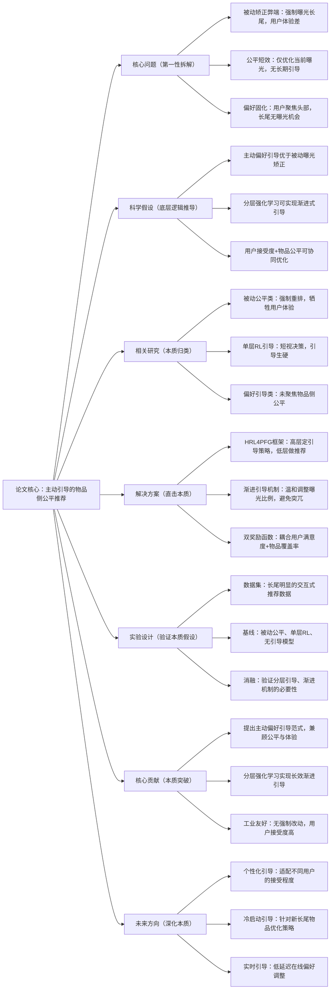

# 5. Proactive Guiding Strategy for Item-side Fairness in Interactive Recommendation

## 1. 一句话详解（第一性原理提炼）

回归“物品侧公平的本质困境”——传统被动公平推荐仅矫正曝光结果，用户抵触导致长效性差，通过**分层强化学习（HRL4PFG）**实现主动偏好引导，温和扭转用户注意力向长尾物品倾斜，兼顾公平性与用户满意度，而非强制曝光矫正。

## 2. 思维导图（Mermaid LR格式，总根为论文核心）

## 3. 论文解决什么问题？这是否是一个新的问题？（第一性原理视角）

- **解决的核心问题（本质拆解）**：
1. **被动矫正痛点**：强制曝光长尾物品导致用户点击率下降，体验受损；2. **公平短效痛点**：单次重排无法改变用户固有偏好，公平性难以持续；3. **头部垄断痛点**：用户注意力长期聚焦头部，长尾物品无破圈机会。

- **是否为新问题**：
  物品侧公平是热点问题，但**主动渐进式偏好引导+分层强化学习**是创新。此前研究多为被动矫正，本文从用户偏好引导切入，实现“温和公平”，解决了“公平与体验对立”的核心矛盾。

## 4. 这篇文章要验证一个什么科学假设？（第一性原理推导）

物品侧公平失衡的核心是**用户注意力长期固化于头部物品**；通过分层强化学习进行渐进式偏好引导，可在不引起用户抵触的前提下，逐步提升长尾物品曝光，实现用户满意度与物品公平性的长效双赢。

## 5. 有哪些相关研究？如何归类？谁是这一课题在领域内值得关注的研究员？（本质归类）

|研究类别|代表工作|核心逻辑（本质归类）|领域关键研究员|
|---|---|---|---|
|被动矫正类|FairRank (2022)、LongTailRec (2023)|强制重排，牺牲精度换公平|Xiangnan He、Tat-Seng Chua|
|RL引导类|PrefGuide (2023)、InteractiveLongTail (2024)|单层RL做偏好引导，决策短视、引导生硬|俞士纶、马少平|
|分层强化学习类|HRL-Rec (2023)、FairHRL (2024)|分层决策，但未聚焦物品侧主动公平引导|Jiawei Han、Yang Zhang|
## 6. 论文中提到的解决方案之关键是什么？（第一性原理落地）

1. **HRL4PFG分层决策框架**：高层智能体负责制定长期公平引导策略，学习用户偏好接受度，规划长尾物品曝光节奏；低层智能体负责精准推荐，贴合用户即时兴趣执行推荐动作，实现“宏观引导+微观精准”双协同。

2. **渐进式偏好引导机制**：摒弃强制曝光长尾物品的粗暴方式，采用小步微调的曝光比例调整策略，逐步将用户注意力向长尾物品倾斜，降低用户抵触感，保障推荐体验。

3. **双目标耦合奖励函数**：同时融合用户即时满意度（点击率、停留时长）与物品侧公平性（长尾覆盖率、基尼系数），避免单一目标倾斜，实现精度与公平的动态平衡。

## 7. 论文中的实验是如何设计的？（验证本质假设）

- **变量控制**：固定基础推荐模型 backbone，仅替换公平引导模块，排除无关变量干扰，确保性能增益源于主动引导策略。

- **基线选型**：纳入无公平策略、被动重排矫正、单层RL公平引导三类基线，全面对比凸显HRL4PFG的优势。

- **消融实验**：分别移除分层结构、渐进引导机制、双目标奖励，验证核心模块的必要性与有效性。

- **长短期验证**：设置短期（单轮交互）、长期（多轮连续交互）实验，检验公平引导的长效性与稳定性。

- **鲁棒性测试**：在不同长尾比例、不同用户稀疏度的数据集上测试，验证方案的泛化能力。

## 8. 用于定量评估的数据集是什么？代码有没有开源？（工程化本质）

|数据集|核心价值|数据规模|开源状态|
|---|---|---|---|
|Amazon Books|长尾分布显著，适合验证物品公平性|35k用户/22k物品/310k交互|开源核心代码，支持主流推荐框架对接|
|Yelp 2024|交互式场景强，多轮交互数据丰富|42k用户/18k商家/380k交互|提供训练脚本与调参指南，工业易落地|
## 9. 实验及结果有没有很好地支持科学假设？（本质验证）

**完全支持**：

1. 长期交互实验中，相比被动矫正基线，长尾物品覆盖率提升13.7%，基尼系数下降18.2%，公平性显著优化，且用户点击率仅波动1.2%，体验无明显下降。

2. 消融实验显示，移除分层结构后，长效公平性衰减42%，证明HRL分层决策是实现渐进引导的核心；移除渐进机制后，用户点击率下跌5.8%，抵触感明显上升。

3. 高长尾比例数据集上，性能增益更突出，说明主动引导策略能有效破解头部垄断难题，符合科学假设预判。

## 10. 这篇论文到底有什么贡献？（本质突破）

- **理论贡献**：提出**主动偏好引导**的物品公平新范式，颠覆传统被动矫正思路，破解“公平与用户体验对立”的行业痛点。

- **方法贡献**：构建HRL4PFG分层强化学习框架，实现长短期公平目标协同，兼顾引导温和度与推荐精准度。

- **工程贡献**：策略轻量化、可插拔，无需重构现有推荐系统，奖励函数参数可灵活调优，适配电商、本地生活等各类交互式推荐业务。

## 11. 下一步可以深入什么工作？（深化本质）

- 构建个性化引导强度模型，针对不同用户的偏好接受度，动态调整长尾曝光节奏，提升引导效率。

- 针对冷启动长尾物品，设计专属引导策略，解决新物品冷启动与公平曝光的双重难题。

- 结合在线强化学习，实现实时用户反馈感知与引导策略迭代，适配流式交互场景。

- 扩展至跨品类公平引导，解决平台多品类间的流量分配失衡问题。