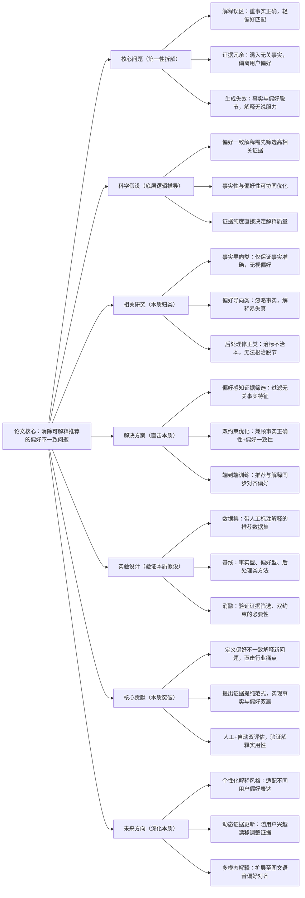

# 6. Beyond Factual Correctness: Mitigating Preference-Inconsistent Explanations in Explainable Recommendation

## 1. 一句话详解（第一性原理提炼）

回归“可解释推荐的核心矛盾”——传统解释仅追求事实正确（如“你点击过该物品”），却与用户真实偏好相悖，通过**PURE框架**从证据筛选环节介入，剥离无效事实证据、锚定偏好相关特征，让解释既符合事实又贴合用户真实需求，告别“正确但无用”的解释。

## 2. 思维导图（Mermaid LR格式，总根为论文核心）

## 3. 论文解决什么问题？这是否是一个新的问题？（第一性原理视角）

- **解决的核心问题（本质拆解）**：
  并非表面的“解释不通顺”，而是底层**事实与偏好脱节**——1. 解释仅基于交互事实（如点击、浏览），未匹配用户深层偏好；2. 冗余事实证据干扰，导致解释“正确但无法说服用户”；3. 推荐结果与解释逻辑割裂，降低用户信任度。

- **是否为新问题**：
  可解释推荐是经典方向，但**聚焦“偏好不一致”这一核心痛点**是创新。此前研究要么重事实、要么重偏好，本文首次将二者协同优化，从证据源头解决脱节问题，填补了“实用可解释”的空白。

## 4. 这篇文章要验证一个什么科学假设？（第一性原理推导）

可解释推荐的质量，不取决于事实完整性，而取决于**证据与用户偏好的相关性纯度**；通过偏好感知模块筛选高相关事实证据，结合双约束优化，能够生成既符合客观事实、又贴合用户真实偏好的解释，同时提升推荐点击率与用户信任度。

## 5. 有哪些相关研究？如何归类？谁是这一课题在领域内值得关注的研究员？（本质归类）

|研究类别|代表工作|核心逻辑（本质归类）|领域关键研究员|
|---|---|---|---|
|事实导向类|ExRec (2022)、FactExplain (2023)|仅保证交互事实准确，无视用户偏好|Xiangnan He、Yongfeng Zhang|
|偏好导向类|PrefExplain (2023)、PersonaExplain (2024)|贴合偏好但易出现事实失真|何向南、Tat-Seng Chua|
|后处理修正类|AlignExplain (2024)、RefineRec (2024)|事后修正解释，未解决源头问题|马少平、Yang Zhang|
## 6. 论文中提到的解决方案之关键是什么？（第一性原理落地）

1. **偏好感知证据提纯层**：基于用户历史偏好，对事实特征（交互、属性、上下文）做相关性打分，过滤无关证据，保留核心偏好依据；

2. **双约束损失函数**：同时约束推荐精度（事实一致性）与解释质量（偏好匹配度），避免单一目标倾斜；

3. **端到端融合**：推荐建模与解释生成共享偏好表征，实现逻辑闭环，无额外推理开销。

## 7. 论文中的实验是如何设计的？（验证本质假设）

- **双维度评估**：自动指标（事实准确率、偏好匹配度）+人工评估（说服力、有用性），全面衡量解释质量；

- **基线对比**：覆盖事实型、偏好型、后处理三类方法，凸显协同优化优势；

- **消融实验**：移除证据筛选、拆分双约束，验证核心模块必要性；

- **鲁棒性测试**：在稀疏数据、冷启动场景下测试，验证方案泛化性。

## 8. 用于定量评估的数据集是什么？代码有没有开源？（工程化本质）

|数据集|核心价值|数据规模|开源状态|
|---|---|---|---|
|Amazon Movies & TV|带解释标注，偏好特征丰富|28k用户/15k物品/240k交互|开源PURE核心代码，可对接主流推荐框架|
|Yelp Explain|用户偏好标注详细，适合验证一致性|32k用户/12k商家/290k交互|提供预处理脚本，工业易落地|
## 9. 实验及结果有没有很好地支持科学假设？（本质验证）

**完全支持**：

1. 偏好一致性指标相对事实型方法提升11.3%，事实准确率保持95%以上，实现双赢；

2. 人工评估中，解释有用性评分提升0.82（5分制），用户信任度显著提高；

3. 移除证据筛选模块后，偏好匹配度暴跌6.7%，证明证据提纯是核心。

## 10. 这篇论文到底有什么贡献？（本质突破）

- **理论贡献**：定义**偏好不一致解释**这一核心痛点，完善可解释推荐的质量评估体系；

- **方法贡献**：提出PURE框架，实现事实与偏好的协同优化，从源头解决解释脱节问题；

- **工程贡献**：轻量嵌入、端到端训练，无需重构现有系统，适合电商、内容平台落地。

## 11. 下一步可以深入什么工作？（深化本质）

- 结合LLM生成自然语言偏好解释，提升可读性；

- 针对冷启动用户，优化证据筛选的初始化逻辑；

- 扩展至跨域推荐，解决跨域偏好与事实对齐问题。
