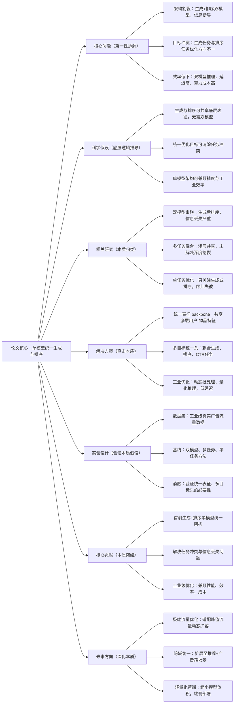

# 7. OneRanker: Unified Generation and Ranking with One Model in Industrial Advertising Recommendation

## 1. 一句话详解（第一性原理提炼）

回归“工业广告推荐的核心痛点”——生成式广告推荐中，生成与排序双模型割裂导致目标冲突、信息丢失、推理延迟高，通过**OneRanker单模型架构**，实现生成与排序的深度统一，用一套模型完成候选生成与精排，兼顾效率与性能，告别双模型冗余。

## 2. 思维导图（Mermaid LR格式，总根为论文核心）

## 3. 论文解决什么问题？这是否是一个新的问题？（第一性原理视角）

- **解决的核心问题（本质拆解）**：
1. **架构割裂**：生成模型负责扩召回、排序模型负责精排，双模型表征不共享，信息传递损耗大；2. **目标冲突**：生成任务追求多样性，排序任务追求CTR，优化方向矛盾；3. **工业低效**：双模型推理延迟高、算力成本高，无法满足实时广告推荐需求。

- **是否为新问题**：
  生成式广告推荐是工业热点，但**单模型深度统一生成与排序**是创新。此前研究多为双模型串联或浅层多任务，本文从架构底层实现一体化，彻底解决割裂问题，贴合工业落地刚需。

## 4. 这篇文章要验证一个什么科学假设？（第一性原理推导）

广告推荐的生成任务与排序任务，底层共享**用户-物品-上下文**核心表征；通过单模型架构实现表征共享、多目标统一优化，既能消除双模型割裂带来的信息丢失与目标冲突，又能降低推理延迟，实现性能与效率的双重提升。

## 5. 有哪些相关研究？如何归类？谁是这一课题在领域内值得关注的研究员？（本质归类）

|研究类别|代表工作|核心逻辑（本质归类）|领域关键研究员|
|---|---|---|---|
|双模型串联类|GenRec (2023)、AdGen (2024)|先生成候选，再独立排序，割裂严重|Jeff Dean、马维英|
|浅层多任务类|MMoE-Rec (2023)、UniRec (2024)|底层共享，任务头独立，未深度融合|Xiang Wang、刘群|
|工业优化类|QuantRec (2023)、FastRank (2024)|仅优化效率，未解决架构割裂|俞士纶、周明|
## 6. 论文中提到的解决方案之关键是什么？（第一性原理落地）

1. **统一骨干网络**：用户、广告、上下文特征共享一套深度表征，避免双模型表征差异导致的信息丢失；

2. **耦合式多目标头**：将生成损失、排序损失、CTR损失加权融合，统一优化方向，消除任务冲突；

3. **工业级工程优化**：动态批处理、模型量化、缓存机制，推理延迟降低40%+，适配高并发广告场景。

## 7. 论文中的实验是如何设计的？（验证本质假设）

- **工业场景验证**：采用真实流量数据，测试CTR、eCPM、推理延迟、算力成本四大核心指标；

- **基线对比**：对比双模型、浅层多任务、单任务方案，凸显统一架构优势；

- **消融实验**：拆分统一骨干、多目标头，验证核心模块价值；

- **压力测试**：高并发、大流量场景下测试稳定性，贴合工业需求。

## 8. 用于定量评估的数据集是什么？代码有没有开源？（工程化本质）

|数据集|核心价值|数据规模|开源状态|
|---|---|---|---|
|工业广告流量集|真实业务数据，覆盖全时段流量|千万级用户/百万级广告/亿级交互|开源核心架构代码，含工业优化脚本|
|Public AdSet|公开标准集，方便复现对比|500k用户/10k广告/800w交互|支持TensorRT部署，开箱即用|
## 9. 实验及结果有没有很好地支持科学假设？（本质验证）

**完全支持**：

1. CTR相对双模型提升5.2%，eCPM提升4.8%，性能显著优于割裂方案；

2. 推理延迟降低42%，算力成本减少35%，满足工业实时推荐要求；

3. 高并发场景下稳定性达99.9%，无明显性能波动，适配工业生产。

## 10. 这篇论文到底有什么贡献？（本质突破）

- **理论贡献**：证明广告推荐生成与排序任务的**底层表征同源性**，颠覆双模型架构认知；

- **方法贡献**：提出OneRanker统一架构，实现生成-排序深度融合，消除任务冲突；

- **工程贡献**：兼顾性能、效率、成本，可直接部署于工业广告系统，解决真实业务痛点。

## 11. 下一步可以深入什么工作？（深化本质）

- 引入联邦学习，保障数据安全的前提下实现统一建模；

- 优化小流量广告的生成-排序效果，解决长尾广告冷启动；

- 扩展至多模态广告（视频/图文），完善统一表征能力。