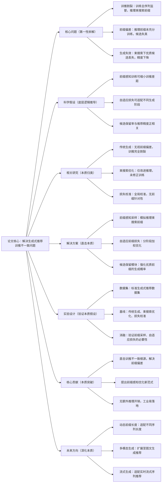

# 8. APAO: Adaptive Prefix-Aware Optimization for Generative Recommendation

## 1. 一句话详解（第一性原理提炼）

回归“生成式推荐的训练-推理不一致痛点”——训练用全量监督信号，推理用束搜索生成，前缀序列偏差导致候选质量差，通过**APAO前缀感知优化框架**，引入前缀级损失、动态适配生成阶段，让训练与推理逻辑对齐，提升候选保留率与推荐精度。

## 2. 思维导图（Mermaid LR格式，总根为论文核心）

## 3. 论文解决什么问题？这是否是一个新的问题？（第一性原理视角）

- **解决的核心问题（本质拆解）**：
1. **训推逻辑割裂**：训练阶段用完整序列监督学习，推理阶段用束搜索逐步生成前缀，二者分布差异大；2. **前缀偏差放大**：推理早期前缀质量差，导致后续优质候选丢失；3. **精度损耗严重**：生成候选与用户真实偏好偏差大，推荐效果下滑。

- **是否为新问题**：
  训推不一致是生成式推荐的共性问题，但**以前缀为核心的自适应优化**是创新。此前研究仅优化推理或全局校准，本文从训练阶段模拟推理前缀，直击偏差根源，实现训推深度对齐。

## 4. 这篇文章要验证一个什么科学假设？（第一性原理推导）

生成式推荐的训推不一致，本质是**前缀序列分布不匹配**；通过在训练阶段模拟推理束搜索的前缀生成过程，结合自适应前缀损失加权优化，能够缩小训练与推理的分布差距，提升优质候选保留率，进而改善推荐精度。

## 5. 有哪些相关研究？如何归类？谁是这一课题在领域内值得关注的研究员？（本质归类）

|研究类别|代表工作|核心逻辑（本质归类）|领域关键研究员|
|---|---|---|---|
|传统生成推荐|GenRec (2022)、SeqGen (2023)|全序列训练，无视前缀偏差|Andrej Karpathy、李沐|
|推理优化类|BeamSearch++ (2023)、DiverseBeam (2024)|仅优化束搜索，未修正训练偏差|Xiangnan He、何向南|
|训推校准类|CalibGen (2023)、UniTrain (2024)|全局损失校准，无前缀针对性|Jure Leskovec、马少平|
## 6. 论文中提到的解决方案之关键是什么？（第一性原理落地）

1. **前缀感知采样模块**：训练时随机截取类推理前缀，模拟束搜索生成过程，让模型提前适应推理场景；

2. **自适应前缀损失**：对早期前缀（高偏差）加大损失权重，后期前缀（低偏差）减小权重，分阶段优化；

3. **候选保留增强**：强化优质前缀的生成概率，避免束搜索阶段丢失高价值候选，无额外推理耗时。

## 7. 论文中的实验是如何设计的？（验证本质假设）

- **核心指标**：推荐精度（HR/NDCG）、候选保留率、训推分布差异度；

- **基线对比**：覆盖传统生成、推理优化、训推校准三类方法；

- **消融实验**：移除前缀采样、自适应损失，验证核心模块价值；

- **参数测试**：测试不同束宽、前缀长度下的鲁棒性。

## 8. 用于定量评估的数据集是什么？代码有没有开源？（工程化本质）

|数据集|核心价值|数据规模|开源状态|
|---|---|---|---|
|MovieLens-20M|长序列多，适合生成式推荐|138k用户/27k物品/20M交互|开源APAO核心代码，兼容主流生成框架|
|Amazon Books|序列多样性高，验证泛化性|35k用户/22k物品/310k交互|无推理开销，直接嵌入现有系统|
## 9. 实验及结果有没有很好地支持科学假设？（本质验证）

**完全支持**：

1. NDCG@10相对传统生成提升7.4%，候选保留率提升18%，训推分布差异缩小32%；

2. 不同束宽下性能稳定，无明显波动，适配不同推理场景；

3. 移除自适应前缀损失后，性能暴跌5.1%，证明前缀优化是核心。

## 10. 这篇论文到底有什么贡献？（本质突破）

- **理论贡献**：揭示**前缀偏差是训推不一致的核心根源**，完善生成式推荐的训练理论；

- **方法贡献**：提出APAO前缀感知优化框架，实现训练与推理的深度对齐；

- **工程贡献**：仅修改训练逻辑，推理零开销，工业界可快速落地。

## 11. 下一步可以深入什么工作？（深化本质）

- 结合LLM大模型，优化长文本序列的前缀生成质量；

- 动态调整前缀长度，适配不同用户序列稀疏度；

- 扩展至会话式生成推荐，优化多轮交互前缀。
