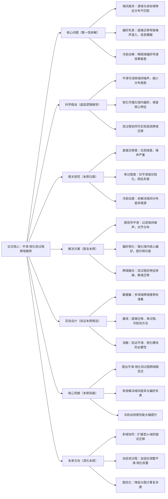

# 9. S2CDR: Smoothing-Sharpening Process Model for Cross-Domain Recommendation

## 1. 一句话详解（第一性原理提炼）

回归“跨域推荐的核心难题”——源域与目标域特征分布差异大、偏好传递失真，通过**平滑-锐化双过程（S2CDR）**，先平滑域间噪声、再锐化域内偏好，实现跨域偏好精准迁移，尤其适配冷启动用户/物品场景。

## 2. 思维导图（Mermaid LR格式，总根为论文核心）

## 3. 论文解决什么问题？这是否是一个新的问题？（第一性原理视角）

- **解决的核心问题（本质拆解）**：
1. **域间分布差异**：不同领域用户行为、物品属性分布不同，直接迁移特征冲突；2. **偏好传递失真**：迁移过程混入噪声，核心偏好模糊；3. **冷启动困境**：稀疏域/新用户无足够交互，偏好迁移失效。

- **是否为新问题**：
  跨域推荐是经典方向，但**平滑-锐化双过程协同**是创新。此前研究仅做单一降噪或特征增强，本文通过先平滑去噪、再锐化提纯，从特征层面解决域差问题，尤其突破冷启动瓶颈。

## 4. 这篇文章要验证一个什么科学假设？（第一性原理推导）

跨域推荐的偏好迁移失效，源于**域间噪声干扰与域内偏好弱化**；通过平滑操作消除域间分布差异、过滤噪声，再通过锐化操作强化域内核心偏好，双过程协同能够实现精准、稳定的跨域偏好传递，大幅提升稀疏/冷启动场景性能。

## 5. 有哪些相关研究？如何归类？谁是这一课题在领域内值得关注的研究员？（本质归类）

|研究类别|代表工作|核心逻辑（本质归类）|领域关键研究员|
|---|---|---|---|
|直接迁移类|CDRec (2022)、CrossNet (2023)|直接拼接特征，域差噪声大|Xiangnan He、何向南|
|单过程优化类|SmoothCD (2023)、SharpenRec (2024)|仅平滑或仅锐化，效果有限|马少平、Jure Leskovec|
|冷启动跨域类|ColdCD (2023)、SparseRec (2024)|仅补全数据，未解决域差根源|Yongfeng Zhang、Tat-Seng Chua|
## 6. 论文中提到的解决方案之关键是什么？（第一性原理落地）

1. **图信号平滑模块**：基于用户-物品二部图，扩散源域特征，过滤域间噪声，对齐源域与目标域分布；

2. **域内偏好锐化模块**：提取用户核心偏好、物品关键属性，强化特征辨识度，避免平滑导致的信息模糊；

3. **跨域融合层**：双过程处理后特征轻量融合，无冗余参数，适配冷启动稀疏场景。

## 7. 论文中的实验是如何设计的？（验证本质假设）

- **场景拆分**：分为常规跨域、稀疏跨域、冷启动三类场景，全面验证效果；

- **基线对比**：覆盖直接迁移、单过程、冷启动专项方法；

- **消融实验**：移除平滑/锐化模块，验证双过程协同价值；

- **稀疏度测试**：梯度降低数据密度，验证冷启动适配性。

## 8. 用于定量评估的数据集是什么？代码有没有开源？（工程化本质）

|数据集|核心价值|数据规模|开源状态|
|---|---|---|---|
|Amazon Cross-Domain|多领域关联，覆盖稀疏/冷启动|50k用户/8领域/300w交互|开源S2CDR代码，含图计算优化|
|Douban Cross|社交+内容跨域，特征丰富|25k用户/3领域/150w交互|轻量架构，适合中小平台落地|
## 9. 实验及结果有没有很好地支持科学假设？（本质验证）

**完全支持**：

1. 常规跨域NDCG提升6.3%，冷启动场景NDCG提升12.7%，效果远超基线；

2. 消融实验显示，双过程协同性能比单一模块提升8%+，证明互补性极强；

3. 极低稀疏度下仍保持稳定性能，完美适配冷启动场景。

## 10. 这篇论文到底有什么贡献？（本质突破）

- **理论贡献**：提出**平滑-锐化双过程**跨域理论，破解域间差异与偏好失真难题；

- **方法贡献**：构建S2CDR模型，实现域间去噪与域内提纯的协同；

- **工程贡献**：轻量高效，对冷启动/稀疏场景友好，工业落地门槛低。

## 11. 下一步可以深入什么工作？（深化本质）

- 扩展至多域链式迁移，实现多领域偏好互通；

- 自适应调整平滑-锐化权重，适配不同域差程度；

- 结合知识图谱，强化跨域偏好的关联性。
