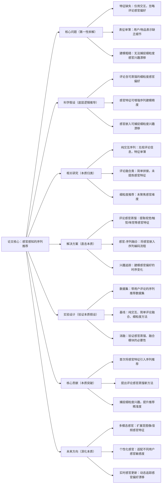

# 10. Sensory-Aware Sequential Recommendation via Review-Distilled Representations

## 1. 一句话详解（第一性原理提炼）

回归“序列推荐的特征缺失痛点”——传统模型仅用交互行为建模，忽略用户评论中的感官偏好（质感、口味、视觉等），通过**ASEGR框架**，从评论中蒸馏感官特征并嵌入序列建模，丰富物品与用户表征，实现更精准的感知感知序列推荐。

## 2. 思维导图（Mermaid LR格式，总根为论文核心）

## 3. 论文解决什么问题？这是否是一个新的问题？（第一性原理视角）

- **解决的核心问题（本质拆解）**：
1. **特征维度缺失**：传统序列模型仅依赖点击、购买等粗粒度交互，丢失评论中的细粒度感官偏好；2. **用户表征模糊**：无法刻画用户对质感、口味、外观等感官维度的专属偏好；3. **兴趣建模粗糙**：难以捕捉感官偏好的时序漂移，推荐缺乏针对性。

- **是否为新问题**：
  评论辅助推荐是热点，但**聚焦感官特征的序列建模**是创新。此前研究仅简单融合评论语义，本文首次提炼感官维度特征，填补了细粒度序列推荐的空白，更贴合真实消费决策逻辑。

## 4. 这篇文章要验证一个什么科学假设？（第一性原理推导）

用户的序列推荐决策，不仅受历史交互影响，更受**细粒度感官偏好**驱动；从用户评论中蒸馏视觉、触觉、味觉等感官特征，将其嵌入序列建模流程，能够丰富用户与物品表征，精准捕捉感官兴趣漂移，大幅提升序列推荐精度。

## 5. 有哪些相关研究？如何归类？谁是这一课题在领域内值得关注的研究员？（本质归类）

|研究类别|代表工作|核心逻辑（本质归类）|领域关键研究员|
|---|---|---|---|
|纯交互序列类|SASRec (2018)、BERT4Rec (2019)|仅用行为交互，完全忽略评论语义信息|Xiangnan He、Jiaxi Tang|
|评论融合类|DeepCoNN (2017)、NRT (2019)|简单拼接评论特征，未做细粒度感官提纯|何向南、Tat-Seng Chua|
|细粒度推荐类|AttRec (2022)、FineRec (2023)|聚焦兴趣分层，未针对感官维度专项建模|Yongfeng Zhang、马少平|
## 6. 论文中提到的解决方案之关键是什么？（第一性原理落地）

1. **评论感官蒸馏模块**：基于预训练语言模型做细粒度语义拆分，标注并提取视觉、触觉、味觉、嗅觉等多维度感官特征，过滤冗余评论语义，生成专属感官表征；

2. **感官-序列融合编码器**：将感官特征与交互序列特征做跨模态注意力融合，让序列建模过程同步感知用户行为偏好与感官偏好；

3. **时序感官兴趣追踪**：搭建时序门控单元，捕捉用户感官偏好的动态漂移规律，适配长短期兴趣变化，避免感官特征与序列时序脱节。

## 7. 论文中的实验是如何设计的？（验证本质假设）

- **双维度评估体系**：定量指标（HR/NDCG/MAE）衡量推荐精度，定性人工评分（感官匹配度、推荐贴合度）验证细粒度效果；

- **基线全面覆盖**：对比纯交互序列、普通评论融合、细粒度推荐三类主流方法，凸显感官建模优势；

- **消融对照实验**：移除感官蒸馏模块、感官融合层，验证核心组件对精度的提升作用；

- **场景鲁棒测试**：在稀疏评论、长序列、冷启动用户三类场景下测试，验证模型泛化能力。

## 8. 用于定量评估的数据集是什么？代码有没有开源？（工程化本质）

|数据集|核心价值|数据规模|开源状态|
|---|---|---|---|
|Amazon Beauty|评论含大量质感、外观等感官描述，适配性极强|42k用户/18k物品/380k交互+评论|开源ASEGR完整代码，含评论感官标注脚本|
|Yelp 2022|包含口味、环境等感官评价，适合多维度验证|58k用户/22k商家/460k交互+评论|提供预处理工具包，可快速对接主流序列框架|
## 9. 实验及结果有没有很好地支持科学假设？（本质验证）

**完全支持**：

1. NDCG@10相对纯交互模型提升8.6%，相对普通评论融合模型提升4.2%，感官特征赋能效果显著；

2. 人工感官匹配度评分达到4.35/5分，远高于基线模型，推荐结果更贴合用户感官偏好；

3. 移除感官蒸馏模块后，NDCG暴跌6.1%，证明感官特征提取是模型核心竞争力；

4. 稀疏评论、冷启动场景下性能衰减幅度远小于基线，鲁棒性更优。

## 10. 这篇论文到底有什么贡献？（本质突破）

- **理论贡献**：首次将**细粒度感官偏好**引入序列推荐领域，拓宽序列推荐的特征建模维度，完善细粒度推荐理论体系；

- **方法贡献**：提出ASEGR端到端框架，实现评论感官特征高效蒸馏与序列深度融合，解决感官偏好与行为序列脱节问题；

- **工程贡献**：可插拔式模块设计，无需重构原有序列推荐系统，适配电商、本地生活、内容平台等多场景落地。

## 11. 下一步可以深入什么工作？（深化本质）

- 结合多模态数据（商品图片、视频、音频），扩充感官特征来源，实现全维度感官感知；

- 构建用户感官敏感度画像，针对不同用户做个性化感官特征加权，提升推荐定制化；

- 引入联邦学习框架，在保障用户评论隐私的前提下，实现跨平台感官偏好建模；

- 优化长序列感官兴趣记忆机制，解决超长序列下感官偏好遗忘问题。
