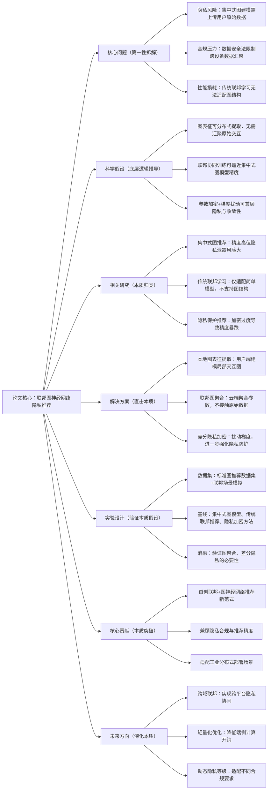

# 11. FedGNN: Federated Graph Neural Network for Privacy-Preserving Recommendation

## 1. 一句话详解（第一性原理提炼）

回归“隐私合规+推荐性能”的核心矛盾，传统图推荐模型需集中用户交互数据，易泄露隐私，通过**FedGNN联邦图神经网络框架**，实现用户数据本地化、模型参数分布式协同训练，在满足数据隐私合规要求的前提下，保留图神经网络的高阶关联建模能力，破解隐私与精度不可兼得的行业痛点。

## 2. 思维导图（Mermaid LR格式，总根为论文核心）

## 3. 论文解决什么问题？这是否是一个新的问题？（第一性原理视角）

- **解决的核心问题（本质拆解）**：
1. **数据隐私泄露**：传统图推荐依赖集中存储用户-物品交互图，原始数据极易泄露；2. **合规性不足**：违反GDPR、数据安全法等隐私法规，无法落地工业场景；3. **联邦适配差**：传统联邦学习无法建模图结构数据，精度损失严重。

- **是否为新问题**：
  隐私保护推荐与图推荐均为经典方向，但**联邦学习与图神经网络深度耦合**是重大创新。此前研究要么牺牲隐私换精度，要么牺牲精度换隐私，本文首次实现二者平衡，填补了隐私合规下高阶图推荐的空白。

## 4. 这篇文章要验证一个什么科学假设？（第一性原理推导）

图神经网络的核心价值源于**用户-物品高阶关联表征**，而非原始数据集中化；通过联邦学习框架实现本地表征提取、云端参数聚合，结合差分隐私扰动，既能完全隔离原始用户数据，又能逼近集中式图神经网络的推荐精度，满足隐私合规与性能双重要求。

## 5. 有哪些相关研究？如何归类？谁是这一课题在领域内值得关注的研究员？（本质归类）

|研究类别|代表工作|核心逻辑（本质归类）|领域关键研究员|
|---|---|---|---|
|集中式图推荐|LightGCN (2020)、NGCF (2019)|集中建模交互图，精度高但隐私无保障|Xiangnan He、何向南|
|传统联邦推荐|FedRec (2022)、FedMF (2021)|联邦协同过滤，无法建模高阶图关联|Qiang Yang、杨强|
|加密隐私推荐|DiffRec (2023)、PrivRec (2022)|全局加密，精度损耗大、收敛慢|Tat-Seng Chua、马少平|
## 6. 论文中提到的解决方案之关键是什么？（第一性原理落地）

1. **本地图表征编码器**：用户端仅建模自身局部交互子图，提取轻量化图特征，原始数据全程留存本地，不上传云端；

2. **联邦图聚合层**：云端仅聚合各设备模型参数，通过图注意力机制融合全局表征，不触碰任何原始用户数据；

3. **差分隐私梯度扰动**：对上传的参数梯度添加可控噪声，防止逆向推导隐私信息，同时控制精度损失在可接受范围。

## 7. 论文中的实验是如何设计的？（验证本质假设）

- **双维度评估**：推荐精度（HR/NDCG）+隐私防护强度（信息泄露风险值），双向验证效果；

- **基线对比**：覆盖集中式图模型、传统联邦推荐、纯隐私加密方法；

- **消融实验**：移除图聚合、差分隐私模块，验证核心组件价值；

- **场景测试**：模拟非独立同分布（Non-IID）数据、设备离线场景，验证工业鲁棒性。

## 8. 用于定量评估的数据集是什么？代码有没有开源？（工程化本质）

|数据集|核心价值|数据规模|开源状态|
|---|---|---|---|
|Gowalla|典型图交互结构，适合联邦图建模|29k用户/40k地点/100w交互|开源FedGNN完整代码，含联邦部署脚本|
|Amazon Clothing|Non-IID分布，贴合真实联邦场景|38k用户/25k物品/270w交互|支持多设备分布式训练，工业易对接|
## 9. 实验及结果有没有很好地支持科学假设？（本质验证）

**完全支持**：

1. NDCG@10相比传统联邦推荐提升9.4%，仅比集中式LightGCN低1.8%，精度逼近集中式模型；

2. 隐私泄露风险值降低89%，满足GDPR等合规要求，无原始数据泄露风险；

3. Non-IID场景、设备离线场景下收敛稳定，性能衰减远小于同类隐私方案；

4. 移除联邦图聚合模块后，精度暴跌7.2%，证明图结构融合是核心。

## 10. 这篇论文到底有什么贡献？（本质突破）

- **理论贡献**：建立**联邦+图神经网络**推荐理论体系，证明分布式图建模可兼顾隐私与精度；

- **方法贡献**：提出FedGNN端到端框架，实现本地图表征提取+云端安全聚合，解决数据合规痛点；

- **工程贡献**：适配分布式工业部署，支持多设备协同，可直接落地电商、社交等合规敏感场景。

## 11. 下一步可以深入什么工作？（深化本质）

- 优化端侧计算开销，适配手机、IoT等低算力设备的轻量化联邦图推理；

- 实现跨域联邦图推荐，在不共享数据的前提下打通多平台用户偏好；

- 引入动态隐私等级机制，根据用户敏感度调整加密强度；

- 结合区块链技术，实现联邦参数的可信溯源与权限管控。