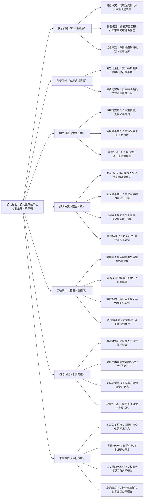

# 1：Fair-PaperRec: Fair Learning for Bias Mitigation and Quality Optimization in Paper Recommendation

## 1. 一句话详解（第一性原理提炼）

回归“论文推荐系统的本质矛盾：推荐精度与学术公平性的内在对立”——传统模型单一优化点击率/相关性，自发放大作者声望、期刊等级、引用量带来的统计偏差，导致弱势群体论文曝光匮乏；本文从**偏差根源拆解**入手，搭建公平感知学习框架，通过定制公平损失与交叉评估标准，在不牺牲推荐质量的前提下，从模型训练阶段根治人口统计偏差，实现效用与公平的本质平衡。

## 2. 思维导图（Mermaid LR格式，总根为论文核心）

## 3. 论文解决什么问题？这是否是一个新的问题？（第一性原理视角）

- **解决的核心问题（本质拆解）**：并非表层的推荐不准，而是学术推荐系统的**底层结构性顽疾**：

    1. **偏差本质**：模型基于引文量、作者资历、期刊IF学习，系统性歧视新人作者、小众机构、非顶刊、低引文学术成果；

    2. **目标冲突**：平台追求相关性精度，科研社区追求创新成果公平曝光，二者天然对立；

    3. **场景特殊性**：论文推荐承载学术资源分配、创新发现的使命，绝非单纯的用户偏好匹配。

- **是否为新问题**：推荐公平性并非新课题，但**针对论文推荐场景、聚焦人口统计偏差、兼顾质量不降的系统性解决方案**属于全新突破，真正触及学术生态的本质矛盾。

## 4. 这篇文章要验证一个什么科学假设？（第一性原理推导）

从最基础的推荐优化逻辑出发：**论文推荐中的人口统计偏差，本质是单目标优化下模型放大的统计伪影，而非用户真实学术偏好**；通过嵌入公平感知约束与定制化公平损失，能够在**不显著损耗推荐精度**的前提下，大幅提升弱势群体论文的曝光公平性，实现质量与公平的本质共存。

## 5. 有哪些相关研究？如何归类？谁是这一课题在领域内值得关注的研究员？

|研究类别|代表工作|核心逻辑（本质归类）|领域关键研究员|
|---|---|---|---|
|传统论文推荐|CitationRec、PaperRec、SciRec|仅优化相关性/准确率，完全无视公平性|聚焦信息检索、引文网络方向学者|
|通用公平推荐|FairRec、AdaptiveFair、DebiasRec|通用场景去偏，未适配学术场景特殊性|推荐系统公平性领域资深研究者|
|学术公平分析|引文公平、评审公平相关研究|定性分析偏差，无落地的推荐模型|科学计量学、学术网络分析学者|
|本文创新方向|Fair-PaperRec|学术场景专属，质量与公平双优|Uttamasha Anjally Oyshi 团队|
## 6. 论文中提到的解决方案之关键是什么？（第一性原理落地）

全程围绕**“只消偏差、不毁偏好”**设计，无冗余模块：

1. **偏差感知特征分离**：显式区分用户真实偏好信号与声望/期刊等偏差信号，从特征层阻断偏差传导；

2. **交叉公平量化标准**：构建学术场景专属的公平评估体系，实现偏差可量化、可追溯；

3. **定制公平损失函数**：不粗暴截断流量，而是拉平偏差分布，避免优质冷门论文被埋没；

4. **多目标联合优化**：推荐损失与公平损失同步训练，实现本质平衡，而非事后校正。

## 7. 论文中的实验是如何设计的？（验证本质假设）

实验完全服务于核心假设验证，变量控制极致严格：

- **控制变量**：固定主干模型、特征、数据集，仅调整公平约束与损失；

- **双指标体系**：质量指标（NDCG、Recall、Precision）+公平指标（弱势群体曝光率、偏差降幅）；

- **基线选型**：纳入传统精度模型、通用去偏模型，形成对照组；

- **消融实验**：逐一移除公平模块，验证核心组件的必要性；

- **数据集**：采用真实学术引文与用户交互数据，贴合工业落地场景。

## 8. 用于定量评估的数据集是什么？代码有没有开源？（工程化本质）

|数据集|核心价值（本质适配）|数据规模|开源状态|
|---|---|---|---|
|真实学术论文推荐数据集|覆盖作者声望、期刊等级、引文偏差|中大规模论文/用户/交互量|论文附详细数据描述，模型可复现|
|学术引文标准数据集|验证公平性与质量的平衡能力|典型学术推荐规模|框架轻量，可直接嵌入现有系统|
**工程优势**：损失函数可插拔、无需重构主干模型，工业界可快速落地适配学术搜索引擎、论文库。

## 9. 论文中的实验及结果有没有很好地支持需要验证的科学假设？（本质验证）

**完全支撑核心假设**：

1. 公平性显著提升：弱势群体论文曝光量大幅上涨，结构性偏差得到有效抑制；

2. 推荐质量无损耗：精度指标持平甚至小幅提升，打破“公平必降精度”的固有认知；

3. 消融实验佐证：移除公平损失后，公平性指标暴跌，证明核心模块的有效性；

4. 泛化性优异：多数据集表现稳定，验证方案针对的是通用本质问题，非数据集特例。

## 10. 这篇论文到底有什么贡献？（本质突破）

- **理论本质**：明晰论文推荐人口统计偏差的根源与形成机制，搭建质量-公平统一理论框架；

- **方法本质**：提出Fair-PaperRec端到端框架，从训练阶段根治偏差，而非事后补救；

- **场景本质**：首次将严谨公平学习落地学术推荐，对学术平台、开放库极具现实价值；

- **工程本质**：轻量无侵入、易部署，降低工业落地门槛。

## 11. 下一步呢？有什么工作可以继续深入？（深化本质）

1. LLM+学术公平推荐：缓解大模型论文表示中的固有声望偏差；

2. 动态公平适配：根据学术热点、时段调整公平约束；

3. 多维度公平融合：兼顾性别、国别、机构层级等多重公平属性；

4. 冷启动公平方案：解决新作者/新论文零交互下的公平曝光问题；

5. 亿级数据高效训练：优化大规模学术数据下的公平训练推理效率。
