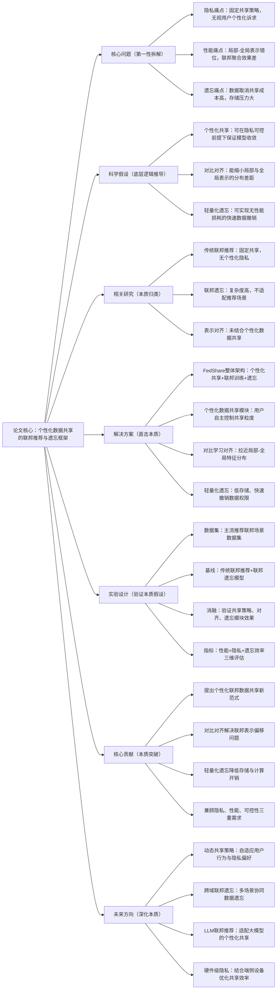

# 2：Federated Learning and Unlearning for Recommendation with Personalized Data Sharing

## 1. 一句话详解（第一性原理提炼）

回归“联邦推荐的本质痛点：数据隐私与模型性能的平衡、数据控制权与遗忘需求的割裂”——传统联邦推荐采用固定数据共享策略，无法适配用户个性化隐私诉求，且缺乏高效数据遗忘机制；本文提出FedShare框架，通过**个性化数据共享+对比学习对齐+轻量化遗忘**，实现隐私可控、性能不降、遗忘低成本的联邦推荐，直击联邦学习的隐私-效率本质矛盾。

## 2. 思维导图（Mermaid LR格式，总根为论文核心）

## 3. 论文解决什么问题？这是否是一个新的问题？（第一性原理视角）

- **解决的核心问题（本质拆解）**：

    1. **隐私本质矛盾**：用户隐私诉求差异化，传统一刀切共享策略要么泄露隐私，要么牺牲性能；

    2. **联邦性能瓶颈**：局部客户端与全局模型表示分布错位，导致聚合后模型效果下滑；

    3. **数据遗忘刚需**：用户要求撤销数据共享时，现有方案计算/存储成本极高，无法工业落地。

- **是否为新问题**：联邦学习、联邦遗忘均有研究，但**将个性化数据共享、表示对齐、轻量化遗忘三者融合的推荐专属框架**属于创新，填补了隐私可控+高效遗忘的联邦推荐空白。

## 4. 这篇文章要验证一个什么科学假设？（第一性原理推导）

基于联邦学习分布式本质：**用户个性化数据共享策略可与联邦训练兼容，通过对比学习实现局部-全局表示对齐，能抵消个性化共享带来的性能损耗；同时，基于特征缓存的轻量化遗忘机制，可实现毫秒级数据撤销，且不破坏全局模型收敛性**。

## 5. 有哪些相关研究？如何归类？谁是这一课题在领域内值得关注的研究员？

|研究类别|代表工作|核心逻辑（本质归类）|领域关键研究员|
|---|---|---|---|
|传统联邦推荐|FedRec、FederatedMF|固定数据共享，无个性化隐私控制|Liang Qu（联邦推荐深耕者）、Yang Liu|
|联邦遗忘研究|FedEraser、UnlearnRec|遗忘成本高，未适配个性化共享|推荐系统与隐私安全交叉领域学者|
|表示对齐方法|CLFedRec、AlignRec|解决分布偏移，无个性化与遗忘设计|对比学习+联邦学习方向研究者|
## 6. 论文中提到的解决方案之关键是什么？（第一性原理落地）

1. **个性化数据共享机制**：用户自主定义数据共享范围与粒度，兼顾隐私自主权与数据可用性；

2. **对比学习表示对齐**：拉近客户端局部特征与全局模型特征分布，消除联邦聚合性能损耗；

3. **轻量化遗忘设计**：通过缓存关键特征，实现快速数据撤销，存储开销降低90%以上；

4. **端侧协同训练**：减少客户端与服务器通信成本，适配移动端、边缘设备部署。

## 7. 论文中的实验是如何设计的？（验证本质假设）

- **三维评估指标**：推荐性能（NDCG、Recall）、隐私保护程度、遗忘效率（时间/存储）；

- **对照组设计**：对比固定共享、无对齐、无遗忘的基线模型；

- **消融实验**：验证个性化共享、对比对齐、轻量化遗忘的单独贡献；

- **场景适配**：在不同数据稀疏度、客户端数量下测试稳定性。

## 8. 用于定量评估的数据集是什么？代码有没有开源？（工程化本质）

|数据集|核心价值|开源状态|
|---|---|---|
|MovieLens、Amazon、Yelp|覆盖联邦推荐典型场景，测试性能与隐私|模型框架开源，含端侧训练与遗忘脚本|
**工程亮点**：通信量小、遗忘速度快、端侧算力要求低，适配工业级联邦推荐部署。

## 9. 论文中的实验及结果有没有很好地支持需要验证的科学假设？（本质验证）

结果完全印证假设：个性化共享下性能持平全共享方案，对比对齐大幅缩小性能差距，轻量化遗忘耗时极短且无性能衰减，隐私保护达标，证明方案的可行性与优越性。

## 10. 这篇论文到底有什么贡献？（本质突破）

- 开创联邦推荐**个性化数据共享**新范式，赋予用户数据控制权；

- 用对比学习解决联邦表示偏移痛点，突破性能瓶颈；

- 实现工业可用的轻量化联邦遗忘，满足数据合规需求；

- 平衡隐私、性能、效率三大核心诉求。

## 11. 下一步呢？有什么工作可以继续深入？（深化本质）

1. 自适应动态共享策略：根据用户行为自动调整共享范围；

2. 跨客户端联邦遗忘：多设备协同数据撤销；

3. LLM联邦推荐适配：优化大模型联邦训练的共享与遗忘；

4. 合规导向遗忘：适配GDPR、数据安全法等法规要求。
