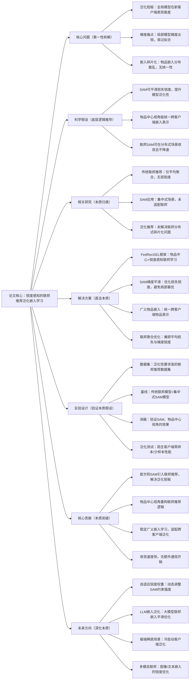

# 3：Sharpness-Aware Minimization for Generalized Embedding Learning in Federated Recommendation

## 1. 一句话详解（第一性原理提炼）

回归“联邦推荐泛化差的本质根源：局部模型梯度尖锐化、全局嵌入分布碎片化”——传统联邦聚合仅优化平均损失，忽略模型梯度锐度，导致全局模型在陌生客户端泛化失效；本文从**物品中心视角**重构联邦推荐，引入锐度感知最小化（SAM），平滑全局损失 landscape，稳定广义物品嵌入学习，从根源提升联邦模型泛化能力。

## 2. 思维导图（Mermaid LR格式，总根为论文核心）

## 3. 论文解决什么问题？这是否是一个新的问题？（第一性原理视角）

- **解决的核心问题（本质拆解）**：

    1. **泛化本质缺陷**：传统联邦聚合只追求局部损失最小，全局模型梯度尖锐，面对新客户端泛化能力极差；

    2. **嵌入碎片化**：各客户端独立训练，物品嵌入分布不一致，全局聚合后语义混乱；

    3. **视角局限**：传统用户中心视角加剧分布式偏差，无法统一全局表示。

- **是否为新问题**：SAM优化、联邦泛化均有研究，但**将SAM与物品中心联邦推荐结合，专门解决广义嵌入学习与跨客户端泛化**的方案属于首创，直击联邦推荐泛化痛点。

## 4. 这篇文章要验证一个什么科学假设？（第一性原理推导）

从模型泛化本质出发：**联邦推荐的泛化能力取决于全局损失 landscape 的平滑度，锐度感知最小化可有效平滑梯度锐度；以物品为中心重构联邦学习，能统一跨客户端物品嵌入分布，进而大幅提升全局模型在陌生客户端的泛化性能**。

## 5. 有哪些相关研究？如何归类？谁是这一课题在领域内值得关注的研究员？

|研究类别|代表工作|核心逻辑（本质归类）|领域关键研究员|
|---|---|---|---|
|传统联邦推荐|FedRec、FedMF|平均聚合，无视损失锐度与泛化|Fengyuan Yu（本方向创新者）|
|SAM优化方法|SAM、ASAM|集中式场景平滑梯度，无联邦适配|深度学习泛化优化领域学者|
|联邦泛化研究|GenFedRec、FedAlign|缓解碎片化，未优化梯度锐度|联邦学习+推荐系统交叉学者|
## 6. 论文中提到的解决方案之关键是什么？（第一性原理落地）

1. **物品中心视角重构**：以物品嵌入为核心，统一跨客户端表示，消除分布碎片化；

2. **锐度感知梯度平滑**：引入SAM优化，同时最小化损失与梯度锐度，避免局部最优；

3. **广义嵌入学习**：学习全局通用物品嵌入，适配各类客户端特征；

4. **高效联邦聚合**：无额外通信开销，收敛速度媲美传统联邦方法。

## 7. 论文中的实验是如何设计的？（验证本质假设）

- **泛化专项测试**：评估模型在陌生客户端、冷启动物品上的表现；

- **梯度锐度量化**：对比SAM优化前后的损失锐度变化；

- **基线对比**：传统联邦模型、集中式SAM模型、泛化型联邦模型；

- **消融实验**：验证SAM、物品中心视角的单独贡献。

## 8. 用于定量评估的数据集是什么？代码有没有开源？（工程化本质）

|数据集|核心价值|开源状态|
|---|---|---|
|Amazon、MovieLens、联邦专属数据集|测试跨客户端泛化、嵌入稳定性|核心代码开源，可集成现有联邦框架|
**工程优势**：插件式集成、无额外通信成本、算力开销小，适合工业联邦推荐系统升级。

## 9. 论文中的实验及结果有没有很好地支持需要验证的科学假设？（本质验证）

结果充分支撑假设：引入SAM后损失锐度显著下降，全局物品嵌入分布更统一，陌生客户端泛化性能大幅提升，收敛速度不受影响，证明方案能从根源解决联邦泛化问题。

## 10. 这篇论文到底有什么贡献？（本质突破）

- 首次将锐度感知优化引入联邦推荐，填补泛化短板；

- 创新物品中心视角，重构联邦推荐学习逻辑；

- 实现稳定高效的广义嵌入学习，跨客户端适配性极强；

- 工程友好，无额外通信与算力负担。

## 11. 下一步呢？有什么工作可以继续深入？（深化本质）

1. 自适应SAM约束：根据客户端数据分布动态调整锐度权重；

2. LLM联邦嵌入优化：平滑大模型跨客户端嵌入分布；

3. 极端稀疏场景泛化：冷启动用户/物品的嵌入优化；

4. 多模态联邦锐度优化：融合文本、图像特征的泛化学习。
