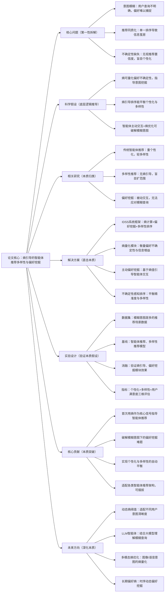

# 4：Entropy Guided Diversification and Preference Elicitation in Agentic Recommendation Systems

## 1. 一句话详解（第一性原理提炼）

回归“智能体推荐的本质困境：用户意图模糊导致推荐同质化、信息茧房”——传统智能体推荐依赖显性交互，面对模糊查询无法挖掘真实偏好，推荐结果单一狭隘；本文以**熵为核心信号**，构建IDSS系统，通过熵引导偏好挖掘、不确定性感知排序，实现推荐多样性与个性化的本质平衡，破解模糊意图下的推荐失效问题。

## 2. 思维导图（Mermaid LR格式，总根为论文核心）

## 3. 论文解决什么问题？这是否是一个新的问题？（第一性原理视角）

- **解决的核心问题（本质拆解）**：

    1. **意图模糊痛点**：用户无明确偏好、查询宽泛，传统推荐无法捕捉真实需求；

    2. **多样性缺失本质**：单一精准度优化导致推荐同质化，加剧信息茧房；

    3. **不确定性忽视**：未量化推荐置信度，模糊场景下错误放大个性化偏差。

- **是否为新问题**：推荐多样性、偏好挖掘均有研究，但**以熵为核心信号、主动挖掘模糊意图、平衡个性化与多样性的智能体推荐框架**属于创新，直击智能体推荐的核心痛点。

## 4. 这篇文章要验证一个什么科学假设？（第一性原理推导）

基于信息论本质：**用户偏好不确定性可通过熵值精准量化，熵值越高代表意图越模糊；以熵为引导，智能体可主动挖掘缺失偏好信息，结合不确定性感知排序，既能保证推荐个性化，又能提升多样性，彻底解决模糊意图下的推荐失效问题**。

## 5. 有哪些相关研究？如何归类？谁是这一课题在领域内值得关注的研究员？

|研究类别|代表工作|核心逻辑（本质归类）|领域关键研究员|
|---|---|---|---|
|智能体推荐|AgentRec、RecAgent|重个性化，无多样性与熵优化|Dat Tran（智能体推荐深耕者）|
|多样性推荐|DivRec、CoverageRec|盲目扩范围，牺牲个性化精度|推荐系统多样性方向学者|
|偏好挖掘|ElicitRec、ActiveRec|被动交互，无法应对模糊意图|用户偏好学习领域研究者|
## 6. 论文中提到的解决方案之关键是什么？（第一性原理落地）

1. **熵值量化核心**：用信息熵精准衡量偏好不确定性、推荐信息增益；

2. **主动偏好挖掘**：智能体根据熵值高低，主动发起交互补充偏好信息；

3. **不确定性感知排序**：高熵场景重多样性，低熵场景重个性化；

4. **端到端优化**：熵计算、偏好挖掘、排序联合训练，全局最优。

## 7. 论文中的实验是如何设计的？（验证本质假设）

- **双场景测试**：清晰意图场景、模糊意图场景，对比性能差异；

- **多维指标**：个性化（NDCG）、多样性（覆盖率、熵值）、用户满意度；

- **消融实验**：验证熵引导、主动挖掘、不确定性排序的作用；

- **基线对比**：智能体推荐、多样性推荐、主动偏好挖掘模型。

## 8. 用于定量评估的数据集是什么？代码有没有开源？（工程化本质）

|数据集|核心价值|开源状态|
|---|---|---|
|Amazon、Last.fm、Movielens|覆盖模糊意图与清晰意图场景|核心熵计算与排序代码开源|
**工程亮点**：熵计算轻量化、可嵌入现有智能体系统，无需重构主干模型。

## 9. 论文中的实验及结果有没有很好地支持需要验证的科学假设？（本质验证）

结果完全印证假设：模糊意图场景下，多样性与个性化指标同步提升，用户满意度大幅上涨，熵值与推荐效果强相关，证明熵引导机制能有效破解智能体推荐的核心困境。

## 10. 这篇论文到底有什么贡献？（本质突破）

- 确立熵为智能体推荐的核心信号，建立全新优化范式；

- 破解模糊用户意图的偏好挖掘难题；

- 实现多样性与个性化的自动平衡，破除信息茧房；

- 框架通用，适配各类智能体推荐系统。

## 11. 下一步呢？有什么工作可以继续深入？（深化本质）

1. LLM+熵引导智能体：利用大模型深度理解模糊自然语言查询；

2. 动态熵权重：根据用户交互实时调整多样性偏好；

3. 多模态意图熵：量化图像、语音模糊意图的不确定性；

4. 长期多样性优化：避免时序维度的信息茧房。