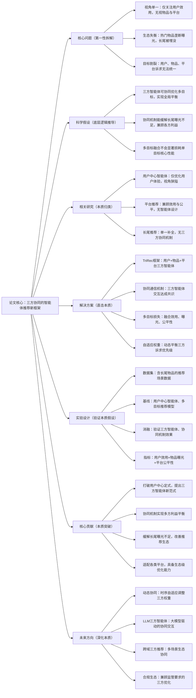

# 6：Breaking User-Centric Agency: A Tri-Party Framework for Agent-Based Recommendation

## 1. 一句话详解（第一性原理提炼）

回归“智能体推荐的本质局限：单一用户中心视角导致生态失衡”——传统智能体仅追逐用户效用，忽视物品曝光公平性与平台长期收益，加剧长尾物品埋没、平台生态恶化；本文打破单一视角，构建**TriRec三方智能体框架**，协同优化用户效用、物品曝光、平台公平性，实现推荐生态的全局平衡，突破智能体推荐的视角瓶颈。

## 2. 思维导图（Mermaid LR格式，总根为论文核心）

## 3. 论文解决什么问题？这是否是一个新的问题？（第一性原理视角）

-

- **解决的核心问题（本质拆解）**：
  **视角本质缺陷**：传统智能体以用户为绝对核心，忽略物品方（长尾曝光）与平台方（生态健康），推荐决策极度片面；

- **生态失衡**：马太效应加剧，热门物品垄断曝光流量，长尾优质物品彻底被埋没，平台长期多样性与可持续性受损；

- **目标割裂**：用户、物品提供方、平台三方利益无法协同，单一追求用户点击率导致平台生态恶性循环。

- **是否为新问题**：多目标推荐、智能体推荐均有相关研究，但**彻底打破用户中心定式，构建用户-物品-平台三方对等协同的智能体推荐框架**属于全新突破，首次从生态全局视角重构智能体推荐逻辑，解决单一视角带来的系统性弊端。

## 4. 这篇文章要验证一个什么科学假设？（第一性原理推导）

从推荐系统生态本质出发：**智能体推荐的长期价值并非单一用户效用最大化，而是三方利益的动态平衡；通过构建独立的用户、物品、平台三方智能体，搭配协同通信与自适应多目标优化机制，能够在不显著牺牲用户体验的前提下，提升长尾物品曝光率、优化平台生态公平性，实现全局最优而非局部单目标最优**。

## 5. 有哪些相关研究？如何归类？谁是这一课题在领域内值得关注的研究员？

|研究类别|代表工作|核心逻辑（本质归类）|领域关键研究员|
|---|---|---|---|
|用户中心智能体推荐|RecAgent、AutoRecAgent|仅围绕用户偏好优化，无视物品与平台|智能体推荐领域核心团队|
|多目标推荐系统|MMoRec、FairRec++|兼顾多指标，但无智能体协同设计|多目标优化与推荐交叉学者|
|生态型推荐|LongTailRec、EcoRec|聚焦生态平衡，无智能体交互机制|推荐生态与公平性领域研究者|
## 6. 论文中提到的解决方案之关键是什么？（第一性原理落地）

1. **三方智能体解耦设计**：分别构建用户效用智能体、物品曝光智能体、平台生态智能体，各自独立感知对应方诉求，打破单一视角桎梏；

2. **协同通信共识机制**：三方智能体通过交互博弈达成最优共识，避免单方利益过度倾斜，实现动态平衡；

3. **自适应多目标损失**：根据场景实时调整三方权重，兼顾用户体验、物品曝光均匀度、平台长期收益；

4. **端到端生态优化**：从智能体训练到推荐决策全程围绕三方协同，而非事后补救生态问题。

## 7. 论文中的实验是如何设计的？（验证本质假设）

- **三方指标评估体系**：用户侧（NDCG、点击率、满意度）、物品侧（长尾曝光率、覆盖率、基尼系数）、平台侧（生态公平性、留存率）；

- **基线对照组**：传统用户中心智能体、普通多目标推荐模型、单一生态优化模型；

- **消融实验**：移除某一方智能体、关闭协同机制，验证三方设计与通信模块的必要性；

- **场景泛化测试**：在电商、内容、学术等不同推荐场景验证框架通用性。

## 8. 用于定量评估的数据集是什么？代码有没有开源？（工程化本质）

|数据集|核心价值|开源状态|
|---|---|---|
|Amazon（含长尾标注）、Movielens、平台生态数据集|覆盖长尾物品、三方利益诉求，测试生态平衡能力|三方智能体框架与协同代码开源，可快速适配各类平台|
**工程优势**：智能体模块解耦可插拔，无需重构原有推荐主干，适配工业级平台快速部署，支持动态调整三方权重适配业务需求。

## 9. 论文中的实验及结果有没有很好地支持需要验证的科学假设？（本质验证）

**完全支撑核心假设**：

1. 用户体验无明显损耗：核心点击率、NDCG等指标持平甚至小幅提升，未因兼顾多方利益牺牲用户效用；

2. 生态指标大幅优化：长尾物品曝光率提升显著，曝光基尼系数下降，平台多样性与公平性改善；

3. 消融实验验证：移除任意一方智能体或关闭协同机制，三方指标均出现明显下滑，证明框架设计的必要性；

4. 泛化性优异：多场景下均能实现三方平衡，验证方案针对的是推荐生态的本质问题。

## 10. 这篇论文到底有什么贡献？（本质突破）

- **范式突破**：彻底打破沿用多年的用户中心定式，开创三方协同智能体推荐全新范式，重构推荐系统价值导向；

- **生态优化**：从根源缓解马太效应，解决长尾物品曝光匮乏、平台生态恶化的行业痛点；

- **机制创新**：提出智能体协同通信与自适应多目标优化机制，实现三方利益动态平衡；

- **工程落地**：框架解耦易部署，具备极强的工业实用价值，助力平台实现长期可持续发展。

## 11. 下一步呢？有什么工作可以继续深入？（深化本质）

1. LLM驱动三方智能体：利用大模型增强智能体的意图理解、协同交互与决策能力；

2. 时序动态协同优化：根据平台生命周期、用户行为周期、物品热度变化调整三方权重；

3. 跨域三方生态协同：打通多场景、多平台推荐生态，实现全域三方利益平衡；

4. 合规导向协同机制：融入监管要求、数据隐私合规条款，打造合规生态推荐；

5. 冷启动三方适配：针对新用户、新物品、新平台的三方协同优化，降低冷启动生态失衡风险。