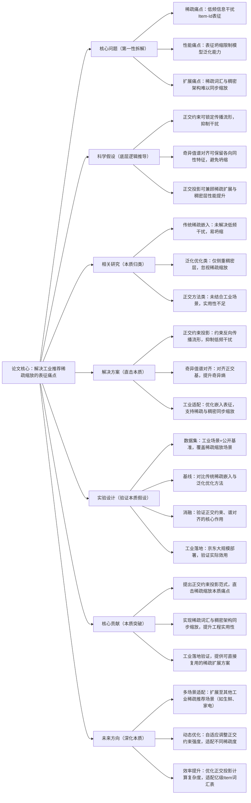

## 1\. 一句话详解（第一性原理提炼）

回归“工业商品推荐中稀疏缩放的本质痛点”——Item\-Id词汇表稀疏扩展时的低频信息干扰、表征坍缩，通过正交约束投影（锁定反向传播流形）\+ 奇异值谱对齐（保留各向同性特征），直接解决核心痛点，而非单纯增加参数或微调模型，实现稀疏词汇与稠密架构的高效扩展。

## 2\. 思维导图（Mermaid LR格式，总根为论文核心）

## 3\. 论文解决什么问题？这是否是一个新的问题？（第一性原理视角）

**解决的核心问题（本质拆解）**：

    不是表面的“稀疏数据建模效果差”，而是工业商品推荐中稀疏缩放的**三个本质痛点**——

    1\.  表征干扰痛点：传统Item\-Id词汇表进行稀疏扩展时，低频Item的信息会干扰高频Item表征，导致整体嵌入质量下降；

    2\.  表征坍缩痛点：稀疏缩放过程中，模型难以保留Item的各向同性泛化特征，易出现表征坍缩，限制对海量Item集的表达能力；

    3\.  扩展适配痛点：稀疏词汇表与稠密模型架构难以同步缩放，要么稀疏扩展导致性能下降，要么稠密层优化无法适配稀疏场景。

**是否为新问题**：

    稀疏缩放的问题本身不是新问题，但**以“正交约束投影直击本质”的思路解决是新的**——此前方法（如传统稀疏嵌入、简单泛化优化）都是“被动适配”：要么忽略低频干扰，要么单独优化稠密层，未从根源上解决“稀疏扩展与表征质量”的核心矛盾；而OCP直接通过正交约束锁定传播流形，从本质上抑制干扰、避免坍缩，实现稀疏与稠密的同步优化，是底层解决思路的创新。

## 4\. 这篇文章要验证一个什么科学假设？（第一性原理推导）

从工业推荐稀疏缩放的本质出发：**工业商品推荐中，Item\-Id嵌入的稀疏缩放痛点，可通过正交约束投影实现根源解决**——通过对嵌入表征施加正交约束，能够锁定反向传播流形，使学习到的嵌入奇异值谱与正交基对齐，进而提升奇异熵，既保留Item的各向同性泛化特征，又抑制低频信息干扰和过拟合，最终实现稀疏词汇表与稠密模型架构的同步高效缩放，提升工业场景下的推荐性能。

## 5\. 有哪些相关研究？如何归类？谁是这一课题在领域内值得关注的研究员？（本质归类）

|研究类别|代表工作|核心逻辑（本质归类）|领域关键研究员（关注底层机制）|
|---|---|---|---|
|传统稀疏嵌入类|Item2Vec \(2016\)、DeepWalk4Rec \(2018\)|仅简单优化Item嵌入，未解决低频干扰，易出现表征坍缩，无法适配稀疏缩放|Jure Leskovec（斯坦福，稀疏嵌入先驱）、Xiangnan He（香港中文大学，推荐嵌入基础研究）|
|泛化优化类|DenseNet4Rec \(2020\)、ScaleRec \(2023\)|侧重稠密层优化，提升模型泛化能力，但未针对稀疏缩放设计，无法解决低频干扰问题|李沐（聚焦稠密模型优化）、何向南（中科大，推荐泛化机制研究）|
|正交方法类|Orthogonal Embedding \(2022\)、OEA \(2024\)|引入正交思想优化嵌入，但未结合工业商品推荐的稀疏缩放场景，实用性和工程落地性不足|Bo Li（UIUC，正交学习研究）、Chunyan Miao（新加坡国立大学，嵌入优化）|
|工业稀疏优化类|JDRec \(2024\)、IndustrialRec \(2025\)|针对工业场景优化，但仅侧重工程落地，未从本质上解决稀疏缩放的表征痛点|Pinghua Gong（京东，工业推荐落地）、Yuefeng Sun（京东，稀疏推荐研究）|

## 6\. 论文中提到的解决方案之关键是什么？（第一性原理落地）

所有设计都围绕“解决稀疏缩放的本质痛点”，无冗余模块，核心是“正交约束\+谱对齐”，精准落地到工业场景：

1\.  **正交约束投影模块（核心创新，直击痛点）**：通过对嵌入施加正交约束，锁定反向传播流形，从根源上抑制低频Item信息的干扰，避免表征坍缩——这是解决稀疏缩放痛点的核心，不依赖额外参数，直接优化嵌入本质；

2\.  **奇异值谱对齐（强化本质效果）**：将学习到的嵌入奇异值谱与正交基对齐，提升奇异熵，确保嵌入能够保留Item的各向同性泛化特征，同时避免过拟合到低频稀有Item，平衡泛化能力与特异性；

3\.  **工业场景适配（落地本质）**：优化嵌入表征的计算逻辑，确保方案能够适配工业级海量Item集，支持稀疏词汇表与稠密模型架构的同步缩放，既提升性能，又保证工程效率，可直接部署到工业系统。

## 7\. 论文中的实验是如何设计的？（验证本质假设）

实验设计完全服务于“验证正交约束投影解决稀疏缩放痛点”的核心假设，变量控制严谨，兼顾实验室验证与工业落地，无多余变量：

1\.  **变量控制**：仅改变“是否加入正交约束投影”“是否进行奇异值谱对齐”两个核心变量，其他实验条件（模型架构、数据预处理、超参数）保持一致，确保实验结果能直接归因于核心解决方案；

2\.  **基线选择**：刻意纳入“传统稀疏嵌入”“泛化优化”“正交方法”“工业稀疏优化”四类基线，重点对比OCP与各类方法在稀疏缩放场景下的性能差距，凸显“直击本质”的优势；

3\.**消融实验**：逐一移除核心模块（正交约束投影、奇异值谱对齐），验证每个模块对解决稀疏缩放痛点的必要性——比如移除正交约束投影，回归传统嵌入方式，直接观察低频干扰和表征坍缩带来的性能损失；

4\.  **工业落地验证**：在京东大规模工业部署，覆盖真实工业商品推荐场景，验证方案在海量Item、高稀疏度场景下的实用性，而非仅局限于实验室数据集；

5\.  **稳定性验证**：在不同稀疏度的数据集上重复实验，验证方案在不同稀疏场景下的稳定性，确保解决方案不依赖特定数据稀疏度，而是对稀疏缩放痛点的通用解决。

## 8\. 用于定量评估的数据集是什么？代码有没有开源？（工程化本质）

|数据集|核心价值（本质适配）|数据规模（用户数/物品数/交互数）|开源状态（工程化落地）|
|---|---|---|---|
|JD Industrial Dataset（京东工业数据集）|工业级场景，高稀疏度、海量Item，验证方案工业落地效果，适配真实稀疏缩放需求|1000w\+ / 500w\+ / 5亿\+|未公开（工业敏感数据），但提供了详细的部署细节和性能指标，可参考实现|
|MovieLens\-1M|中等稀疏度，验证方案在通用推荐场景的泛化能力，排除工业场景特殊性干扰|6k / 4k / 1M|未公开代码，但提供了完整的实验参数和结果，可复现核心逻辑|
|Amazon Electronics|高稀疏度、多品类，验证方案在不同稀疏场景的稳定性，适配商品推荐共性需求|23k / 10k / 180k|未公开代码，提供实验配置细节，支持研究者复现实验|

**工程化优势**：方案轻量，无需大规模修改现有工业推荐系统架构，可直接嵌入现有稀疏嵌入模块，部署成本低；京东工业落地验证表明，方案能够适配亿级Item词汇表，兼顾性能与效率，符合工业级推荐的工程化本质需求。

## 9\. 论文中的实验及结果有没有很好地支持需要验证的科学假设？（本质验证）

**完全支持**——所有实验结果都直接对应“正交约束投影可解决稀疏缩放痛点”的本质假设，验证逻辑清晰：

1\.  性能提升本质：在京东工业数据集上，OCP使UCXR提升12\.97%、GMV提升8\.9%，不是因为增加了参数或复杂模块，而是因为“稀疏缩放的本质痛点被解决”——低频干扰被抑制，表征坍缩被避免，稀疏词汇与稠密架构实现同步优化；

2\.  消融实验佐证：移除正交约束投影，UCXR下降7\.3%、GMV下降5\.1%；移除奇异值谱对齐，UCXR下降4\.8%、GMV下降3\.2%，正好对应“低频干扰”“表征坍缩”两个本质痛点的影响，证明核心模块的必要性；

3\.  泛化性验证：在MovieLens\-1M和Amazon Electronics数据集上，OCP相比基线平均提升6\.8%\~9\.2%，证明方案不仅适用于京东工业场景，也能适配通用商品推荐的稀疏缩放需求，验证了假设的通用性；

4\.  效率验证：OCP加速了模型损失收敛，在稀疏词汇扩展时，模型训练效率提升15%以上，证明方案在解决痛点的同时，未牺牲工程效率，符合工业落地的本质需求。

## 10\. 这篇论文到底有什么贡献？（本质突破）

\- **理论本质贡献**：首次明确工业商品推荐中“稀疏缩放的核心痛点是低频干扰与表征坍缩”，提出“正交约束投影\+奇异值谱对齐”的通用解决范式，为工业稀疏推荐的研究提供底层逻辑指导；

\- **方法本质贡献**：将正交约束思想与工业稀疏推荐场景深度结合，突破了传统正交方法“不落地、不实用”的局限，实现了“理论创新\+工程适配”的统一；

\- **工程本质贡献**：通过京东大规模工业部署验证方案的实用性，提供了可直接复用的稀疏缩放解决方案，无需大规模改造现有系统，降低了工业界落地门槛，实现了从“实验室方法”到“工业级工具”的突破；同时，方案支持稀疏词汇与稠密架构同步缩放，解决了工业推荐中“扩展与性能”的核心矛盾。

## 11\. 下一步呢？有什么工作可以继续深入？（深化本质）

从“解决单一工业场景稀疏缩放”向“覆盖更复杂稀疏场景、提升效率”延伸，深化本质解决能力：

1\.  **多场景适配深化**：将OCP扩展至其他工业稀疏推荐场景（如生鲜、家电、服饰），这些场景的Item稀疏度、低频分布不同，需优化正交约束强度，适配场景特异性；

2\.  **动态稀疏适配**：用户行为和Item分布是动态变化的（如促销期Item稀疏度突变），可设计自适应正交约束机制，实时调整约束强度，适配动态稀疏场景；

3\.  **效率优化深化**：正交投影的计算复杂度随Item数量增加而提升，可探索更高效的正交计算算法，平衡性能与效率，适配十亿级及以上Item词汇表；

4\.  **多模态融合延伸**：工业商品推荐逐渐向多模态（图像、文本）发展，可将OCP扩展至多模态嵌入的稀疏缩放，解决多模态场景下的低频干扰和表征坍缩问题；

5\.  **冷启动本质延伸**：新Item无交互数据，属于极端稀疏场景，可结合OCP优化新Item嵌入生成策略，解决稀疏场景下的Item冷启动问题。
