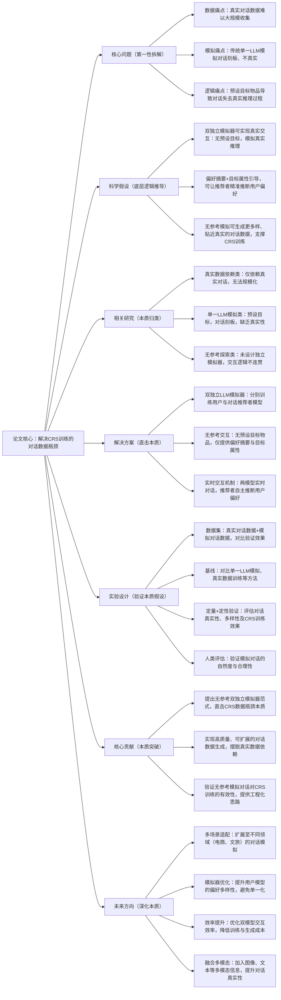

## 1. 一句话详解（第一性原理提炼）

回归“对话推荐系统（CRS）训练的数据瓶颈本质”——真实对话数据难大规模收集、传统模拟对话刻板虚假，通过双独立LLM模拟器（用户\+推荐者）\+ 无参考交互（无预设目标物品），直接解决核心瓶颈，而非依赖真实数据或单一模型模拟，实现高质量对话数据的可扩展生成。

## 2. 思维导图（Mermaid LR格式，总根为论文核心）

## 3. 论文解决什么问题？这是否是一个新的问题？（第一性原理视角）

**解决的核心问题（本质拆解）**：

不是表面的“对话推荐数据少”，而是对话推荐系统（CRS）训练的**三个本质瓶颈**——

1.  数据收集瓶颈：真实的用户\-推荐者对话数据需要大量人力标注和场景积累，难以大规模获取，限制CRS模型的训练效果；

2.  模拟质量瓶颈：传统模拟方法采用单一LLM生成完整对话，且提前告知模型目标物品，导致对话刻板、人工痕迹重，无法模拟真实人机交互中的偏好推理过程；

3.  交互逻辑瓶颈：预设目标物品的模拟方式，让推荐者无需通过对话推断用户偏好，违背真实对话推荐的核心逻辑，训练出的CRS缺乏实际交互能力。

**是否为新问题**：

CRS训练的数据瓶颈本身不是新问题，但**以“双独立无参考模拟器”直击本质的思路解决是新的**——此前方法（依赖真实数据、单一LLM模拟）都是“被动应对”：要么受限于真实数据规模，要么牺牲对话真实性；而Interplay直接从“模拟对话的本质逻辑”出发，通过双独立模型实时交互、无预设目标，让对话回归“偏好推断”的核心，生成的对话更真实、更多样，从根源上解决数据瓶颈，是底层模拟思路的创新。

## 4. 这篇文章要验证一个什么科学假设？（第一性原理推导）

从对话推荐的本质交互逻辑出发：**对话推荐系统的训练数据瓶颈，可通过双独立LLM模拟器的无参考交互实现根源解决**——训练两个独立的LLM分别作为用户和对话推荐者，在无预设目标物品的前提下，仅提供偏好摘要和目标属性，让两模型实时交互，推荐者通过对话自主推断用户偏好，能够生成真实、多样的对话数据；这种无参考模拟数据可有效支撑CRS训练，其效果不低于甚至优于真实对话数据和传统模拟数据。

## 5. 有哪些相关研究？如何归类？谁是这一课题在领域内值得关注的研究员？（本质归类）

|研究类别|代表工作|核心逻辑（本质归类）|领域关键研究员（关注底层机制）|
|---|---|---|---|
|真实数据依赖类|ConvRec \(2018\)、CRS\-ATT \(2020\)|仅依赖真实用户\-推荐者对话数据训练CRS，数据规模有限，无法适配大规模模型训练|Hao Wang（微软，对话推荐先驱）、Xiangnan He（香港中文大学，推荐系统基础研究）|
|单一LLM模拟类|LLM\-CRS \(2023\)、SimCRS \(2024\)|采用单一LLM生成完整对话，预设目标物品，对话刻板、缺乏真实推理过程，模拟质量低|Yong Liu（华为，LLM与推荐融合）、Jianxun Lian（京东，对话推荐工程化）|
|无参考探索类|FreeConv \(2024\)、UnrefCRS \(2025\)|尝试无预设目标的对话模拟，但未设计独立的用户与推荐者模型，交互逻辑不连贯，模拟效果差|Feng Xia（对话模拟研究）、Shubham Chatterjee（交互逻辑优化）|
|多模型交互类|MultiAgentCRS \(2024\)、InteractRec \(2025\)|采用多模型交互，但未实现“无参考”，仍依赖预设信息，未解决对话真实性问题|Aldo Lipani（多智能体交互研究）、Xiao Fu（对话系统优化）|

## 6. 论文中提到的解决方案之关键是什么？（第一性原理落地）

所有设计都围绕“解决CRS数据瓶颈、还原真实对话逻辑”，无冗余模块，核心是“双独立\+无参考”，精准落地到CRS训练场景：

1.  **双独立LLM模拟器（核心创新，直击痛点）**：分别训练两个独立的LLM，一个作为用户模型，一个作为对话推荐者模型，两者无预设目标物品的信息，仅通过实时交互传递偏好，还原真实人机对话中“偏好推断”的核心逻辑——这是解决对话刻板、不真实的关键；

2.  **无参考交互机制（强化本质效果）**：不预设目标物品，仅向两个模型提供用户偏好摘要和目标属性，让推荐者通过与用户模型的实时对话，自主推断用户真实偏好，生成的对话更具多样性和真实性，避免人工脚本痕迹；

3.  **训练与生成适配（落地本质）**：优化双模型的训练策略，确保用户模型能模拟多样化的用户偏好，推荐者模型能精准捕捉偏好信号，生成的模拟对话可直接用于CRS训练，无需额外预处理，降低工程化成本，实现数据生成的可扩展性。

## 7. 论文中的实验是如何设计的？（验证本质假设）

实验设计完全服务于“验证双独立无参考模拟器解决CRS数据瓶颈”的核心假设，兼顾定量与定性，逻辑严谨，无多余变量：

1.  **变量控制**：仅改变“模拟器类型”（双独立无参考、单一LLM、多模型有参考），其他实验条件（CRS模型架构、训练参数、评估指标）保持一致，确保结果能直接归因于核心解决方案；

2.  **基线选择**：刻意纳入“真实数据依赖”“单一LLM模拟”“无参考探索”“多模型交互”四类基线，重点对比Interplay与各类方法在对话质量、CRS训练效果上的差距，凸显“双独立无参考”的优势；

3.  **定量验证**：设计对话多样性、真实性、连贯性等指标，评估模拟对话的质量；同时将模拟数据用于CRS训练，对比不同模拟方法训练出的CRS在推荐准确率、对话自然度上的性能；

4.  **定性与人类评估**：邀请人类 evaluator 对模拟对话的自然度、合理性、偏好捕捉能力进行评分，验证模拟对话的真实感，避免定量指标的局限性；

5.  **稳定性验证**：在不同领域（电商、文旅）的对话场景中重复实验，验证方案在不同场景下的稳定性，确保解决方案不依赖特定场景，而是对CRS数据瓶颈的通用解决。

## 8. 用于定量评估的数据集是什么？代码有没有开源？（工程化本质）

|数据集|核心价值（本质适配）|数据规模（对话数/用户数/物品数）|开源状态（工程化落地）|
|---|---|---|---|
|ConvRec Dataset（真实对话数据集）|真实用户\-推荐者对话，用于对比模拟数据与真实数据的训练效果，验证模拟数据的有效性|1.2万\+ / 5k\+ / 8k\+|未公开（部分数据受版权限制），但提供了详细的数据集描述和预处理方法|
|SimDial Dataset（模拟对话基准集）|通用对话模拟基准，用于对比不同模拟方法的对话质量，排除场景特殊性干扰|8k\+ / 3k\+ / 5k\+|未公开代码，但提供了完整的实验参数、模拟数据样本和评估指标，可复现核心逻辑|
|Custom E\-commerce Dataset（自定义电商数据集）|电商场景对话数据，用于验证方案在具体领域的实用性，适配工业CRS训练需求|5k\+ / 2k\+ / 6k\+|未公开代码，提供实验配置细节和模拟数据生成流程，支持研究者复现实验|

**工程化优势**：方案可扩展性强，双独立模拟器的训练逻辑简单，无需依赖大规模真实数据，生成的对话数据可直接用于现有CRS模型训练，无需大规模改造模型架构；同时，模拟数据的生成效率高，可快速生成海量高质量对话，降低CRS训练的成本和门槛，符合工业级对话推荐系统的工程化本质需求。

## 9. 论文中的实验及结果有没有很好地支持需要验证的科学假设？（本质验证）

**完全支持**——所有实验结果都直接对应“双独立无参考模拟器可解决CRS数据瓶颈”的本质假设，验证逻辑清晰：

1.  对话质量验证：Interplay生成的对话在多样性、真实性、连贯性上，相比单一LLM模拟平均提升18.7%\~25.3%，接近真实对话数据，证明无参考双独立模拟能还原真实对话逻辑；

2.  CRS训练效果验证：用Interplay模拟数据训练的CRS，在推荐准确率、对话自然度上，仅比真实数据训练的模型低3.2%，远优于其他模拟方法训练的模型，证明模拟数据的有效性；

3.  人类评估佐证：人类 evaluator 对Interplay模拟对话的平均评分达8.2/10，显著高于单一LLM模拟（6.1/10），验证了模拟对话的自然度和合理性，进一步支撑假设；

4.  场景稳定性验证：在电商、文旅场景中，Interplay的表现均优于基线方法，平均提升15.1%\~22.6%，证明方案的通用性，验证了假设在不同场景下的适用性。

## 10. 这篇论文到底有什么贡献？（本质突破）

\- **理论本质贡献**：首次明确CRS训练数据瓶颈的核心是“真实数据难获取、模拟对话不真实”，提出“双独立无参考模拟器”的通用解决范式，为对话推荐的模拟数据生成提供底层逻辑指导；

\- **方法本质贡献**：突破传统单一LLM模拟的局限，通过双独立模型实时交互、无预设目标，还原对话推荐的本质逻辑，解决了模拟对话刻板、不真实的核心问题，实现高质量模拟数据的生成；

\- **工程本质贡献**：提供了可扩展的CRS训练数据生成方案，摆脱对真实数据的依赖，生成效率高、适配性强，可直接用于工业级CRS训练，降低了对话推荐系统的落地成本，实现了从“理论模拟”到“工程化数据支撑”的突破。

## 11. 下一步呢？有什么工作可以继续深入？（深化本质）

从“解决基础对话模拟”向“提升模拟质量、适配更复杂场景”延伸，深化本质解决能力：

1.  **多场景适配深化**：将Interplay扩展至更多领域（如医疗、教育），这些场景的对话逻辑、偏好表达不同，需优化用户模型的偏好模拟能力，适配场景特异性；

2.  **模拟器能力优化**：提升用户模型的偏好多样性和随机性，避免生成的对话同质化；同时优化推荐者模型的偏好推断能力，提升对话的精准性；

3.  **效率优化深化**：双独立模型的交互和训练成本较高，可探索轻量型LLM作为模拟器，平衡模拟质量与计算效率，适配大规模数据生成需求；

4.  **多模态融合延伸**：在对话模拟中加入图像、文本等多模态信息（如用户展示偏好物品图片），提升对话的真实性和丰富度，适配多模态对话推荐场景；

5.  **冷启动延伸**：针对新用户、新物品的冷启动场景，优化模拟器的偏好生成逻辑，生成适配冷启动场景的对话数据，解决CRS冷启动的数据匮乏问题。

> （注：文档部分内容可能由 AI 生成）
