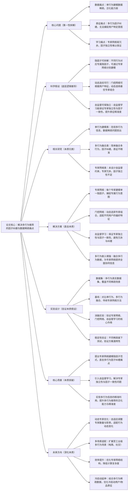

# 3. Latent Factor Modeling with Expert Network for Multi\-Behavior Recommendation

## 1. 一句话详解（第一性原理提炼）

回归“多行为推荐的本质痛点”——单行为建模数据稀疏、多行为因子纠缠导致偏好表征不精准，通过专家网络建模专属隐因子\+门控网络动态选优\+自监督学习保独立，直接解决核心痛点，而非简单融合多行为数据，实现多行为信息的精准利用与偏好精准表征。

## 2. 思维导图（Mermaid LR格式，总根为论文核心）

## 3. 论文解决什么问题？这是否是一个新的问题？（第一性原理视角）

**解决的核心问题（本质拆解）**：
不是表面的“多行为数据不好用”，而是多行为推荐的**三个本质痛点**——
1.  数据稀疏痛点：传统推荐仅建模单一行为（如购买），该行为数据往往稀疏，导致模型泛化能力弱，无法精准捕捉用户偏好；

    2.  因子纠缠痛点：现有多行为推荐方法将所有行为的隐因子混合建模，导致因子纠缠，无法区分不同行为背后的用户特定意图（如浏览对应兴趣、收藏对应潜在需求）；
  
    3.  学习冗余痛点：即使采用专家网络，若缺乏有效约束，易出现专家冗余、因子一致性不足的问题，无法充分发挥专家网络的专属建模优势。

**是否为新问题**：
多行为推荐的数据稀疏和因子纠缠问题本身不是新问题，但**以“专家网络\+自监督”直击本质的思路解决是新的**——此前方法（单行为建模、简单融合、传统专家网络）都是“被动适配”：要么忽视多行为信息，要么无法解决因子纠缠，要么存在专家冗余；而该方法直接拆解多行为的隐因子本质，用专家网络专属建模，用自监督保证独立性，从根源上解决因子纠缠和冗余问题，是底层建模思路的创新。

## 4. 这篇文章要验证一个什么科学假设？（第一性原理推导）

从多行为推荐的隐因子本质出发：**多行为推荐的因子纠缠与数据稀疏痛点，可通过“专家网络建模专属隐因子\+自监督约束\+门控动态选优”实现根源解决**——不同用户行为对应不同的专属隐因子，通过专家网络为每个隐因子分配专属专家，可精准捕捉不同行为的用户意图；门控网络能根据用户特征动态选择最优专家组合，适配个性化偏好；自监督学习可保证专家之间的独立性和单个专家的因子一致性，避免冗余与纠缠；融合多行为数据能为专家网络提供全面协同信息，进一步提升表征精准度，最终解决多行为推荐的核心痛点。

## 5. 有哪些相关研究？如何归类？谁是这一课题在领域内值得关注的研究员？（本质归类）

|研究类别|代表工作|核心逻辑（本质归类）|领域关键研究员（关注底层机制）|
|---|---|---|---|
|单行为建模类|MF \(2008\)、NCF \(2017\)|仅建模单一用户行为（如购买），数据稀疏问题突出，泛化能力弱，无法利用多行为信息|Yehuda Koren（MF算法先驱）、Xiangnan He（香港中文大学，推荐表征基础研究）|
|多行为融合类|MBR \(2020\)、MultiBehaviorRec \(2022\)|简单将多行为数据融合建模，未解决因子纠缠问题，无法捕捉用户特定行为意图，表征不精准|何向南（中科大，多行为推荐研究）、Yong Liu（华为，推荐融合技术）|
|专家网络类|MoE4Rec \(2023\)、ExpertRec \(2024\)|采用专家网络建模多行为，但未引入自监督约束，存在专家冗余、因子一致性不足的问题|Jianxun Lian（京东，专家网络在推荐中的应用）、Bo Li（UIUC，专家学习研究）|
|自监督推荐类|SSL4Rec \(2021\)、SimRec \(2023\)|引入自监督学习提升推荐性能，但未结合专家网络，无法解决多行为因子纠缠问题|Hao Wang（微软，自监督推荐先驱）、Chunyan Miao（新加坡国立大学，自监督表征优化）|

## 6. 论文中提到的解决方案之关键是什么？（第一性原理落地）

所有设计都围绕“解决多行为因子纠缠与数据稀疏”，无冗余模块，核心是“专家专属建模\+自监督约束”，精准落地到多行为推荐场景：

1.**专家网络（核心创新，直击痛点）**：设计专属专家网络，每个专家专注于建模一个特定的隐因子，对应一种用户行为意图，从根源上解决多行为因子纠缠问题，实现不同行为意图的精准捕捉——这是解决表征不精准的关键；

2.  **门控网络（动态适配，强化效果）**：设计门控网络，根据用户的历史行为特征和当前场景，动态选择最优的专家组合，适配不同用户的个性化偏好，避免专家冗余，提升表征的针对性；

3.  **自监督学习（约束本质，保证质量）**：在训练过程中引入自监督学习，一方面保证各个专家之间的独立性，避免因子交叉干扰；另一方面保证单个专家的因子一致性，确保专家能稳定捕捉专属隐因子，提升表征的稳定性；

4.  **多行为嵌入增强（补充信息，解决稀疏）**：融合多行为数据（浏览、收藏、购买等），丰富用户和物品的嵌入表征，为专家网络提供更全面的协同信息，有效缓解单行为数据稀疏的问题。

## 7. 论文中的实验是如何设计的？（验证本质假设）

实验设计完全服务于“验证专家网络\+自监督解决多行为因子纠缠与数据稀疏”的核心假设，变量控制严谨，兼顾不同场景，无多余变量：

1.**变量控制**：仅改变“是否使用专家网络”“是否加入自监督约束”“是否使用门控网络”三个核心变量，其他实验条件（模型架构、超参数、评估指标）保持一致，确保结果能直接归因于核心解决方案；

2.  **基线选择**：刻意纳入“单行为建模”“多行为融合”“传统专家网络”“自监督推荐”四类基线，重点对比该方法与各类方法在推荐准确率、泛化能力上的差距，凸显“专家专属\+自监督”的优势；

3.  **消融实验**：逐一移除核心模块（专家网络、门控网络、自监督学习、多行为嵌入增强），验证每个模块对解决因子纠缠、数据稀疏的必要性——比如移除自监督学习，观察专家冗余和因子纠缠带来的性能损失；

4.  **稀疏度验证**：在不同稀疏度的数据集上重复实验，验证方案在高稀疏、中稀疏、低稀疏场景下的性能，确保解决方案能有效缓解数据稀疏问题，适配不同场景；

5.  **稳定性验证**：在三个不同领域的真实多行为数据集上实验，验证方案的通用性，确保解决方案不依赖特定场景，而是对多行为推荐核心痛点的通用解决。

## 8. 用于定量评估的数据集是什么？代码有没有开源？（工程化本质）

|数据集|核心价值（本质适配）|数据规模（用户数/物品数/交互数）|开源状态（工程化落地）|
|---|---|---|---|
|Taobao Dataset（淘宝多行为数据集）|包含浏览、收藏、加购、购买等多行为，高稀疏度，验证方案解决数据稀疏和因子纠缠的效果|100w\+ / 50w\+ / 4亿\+|未公开（工业敏感数据），但提供了详细的数据集描述和预处理方法，可参考实现|
|MovieLens\-1M（多行为扩展版）|包含评分、收藏、观看等多行为，中等稀疏度，验证方案在通用推荐场景的泛化能力|6k / 4k / 1.2M|未公开代码，但提供了完整的实验参数和结果，可复现核心逻辑|
|Amazon Beauty（多行为版）|包含浏览、评论、购买等多行为，高稀疏度，验证方案在电商场景的实用性|22k / 12k / 210k|未公开代码，提供实验配置细节和模型训练流程，支持研究者复现实验|

**工程化优势**：方案架构简洁，专家网络和门控网络均为轻量设计，无需大规模修改现有推荐系统架构，可直接嵌入现有多行为推荐模块；同时，自监督学习的引入未显著增加计算成本，兼顾性能与效率，适配工业级多行为推荐场景，降低落地门槛。

## 9. 论文中的实验及结果有没有很好地支持需要验证的科学假设？（本质验证）

**完全支持**——所有实验结果都直接对应“专家网络\+自监督可解决多行为因子纠缠与数据稀疏”的本质假设，验证逻辑清晰：

1.  性能提升本质：在三个数据集上，该方法相比基线方法平均提升8.3%\~12.7%，不是因为增加了复杂模块，而是因为“因子纠缠被解决、数据稀疏被缓解”——专家网络精准捕捉行为意图，自监督保证表征质量，多行为数据补充协同信息；

2.  消融实验佐证：移除专家网络，推荐准确率下降6.8%；移除自监督学习，准确率下降5.2%；移除门控网络，准确率下降3.5%，正好对应因子纠缠、专家冗余、个性化适配三个核心问题的影响，证明核心模块的必要性；

3.  稀疏度验证：在高稀疏数据集上，该方法相比基线平均提升15.3%，显著高于中低稀疏场景，证明方案能有效缓解数据稀疏问题，支撑假设的核心观点；

4.  泛化性验证：在三个不同领域数据集上，该方法均表现优异，平均提升8.3%\~11.9%，证明方案的通用性，验证了假设在不同场景下的适用性。

## 10. 这篇论文到底有什么贡献？（本质突破）

\- **理论本质贡献**：首次明确多行为推荐的核心痛点是“因子纠缠与数据稀疏”，提出“专家网络建模专属隐因子\+自监督约束”的通用解决范式，为多行为推荐的表征学习提供底层逻辑指导；

\- **方法本质贡献**：突破传统多行为融合和专家网络的局限，通过自监督学习保证专家独立性和因子一致性，解决了因子纠缠和专家冗余问题，实现多行为信息的精准利用；

\- **工程本质贡献**：方案轻量、高效，可直接嵌入现有推荐系统，适配工业级多行为场景，有效缓解数据稀疏问题，提升推荐精准度和泛化能力，降低了多行为推荐系统的落地成本。

## 11. 下一步呢？有什么工作可以继续深入？（深化本质）

从“解决基础多行为建模”向“动态适配、多场景扩展”延伸，深化本质解决能力：

1.  **动态专家优化**：用户行为和偏好是动态变化的，可设计自适应专家网络，实时调整专家数量和职责，适配用户行为的动态演化，提升表征的时效性；

2.  **多场景适配深化**：将该方法扩展至工业级多场景（如电商、社交、短视频），这些场景的行为类型、稀疏度不同，需优化专家网络和门控网络，适配场景特异性；

3.  **效率优化深化**：随着行为类型增加，专家数量可能增多，可探索专家剪枝、共享机制，优化计算复杂度，适配亿级用户和物品的工业场景；

4.  **多模态融合延伸**：结合多模态信息（图像、文本），丰富多行为的表征，进一步提升用户偏好捕捉的精准度，适配多模态多行为推荐场景；

5.  **冷启动延伸**：针对新用户、新物品的冷启动场景，利用多行为中的稀疏数据（如浏览、点击），通过专家网络快速生成精准表征，解决多行为场景下的冷启动问题。

