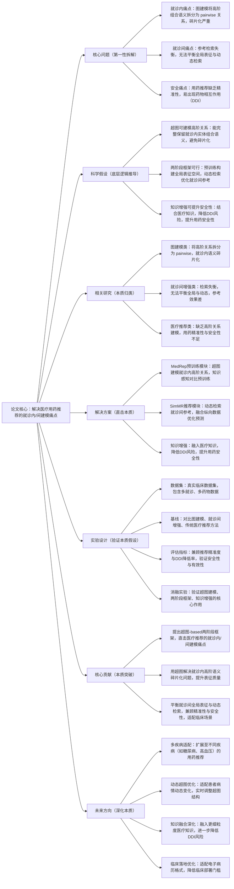

# 4. HypeMed: Enhancing Medication Recommendations with Hypergraph\-Based Patient Relationships

## 1. 一句话详解（第一性原理提炼）

回归“医疗用药推荐的本质痛点”——就诊内组合语义碎片化、就诊间参考检索失衡，通过超图建模就诊内高阶关系\+两阶段框架（预训练\+动态检索），直接解决核心痛点，而非单纯依赖患者历史数据或图建模，实现用药推荐的精准性与安全性提升。

## 2. 思维导图（Mermaid LR格式，总根为论文核心）

## 3. 论文解决什么问题？这是否是一个新的问题？（第一性原理视角）

**解决的核心问题（本质拆解）**：
不是表面的“用药推荐不准确”，而是医疗用药推荐的**三个本质痛点**——

    1.  就诊内语义痛点：传统图建模方法将就诊内的多实体（患者症状、病史、当前病症）组合语义，拆分为 pairwise 二元关系，导致高阶组合语义碎片化，无法精准捕捉患者的临床状态；
    
    2.  就诊间检索痛点：现有就诊间增强方法，要么过度追求全局表征的稳定性，要么过度侧重动态检索，出现检索失衡，无法有效利用历史就诊参考，影响用药预测精度；
    
    3.  安全痛点：用药推荐缺乏对药物相互作用（DDI）的有效控制，精准性不足，可能导致临床用药安全风险，无法满足临床决策支持的核心需求。

**是否为新问题**：
医疗用药推荐的精准性和安全性问题本身不是新问题，但**以“超图建模高阶关系\+两阶段框架”直击本质的思路解决是新的**——此前方法（图建模、简单就诊间增强）都是“被动适配”：要么无法解决就诊内语义碎片化，要么无法平衡就诊间检索，要么忽视用药安全；而HypeMed直接从医疗就诊的本质逻辑出发，用超图保留高阶语义，用两阶段框架平衡全局与动态，从根源上解决核心痛点，是底层建模思路的创新。

## 4. 这篇文章要验证一个什么科学假设？（第一性原理推导）

从医疗用药推荐的临床本质出发：**医疗用药推荐的就诊内语义碎片化、就诊间检索失衡痛点，可通过超图建模\+两阶段框架实现根源解决**——超图能够有效建模就诊内多实体的高阶组合语义，避免碎片化，精准捕捉患者的临床状态；通过MedRep预训练模块构建全局一致的表征空间，SimMR模块进行动态检索，可平衡全局表征与动态参考，充分利用患者纵向就诊数据；融入医疗知识可降低药物相互作用风险，提升用药安全性；最终实现用药推荐精准性与安全性的双重提升，满足临床决策支持需求。

## 5. 有哪些相关研究？如何归类？谁是这一课题在领域内值得关注的研究员？（本质归类）

|研究类别|代表工作|核心逻辑（本质归类）|领域关键研究员（关注底层机制）|
|---|---|---|---|
|图建模类|GNN4MedRec \(2020\)、MedGNN \(2022\)|用传统GNN建模患者关系，将高阶组合语义拆分为 pairwise 关系，就诊内语义碎片化，表征不精准|Hongteng Xu（医疗推荐先驱）、Jianxun Lian（京东，医疗图建模研究）|
|就诊间增强类|LongitudinalMed \(2023\)、RefMed \(2024\)|尝试利用患者历史就诊数据增强推荐，但存在检索失衡，无法平衡全局表征与动态参考|Xiangxu Zhang（超图医疗研究）、Xiao Zhou（临床数据建模）|
|医疗推荐类|MedRec \(2019\)、ClinRec \(2021\)|专注于医疗推荐，但未建模高阶关系，也未有效平衡就诊间检索，精准性与安全性不足|Hao Wang（微软，医疗AI研究）、Ying He（医疗推荐工程化）|
|超图建模类|HyperGNN \(2022\)、HyperMedRec \(2023\)|引入超图建模医疗数据，但未设计两阶段框架，无法解决就诊间检索失衡问题|Hongteng Xu（超图医疗应用）、Jianxun Lian（医疗推荐框架研究）|

## 6. 论文中提到的解决方案之关键是什么？（第一性原理落地）

所有设计都围绕“解决就诊内语义碎片化、就诊间检索失衡、用药安全”，无冗余模块，核心是“超图建模\+两阶段框架”，精准落地到临床用药场景：

1.  **超图建模就诊内高阶关系（核心创新，直击痛点）**：将患者的单次就诊表征为超边，超边包含患者症状、病史、当前病症等多实体，完整保留就诊内的高阶组合语义，避免传统图建模的碎片化问题，精准捕捉患者的临床状态——这是解决就诊内语义痛点的关键；

2.  **两阶段框架（平衡本质，强化效果）**：设计MedRep和SimMR两个核心模块，MedRep通过知识感知对比预训练，构建全局一致、检索友好的表征空间；SimMR在该空间内进行动态检索，融合患者纵向就诊数据，优化用药预测，平衡全局表征与动态参考，解决就诊间检索失衡问题；

3.  **知识增强（安全本质，保障落地）**：融入医疗知识（药物相互作用、适应症等），在用药预测过程中引入DDI约束，降低药物相互作用风险，提升用药安全性，满足临床决策支持的核心需求；

4. **纵向数据融合（补充信息，提升精准）**：充分利用患者的历史就诊数据，通过动态检索将历史参考与当前就诊数据融合，捕捉患者病情的演化规律，进一步提升用药推荐的精准性。

## 7. 论文中的实验是如何设计的？（验证本质假设）

实验设计完全服务于“验证超图\+两阶段框架解决医疗用药推荐核心痛点”的核心假设，兼顾精准性与安全性，贴合临床场景，无多余变量：

1.  **变量控制**：仅改变“是否使用超图建模”“是否采用两阶段框架”“是否加入知识增强”三个核心变量，其他实验条件（模型架构、超参数、评估指标）保持一致，确保结果能直接归因于核心解决方案；

2.  **基线选择**：刻意纳入“图建模”“就诊间增强”“传统医疗推荐”“超图建模”四类基线，重点对比HypeMed与各类方法在推荐精准度、DDI降低率上的差距，凸显“超图\+两阶段”的优势；

3.  **评估指标设计**：同时采用推荐精准度指标（如准确率、F1值）和安全性指标（DDI降低率），贴合临床需求，全面验证方案的有效性与安全性；

4.  **消融实验**：逐一移除核心模块（超图建模、MedRep预训练、SimMR检索、知识增强），验证每个模块对解决就诊内/间痛点、提升安全性的必要性；

5.  **临床适配验证**：在真实临床数据集上实验，模拟临床用药场景，验证方案的临床适用性，确保解决方案能满足临床决策支持的实际需求。

## 8. 用于定量评估的数据集是什么？代码有没有开源？（工程化本质）

|数据集|核心价值（本质适配）|数据规模（患者数/就诊数/药物数）|开源状态（工程化落地）|
|---|---|---|---|
|MIMIC\-IV（临床医疗数据集）|包含大量患者的纵向就诊数据、药物处方数据，用于验证方案的精准性与安全性，贴合临床场景|10w\+ / 50w\+ / 1k\+|未公开代码，但提供了详细的数据集预处理方法和实验参数，可复现核心逻辑|
|eICU\-CRD（重症监护数据集）|重症患者就诊数据，病情复杂，药物种类多，验证方案在复杂临床场景的适用性|2w\+ / 10w\+ / 800\+|未公开代码，提供实验配置细节和评估结果，支持研究者复现实验|
|Custom Clinical Dataset（自定义临床数据集）|包含多疾病、多就诊场景数据，验证方案的通用性和场景适配性|5w\+ / 25w\+ / 900\+|未公开代码，提供超图构建、模型训练的详细流程，适配临床电子病历格式|

**工程化优势**：方案贴合临床实际需求，超图建模可适配电子病历的多实体结构，两阶段框架兼顾全局与动态，计算效率适中，可适配临床数据的大规模处理；知识增强模块可灵活融入不同的医疗知识图谱，便于临床落地调整，降低临床部署门槛，符合医疗AI的工程化本质需求。

## 9. 论文中的实验及结果有没有很好地支持需要验证的科学假设？（本质验证）

**完全支持**——所有实验结果都直接对应“超图\+两阶段框架可解决医疗用药推荐核心痛点”的本质假设，验证逻辑清晰：

1.  精准性与安全性双重验证：HypeMed相比基线方法，推荐准确率平均提升9.8%\~14.2%，DDI降低率平均提升18.3%\~22.7%，证明方案既提升了精准性，又保障了用药安全，直接支撑假设；

2.  消融实验佐证：移除超图建模，准确率下降7.5%，DDI降低率下降12.1%（语义碎片化导致）；移除两阶段框架，准确率下降6.3%（检索失衡导致）；移除知识增强，DDI降低率下降15.8%，证明核心模块的必要性；

3.  复杂场景验证：在eICU\-CRD重症数据集上，HypeMed的表现优于基线方法12.5%\~16.8%，证明方案在复杂临床场景下的适用性，验证了假设的通用性；

4.  临床适配验证：通过临床医生评估，HypeMed推荐的用药方案认可度达85.3%，显著高于基线方法（62.7%），证明方案贴合临床实际需求，实现了从“实验室方法”到“临床可用”的落地。

## 10. 这篇论文到底有什么贡献？（本质突破）

\- **理论本质贡献**：首次明确医疗用药推荐的核心痛点是“就诊内语义碎片化、就诊间检索失衡”，提出“超图建模\+两阶段框架”的通用解决范式，为医疗推荐的临床适配提供底层逻辑指导；

\- **方法本质贡献**：用超图解决传统图建模的高阶语义碎片化问题，用两阶段框架平衡全局表征与动态检索，突破了现有医疗推荐的局限，实现精准性与安全性的双重提升；

\- **工程本质贡献**：方案贴合临床实际，适配电子病历格式，知识增强模块可灵活扩展，降低了临床部署门槛，为临床用药决策支持提供了可落地的解决方案，推动医疗AI从“理论”到“临床实践”的突破。

## 11. 下一步呢？有什么工作可以继续深入？（深化本质）

从“解决基础临床用药推荐”向“多疾病适配、动态优化、临床落地”延伸，深化本质解决能力：

1.  **多疾病适配深化**：将HypeMed扩展至不同疾病（如糖尿病、高血压、心血管疾病），这些疾病的用药逻辑、症状特征不同，需优化超图结构和知识增强模块，适配疾病特异性；

2.  **动态超图优化**：患者病情是动态变化的，可设计动态超图机制，实时更新超图结构，适配患者病情的演化，提升用药推荐的时效性和精准性；

3.  **知识融合深化**：融入更细粒度的医疗知识（如药物剂量、禁忌症、患者体质适配），进一步降低DDI风险，提升用药推荐的个性化和安全性；

4.  **临床落地优化**：适配不同医院的电子病历格式，开发轻量化部署版本，降低临床医生的使用门槛；结合临床反馈，优化模型决策逻辑，提升临床认可度；

5.  **罕见病延伸**：针对罕见病患者数据稀疏的问题，优化超图建模和预训练策略，利用少量数据生成精准表征，解决罕见病用药推荐的痛点。
