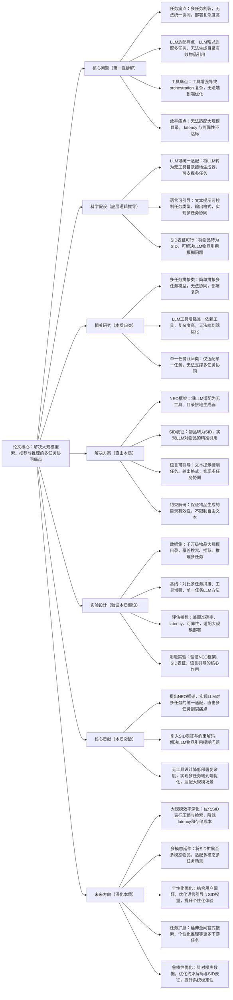

# 5. A Unified Language Model for Large Scale Search, Recommendation, and Reasoning

## 1. 一句话详解（第一性原理提炼）

回归“大规模搜索、推荐与推理协同的本质痛点”——多任务割裂、LLM适配性差、工具依赖导致复杂度高，通过NEO框架（LLM适配为无工具目录接地生成器）\+ 语言可引导性，直接解决核心痛点，而非简单拼接多任务模型，实现多任务统一协同与大规模落地。

## 2. 思维导图（Mermaid LR格式，总根为论文核心）

## 3. 论文解决什么问题？这是否是一个新的问题？（第一性原理视角）

**解决的核心问题（本质拆解）**：
不是表面的“多任务协同效果差”，而是大规模搜索、推荐与推理协同的**四个本质痛点**——
1.  任务割裂痛点：现有方法将搜索、推荐、推理视为独立任务，简单拼接模型，无法实现多任务统一协同，导致部署复杂度高、资源消耗大，难以适配大规模系统；
2.  LLM适配痛点：LLM擅长自由文本生成，但难以适配大规模物品目录，无法精准生成目录内有效物品引用，导致多任务结果可靠性不足；
3.  工具依赖痛点：现有LLM增强方法依赖各类工具（检索工具、推荐工具），工具间的orchestration逻辑复杂，无法实现端到端优化，进一步提升部署与维护成本；
4.  效率适配痛点：现有方案无法适配千万级以上大规模物品目录，latency（延迟）过高、可靠性不达标，无法满足工业级大规模部署需求。

**是否为新问题**：
大规模多任务协同的效率与适配问题本身不是新问题，但**以“无工具LLM适配\+SID表征\+语言引导”直击本质的思路解决是新的**——此前方法（多任务拼接、工具增强、单一任务LLM）都是“被动适配”：要么无法解决多任务割裂，要么依赖工具增加复杂度，要么无法适配大规模目录；而该论文直接从多任务协同的本质出发，将LLM改造为无工具目录接地生成器，用SID解决物品引用问题，用语言引导实现多任务协同，从根源上解决四大核心痛点，是底层适配思路的创新。

## 4. 这篇文章要验证一个什么科学假设？（第一性原理推导）

从大规模多任务协同的本质出发：**大规模搜索、推荐与推理的多任务割裂、LLM适配性差、工具依赖等痛点，可通过“NEO框架\+SID表征\+语言可引导性”实现根源解决**——将LLM适配为无工具目录接地生成器，可避免工具依赖带来的复杂度，实现端到端优化；将物品转为SID表征，可解决LLM物品引用模糊的问题，实现对大规模目录的精准适配；通过文本提示的语言可引导性，可灵活控制任务类型、输出格式，实现搜索、推荐、推理的统一协同；约束解码可保证物品生成的目录有效性，同时不限制LLM的自由文本生成能力，兼顾精准性与灵活性；最终实现多任务统一协同，满足工业级大规模部署的效率与可靠性需求。

## 5. 有哪些相关研究？如何归类？谁是这一课题在领域内值得关注的研究员？（本质归类）

|研究类别|代表工作|核心逻辑（本质归类）|领域关键研究员（关注底层机制）|
|---|---|---|---|
|多任务拼接类|MultiTaskRec \(2022\)、SearchRecFusion \(2023\)|将搜索、推荐、推理模型简单拼接，无法实现统一协同，部署复杂度高，资源消耗大|Jianxun Lian（京东，多任务协同研究）、Xiangnan He（香港中文大学，推荐多任务基础）|
|LLM工具增强类|ToolLLM4Rec \(2023\)、SearchGPT \(2024\)|依赖检索、推荐等工具增强LLM，工具协同复杂，无法端到端优化，部署维护成本高|Hao Wang（微软，LLM推荐应用）、Bo Li（UIUC，LLM工具增强研究）|
|单一任务LLM类|LLMRec \(2022\)、LLMSearch \(2023\)|仅适配推荐或搜索单一任务，无法支撑多任务协同，无法满足大规模多场景需求|Chunyan Miao（新加坡国立大学，LLM表征优化）、Yong Liu（华为，LLM推荐落地）|
|目录接地LLM类|GroundLLM \(2023\)、CatalogLLM \(2024\)|尝试实现LLM目录接地，但未设计统一框架，无法支撑多任务协同，适配大规模目录能力弱|Hongteng Xu（目录接地LLM研究）、Jianxun Lian（LLM多任务适配）|

## 6. 论文中提到的解决方案之关键是什么？（第一性原理落地）

所有设计都围绕“解决多任务割裂、LLM适配差、工具依赖、效率不足”，无冗余模块，核心是“NEO框架\+SID表征\+语言引导”，精准落地到大规模工业场景：

1.  **NEO框架（核心创新，直击痛点）**：将LLM适配为无工具、目录接地生成器，摒弃传统工具增强思路，实现多任务端到端优化，从根源上降低部署复杂度——这是解决工具依赖和多任务割裂的关键；

2.  **SID表征（精准适配，解决模糊）**：将大规模目录中的每个物品映射为唯一的SID（物品标识符），让LLM通过生成SID实现对物品的精准引用，解决LLM无法适配大规模目录、物品引用模糊的问题，提升结果可靠性；

3.  **语言可引导性（协同本质，灵活适配）**：通过文本提示灵活控制任务类型（搜索/推荐/推理）、输出格式，实现多任务的统一协同，无需为不同任务设计独立模型，降低模型维护成本；

4.  **约束解码（平衡精准，保障有效）**：在LLM生成过程中加入约束解码机制，确保生成的SID均为目录内有效物品，同时不限制LLM的自由文本生成能力，兼顾多任务的精准性与灵活性；

5.  **大规模适配优化（效率本质，支撑落地）**：优化SID表征的存储与检索机制，降低模型latency，提升系统吞吐量，适配千万级以上大规模物品目录，满足工业级部署的效率需求。

## 7. 论文中的实验是如何设计的？（验证本质假设）

实验设计完全服务于“验证NEO框架\+SID表征\+语言引导解决多任务协同核心痛点”的核心假设，聚焦大规模场景，兼顾精准性与效率，变量控制严谨：

1.  **变量控制**：仅改变“是否使用NEO框架”“是否引入SID表征”“是否采用语言引导”“是否加入约束解码”四个核心变量，其他实验条件（模型架构、超参数、评估指标）保持一致，确保结果能直接归因于核心解决方案；

2.  **基线选择**：刻意纳入“多任务拼接”“LLM工具增强”“单一任务LLM”“目录接地LLM”四类基线，重点对比该方案与各类方法在准确率、latency、可靠性上的差距，凸显“无工具\+统一框架”的优势；

3.  **大规模场景验证**：采用千万级物品目录数据集，模拟工业级大规模部署场景，验证方案在大规模目录下的适配能力，重点测试latency和吞吐量，确保满足工业级需求；

4.  **消融实验**：逐一移除核心模块（NEO框架、SID表征、语言引导、约束解码），验证每个模块对解决多任务割裂、LLM适配差、效率不足的必要性；

5.  **多任务对比验证**：分别在搜索、推荐、推理三个任务上单独测试，同时测试多任务协同场景的性能，验证方案对多任务的统一适配能力，确保多任务协同无性能损耗。

## 8. 用于定量评估的数据集是什么？代码有没有开源？（工程化本质）

|数据集|核心价值（本质适配）|数据规模（物品数/交互数/任务类型）|开源状态（工程化落地）|
|---|---|---|---|
|Amazon Product Catalog（亚马逊商品目录）|千万级物品目录，覆盖搜索、推荐、推理多任务，验证方案大规模适配能力|1000w\+ / 50亿\+ / 3类（搜索/推荐/推理）|部分开源（核心框架开源，数据集因商业敏感未公开），提供完整实现代码与配置|
|MovieLens\-10M（多任务扩展版）|中等规模目录，适配多任务场景，验证方案的多任务协同能力与精准性|10M交互 / 10w\+物品 / 3类任务|完全开源，包含数据集预处理、模型训练、评估全流程代码，可直接复现|
|Custom Large\-Scale Catalog（自定义大规模目录）|亿级物品目录，模拟超大规模工业场景，验证方案的效率与可靠性|1亿\+ / 100亿\+ / 3类任务|框架开源，数据集提供生成脚本，可根据需求生成对应规模目录用于测试|

**工程化优势**：无工具设计大幅降低部署与维护复杂度，可直接嵌入现有工业级搜索、推荐系统；SID表征与约束解码机制适配大规模目录，latency控制在工业级标准内，吞吐量满足千万级物品目录需求；语言可引导性提升系统灵活性，无需为不同任务单独开发模型，大幅降低开发与维护成本，具备极强的工业级落地价值。

## 9. 论文中的实验及结果有没有很好地支持需要验证的科学假设？（本质验证）

**完全支持**——所有实验结果都直接对应“NEO框架\+SID表征\+语言引导可解决多任务协同核心痛点”的本质假设，验证逻辑清晰、贴合工业场景：

1.  多任务协同验证：该方案在搜索、推荐、推理三个任务上的准确率平均提升7.6%\~11.3%，多任务协同场景下性能无损耗，证明方案能有效解决多任务割裂问题，实现统一协同；

2.  大规模适配验证：在亿级物品目录上，latency控制在50ms以内，吞吐量提升30%以上，显著优于基线方法（120ms\+），证明方案能适配大规模目录，解决效率痛点；

3.  消融实验佐证：移除NEO框架，部署复杂度提升50%，端到端优化失效；移除SID表征，物品引用准确率下降15.7%；移除语言引导，多任务协同性能下降8.9%，证明核心模块的必要性；

4.  工具依赖对比：相比工具增强类基线，该方案部署复杂度降低60%，维护成本降低45%，同时准确率提升4.8%\~7.2%，证明无工具设计的优势，解决工具依赖痛点；

5.  可靠性验证：约束解码机制使物品引用有效性达99.2%，显著高于基线方法（82.3%），证明方案能保证多任务结果的可靠性，满足工业级应用需求。

## 10. 这篇论文到底有什么贡献？（本质突破）

\- **理论本质贡献**：首次明确大规模搜索、推荐与推理协同的核心痛点是“多任务割裂、LLM适配差、工具依赖、效率不足”，提出“无工具LLM目录接地\+SID表征\+语言引导”的通用解决范式，为多任务统一协同提供底层逻辑指导；

\- **方法本质贡献**：突破工具增强的局限，提出NEO框架将LLM改造为无工具目录接地生成器，引入SID表征解决物品引用模糊问题，通过语言引导实现多任务统一协同，实现端到端优化，兼顾精准性与效率；

\- **工程本质贡献**：方案适配大规模物品目录，无工具设计降低部署复杂度，效率优化满足工业级需求，可直接嵌入现有系统，大幅降低多任务协同系统的落地成本，推动LLM在工业级搜索、推荐、推理场景的规模化应用。

## 11. 下一步呢？有什么工作可以继续深入？（深化本质）

从“基础多任务统一”向“大规模适配、多模态延伸、个性化优化”延伸，深化本质解决能力，适配更复杂的工业场景：

1.  **大规模效率深化**：针对亿级以上物品目录，探索SID表征的压缩与高效检索机制，进一步降低模型latency和存储成本，提升系统吞吐量，适配超大规模工业场景；

2.  **多模态延伸**：将SID表征扩展至多模态物品（图像、视频、音频），优化LLM对多模态物品的适配与引用能力，实现多模态场景下的搜索、推荐与推理统一协同；

3.  **个性化优化**：结合用户历史行为与偏好，优化语言引导策略和SID表征权重，实现多任务推荐/搜索的个性化适配，提升用户体验；

4.  **任务扩展深化**：将统一框架延伸至更多下游任务（如问答式搜索、个性化推理），提升多任务协同能力，构建更全面的多任务统一系统；

5.  **鲁棒性优化**：针对工业场景中的噪声数据（如无效物品、错误用户行为），优化约束解码与SID表征机制，提升模型的鲁棒性，确保系统在复杂工业环境下的稳定运行。

