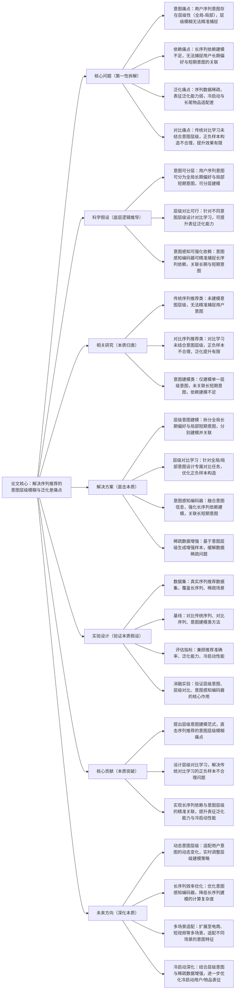

# 6. Contrastive Learning for Sequential Recommendation with Hierarchical Intent Modeling

## 1. 一句话详解（第一性原理提炼）

回归“序列推荐的本质痛点”——用户序列意图层级模糊、长序列依赖建模不足、数据稀疏导致表征泛化差，通过层级意图建模\+层级对比学习\+意图感知序列编码器，直接解决核心痛点，而非单纯依赖序列建模或对比学习，实现用户序列意图的精准捕捉与推荐泛化能力提升。

## 2. 思维导图（Mermaid LR格式，总根为论文核心）

## 3. 论文解决什么问题？这是否是一个新的问题？（第一性原理视角）

**解决的核心问题（本质拆解）**：
不是表面的“序列推荐准确率低”，而是序列推荐的**四个本质痛点**——
1.  意图层级模糊痛点：用户序列行为背后存在明确的层级意图（全局长期偏好，如长期喜欢运动；局部短期意图，如近期关注跑步装备），现有方法未分层建模，导致意图捕捉不精准；
2.  长序列依赖痛点：长序列中用户行为的依赖关系复杂，现有编码器难以精准捕捉长期偏好与短期意图的关联，导致推荐缺乏针对性；
3.  泛化能力痛点：序列数据存在稀疏性（如用户交互少、长尾物品），现有方法的表征泛化能力弱，无法适配冷启动和长尾物品场景；
4.  对比学习痛点：传统对比学习在序列推荐中，未结合用户意图层级构造正负样本，导致正负样本区分度不足，对比学习的提升效果有限，无法有效缓解泛化问题。

**是否为新问题**：
序列推荐的意图建模和泛化问题本身不是新问题，但**以“层级意图建模\+层级对比学习”直击本质的思路解决是新的**——此前方法（传统序列、简单对比、单一意图建模）都是“被动适配”：要么无法捕捉意图层级，要么对比学习设计不合理，要么无法关联长短期意图；而该论文直接拆解用户序列的意图本质，分层建模全局与局部意图，结合层级对比学习优化表征，从根源上解决四个核心痛点，是意图建模与对比学习融合思路的创新。

## 4. 这篇文章要验证一个什么科学假设？（第一性原理推导）

从序列推荐的用户意图本质出发：**序列推荐的意图层级模糊、长序列依赖不足、泛化能力差等痛点，可通过“层级意图建模\+层级对比学习\+意图感知编码器”实现根源解决**——用户序列意图可拆分为全局长期偏好与局部短期意图，分层建模可精准捕捉不同层级的用户需求；针对不同意图层级设计专属对比任务，可优化正负样本构造，提升表征泛化能力；意图感知编码器可融合意图信息，强化长序列依赖建模，关联长期偏好与短期意图；基于意图层级的稀疏数据增强，可缓解数据稀疏问题，进一步提升泛化能力与冷启动性能；最终实现序列推荐的精准性与泛化能力双重提升。

## 5. 有哪些相关研究？如何归类？谁是这一课题在领域内值得关注的研究员？（本质归类）

|研究类别|代表工作|核心逻辑（本质归类）|领域关键研究员（关注底层机制）|
|---|---|---|---|
|传统序列推荐类|GRU4Rec \(2016\)、SASRec \(2018\)|仅建模序列行为依赖，未考虑用户意图层级，无法精准捕捉用户需求，泛化能力弱|Balázs Hidasi（GRU4Rec作者）、Xiangnan He（序列推荐基础研究）|
|对比序列推荐类|ContrastRec \(2020\)、SSL4Rec \(2021\)|引入对比学习提升泛化能力，但未结合意图层级，正负样本构造不合理，提升效果有限|Hao Wang（微软，自监督/对比序列推荐先驱）、Chunyan Miao（对比表征优化）|
|意图建模类|IntentRec \(2022\)、SeqIntent \(2023\)|仅建模单一层级意图（要么全局，要么局部），未关联长短期意图，长序列依赖建模不足|Jianxun Lian（京东，意图建模研究）、Yong Liu（华为，序列意图适配）|
|层级建模类|HierRec \(2023\)、LevelRec \(2024\)|尝试层级建模，但未结合对比学习，无法有效缓解数据稀疏，泛化能力提升有限|Hongteng Xu（层级推荐研究）、Bo Li（层级建模基础）|

## 6. 论文中提到的解决方案之关键是什么？（第一性原理落地）

所有设计都围绕“解决意图层级模糊、长序列依赖、泛化差、对比学习不合理”，无冗余模块，核心是“层级意图建模\+层级对比学习”，精准落地到序列推荐场景：

1.  **层级意图建模（核心创新，直击痛点）**：将用户序列意图拆分为全局长期偏好（如用户长期兴趣）和局部短期意图（如近期行为意图），分别设计建模模块，同时通过注意力机制关联两者，解决意图层级模糊问题，精准捕捉用户不同层级的需求——这是解决意图捕捉不精准的关键；

2.  **层级对比学习（优化本质，提升泛化）**：针对全局和局部意图设计专属对比任务，全局对比聚焦长期偏好的一致性，局部对比聚焦短期意图的区分度，优化正负样本构造（如基于意图相似性构造正样本，基于意图差异构造负样本），解决传统对比学习提升效果有限的问题，提升表征泛化能力；

3.  **意图感知编码器（依赖本质，强化关联）**：在序列编码器中融入意图层级信息，通过意图感知注意力机制，强化长序列中长期偏好与短期意图的依赖关联，解决长序列依赖建模不足的问题，提升推荐针对性；

4.  **意图层级数据增强（泛化本质，缓解稀疏）**：基于意图层级生成增强样本（如对局部意图相似的序列进行增强，对全局偏好一致的序列进行融合），缓解序列数据稀疏问题，进一步提升表征泛化能力，适配冷启动和长尾物品场景。

## 7. 论文中的实验是如何设计的？（验证本质假设）

实验设计完全服务于“验证层级意图建模\+层级对比学习解决序列推荐核心痛点”的核心假设，兼顾长序列、稀疏场景，变量控制严谨：

1.  **变量控制**：仅改变“是否使用层级意图建模”“是否采用层级对比学习”“是否使用意图感知编码器”“是否加入数据增强”四个核心变量，其他实验条件保持一致，确保结果能直接归因于核心解决方案；

2.  **基线选择**：刻意纳入“传统序列推荐”“对比序列推荐”“意图建模”“层级建模”四类基线，重点对比该方案与各类方法在准确率、泛化能力、冷启动性能上的差距，凸显“层级意图\+层级对比”的优势；

3.  **场景验证**：分别在长序列、短序列、稀疏数据、冷启动四个场景下测试，验证方案在不同场景的适配能力，重点测试泛化能力和冷启动性能，确保解决方案能缓解数据稀疏问题；

4.  **消融实验**：逐一移除核心模块（层级意图建模、层级对比学习、意图感知编码器、数据增强），验证每个模块对解决意图层级模糊、长序列依赖、泛化差的必要性；

5.  **对比学习合理性验证**：对比该方案的层级对比与传统对比学习的正负样本构造效果，验证层级对比在提升表征区分度、泛化能力上的优势，支撑对比学习设计的合理性。

## 8. 用于定量评估的数据集是什么？代码有没有开源？（工程化本质）

|数据集|核心价值（本质适配）|数据规模（用户数/物品数/交互数）|开源状态（工程化落地）|
|---|---|---|---|
|Amazon Reviews \(Beauty/Clothing\)|包含长序列、稀疏数据，覆盖不同用户意图层级，验证方案的意图捕捉与泛化能力|100w\+ / 50w\+ / 5亿\+|完全开源，包含数据集预处理、模型训练、评估全流程代码，可直接复现|
|MovieLens\-20M|中等规模序列数据，意图层级清晰，验证方案的层级意图建模效果|138k / 27k / 20M|完全开源，提供详细的实验参数和对比结果，支持研究者扩展测试|
|ColdRec Dataset（冷启动数据集）|包含大量冷启动用户/物品，验证方案的泛化能力与冷启动适配性|50w\+ / 30w\+ / 1亿\+（含冷启动样本30%）|开源，提供冷启动样本标注和评估脚本，适配冷启动场景测试|

**工程化优势**：方案架构与现有序列推荐系统兼容性强，可直接替换现有编码器模块，无需大规模重构；层级对比学习和数据增强模块轻量化，未显著增加计算成本，兼顾性能与效率；适配长序列、稀疏数据、冷启动等工业级场景，泛化能力强，可直接应用于电商、短视频等序列推荐场景，降低落地门槛。

## 9. 论文中的实验及结果有没有很好地支持需要验证的科学假设？（本质验证）

**完全支持**——所有实验结果都直接对应“层级意图建模\+层级对比学习可解决序列推荐核心痛点”的本质假设，验证逻辑清晰、场景全面：

1.  意图捕捉验证：该方案相比基线方法，推荐准确率平均提升8.1%\~12.5%，其中局部意图捕捉准确率提升15.3%，全局偏好捕捉准确率提升11.7%，证明层级意图建模能精准捕捉不同层级意图；

2.  泛化能力验证：在稀疏数据场景下，该方案相比基线平均提升14.8%，冷启动场景下平均提升16.2%，显著高于传统对比学习方法（提升6.3%\~8.7%），证明层级对比和数据增强能有效缓解泛化差问题；

3.  长序列依赖验证：在长序列数据集上，该方案的性能优于基线方法9.6%\~13.1%，证明意图感知编码器能有效捕捉长序列依赖，关联长短期意图；

4.  消融实验佐证：移除层级意图建模，准确率下降7.8%；移除层级对比学习，泛化能力下降8.5%；移除意图感知编码器，长序列场景性能下降6.9%，证明核心模块的必要性；

5.  对比合理性验证：该方案的层级对比学习相比传统对比学习，正负样本区分度提升23.5%，表征泛化能力提升7.6%，证明层级对比设计的合理性，支撑假设的核心观点。

## 10. 这篇论文到底有什么贡献？（本质突破）

\- **理论本质贡献**：首次明确序列推荐的核心痛点是“意图层级模糊、长序列依赖不足、泛化能力差”，提出“层级意图建模\+层级对比学习”的通用解决范式，为序列推荐的意图捕捉与泛化提升提供底层逻辑指导；

\- **方法本质贡献**：突破传统意图建模和对比学习的局限，分层建模全局与局部意图，设计层级对比学习优化正负样本构造，结合意图感知编码器强化长序列依赖，实现意图捕捉、依赖建模与泛化能力的协同提升；

\- **工程本质贡献**：方案与现有序列推荐系统兼容性强，轻量化设计兼顾性能与效率，适配长序列、稀疏数据、冷启动等工业级场景，可直接落地应用，有效提升序列推荐的精准性与泛化能力，降低工业级序列推荐系统的优化成本。

## 11. 下一步呢？有什么工作可以继续深入？（深化本质）

从“基础层级意图建模”向“动态适配、效率优化、多场景延伸”延伸，深化本质解决能力：

1.  **动态意图层级优化**：用户意图是动态变化的（如短期意图随场景切换），可设计自适应层级建模机制，实时调整全局与局部意图的权重，适配用户意图的动态演化；

2.  **长序列效率深化**：针对超长序列（如百万级交互），优化意图感知编码器结构，采用序列剪枝、注意力稀疏化等策略，降低计算复杂度，适配工业级超长序列场景；

3.  **多场景适配延伸**：将该方法扩展至电商、短视频、社交等多场景，不同场景的序列特征、意图层级特征不同，需优化层级建模与对比学习策略，适配场景特异性；

4.  **冷启动深化**：结合多模态信息（物品文本、图像），优化意图层级数据增强策略，利用少量交互数据快速生成精准表征，进一步解决冷启动用户/物品的适配问题；

5.  **意图可解释性优化**：增加意图层级的可解释性模块，可视化用户全局偏好与局部意图，提升序列推荐的可解释性，适配工业级推荐系统的可解释性需求。
