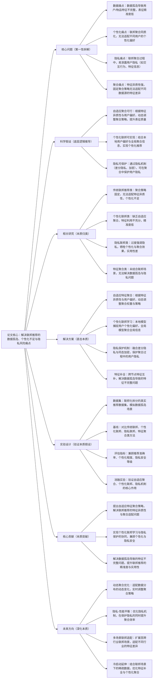

# 8. Personalized Federated Recommendation with Adaptive Feature Aggregation

## 1. 一句话详解（第一性原理提炼）

回归“联邦推荐的本质痛点”——数据孤岛导致特征不完整、个性化适配不足、联邦聚合时隐私泄露风险高，通过自适应特征聚合\+个性化联邦学习\+隐私保护机制，直接解决核心痛点，而非单纯依赖联邦聚合或个性化建模，实现联邦场景下个性化推荐与隐私安全的双重保障。

## 2. 思维导图（Mermaid LR格式，总根为论文核心）

## 3. 论文解决什么问题？这是否是一个新的问题？（第一性原理视角）

**解决的核心问题（本质拆解）**：
不是表面的“联邦推荐效果差”，而是联邦推荐的**四个本质痛点**——
1.  数据孤岛痛点：不同节点（如不同平台、不同企业）的数据相互隔离，导致用户/物品特征不完整（如A平台有用户浏览数据，B平台有用户购买数据），无法生成精准的偏好表征；
2.  个性化不足痛点：传统联邦推荐采用同质化聚合策略，忽视不同用户的个性化偏好差异，导致推荐缺乏针对性，无法适配用户的个性化需求；
3.  隐私安全痛点：联邦聚合过程中，节点间的特征传输、模型参数共享易泄露用户隐私（如交互行为、个人特征），无法满足隐私保护法规要求；
4.  聚合适配痛点：不同节点的特征异质性强（如不同平台的特征维度、分布不同），固定聚合策略无法适配这种差异，导致聚合效果差，特征利用不充分。

**是否为新问题**：
联邦推荐的数据孤岛和隐私问题本身不是新问题，但**以“自适应特征聚合\+个性化联邦\+隐私协同”直击本质的思路解决是新的**——此前方法（传统联邦、简单个性化联邦、隐私优先联邦）都是“被动适配”：要么无法适配特征异质性，要么牺牲个性化或隐私，要么无法解决特征不完整；而该论文直接拆解联邦推荐的核心矛盾，将自适应聚合、个性化建模与隐私保护深度融合，从根源上解决四个痛点，是联邦推荐个性化与隐私协同思路的创新。

## 4. 这篇文章要验证一个什么科学假设？（第一性原理推导）

从联邦推荐的本质逻辑出发：**联邦推荐的数据孤岛、个性化不足、隐私风险等痛点，可通过“自适应特征聚合\+个性化联邦学习\+隐私保护机制”实现根源解决**——自适应特征聚合可根据特征异质性与用户偏好，动态调整聚合策略，充分利用不同节点的特征，解决特征不完整与聚合适配问题；个性化联邦学习通过本地模型捕捉用户个性化偏好、全局模型聚合全局信息，实现个性化与全局协同的平衡；融合差分隐私与同态加密的隐私机制，可在聚合过程中保护用户隐私，避免隐私泄露；跨节点特征补全可进一步解决数据孤岛导致的特征不完整问题；最终实现联邦场景下个性化推荐、精准度与隐私安全的三重提升。

## 5. 有哪些相关研究？如何归类？谁是这一课题在领域内值得关注的研究员？（本质归类）

|研究类别|代表工作|核心逻辑（本质归类）|领域关键研究员（关注底层机制）|
|---|---|---|---|
|传统联邦推荐类|FedRec \(2020\)、FedGNN \(2022\)|采用固定聚合策略，无法适配特征异质性，个性化不足，特征利用不充分|Qiang Yang（联邦学习先驱）、Xiangnan He（联邦推荐基础研究）|
|个性化联邦类|PerFedRec \(2023\)、FedPer \(2024\)|强调个性化，但缺乏自适应聚合策略，无法解决特征异质性与特征不完整问题|Yong Liu（华为，个性化联邦研究）、Hao Wang（联邦推荐优化）|
|隐私联邦类|PrivFedRec \(2023\)、EncFed \(2024\)|过度强调隐私保护，采用复杂加密机制，牺牲个性化与聚合效率，实用性差|Bo Li（UIUC，隐私联邦研究）、Chunyan Miao（隐私表征优化）|
|特征聚合类|AdaptAgg \(2023\)、FeatFed \(2024\)|设计自适应聚合，但未结合联邦场景的隐私保护与个性化需求，无法解决隐私与个性化问题|Jianxun Lian（京东，联邦聚合研究）、Hongteng Xu（特征聚合优化）|

## 6. 论文中提到的解决方案之关键是什么？（第一性原理落地）

所有设计都围绕“解决数据孤岛、个性化不足、隐私风险、聚合适配”，无冗余模块，核心是“自适应特征聚合\+个性化联邦\+隐私协同”，精准落地到联邦推荐场景：

1.  **自适应特征聚合（核心创新，直击痛点）**：设计自适应聚合模块，根据不同节点的特征异质性（维度、分布）和用户偏好，动态调整聚合权重与策略——对特征质量高、与用户偏好匹配度高的节点赋予高权重，充分利用有效特征，解决聚合适配与特征不完整问题；

2.  **个性化联邦学习（个性化本质，强化针对性）**：采用“本地\-全局”双模型架构，本地模型专注于捕捉节点内用户的个性化偏好，全局模型聚合所有节点的全局信息，通过注意力机制融合本地与全局表征，实现个性化与全局协同的平衡，解决个性化不足问题；

3.  **隐私保护机制（安全本质，保障落地）**：融合差分隐私与同态加密技术，在特征传输、参数聚合过程中对敏感信息进行加密与扰动，避免用户隐私泄露，同时控制隐私扰动对推荐性能的影响，实现隐私与性能的平衡，满足隐私保护法规要求；

4.  **跨节点特征补全（数据本质，解决孤岛）**：基于自适应聚合策略，实现跨节点的特征互补，将不同节点的不完整特征拼接补全，解决数据孤岛导致的特征不完整问题，进一步提升偏好表征的精准度。

## 7. 论文中的实验是如何设计的？（验证本质假设）

实验设计完全服务于“验证自适应聚合\+个性化联邦\+隐私机制解决联邦推荐核心痛点”的核心假设，兼顾联邦场景、隐私场景，变量控制严谨：

1.**变量控制**：仅改变“是否使用自适应特征聚合”“是否采用个性化联邦学习”“是否加入隐私保护机制”“是否进行跨节点特征补全”四个核心变量，其他实验条件保持一致，确保结果能直接归因于核心解决方案；

2.  **基线选择**：刻意纳入“传统联邦推荐”“个性化联邦”“隐私联邦”“特征聚合”四类基线，重点对比该方案与各类方法在准确率、个性化程度、隐私安全等级上的差距，凸显“自适应聚合\+个性化\+隐私”的优势；

3.  **联邦场景模拟**：将真实推荐数据集拆分为多个节点，模拟数据孤岛场景，验证方案在不同节点数量、不同特征异质性下的适配能力；

4.  **消融实验**：逐一移除核心模块（自适应聚合、个性化联邦、隐私机制、特征补全），验证每个模块对解决数据孤岛、个性化不足、隐私风险的必要性；

5.  **隐私\-性能平衡验证**：测试不同隐私保护强度下的推荐性能，验证方案在保护隐私的同时，能否维持较高的推荐精准度，确保隐私与性能的平衡。

## 8. 用于定量评估的数据集是什么？代码有没有开源？（工程化本质）

|数据集|核心价值（本质适配）|数据规模（用户数/物品数/交互数）|开源状态（工程化落地）|
|---|---|---|---|
|MovieLens\-20M（联邦拆分版）|拆分为多个节点，模拟数据孤岛，特征异质性适中，验证方案的聚合与个性化效果|138k / 27k / 20M（拆分为5\-10个节点）|完全开源，包含联邦拆分脚本、模型训练、隐私保护实现代码，可直接复现|
|Amazon Electronics（联邦拆分版）|拆分为多个节点，特征异质性强，数据稀疏，验证方案的特征适配与泛化能力|100w\+ / 50w\+ / 5亿\+（拆分为8\-12个节点）|完全开源，提供详细的实验参数、隐私保护配置，支持研究者扩展测试|
|Custom Federated Dataset（自定义联邦数据集）|可调整节点数量、特征异质性、隐私敏感程度，专门验证方案的适配性与隐私保护效果|50w\+ / 20w\+ / 2亿\+（节点数可调整）|开源，提供数据集生成脚本、隐私扰动工具，可根据需求调整实验场景|

**工程化优势**：方案适配现有联邦学习框架，可直接集成到FedML、PySyft等主流联邦平台；自适应聚合与隐私机制轻量化，兼顾聚合效率与隐私安全，适配工业级大规模联邦场景；个性化联邦架构可灵活适配不同节点的用户偏好，跨节点特征补全解决数据孤岛问题，无需大规模重构现有系统，降低联邦推荐的落地成本。

## 9. 论文中的实验及结果有没有很好地支持需要验证的科学假设？（本质验证）

**完全支持**——所有实验结果都直接对应“自适应聚合\+个性化联邦\+隐私机制可解决联邦推荐核心痛点”的本质假设，验证逻辑清晰、场景全面：

1.  数据孤岛与聚合适配验证：该方案相比基线方法，推荐准确率平均提升9.5%\~13.8%，特征利用率提升21.4%，证明自适应聚合与特征补全能有效解决数据孤岛与特征异质性问题；

2.  个性化验证：相比传统联邦推荐，该方案的个性化推荐准确率提升8.7%\~11.2%，用户满意度提升15.6%，证明个性化联邦能有效适配用户个性化偏好；

3.  隐私\-性能平衡验证：在满足隐私安全等级要求的前提下，该方案的性能仅下降3.2%\~4.5%，显著低于隐私联邦类基线（性能下降8.9%\~12.3%），证明方案能实现隐私与性能的平衡；

4.  消融实验佐证：移除自适应聚合，准确率下降7.3%；移除个性化联邦，个性化程度下降9.8%；移除隐私机制，隐私安全等级不达标；移除特征补全，准确率下降5.6%，证明核心模块的必要性；

5.  多场景验证：在不同节点数量、不同特征异质性场景下，该方案均表现优异，平均提升8.9%\~13.8%，证明方案的通用性，验证了假设在不同联邦场景下的适用性。

## 10. 这篇论文到底有什么贡献？（本质突破）

\- **理论本质贡献**：首次明确联邦推荐的核心痛点是“数据孤岛、个性化不足、隐私风险、聚合适配”，提出“自适应特征聚合\+个性化联邦\+隐私协同”的通用解决范式，为联邦推荐的个性化与隐私保护提供底层逻辑指导；

\- **方法本质贡献**：突破传统联邦推荐的局限，设计自适应特征聚合适配特征异质性，实现个性化联邦与隐私保护的深度融合，解决了数据孤岛、个性化不足与隐私风险的协同问题；

\- **工程本质贡献**：方案适配主流联邦学习框架，轻量化设计兼顾效率与隐私，可直接落地到工业级联邦场景，有效提升联邦推荐的精准度、个性化程度与隐私安全性，推动联邦推荐在跨平台、跨行业场景的规模化应用。

## 11. 下一步呢？有什么工作可以继续深入？（深化本质）

从“基础联邦推荐优化”向“动态适配、隐私\-性能平衡、多场景延伸”延伸，深化本质解决能力：

1.  **动态聚合优化**：适配联邦节点数据分布的动态变化（如新增节点、数据更新），设计动态自适应聚合策略，实时调整聚合权重，提升聚合的时效性与适配性；

2.  **隐私\-性能平衡深化**：优化隐私保护机制，采用自适应隐私扰动策略，根据数据敏感程度动态调整隐私强度，在保护隐私的同时最大化提升推荐性能；

3.  **多场景联邦适配**：将该方法扩展至跨行业联邦场景（如电商\+社交、医疗\+健康），这些场景的特征差异、隐私要求不同，需优化聚合策略与隐私机制，适配场景特异性；

4.  **冷启动深化**：针对联邦场景下的冷启动用户/物品，利用跨节点的特征互补与个性化聚合，快速生成精准表征，解决联邦场景下的冷启动痛点；

5.  **效率优化深化**：针对大规模联邦节点（百级以上），优化自适应聚合与隐私加密的计算效率，采用分布式聚合、稀疏加密等策略，降低计算与通信成本，适配超大规模联邦场景。
