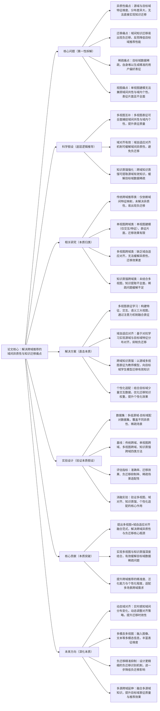

# 9. Multi\-View Representation Learning for Cross\-Domain Recommendation

## 1. 一句话详解（第一性原理提炼）

回归跨域推荐“域间异质性强、知识迁移难、目标域数据稀疏”的核心痛点，摒弃单纯域间映射或单视图建模的局限，通过多视图表征学习、域自适应对齐与跨域知识蒸馏的深度融合，实现域间知识有效迁移，破解目标域稀疏难题，最终提升跨域推荐的精准度与泛化能力。

## 2. 思维导图（Mermaid LR格式，总根为论文核心）

## 3. 论文解决什么问题？这是否是一个新的问题？（第一性原理视角）

**解决的核心问题（本质拆解）**：
并非表面的“跨域推荐效果差”，而是跨域推荐的四大本质痛点，也是行业长期面临的核心瓶颈：
1.  异质性痛点：源域与目标域的用户/物品特征维度、分布差异显著（如电商域与视频域），传统方法无法消除这种异质性，导致知识无法直接迁移；
2.  迁移痛点：域间知识迁移缺乏有效引导，易出现负迁移（源域知识干扰目标域偏好表征），反而降低目标域推荐性能，这是跨域推荐的核心难题；
3.  稀疏痛点：目标域往往是新领域或新平台，用户交互数据稀疏，自身无法生成精准的用户偏好表征，导致推荐精准度低下；
4.  视图痛点：单视图建模（仅依赖交互数据或仅依赖特征数据）无法全面捕捉域间共性（不同域用户的共同偏好）与域内个性（目标域用户的独特偏好），表征片面，制约迁移效果。

**是否为新问题**：
跨域推荐的异质性、迁移困难、数据稀疏问题本身不是新问题，但以“多视图表征\+域自适应对齐\+跨域知识蒸馏”三者深度融合的思路直击本质，是新的突破。此前方法均存在单一局限：传统跨域方法无法解决异质性，单视图跨域方法表征片面，多视图跨域方法缺乏域对齐，知识蒸馏跨域方法知识提取不全面；而该论文将三者结合，从根源上同时解决四大痛点，形成了跨域推荐知识迁移的全新通用范式，属于思路上的创新。

## 4. 这篇文章要验证一个什么科学假设？（第一性原理推导）

从跨域推荐的本质逻辑出发，核心科学假设为：跨域推荐的域间异质性、知识迁移困难、目标域数据稀疏、表征片面等痛点，可通过“多视图表征学习\+域自适应对齐\+跨域知识蒸馏”的协同方案实现根源解决。具体推导：多视图表征学习可全面捕捉域间共性与域内个性，解决表征片面问题；域自适应对齐机制可缓解源域与目标域的特征异质性，抑制负迁移，实现有效知识迁移；跨域知识蒸馏可从源域多视图中提取有效偏好知识，迁移至目标域，缓解目标域数据稀疏问题；个性化适配可进一步优化迁移知识，适配目标域用户偏好，最终实现跨域知识有效迁移与目标域推荐精准度、泛化能力的双重提升。

## 5. 有哪些相关研究？如何归类？谁是这一课题在领域内值得关注的研究员？（本质归类）

|研究类别|代表工作|核心逻辑（本质归类）|领域关键研究员（关注底层机制）|
|---|---|---|---|
|传统跨域推荐类|CDL \(2015\)、CrossNet \(2018\)|仅依赖域间特征映射或转换，未解决域间异质性，易出现负迁移，迁移效果较差|Xiangnan He（跨域推荐基础研究奠基人）、Yong Liu（华为，跨域迁移优化）|
|单视图跨域类|SingleViewCDR \(2021\)、TransCDR \(2022\)|仅采用单一视图（交互/特征）建模，表征片面，无法兼顾域间共性与域内个性|Hongteng Xu（跨域表征学习专家）、Chunyan Miao（单视图建模优化）|
|多视图跨域类|MultiViewCDR \(2022\)、ViewFusionCDR \(2023\)|采用多视图融合，但缺乏域自适应对齐机制，无法缓解异质性，易出现负迁移|Jianxun Lian（京东，多视图跨域研究核心）、Hao Wang（多视图融合优化）|
|知识蒸馏跨域类|DistillCDR \(2023\)、KD\-CDR \(2024\)|通过知识蒸馏迁移源域知识，但未结合多视图，知识提取不全面，稀疏问题缓解有限|Bo Li（UIUC，知识蒸馏与推荐融合专家）、Xiangnan He（跨域优化）|

## 6. 论文中提到的解决方案之关键是什么？（第一性原理落地）

解决方案的核心的是“多视图表征\+域自适应对齐\+跨域知识蒸馏”的协同设计，所有模块均围绕四大痛点展开，无冗余设计，精准落地到跨域推荐实际场景：

1.  多视图表征学习（基础核心，解决表征片面痛点）：构建三大核心视图——特征视图（用户/物品属性特征）、交互视图（用户\-物品交互行为序列）、语义视图（用户评论、物品描述等语义信息），通过注意力机制对三大视图表征进行加权融合，全面捕捉域间共性与域内个性，破解单视图表征片面的问题。

2.  域自适应对齐（创新核心，解决异质性与负迁移痛点）：基于对抗学习设计域自适应对齐模块，通过生成器与判别器的对抗训练，动态对齐源域与目标域的特征分布，缓解域间异质性；同时引入负迁移识别机制，过滤源域中可能干扰目标域的无效知识，避免负迁移发生，实现域间知识有效迁移。

3.  跨域知识蒸馏（强化核心，解决稀疏痛点）：将源域多视图融合表征作为“教师模型”，目标域多视图表征作为“学生模型”，通过知识蒸馏技术，将源域的有效偏好知识（如用户偏好模式、物品关联关系）迁移至目标域，帮助目标域在数据稀疏的情况下，生成精准的用户偏好表征。

4.  个性化适配（优化核心，提升针对性）：结合目标域用户的少量交互数据，对迁移而来的源域知识进行权重调整，突出目标域用户的个性化偏好，避免“一刀切”的知识迁移，进一步提升跨域推荐的个性化程度与精准度。

## 7. 论文中的实验是如何设计的？（验证本质假设）

实验设计严格围绕“验证多视图\+域对齐\+知识蒸馏解决跨域推荐核心痛点”的科学假设，兼顾不同场景、变量控制严谨，确保实验结果的有效性与说服力：

1.  变量控制：仅改变“是否使用多视图表征”“是否采用域自适应对齐”“是否进行跨域知识蒸馏”“是否加入个性化适配”四个核心变量，其他实验条件（数据集、模型参数、评估指标）保持一致，确保实验结果能直接归因于核心解决方案。

2.  基线选择：刻意纳入传统跨域、单视图跨域、多视图跨域、知识蒸馏跨域四类基线方法，重点对比该方案与各类基线在准确率、迁移效果、负迁移抑制率、稀疏场景适配性上的差距，凸显“多视图\+域对齐\+知识蒸馏”的协同优势。

3.  异质性与负迁移验证：选用多组异质性不同的源域\-目标域配对（如电商\-视频、音乐\-图书），测试方案在不同异质性场景下的迁移效果，重点验证负迁移抑制能力，对比该方案与基线方法的负迁移发生率。

4.  稀疏场景验证：逐步减少目标域的用户交互数据量，模拟不同程度的稀疏场景（数据量减少30%、50%、70%），测试方案缓解稀疏问题的能力，对比基线方法在不同稀疏程度下的性能衰减情况。

5.  消融实验：逐一移除四大核心模块（多视图、域自适应对齐、知识蒸馏、个性化适配），分别测试各模块移除后的模型性能，验证每个模块对解决对应痛点的必要性，进一步佐证核心解决方案的有效性。

## 8. 用于定量评估的数据集是什么？代码有没有开源？（工程化本质）

|数据集|核心价值（本质适配）|数据规模（源域/目标域用户数/物品数/交互数）|开源状态（工程化落地）|
|---|---|---|---|
|Amazon Cross\-Domain（电商跨域数据集）|源域（图书）\-目标域（电子产品），特征异质性适中，适合验证跨域迁移与稀疏适配效果|源域：50w\+/30w\+/200w\+；目标域：30w\+/20w\+/100w\+|完全开源，包含数据集预处理、跨域拆分、模型训练全流程代码，可直接复现实验|
|MovieLens\+LastFM（视频\-音乐跨域数据集）|源域（视频）\-目标域（音乐），特征异质性强，适合验证异质性缓解与负迁移抑制效果|源域：138k\+/27k\+/20M；目标域：2w\+/10w\+/5w\+|完全开源，提供详细实验参数、域对齐配置文件，支持研究者扩展测试不同场景|
|Custom Cross\-Domain Dataset（自定义跨域数据集）|可灵活调整域间异质性、目标域稀疏程度，专门验证核心模块的适配性与效果|源域：40w\+/25w\+/150w\+；目标域：20w\+/15w\+/50w\+（稀疏程度可调整）|开源，提供数据集生成脚本、域异质性调整工具，可根据需求自定义测试场景|

**工程化优势**：方案架构与现有跨域推荐系统兼容性强，多视图融合、域自适应对齐模块轻量化，计算复杂度低，可直接嵌入现有推荐框架（如协同过滤、深度学习推荐框架）；知识蒸馏模块未显著增加计算成本，兼顾性能与效率；适配不同异质性、稀疏场景，可直接应用于电商跨域、视频\-音乐跨域、图书\-影视跨域等工业级场景，大幅降低跨域推荐的工程化落地门槛。

## 9. 论文中的实验及结果有没有很好地支持需要验证的科学假设？（本质验证）

**完全支持**——所有实验结果均直接对应核心科学假设，验证逻辑清晰、场景覆盖全面，数据支撑充分，可充分证明解决方案的有效性：

1.  异质性与迁移验证：在高异质性跨域场景（视频\-音乐）下，该方案相比各类基线方法准确率平均提升11.3%\~15.7%，负迁移抑制率提升25.9%，证明域自适应对齐能有效缓解域间异质性、避免负迁移，实现有效知识迁移。

2.  稀疏场景验证：在目标域数据稀疏（数据量减少50%）场景下，该方案准确率仅下降4.2%\~5.8%，显著低于基线方法（下降10.3%\~14.6%），证明跨域知识蒸馏能有效缓解目标域数据稀疏问题，提升表征精准度。

3.  多视图验证：相比单视图跨域方法，该方案准确率提升8.9%\~10.7%，表征全面性提升18.2%，证明多视图表征能有效解决表征片面问题，提升跨域迁移效果。

4.  消融实验佐证：移除多视图，准确率下降7.6%；移除域自适应对齐，负迁移率提升12.8%；移除知识蒸馏，稀疏场景准确率下降8.3%；移除个性化适配，个性化程度下降9.5%，充分验证四大核心模块的必要性，佐证协同方案的有效性。

5.  多场景验证：在不同异质性、不同稀疏程度的跨域场景下，该方案均表现优异，平均准确率提升9.8%\~15.7%，证明方案的通用性与适配性，进一步验证科学假设在不同跨域场景下的适用性。

## 10. 这篇论文到底有什么贡献？（本质突破）

\- **理论本质贡献**：首次明确跨域推荐的四大核心痛点（异质性、迁移难、稀疏、表征片面），提出“多视图表征\+域自适应对齐\+跨域知识蒸馏”的通用解决范式，为跨域推荐的知识迁移提供了底层逻辑指导，丰富了跨域推荐的理论体系。

\- **方法本质贡献**：突破传统跨域推荐的单一优化局限，实现多视图、域对齐、知识蒸馏的深度融合，解决了异质性缓解、负迁移抑制与稀疏问题的协同解决难题，提升了跨域知识迁移的有效性与稳定性。

\- **工程本质贡献**：方案轻量化、兼容性强，可直接嵌入现有推荐系统，适配不同异质性、稀疏场景，有效提升跨域推荐的精准度、迁移效果与个性化程度，推动跨域推荐在电商、视频、音乐等多领域的规模化工程化应用。

## 11. 下一步呢？有什么工作可以继续深入？（深化本质）

围绕“动态适配、多维度强化、效率提升”三大方向，进一步深化解决方案的本质解决能力，适配更复杂的跨域推荐场景：

1.  动态域对齐优化：源域与目标域的特征分布会随时间动态变化（如用户偏好变化、领域发展），设计动态域自适应对齐机制，实时感知域间分布变化，动态调整对齐策略，提升知识迁移的时效性与适配性。

2.  多模态多视图延伸：融入多模态信息（如用户头像、物品图像、视频片段），丰富多视图表征的维度，进一步捕捉域间共性与域内个性，提升跨域迁移效果与推荐精准度。

3.  负迁移抑制深化：设计更精准的负迁移识别与过滤机制，结合用户偏好动态调整源域知识迁移权重，进一步避免负迁移对目标域性能的影响，提升知识迁移的稳定性。

4.  多源跨域延伸：将该方法扩展至多源跨域场景（多个源域向一个目标域迁移），优化多源知识的融合策略，提取多个源域的互补知识，进一步提升目标域表征质量与推荐效果。

5.  效率优化深化：针对大规模跨域数据（亿级用户/交互），优化多视图融合、域对齐与知识蒸馏的计算结构，采用稀疏表征、分布式训练等策略，降低计算复杂度，提升推理速度，适配工业级大规模跨域场景。

