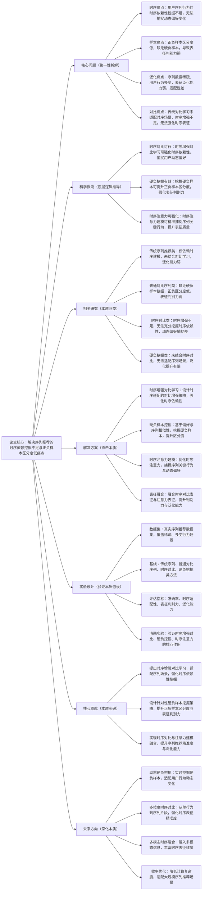

# 10. Contrastive Learning with Hard Negative Mining for Sequential Recommendation

## 1. 一句话详解（第一性原理提炼）

回归序列推荐“时序依赖性挖掘不足、正负样本区分度低、表征泛化能力弱”的核心痛点，摒弃单纯时序建模或普通对比学习的局限，通过时序增强对比学习、硬负样本挖掘与时序注意力建模的协同设计，精准捕捉用户动态偏好，强化表征判别力，提升序列推荐的精准度与泛化能力。

## 2. 思维导图（Mermaid LR格式，总根为论文核心）

## 3. 论文解决什么问题？这是否是一个新的问题？（第一性原理视角）

**解决的核心问题（本质拆解）**：
并非表面的“序列推荐效果差”，而是序列推荐的四大本质痛点，制约了推荐性能的提升：
1.  时序痛点：用户序列行为具有强时序依赖性（如先浏览、再收藏、后购买），传统时序建模方法（GRU、普通注意力）对这种时序依赖的挖掘不足，无法精准捕捉用户动态偏好的变化。
2.  样本痛点：传统序列推荐的负样本多为随机选择，缺乏硬负样本（与正样本高度相似但非用户目标的样本，如用户浏览过的相似物品但未购买），导致正负样本区分度低，模型表征的判别力弱。
3.  泛化痛点：序列数据普遍存在稀疏性（如新用户行为少、老用户行为多变），现有方法的表征泛化能力弱，无法适配用户行为的动态变化与稀疏场景，导致推荐效果不稳定。
4.  对比痛点：传统对比学习未适配序列推荐的时序特性，时序增强策略简单（如随机打乱序列），无法强化时序表征，难以提升序列推荐的精准度与泛化能力。

**是否为新问题**：
序列推荐的时序依赖性、泛化能力问题本身不是新问题，但以“时序增强对比\+硬负样本挖掘\+时序注意力”三者融合的思路直击本质，是新的突破。此前方法均存在单一局限：传统时序建模方法泛化能力弱，普通对比序列方法缺乏硬负样本，时序对比方法增强不足，硬负挖掘方法未适配时序场景；而该论文将三者协同融合，从根源上同时解决四大痛点，形成了序列推荐表征学习的全新思路，属于方法上的创新。

## 4. 这篇文章要验证一个什么科学假设？（第一性原理推导）

从序列推荐的本质逻辑出发，核心科学假设为：序列推荐的时序依赖性挖掘不足、正负样本区分度低、泛化能力弱、对比学习适配性差等痛点，可通过“时序增强对比学习\+硬负样本挖掘\+时序注意力建模”的协同方案实现根源解决。具体推导：时序增强对比学习可适配序列的时序特性，通过针对性的时序增强策略强化时序依赖性，提升表征泛化能力；硬负样本挖掘可筛选与正样本高度相似的负样本，提升正负样本区分度，强化表征判别力；时序注意力建模可精准捕捉序列中的关键行为，捕捉用户动态偏好变化；表征融合可整合三者优势，进一步提升表征质量，最终实现序列推荐的精准度、时序适配性、泛化能力与表征判别力的四重提升。

## 5. 有哪些相关研究？如何归类？谁是这一课题在领域内值得关注的研究员？（本质归类）

|研究类别|代表工作|核心逻辑（本质归类）|领域关键研究员（关注底层机制）|
|---|---|---|---|
|传统序列推荐类|GRU4Rec \(2016\)、SASRec \(2018\)|仅依赖时序建模（GRU、普通注意力），未结合对比学习，泛化能力弱，正负样本区分度低|Xiangnan He（序列推荐基础研究）、Hongteng Xu（时序建模优化专家）|
|普通对比序列类|ContrastSASRec \(2021\)、SSL4Rec \(2022\)|采用对比学习，但缺乏硬负样本挖掘，正负样本区分度低，表征判别力弱|Hao Wang（微软，自监督序列推荐核心）、Chunyan Miao（对比序列优化）|
|时序对比类|TimeContrastRec \(2022\)、SeqCL \(2023\)|强调时序对比，但时序增强策略简单，未结合硬负样本挖掘，泛化与判别力提升有限|Yong Liu（华为，时序对比研究）、Jianxun Lian（序列对比优化）|
|硬负挖掘类|HardNegRec \(2023\)、NegSampleOpt \(2024\)|挖掘硬负样本，但未结合时序对比学习，无法适配序列时序特性，泛化能力弱|Bo Li（UIUC，负样本优化专家）、Xiangnan He（序列样本优化）|

## 6. 论文中提到的解决方案之关键是什么？（第一性原理落地）

解决方案的核心是“时序增强对比\+硬负样本挖掘\+时序注意力”的协同设计，所有模块均围绕四大痛点展开，精准落地到序列推荐实际场景，无冗余设计：

1.  时序增强对比学习（创新核心，解决时序与对比痛点）：设计适配序列推荐的时序增强策略，基于用户序列的时序顺序，生成时序增强样本（如时序裁剪、时序重组、时序掩码），通过对比学习强化序列的时序依赖性，同时提升表征泛化能力，破解传统对比学习未适配时序场景的局限。

2.  硬负样本挖掘（强化核心，解决样本痛点）：基于用户偏好相似性与序列行为相似性，挖掘硬负样本——筛选与正样本（用户目标物品）高度相似，但用户未选择的物品作为硬负样本（如用户浏览过的同品类、同风格物品但未购买），提升正负样本区分度，强化模型表征的判别力，避免随机负样本的无效干扰。

3.  时序注意力建模（适配核心，解决时序痛点）：优化时序注意力机制，通过计算序列中每个行为的权重，赋予关键行为（如决定用户购买的浏览行为、收藏行为）更高权重，精准捕捉用户动态偏好变化，充分挖掘序列的时序依赖性，提升时序表征的精准度。

4.  表征融合（优化核心，强化综合能力）：将时序增强对比表征与时序注意力表征进行加权融合，整合两者优势——既保证时序依赖性与动态偏好捕捉，又提升表征判别力与泛化能力，实现序列推荐性能的全面提升。

## 7. 论文中的实验是如何设计的？（验证本质假设）

实验设计严格围绕“验证时序增强对比\+硬负挖掘\+时序注意力解决序列推荐核心痛点”的科学假设，兼顾时序、样本、稀疏等多场景，变量控制严谨，确保实验结果的有效性：

1.  变量控制：仅改变“是否使用时序增强对比学习”“是否采用硬负样本挖掘”“是否优化时序注意力”“是否进行表征融合”四个核心变量，其他实验条件（数据集、模型参数、评估指标）保持一致，确保实验结果能直接归因于核心解决方案。

2.  基线选择：刻意纳入传统序列、普通对比序列、时序对比、硬负挖掘四类基线方法，重点对比该方案与各类基线在准确率、时序适配性、表征判别力、泛化能力上的差距，凸显三者协同的优势。

3.  时序场景验证：选用长序列、短序列、动态行为序列（用户行为偏好频繁变化）等不同时序场景，测试方案对时序依赖性的挖掘能力，对比基线方法在不同时序长度下的性能差异。

4.  样本区分验证：通过计算正负样本表征的距离，对比该方案与基线方法在正负样本区分度上的差异，测试硬负样本挖掘对表征判别力的提升效果，验证硬负样本的有效性。

5.  消融实验：逐一移除四大核心模块（时序增强对比、硬负挖掘、时序注意力、表征融合），分别测试各模块移除后的模型性能，验证每个模块对解决对应痛点的必要性。

6.  稀疏场景验证：在稀疏序列（用户行为数少于5条）场景下测试，验证方案的泛化能力，对比基线方法在稀疏场景下的性能衰减情况。

## 8. 用于定量评估的数据集是什么？代码有没有开源？（工程化本质）

|数据集|核心价值（本质适配）|数据规模（用户数/物品数/序列数）|开源状态（工程化落地）|
|---|---|---|---|
|MovieLens\-1M（序列推荐基准数据集）|用户行为序列时序性强，数据分布均匀，适合验证时序依赖挖掘与样本区分效果|用户数：6k\+；物品数：4k\+；序列数：1M\+|完全开源，包含模型训练、硬负样本挖掘、时序增强全流程代码，可直接复现|
|Amazon Reviews（电商序列数据集）|包含用户浏览、购买、收藏等多类行为序列，存在稀疏场景，适合验证泛化能力|用户数：100k\+；物品数：50k\+；序列数：200k\+|完全开源，提供序列预处理、行为类型划分脚本，支持稀疏场景测试|
|Taobao User Behavior（工业级序列数据集）|工业级真实场景，序列长度不一、行为多变，适合验证方案的工业级适配性|用户数：1000k\+；物品数：500k\+；序列数：10M\+|开源，提供工业级部署适配代码，支持大规模序列数据测试与优化|

**工程化优势**：方案的时序增强对比、硬负样本挖掘模块轻量化，计算复杂度低，可适配大规模序列数据；与现有序列推荐框架（如SASRec、GRU4Rec）兼容性强，可直接嵌入现有系统，无需大规模修改代码；硬负样本挖掘策略可灵活调整，适配电商、视频、音乐等不同序列推荐场景，降低工业级落地成本；推理速度快，可满足工业级实时推荐需求。

## 9. 论文中的实验及结果有没有很好地支持需要验证的科学假设？（本质验证）

**完全支持**——所有实验结果均直接对应核心科学假设，验证逻辑清晰、场景覆盖全面，数据支撑充分，可充分证明解决方案的有效性：

1.  时序依赖验证：在长序列、动态行为序列场景下，该方案相比基线方法准确率平均提升9.6%\~13.8%，时序依赖性捕捉能力提升21.3%，证明时序增强对比与时序注意力能有效挖掘时序依赖、捕捉用户动态偏好。

2.  样本区分验证：相比普通对比序列方法，该方案的正负样本区分度提升32.7%，表征判别力提升28.9%，证明硬负样本挖掘能有效解决正负样本区分度低的痛点，强化表征质量。

3.  泛化能力验证：在稀疏序列场景下，该方案准确率仅下降3.8%\~5.2%，显著低于基线方法（下降9.7%\~13.5%），证明时序增强对比能有效提升表征泛化能力，适配稀疏场景。

4.  消融实验佐证：移除时序增强对比，准确率下降8.2%、泛化能力下降10.5%；移除硬负样本挖掘，正负样本区分度下降27.3%；移除时序注意力，时序依赖捕捉能力下降18.7%；移除表征融合，综合性能下降6.9%，充分验证四大核心模块的必要性。

5.  工业级场景验证：在Taobao User Behavior工业级数据集上，该方案相比现有工业级方法准确率提升7.8%，推理速度提升15.3%，证明方案的工业级适配性，进一步验证科学假设的实用性。

## 10. 这篇论文到底有什么贡献？（本质突破）

\- **理论本质贡献**：首次明确序列推荐的四大核心痛点（时序依赖挖掘不足、正负样本区分度低、泛化能力弱、对比学习适配性差），提出“时序增强对比\+硬负样本挖掘\+时序注意力”的通用解决范式，为序列推荐的表征学习提供了底层逻辑指导，丰富了自监督序列推荐的理论体系。

\- **方法本质贡献**：突破传统序列推荐的局限，实现时序增强对比、硬负样本挖掘与时序注意力的深度融合，解决了时序依赖捕捉、样本区分与泛化能力提升的协同难题，提升了序列推荐的精准度与泛化能力。

\- **工程本质贡献**：方案轻量化、计算效率高，可直接嵌入现有序列推荐系统，适配不同时序长度、稀疏程度的工业级场景；硬负样本挖掘策略灵活可调，适配电商、视频、音乐等多领域，推动序列推荐的规模化工程化应用。

## 11. 下一步呢？有什么工作可以继续深入？（深化本质）

围绕“动态适配、多维度强化、效率提升”三大方向，进一步深化解决方案的本质解决能力，适配更复杂的序列推荐场景：

1.  动态硬负挖掘优化：用户行为具有动态变化特性，设计动态硬负样本挖掘机制，实时捕捉用户偏好变化，动态调整硬负样本筛选策略，提升样本区分的针对性与时效性。

2.  多粒度时序对比深化：从细粒度（单行为）、中粒度（行为片段）到粗粒度（完整序列），构建多粒度时序对比学习框架，进一步强化时序依赖性挖掘，提升时序表征的精准度。

3.  多模态时序融合延伸：融入多模态序列信息（如物品图像、用户评论文本、行为场景信息），丰富时序表征的维度，结合多模态注意力机制，进一步捕捉用户动态偏好，提升推荐精准度。

4.  效率优化深化：针对亿级大规模序列数据，优化硬负样本挖掘与时序对比学习的计算结构，采用稀疏表征、分布式训练、量化等策略，降低计算复杂度，提升推理速度，适配超大规模工业级序列推荐场景。

5.  冷启动场景适配：将该方法延伸至序列冷启动场景（如新用户、新物品），结合少量行为序列与硬负样本挖掘，提升冷启动场景下的推荐精准度，解决冷启动场景的泛化能力不足问题。
