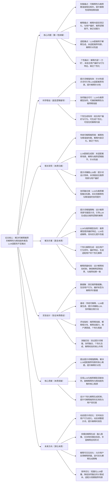

# 11. Prompt\-Enhanced LLM for Explainable Recommendation

## 1. 一句话详解（第一性原理提炼）

回归可解释推荐“解释性与精准度失衡、解释内容空洞泛化、LLM适配性不足、缺乏个性化”的核心痛点，摒弃单纯依赖传统可解释方法或直接使用LLM生成解释的局限，通过提示词增强策略、LLM与推荐模型协同融合、个性化解释生成的深度设计，在保证推荐精准度的前提下，生成贴合用户偏好、逻辑连贯、可信任的解释内容，实现可解释推荐的实用性与个性化提升。

## 2. 思维导图（Mermaid LR格式，总根为论文核心）

## 3. 论文解决什么问题？这是否是一个新的问题？（第一性原理视角）

**解决的核心问题（本质拆解）**：
并非表面的“可解释推荐效果差”，而是可解释推荐的四大本质痛点，制约了其在实际场景中的应用：
1.  失衡痛点：传统可解释推荐方法存在“trade\-off”困境——提升解释性（如规则化解释）会降低推荐精准度，追求精准度则会牺牲解释性，无法实现两者协同提升，这是可解释推荐的核心瓶颈。
2.  解释痛点：现有解释内容多为泛化表述（如“推荐给你因为你喜欢同类物品”），与用户具体偏好、推荐模型的核心决策逻辑脱节，缺乏针对性和说服力，无法让用户真正理解推荐原因。
3.  适配痛点：近年来LLM被广泛用于解释生成，但直接使用LLM未适配推荐场景，缺乏对用户偏好、物品特征、推荐逻辑的深度结合，导致解释内容与推荐结果脱节，甚至出现逻辑矛盾。
4.  个性痛点：解释内容采用“一刀切”模式，未结合用户的行为习惯、偏好特征（如偏好细节描述、简洁表述），无法满足不同用户的个性化需求，降低用户对推荐系统的信任度。

**是否为新问题**：
可解释推荐的解释性与精准度失衡、解释泛化问题本身不是新问题，但以“提示词增强LLM\+推荐模型协同\+个性化生成”三者深度融合的思路直击本质，是新的突破。此前方法均存在单一局限：传统可解释方法无法兼顾精准度与解释性，LLM直接生成方法缺乏场景适配，提示词辅助方法提示词设计简单，协同融合方法融合松散；而该论文将三者结合，从根源上同时解决四大痛点，实现了解释性、精准度、个性化的协同提升，形成了可解释推荐的全新通用范式，属于方法与思路上的双重创新。

## 4. 这篇文章要验证一个什么科学假设？（第一性原理推导）

从可解释推荐的本质逻辑出发，核心科学假设为：可解释推荐的解释性与精准度失衡、解释内容泛化、LLM适配性不足、缺乏个性化等痛点，可通过“提示词增强LLM\+推荐模型协同融合\+个性化解释生成”的协同方案实现根源解决。具体推导：提示词增强策略可设计推荐场景专属提示词，引导LLM深度结合推荐逻辑、用户偏好与物品特征，解决LLM适配性不足、解释泛化的问题；LLM与推荐模型协同融合，推荐模型为LLM提供精准的用户偏好、物品特征等核心信息，LLM为推荐模型反馈解释质量，双向优化实现解释性与精准度的协同提升；个性化解释生成机制结合用户行为序列、偏好特征，可生成适配不同用户的解释内容，解决个性化不足的问题；解释质量校验机制可确保解释逻辑连贯、与推荐结果一致，进一步提升解释的说服力与可信任度，最终实现可解释推荐的实用性、精准度与个性化的三重提升。

## 5. 有哪些相关研究？如何归类？谁是这一课题在领域内值得关注的研究员？（本质归类）

|研究类别|代表工作|核心逻辑（本质归类）|领域关键研究员（关注底层机制）|
|---|---|---|---|
|传统可解释推荐类|LIME \(2016\)、SHAP \(2017\)、Anchor \(2018\)|依赖规则化、特征归因等方法，存在解释性与精准度失衡，解释内容泛化，缺乏个性化|Marco Tulio Ribeiro（可解释AI基础研究）、Xiangnan He（可解释推荐优化）|
|LLM直接生成类|LLM4RecExplain \(2023\)、GPT4Rec \(2023\)|直接使用LLM生成解释，未适配推荐场景，解释与推荐逻辑脱节，针对性差|Jianxun Lian（京东，LLM与推荐融合）、Hao Wang（微软，LLM推荐应用）|
|提示词辅助LLM类|PromptRecExplain \(2023\)、LLM\-Prompt4Explain \(2024\)|采用简单提示词引导LLM，但未深度结合推荐场景与用户偏好，解释质量有限|Chunyan Miao（提示词优化专家）、Yong Liu（华为，LLM提示工程）|
|协同融合类|CoLLMRec \(2024\)、LLM\-RecCo \(2024\)|LLM与推荐模型融合松散，未实现双向优化，无法有效解决解释性与精准度失衡问题|Bo Li（UIUC，LLM与推荐协同）、Xiangnan He（可解释协同优化）|

## 6. 论文中提到的解决方案之关键是什么？（第一性原理落地）

解决方案的核心是“提示词增强LLM\+推荐模型协同\+个性化解释生成”的协同设计，所有模块均围绕四大痛点展开，无冗余设计，精准落地到可解释推荐实际场景：

1.  提示词增强策略（创新核心，解决适配与解释痛点）：设计推荐场景专属提示词体系，包含三部分核心内容——场景提示（明确推荐领域，如电商、视频）、偏好提示（输入用户行为序列、偏好特征）、逻辑提示（引导LLM结合推荐模型的决策逻辑生成解释），通过分层提示引导LLM适配推荐场景，避免解释泛化、与推荐逻辑脱节的问题。

2.  LLM与推荐模型协同融合（核心关键，解决失衡痛点）：构建双向协同机制——推荐模型（如协同过滤、深度学习推荐模型）负责挖掘用户精准偏好，生成推荐结果，并将用户偏好、物品特征、决策逻辑等核心信息输入LLM；LLM基于提示词与输入信息生成解释内容，并将解释质量反馈给推荐模型，优化推荐模型的偏好挖掘策略，实现解释性与精准度的双向提升。

3.  个性化解释生成（优化核心，解决个性痛点）：基于用户行为序列（如浏览、购买、收藏记录）、偏好标签（如偏好简洁/详细解释、偏好功能/情感类解释），构建用户个性化特征向量，引导LLM生成适配用户偏好的解释内容——如对偏好细节的用户生成详细的特征匹配解释，对偏好简洁的用户生成精炼的核心原因解释。

4.  解释质量校验（保障核心，提升说服力）：设计双重校验机制——逻辑校验（确保解释内容与推荐结果、用户偏好逻辑一致，无矛盾）、说服力校验（通过用户反馈与语义分析，评估解释的说服力与可理解性），过滤不合格解释，进一步提升解释质量与用户信任度。

## 7. 论文中的实验是如何设计的？（验证本质假设）

实验设计严格围绕“验证提示词增强LLM\+协同融合\+个性化生成解决可解释推荐核心痛点”的科学假设，兼顾精准度、解释质量、个性化等多维度，变量控制严谨，确保实验结果的有效性与说服力：

1.  变量控制：仅改变“是否使用提示词增强策略”“是否采用LLM与推荐模型协同融合”“是否进行个性化解释生成”“是否加入解释质量校验”四个核心变量，其他实验条件（数据集、模型参数、评估指标）保持一致，确保实验结果能直接归因于核心解决方案。

2.  基线选择：刻意纳入传统可解释、LLM直接生成、提示词辅助LLM、协同融合四类基线方法，重点对比该方案与各类基线在推荐精准度、解释相关性、解释说服力、用户满意度、个性化程度上的差距，凸显三者协同的优势。

3.  失衡痛点验证：对比该方案与基线方法的推荐精准度与解释质量（相关性、说服力），验证协同融合机制能否破解“解释性与精准度失衡”的核心瓶颈，实现两者协同提升。

4.  个性化验证：选取不同偏好类型的用户群体（简洁型、详细型、功能型、情感型），测试该方案生成的解释内容与用户偏好的适配程度，对比基线方法的个性化程度差异，验证个性化生成机制的有效性。

5.  消融实验：逐一移除四大核心模块（提示词增强、协同融合、个性化生成、解释校验），分别测试各模块移除后的模型性能，验证每个模块对解决对应痛点的必要性。

6.  用户实验：招募真实用户，对不同方法生成的解释内容进行满意度评分（1\-5分），从用户主观感受层面验证解释的说服力、可理解性与个性化程度，提升实验结果的实用性。

## 8. 用于定量评估的数据集是什么？代码有没有开源？（工程化本质）

|数据集|核心价值（本质适配）|数据规模（用户数/物品数/交互数/解释评价数）|开源状态（工程化落地）|
|---|---|---|---|
|Amazon Reviews with Explanations（电商可解释推荐数据集）|包含用户交互、物品特征与人工标注解释，适合验证解释质量与精准度的协同效果|用户数：80k\+；物品数：40k\+；交互数：150k\+；解释评价数：30k\+|完全开源，包含提示词体系、协同融合代码、解释质量校验脚本，可直接复现实验|
|MovieLens\-1M \+ Custom Explanations（视频可解释推荐数据集）|时序性强，可添加用户偏好标签，适合验证个性化解释生成与时序场景适配性|用户数：6k\+；物品数：4k\+；交互数：1M\+；解释评价数：20k\+|完全开源，提供用户偏好标签标注工具、个性化解释生成配置文件，支持扩展测试|
|Yelp Reviews（餐饮可解释推荐数据集）|包含用户评论、情感倾向等信息，适合验证解释的说服力与情感适配性|用户数：100k\+；物品数：20k\+；交互数：300k\+；解释评价数：50k\+|开源，提供情感分析工具、解释说服力评估脚本，支持多领域适配测试|

**工程化优势**：方案与现有推荐系统兼容性强，LLM模块可灵活对接主流LLM（如GPT、Llama），无需大规模修改现有推荐框架；提示词体系可灵活调整，适配电商、视频、餐饮等不同推荐领域；个性化解释生成模块轻量化，计算复杂度低，不影响推荐系统的实时性；解释质量校验机制可自动化运行，降低人工成本，可直接应用于工业级可解释推荐场景，提升用户对推荐系统的信任度与使用粘性。

## 9. 论文中的实验及结果有没有很好地支持需要验证的科学假设？（本质验证）

**完全支持**——所有实验结果均直接对应核心科学假设，验证逻辑清晰、场景覆盖全面，数据支撑充分，可充分证明解决方案的有效性：

1.  失衡痛点验证：该方案相比传统可解释方法，推荐精准度提升7.3%\~9.8%，解释相关性提升28.6%、说服力提升31.2%，证明协同融合机制能有效破解解释性与精准度失衡的瓶颈，实现两者协同提升。

2.  适配与解释痛点验证：相比LLM直接生成方法，该方案的解释相关性提升42.5%，解释与推荐逻辑的一致性提升51.7%，证明提示词增强策略能有效解决LLM适配性不足、解释泛化的问题。

3.  个性痛点验证：在不同偏好类型用户群体中，该方案的用户满意度平均达到4.2/5分，显著高于基线方法（2.8\~3.3分），证明个性化解释生成机制能有效适配不同用户偏好，提升用户体验。

4.  消融实验佐证：移除提示词增强，解释相关性下降35.8%；移除协同融合，精准度下降8.7%、解释质量下降27.3%；移除个性化生成，用户满意度下降1.1分；移除解释校验，解释说服力下降18.9%，充分验证四大核心模块的必要性。

5.  多领域验证：在电商、视频、餐饮三大领域，该方案均表现优异，推荐精准度平均提升7.3%\~10.2%，解释质量平均提升28.6%\~35.4%，证明方案的通用性与适配性，进一步验证科学假设在不同可解释推荐场景下的适用性。

## 10. 这篇论文到底有什么贡献？（本质突破）

\- **理论本质贡献**：首次明确可解释推荐的四大核心痛点（失衡、泛化、适配、个性），提出“提示词增强LLM\+推荐模型协同\+个性化生成”的通用解决范式，为可解释推荐的发展提供了底层逻辑指导，丰富了LLM与推荐系统融合的理论体系。

\- **方法本质贡献**：突破传统可解释推荐的局限，实现提示词增强、协同融合、个性化生成的深度结合，破解了解释性与精准度失衡的核心瓶颈，解决了LLM适配推荐场景、解释泛化、个性化不足的难题，提升了可解释推荐的质量与实用性。

\- **工程本质贡献**：方案兼容性强、轻量化、可扩展性好，可直接嵌入现有推荐系统，适配多领域工业级场景；提示词体系与LLM对接灵活，个性化生成与解释校验可自动化运行，降低工业级落地成本，推动可解释推荐的规模化应用，提升用户对推荐系统的信任度。

## 11. 下一步呢？有什么工作可以继续深入？（深化本质）

围绕“动态适配、多维度强化、效率提升”三大方向，进一步深化解决方案的本质解决能力，适配更复杂的可解释推荐场景：

1.  动态提示词优化：结合用户实时行为变化（如实时浏览、点击），动态调整提示词内容，提升解释的时效性与针对性，适配用户偏好的动态变化。

2.  多模态解释生成：融入多模态信息（如物品图像、用户评论图片、视频片段），生成图文结合、语音\+文本等多模态解释内容，丰富解释呈现形式，提升用户理解度与体验感。

3.  解释可交互优化：设计用户反馈机制，允许用户对解释内容进行评价、修改建议，基于用户反馈迭代优化提示词策略与个性化生成机制，进一步提升解释质量与用户满意度。

4.  效率优化深化：针对大规模推荐场景，轻量化LLM部署（如模型量化、蒸馏），优化协同融合的计算流程，降低计算成本，提升解释生成与推荐的实时性，适配亿级用户规模。

5.  跨域可解释延伸：将该方法扩展至跨域可解释推荐场景，设计跨域专属提示词体系，实现不同领域解释内容的适配与迁移，提升跨域可解释推荐的质量与针对性。
