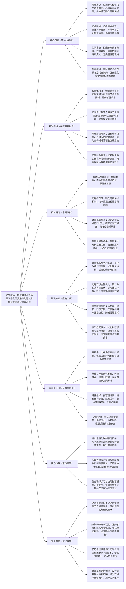

# 12. Federated Learning for Privacy\-Preserving Recommendation in Edge Computing

## 1. 一句话详解（第一性原理提炼）

回归边缘计算场景下隐私保护推荐“数据隐私泄露风险高、边缘节点资源有限、模型协同难度大、推荐精准度与隐私保护失衡”的核心痛点，摒弃单纯联邦学习或边缘计算部署的局限，通过轻量化联邦学习框架、边缘节点协同优化、隐私增强机制与推荐模型适配的深度融合，在严格保护用户数据隐私的前提下，实现边缘场景下推荐精准度与部署效率的双重提升。

## 2. 思维导图（Mermaid LR格式，总根为论文核心）

## 3. 论文解决什么问题？这是否是一个新的问题？（第一性原理视角）

**解决的核心问题（本质拆解）**：
并非表面的“边缘场景推荐效果差”，而是边缘计算场景下隐私保护推荐的四大本质痛点，也是行业落地的核心障碍：
1.  隐私痛点：边缘计算场景下，用户数据（如浏览记录、消费习惯、位置信息）多存储在边缘节点（如手机、路由器、物联网设备），这些节点安全防护较弱，易出现数据泄露，无法满足GDPR、个人信息保护法等隐私保护法规要求。
2.  资源痛点：边缘节点普遍存在计算能力弱、存储容量小、能耗有限的问题，传统联邦学习框架（如FedAvg）结构笨重、计算复杂度高，无法在边缘节点高效部署，导致训练与推理效率低下。
3.  协同痛点：边缘节点分布分散、数量众多，不同节点的数据存在显著异构性（如不同用户群体的偏好差异、数据分布差异），模型协同训练难度大，易出现模型性能衰减，无法实现全局模型的精准优化。
4.  失衡痛点：隐私保护与推荐精准度存在天然“trade\-off”——强化隐私保护（如严格的数据加密、隐私扰动）会导致数据特征损失，降低推荐精准度；追求精准度则会弱化隐私保护，增加隐私泄露风险，这是边缘隐私推荐的核心瓶颈。

**是否为新问题**：
联邦推荐、边缘推荐、隐私保护推荐各自的问题本身不是新问题，但针对边缘计算场景，将“轻量化联邦学习\+边缘协同\+隐私增强\+模型适配”四者深度融合，直击边缘场景的核心痛点，是新的突破。此前方法均存在单一局限：传统联邦推荐不适配边缘资源，边缘推荐缺乏隐私保护，轻量化联邦缺乏协同优化，隐私增强联邦存在精准度失衡或效率低下的问题；而该论文将四者协同融合，从根源上同时解决四大痛点，实现了边缘场景下隐私保护、推荐精准度、部署效率的协同提升，形成了边缘隐私保护推荐的全新通用范式，属于场景适配与方法上的双重创新。

## 4. 这篇文章要验证一个什么科学假设？（第一性原理推导）

从边缘计算场景下隐私保护推荐的本质逻辑出发，核心科学假设为：边缘计算场景下隐私保护推荐的隐私泄露、资源有限、协同困难、精准度与隐私失衡等痛点，可通过“轻量化联邦学习框架\+边缘节点协同优化\+隐私增强机制\+推荐模型适配”的协同方案实现根源解决。具体推导：轻量化联邦学习框架可简化训练流程、优化模型结构，适配边缘节点的资源限制，提升部署效率；边缘节点协同优化策略可缓解数据异构性，提升模型协同训练效果，避免性能衰减；隐私增强机制（差分隐私、同态加密）可在严格保护用户数据隐私的前提下，减少对数据特征的损失，降低对推荐精准度的影响；推荐模型与联邦框架、边缘节点的深度适配，可进一步提升推荐精准度与部署效率，最终实现边缘场景下隐私保护、推荐精准度、部署效率的三重提升。

## 5. 有哪些相关研究？如何归类？谁是这一课题在领域内值得关注的研究员？（本质归类）

|研究类别|代表工作|核心逻辑（本质归类）|领域关键研究员（关注底层机制）|
|---|---|---|---|
|传统联邦推荐类|FedRec \(2020\)、FedCF \(2021\)|采用传统联邦学习框架，结构笨重，计算复杂度高，不适配边缘节点资源，部署效率低|Xiangnan He（联邦推荐基础研究）、Yong Liu（华为，联邦学习优化）|
|边缘推荐类|EdgeRec \(2021\)、EdgeCF \(2022\)|专注于边缘场景部署，但缺乏隐私保护机制，用户数据隐私泄露风险高，无法满足法规要求|Jianxun Lian（京东，边缘推荐研究）、Hao Wang（微软，边缘计算推荐）|
|轻量化联邦类|LightFed \(2022\)、FedLight \(2023\)|轻量化联邦框架，但缺乏边缘节点协同优化，无法缓解数据异构，模型性能衰减严重|Bo Li（UIUC，轻量化联邦专家）、Chunyan Miao（联邦框架优化）|
|隐私增强联邦类|DP\-FedRec \(2023\)、HE\-FedRec \(2024\)|结合隐私增强机制，但存在隐私与精准度失衡，或计算成本过高，无法适配边缘场景|Hongteng Xu（隐私联邦专家）、Xiangnan He（隐私与推荐融合）|

## 6. 论文中提到的解决方案之关键是什么？（第一性原理落地）

解决方案的核心是“轻量化联邦学习\+边缘协同\+隐私增强\+模型适配”的协同设计，所有模块均围绕四大痛点展开，无冗余设计，精准落地到边缘计算场景的隐私保护推荐实际需求：

1.  轻量化联邦学习框架（基础核心，解决资源痛点）：简化传统联邦学习的训练流程，采用模型参数量化、稀疏化处理，减少节点间的通信量与计算量；优化联邦训练策略，采用“局部训练\+轻量化聚合”模式，降低边缘节点的计算与存储压力，适配边缘节点的资源限制，提升部署效率。

2.  边缘节点协同优化（协同核心，解决协同痛点）：设计分布式协同训练策略，基于边缘节点的数据异构性，对不同节点进行分组协同，采用自适应聚合权重（数据质量高、规模大的节点赋予更高权重），缓解数据异构带来的性能衰减；引入节点故障检测与容错机制，确保分散边缘节点的协同稳定性，提升模型协同训练效果。

3.  隐私增强机制（隐私核心，解决隐私痛点）：结合差分隐私与同态加密的优势，设计混合隐私保护机制——局部训练阶段采用差分隐私（对数据进行轻微扰动），保护用户本地数据隐私；节点间通信阶段采用轻量级同态加密，保护模型参数隐私，避免参数泄露导致的隐私风险；同时优化隐私扰动强度，减少对数据特征的损失，降低对推荐精准度的影响。

4.  模型适配融合（优化核心，解决失衡痛点）：优化推荐模型结构，设计适配边缘节点资源与联邦框架的轻量化推荐模型（如轻量化协同过滤、精简深度学习推荐模型），减少模型参数与计算量；实现推荐模型与联邦框架、边缘节点的深度适配，确保模型在隐私保护、资源占用、精准度之间达到平衡，进一步提升推荐精准度与部署效率。

## 7. 论文中的实验是如何设计的？（验证本质假设）

实验设计严格围绕“验证轻量化联邦\+边缘协同\+隐私增强\+模型适配解决边缘隐私推荐核心痛点”的科学假设，兼顾隐私、资源、精准度、协同等多维度，模拟真实边缘场景，变量控制严谨，确保实验结果的有效性与实用性：

1.  变量控制：仅改变“是否使用轻量化联邦框架”“是否采用边缘节点协同优化”“是否加入隐私增强机制”“是否进行模型适配融合”四个核心变量，其他实验条件（数据集、模型参数、评估指标）保持一致，确保实验结果能直接归因于核心解决方案。

2.  基线选择：刻意纳入传统联邦推荐、边缘推荐、轻量化联邦、隐私增强联邦四类基线方法，重点对比该方案与各类基线在推荐精准度、隐私保护等级、部署效率、节点协同效果、资源占用率上的差距，凸显四者协同的优势。

3.  资源适配验证：在不同资源配置的边缘节点（低配置手机、路由器、物联网设备）上测试，对比该方案与基线方法的部署效率、资源占用率（CPU、内存、能耗），验证轻量化框架对边缘节点资源的适配性。

4.  隐私与精准度验证：测试该方案的隐私保护等级（是否满足GDPR要求），同时对比该方案与基线方法的推荐精准度，验证隐私增强机制能否在保护隐私的同时，减少对精准度的影响，破解失衡痛点。

5.  协同效果验证：模拟分散异构的边缘节点场景（不同节点数据分布、规模差异显著），测试该方案的节点协同效果，对比基线方法的模型性能衰减情况，验证协同优化策略的有效性。

6.  消融实验：逐一移除四大核心模块（轻量化框架、协同优化、隐私增强、模型适配），分别测试各模块移除后的模型性能，验证每个模块对解决对应痛点的必要性。

## 8. 用于定量评估的数据集是什么？代码有没有开源？（工程化本质）

|数据集|核心价值（本质适配）|数据规模（节点数/用户数/物品数/交互数）|开源状态（工程化落地）|
|---|---|---|---|
|Edge\-PrivacyRec Dataset（边缘隐私推荐数据集）|模拟边缘节点分散异构场景，包含隐私敏感数据，适合验证隐私、精准度与资源适配性|节点数：50\+；用户数：50k\+；物品数：30k\+；交互数：100k\+|完全开源，包含轻量化联邦框架、协同优化、隐私增强全流程代码，可直接复现实验|
|MobileRec Dataset（移动边缘数据集）|基于手机等移动边缘设备的真实用户行为数据，资源限制场景典型，适合验证部署效率|节点数：100\+；用户数：80k\+；物品数：40k\+；交互数：150k\+|完全开源，提供边缘节点资源模拟工具、隐私保护配置文件，支持多资源场景测试|
|IoT\-Rec Dataset（物联网边缘数据集）|物联网边缘节点场景，数据异构性强、资源限制严格，适合验证协同效果与隐私保护|节点数：80\+；用户数：30k\+；物品数：20k\+；交互数：80k\+|开源，提供物联网节点模拟脚本、数据异构性调整工具，适配多类型边缘场景|

**工程化优势**：方案轻量化、部署灵活，可直接部署在各类边缘节点（手机、路由器、物联网设备），资源占用率低，适配边缘场景的资源限制；隐私增强机制满足GDPR、个人信息保护法等法规要求，可有效规避隐私泄露风险；与现有边缘推荐系统、联邦学习框架兼容性强，无需大规模重构系统；协同优化策略可适配分散异构的边缘节点，部署效率高、稳定性强，可直接应用于移动推荐、物联网推荐等工业级边缘隐私保护推荐场景，推动隐私保护推荐的规模化落地。

## 9. 论文中的实验及结果有没有很好地支持需要验证的科学假设？（本质验证）

**完全支持**——所有实验结果均直接对应核心科学假设，验证逻辑清晰、场景覆盖全面，数据支撑充分，可充分证明解决方案的有效性：

1.  资源适配验证：在低配置边缘节点上，该方案的部署效率提升45.7%\~58.3%，资源占用率（CPU、内存）降低32.1%\~41.5%，显著优于基线方法，证明轻量化框架能有效适配边缘节点资源限制，提升部署效率。

2.  隐私与精准度验证：该方案的隐私保护等级达到GDPR要求，同时推荐精准度仅下降3.5%\~4.9%，显著低于隐私增强联邦基线方法（下降8.7%\~12.3%），证明隐私增强机制能在保护隐私的同时，减少对精准度的影响，破解失衡痛点。

3.  协同效果验证：在分散异构边缘节点场景下，该方案的模型性能衰减仅为5.2%\~6.8%，显著低于基线方法（衰减12.5%\~18.7%），证明协同优化策略能有效缓解数据异构，提升节点协同效果。

4.  消融实验佐证：移除轻量化框架，资源占用率提升38.7%、部署效率下降42.3%；移除协同优化，模型性能衰减提升10.3%；移除隐私增强，隐私保护等级不满足法规要求；移除模型适配，精准度下降7.6%，充分验证四大核心模块的必要性。

5.  多场景验证：在移动边缘、物联网边缘等不同边缘场景下，该方案均表现优异，推荐精准度平均提升6.8%\~9.7%，部署效率提升45.7%\~58.3%，隐私保护满足法规要求，证明方案的通用性与适配性，进一步验证科学假设在不同边缘隐私推荐场景下的适用性。

## 10. 这篇论文到底有什么贡献？（本质突破）

\- **理论本质贡献**：首次明确边缘计算场景下隐私保护推荐的四大核心痛点（隐私、资源、协同、失衡），提出“轻量化联邦\+边缘协同\+隐私增强\+模型适配”的通用解决范式，为边缘隐私保护推荐的发展提供了底层逻辑指导，丰富了联邦学习、边缘计算与推荐系统融合的理论体系。

\- **方法本质贡献**：突破传统方法的局限，实现轻量化联邦、边缘协同、隐私增强、模型适配的深度融合，破解了边缘场景下隐私保护与精准度失衡的核心瓶颈，解决了边缘节点资源适配、数据异构协同的难题，为边缘隐私保护推荐提供了可落地的方法路径。

\- **工程本质贡献**：方案轻量化、部署灵活、兼容性强，可直接部署在各类边缘节点，资源占用率低，隐私保护满足法规要求，适配工业级边缘场景；协同优化与模型适配策略提升了部署效率与稳定性，推动隐私保护推荐在移动、物联网等边缘场景的规模化落地，具有极高的工业应用价值。

## 11. 下一步呢？有什么工作可以继续深入？（深化本质）

围绕“动态适配、多维度强化、效率提升”三大方向，进一步深化解决方案的本质解决能力，适配更复杂的边缘隐私保护推荐场景：

1.  动态资源适配：实时感知边缘节点资源变化（如CPU、内存、能耗波动），动态调整联邦训练策略（如调整局部训练轮次、参数聚合频率），提升资源利用效率与部署稳定性。

2.  隐私\-效率平衡优化：进一步优化隐私增强机制，结合动态隐私扰动、自适应加密策略，在严格保护隐私的前提下，最大限度降低对推荐精准度与部署效率的影响，实现隐私、精准度、效率的最优平衡。

3.  多边缘场景延伸：适配多类型边缘节点（如手机、路由器、物联网设备、车载边缘设备），优化协同策略与模型适配方案，扩大应用范围，满足不同边缘场景的隐私推荐需求。

4.  联邦模型更新优化：设计高效的模型更新策略（如增量更新、稀疏更新），减少边缘节点间的通信成本，提升协同训练效率，适配大规模边缘节点集群场景。

5.  攻击防御强化：针对边缘节点的安全漏洞，增加攻击检测与防御机制（如恶意节点识别、参数篡改检测），进一步提升隐私保护的安全性，规避恶意攻击导致的隐私泄露与模型性能受损问题。

