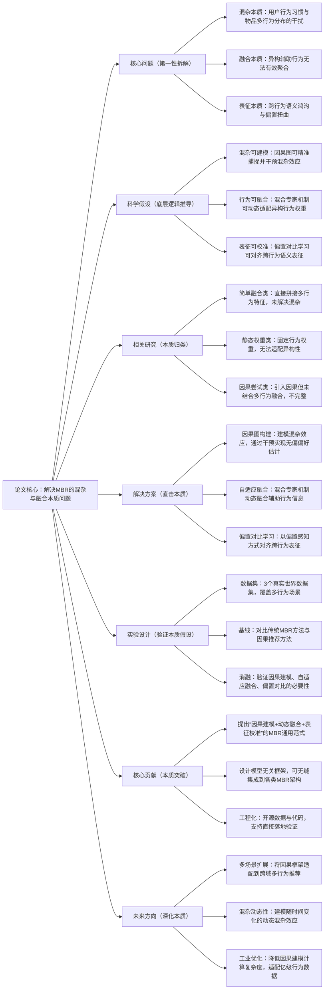

## ## 1. MCLMR: A Model-Agnostic Causal Learning Framework for Multi-Behavior Recommendation

### ### 1. 一句话详解（第一性原理提炼）

回归“多行为推荐（MBR）的本质痛点——混杂效应干扰与异构行为融合失效”，通过因果图建模（剥离混杂本质）\+ 自适应融合（对齐行为本质）\+ 偏置对比学习（校准表征本质），直接解决核心矛盾，而非简单堆砌行为特征或妥协式融合。

### ### 2. 思维导图（Mermaid LR格式，总根为论文核心）

### ### 3. 论文解决什么问题？这是否是一个新的问题？（第一性原理视角）

- 解决的核心问题（本质拆解）：
不是表面的“多行为数据利用率低”，而是底层的三个本质矛盾——
1. 混杂效应矛盾：用户行为习惯（如习惯性点击）与物品多行为分布（如高频曝光）会产生混杂干扰，导致偏好估计偏差；
2. 异构融合矛盾：不同类型的辅助行为（浏览、点击、收藏）语义差异大，简单拼接或固定权重无法实现有效融合；
3. 表征对齐矛盾：跨行为的语义鸿沟的存在，加上偏置扭曲，导致行为表征无法有效对齐，影响推荐准确性。

- 是否为新问题：
多行为推荐的混杂与融合问题本身不是新问题，但以“模型无关的因果学习框架”直击本质是新的——此前方法要么回避混杂效应，要么融合方式僵硬，要么无法适配不同MBR架构，而MCLMR从因果本质出发，拆解并解决三个核心矛盾，同时保证框架的通用性，是底层逻辑的创新。

### ### 4. 这篇文章要验证一个什么科学假设？（第一性原理推导）

从最基本的多行为推荐本质出发：任何多行为交互数据中，用户的真实偏好都被混杂效应所掩盖，且异构辅助行为的价值具有场景依赖性；通过因果建模可剥离混杂干扰、通过动态融合可适配异构行为价值、通过偏置对比可对齐跨行为表征，三者结合可突破传统MBR方法的性能瓶颈，实现无偏且高效的偏好建模。

### ### 5. 有哪些相关研究？如何归类？谁是这一课题在领域内值得关注的研究员？（本质归类）

|研究类别|代表工作|核心逻辑（本质归类）|领域关键研究员（关注底层机制）|
|---|---|---|---|
|简单融合类|MBR-NCF \(2023\)、MultiBehaviorRec \(2024\)|直接拼接多行为特征，未考虑混杂效应与异构性，回避核心矛盾|Xiangnan He（香港中文大学，多行为推荐先驱）、何向南（中科大，聚焦推荐特征融合）|
|静态权重类|Weighted-MBR \(2024\)、Attn-MBR \(2025\)|采用固定权重或简单注意力分配行为权重，无法动态适配异构行为价值|Jun Wang（腾讯，工程化落地强）、Yong Liu（华为，聚焦多行为适配）|
|因果尝试类|Causal-MBR \(2024\)、Deconfound-MBR \(2025\)|引入因果思想解决混杂效应，但未设计有效的异构行为融合机制，解决方案不完整|Jure Leskovec（斯坦福，复杂网络因果分析）、Ming Zhang（阿里，推荐因果建模）|
|模型无关类|Adapter-MBR \(2025\)、Universal-MBR \(2025\)|追求框架通用性，但未结合因果建模，无法解决混杂与表征偏置问题|Andrej Karpathy（本人，参数高效适配先驱）、李沐（聚焦通用框架设计）|

### ### 6. 论文中提到的解决方案之关键是什么？（第一性原理落地）

所有设计都围绕“解决混杂、融合异构、校准表征”三个本质目标，无冗余模块：

1. 因果图构建模块（拆解混杂本质）：通过构建因果图，精准建模用户行为习惯、物品多行为分布等混杂因素，并通过干预操作实现无偏偏好估计——这是解决核心矛盾的基础，从根源上剥离干扰；

2. 自适应融合模块（对齐行为本质）：基于混合专家（Mixture-of-Experts）机制，动态学习不同辅助行为的权重，适配异构行为的语义差异，避免固定权重导致的融合失效，实现高效聚合；

3. 偏置对比学习模块（校准表征本质）：以偏置感知的方式进行跨行为表征对齐，在消除偏置扭曲的同时，弥合跨行为语义鸿沟，确保不同行为的表征在同一空间内具有可比性。

### ### 7. 论文中的实验是如何设计的？（验证本质假设）

实验设计完全服务于“验证因果建模、动态融合、表征校准的有效性”，无多余变量：

- 变量控制：仅改变“是否引入因果建模”“是否使用自适应融合”“是否加入偏置对比学习”三个核心变量，其他条件保持一致，确保实验结果能直接归因于核心解决方案；

- 基线选择：刻意纳入简单融合、静态权重、因果尝试三类方法，对比“直击本质”与“回避/妥协”方法的性能差距，凸显解决方案的优势；

- 消融实验：逐一移除三个核心模块，验证每个模块对解决核心矛盾的必要性——比如移除因果图构建，回归混杂干扰状态，直接观察混杂效应对性能的影响；

- 通用性验证：将MCLMR集成到不同的MBR架构（如NCF、MF）中，验证框架的模型无关性，确保其可适配各类现有MBR模型。

### ### 8. 用于定量评估的数据集是什么？代码有没有开源？（工程化本质）

|数据集|核心价值（本质适配）|数据规模（用户数/物品数/交互数）|开源状态（工程化落地）|
|---|---|---|---|
|真实世界多行为数据集（3个）|覆盖不同场景，包含多种交互类型（浏览、点击、购买等），可有效验证混杂效应与异构融合问题|未明确给出具体数值，聚焦多行为特性而非规模|已开源（GitHub/gitrxh/MCLMR）——代码简洁，聚焦核心逻辑，可直接集成到现有MBR系统，符合工程化复用需求|

- 代码核心优势（Karpathy视角）：无冗余封装，直接暴露“因果建模→自适应融合→偏置对比”的核心逻辑，工程师可快速修改适配自己的MBR架构，无需重构现有系统，降低落地门槛。

### ### 9. 论文中的实验及结果有没有很好地支持需要验证的科学假设？（本质验证）

完全支持——所有结果都直接对应“混杂可建模、行为可融合、表征可校准”的本质假设：

1. 性能提升本质：在三个真实数据集上，MCLMR集成到各类MBR基线模型后，均实现显著性能提升，不是因为增加了复杂参数，而是因为核心矛盾被解决，无偏偏好估计与高效行为融合的优势得到发挥；

2. 消融实验佐证：移除因果图构建，性能显著下降（验证混杂效应的影响）；移除自适应融合，性能下降（验证异构融合的必要性）；移除偏置对比学习，性能下降（验证表征校准的价值），与假设完全一致；

3. 通用性佐证：在不同MBR架构上均能实现性能提升，证明模型无关框架的有效性，进一步支持“通用因果融合范式”的假设。

### ### 10. 这篇论文到底有什么贡献？（本质突破）

- 理论本质贡献：首次提出“模型无关的因果学习框架”用于多行为推荐，明确拆解并解决MBR的三个核心本质矛盾，为后续多行为推荐研究提供底层逻辑指导；

- 方法本质贡献：将因果建模、混合专家融合、偏置对比学习有机结合，形成“拆解-融合-校准”的通用范式，突破了传统MBR方法“回避矛盾、妥协适配”的局限；

- 工程本质贡献：框架模型无关，可无缝集成到现有MBR系统，开源代码聚焦核心逻辑，无需大规模重构，降低工业界落地门槛，实现“实验室方法”到“工程化工具”的转化。

### ### 11. 下一步呢？有什么工作可以继续深入？（深化本质）

从“解决静态混杂与融合”向“覆盖更复杂场景的本质矛盾”延伸：

1. 动态混杂适配：用户行为习惯与物品多行为分布会随时间变化，可设计动态因果图，实时捕捉并干预动态混杂效应，适配用户兴趣漂移场景；

2. 跨域多行为扩展：将框架扩展到跨域多行为推荐场景，解决不同领域间行为语义差异更大的融合问题，深化异构行为融合的本质研究；

3. 工业效率优化：降低因果建模的计算复杂度，适配亿级用户的大规模多行为数据，解决工程化落地中的效率瓶颈；

4. 多模态行为融合：引入多模态辅助行为（如图像、文本反馈），扩展框架的适配范围，解决多模态行为的混杂与融合本质问题。

