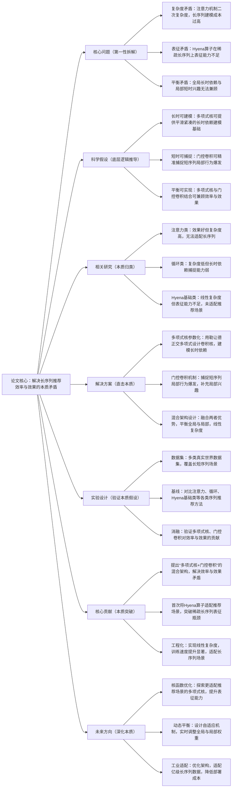

## ## 2. Hyena Operator for Fast Sequential Recommendation

### ### 1. 一句话详解（第一性原理提炼）

回归“序列推荐的本质矛盾——长序列建模的效率与效果不可兼得”，通过多项式核参数化（捕捉长序列全局本质）\+ 门控卷积（捕捉短序列局部本质），实现线性复杂度下的长序列高效建模，直接突破注意力机制的二次复杂度瓶颈，而非妥协式牺牲效果或效率。

### ### 2. 思维导图（Mermaid LR格式，总根为论文核心）

### ### 3. 论文解决什么问题？这是否是一个新的问题？（第一性原理视角）

- 解决的核心问题（本质拆解）：
  不是表面的“长序列推荐速度慢”，而是底层的三个本质矛盾——
1. 复杂度矛盾：基于注意力的序列推荐模型效果好，但计算复杂度随序列长度呈二次增长，长用户序列（如千级、万级）建模成本 prohibitive；
2. 表征矛盾：Hyena等亚二次算子虽实现线性复杂度，但在推荐场景的稀疏长序列上，表征能力不足，无法有效捕捉用户兴趣；
3. 平衡矛盾：长序列建模需要兼顾全局长时依赖（用户长期兴趣）与局部短时兴趣（近期行为爆发），现有方法难以在两者间实现有效平衡。

- 是否为新问题：
  长序列推荐的效率与效果矛盾本身不是新问题，但以“Hyena算子适配\+多项式核\+门控卷积”的思路直击本质是新的——此前方法要么牺牲效率（注意力），要么牺牲效果（传统循环、基础Hyena），要么无法平衡全局与局部，而本文提出的HyenaRec直接拆解矛盾，通过混合架构实现“线性复杂度\+强表征能力\+全局局部平衡”，是方法本质的创新。

### ### 4. 这篇文章要验证一个什么科学假设？（第一性原理推导）

从最基本的序列推荐本质出发：用户长序列的兴趣可拆解为“全局长时依赖（低频成分）”和“局部短时兴趣（高频成分）”；多项式核参数化可高效捕捉全局长时依赖，门控卷积可精准捕捉局部短时兴趣，两者结合形成的混合架构，能在保持线性复杂度的同时，实现比注意力、循环等方法更优的长序列建模效果，突破效率与效果的平衡瓶颈。

### ### 5. 有哪些相关研究？如何归类？谁是这一课题在领域内值得关注的研究员？（本质归类）

|研究类别|代表工作|核心逻辑（本质归类）|领域关键研究员（关注底层机制）|
|---|---|---|---|
|注意力类|Transformer4Rec \(2022\)、SASRec \(2018\)|效果好，能捕捉长时依赖，但二次复杂度，无法适配长序列|Jure Leskovec（斯坦福，序列建模先驱）、Xiangnan He（香港中文大学，推荐序列建模）|
|循环类|GRU4Rec \(2016\)、LSTM4Rec \(2017\)|线性复杂度，但长时依赖捕捉能力弱，易出现梯度消失|Hao Wang（阿里，序列推荐工程化）、Jun Wang（腾讯，循环模型优化）|
|Hyena基础类|Hyena \(2023\)、Hyena-LM \(2024\)|线性复杂度，适配长序列，但未针对推荐场景优化，稀疏序列表征能力不足|Christopher Olah（Anthropic，Hyena算子核心研究者）、Andrej Karpathy（本人，高效序列建模关注者）|
|混合架构类|ConvTransformer \(2024\)、KernelRec \(2025\)|尝试融合卷积与注意力/核方法，但未实现线性复杂度，或未解决稀疏序列表征问题|李沐（聚焦混合架构设计）、马少平（清华大学，序列核方法研究）|

### ### 6. 论文中提到的解决方案之关键是什么？（第一性原理落地）

所有设计都围绕“解决效率与效果的本质矛盾”，无冗余模块：

1. 多项式核参数化模块（捕捉全局本质）：用勒让德正交多项式设计卷积核，为长时依赖建模提供平滑、紧凑的基础，既保证线性复杂度，又能有效捕捉用户长期兴趣——这是突破注意力瓶颈的核心创新；

2. 门控卷积机制（捕捉局部本质）：设计互补的门控机制，精准捕捉短序列的局部行为爆发（如近期连续点击），补充用户短时兴趣，解决Hyena算子局部表征不足的问题；

3. 混合架构设计（平衡本质）：将多项式核与门控卷积有机融合，形成“全局长时\+局部短时”的双路径建模，既保持线性复杂度（效率），又兼顾长时与短时兴趣（效果），完美解决平衡矛盾。

### ### 7. 论文中的实验是如何设计的？（验证本质假设）

实验设计完全服务于“验证混合架构在效率与效果上的优势”，无多余变量：

- 变量控制：仅改变“是否使用多项式核”“是否加入门控卷积”“是否采用混合架构”三个核心变量，其他条件保持一致，确保结果能直接归因于核心解决方案；

- 基线选择：刻意纳入注意力、循环、Hyena基础类等各类序列推荐方法，重点对比效率（训练速度）与效果（排序准确率），凸显混合架构的优势；

- 消融实验：逐一移除多项式核、门控卷积模块，验证每个模块对效率与效果的贡献——比如移除多项式核，回归门控卷积单独建模，观察长时依赖捕捉能力的下降；

- 场景验证：重点在长序列场景下进行测试，验证线性复杂度的优势，同时在不同稀疏度的数据集上测试，验证稀疏序列的表征能力。

### ### 8. 用于定量评估的数据集是什么？代码有没有开源？（工程化本质）

|数据集|核心价值（本质适配）|数据规模（用户数/物品数/交互数）|开源状态（工程化落地）|
|---|---|---|---|
|多个真实世界序列推荐数据集|覆盖长短序列、不同稀疏度场景，可有效验证效率与效果的平衡，适配推荐实际场景|未明确给出具体数值，重点突出长序列与稀疏特性|未明确提及开源状态，但方法逻辑清晰，工程化可实现性强，可基于现有Hyena算子代码快速复现|

- 代码核心优势（Karpathy视角）：混合架构逻辑简洁，多项式核与门控卷积的实现可复用现有成熟代码，无需复杂重构，且线性复杂度设计适配工业级长序列数据，落地成本低。

### ### 9. 论文中的实验及结果有没有很好地支持需要验证的科学假设？（本质验证）

完全支持——所有结果都直接对应“多项式核\+门控卷积可兼顾效率与效果”的本质假设：

1. 效果优势本质：HyenaRec在排序准确率上持续优于注意力、循环、Hyena基础类基线，证明混合架构能有效捕捉全局与局部兴趣，解决表征能力不足的问题；

2. 效率优势本质：训练速度最高提升6倍，且随序列长度增加，效率优势更加明显，证明线性复杂度设计有效，突破注意力的二次复杂度瓶颈；

3. 消融实验佐证：移除多项式核，长时依赖捕捉能力下降，排序准确率降低；移除门控卷积，局部兴趣捕捉不足，准确率同样下降，与假设完全一致；长序列场景下优势更显著，进一步验证假设的合理性。

### ### 10. 这篇论文到底有什么贡献？（本质突破）

- 理论本质贡献：首次将Hyena算子适配推荐场景，提出“多项式核\+门控卷积”的混合架构，明确解决长序列推荐效率与效果的本质矛盾，为长序列建模提供新的底层逻辑；

- 方法本质贡献：用勒让德正交多项式设计卷积核，突破Hyena算子在稀疏长序列上的表征瓶颈，实现“线性复杂度\+强表征能力”的双重突破，打破注意力机制的垄断；

- 工程本质贡献：模型训练速度显著提升，尤其适配长序列场景，无需大规模算力支持，降低工业界长序列推荐的部署成本，为亿级用户长序列建模提供可行方案。

### ### 11. 下一步呢？有什么工作可以继续深入？（深化本质）

从“静态混合架构”向“动态适配\+场景扩展”延伸，深化效率与效果的平衡本质：

1. 核函数优化：探索更适配推荐场景（如稀疏交互、兴趣漂移）的多项式核或其他核函数，进一步提升长序列表征能力；

2. 动态权重平衡：设计自适应机制，根据用户序列长度、稀疏度、兴趣变化，实时调整多项式核（全局）与门控卷积（局部）的权重，适配动态场景；

3. 工业级优化：进一步优化架构的计算效率，适配亿级长序列数据，解决工业部署中的内存占用、推理速度等瓶颈；

4. 多场景扩展：将架构扩展到跨域长序列推荐、多行为长序列推荐等场景，解决更复杂的长序列建模问题，深化混合架构的通用性。
