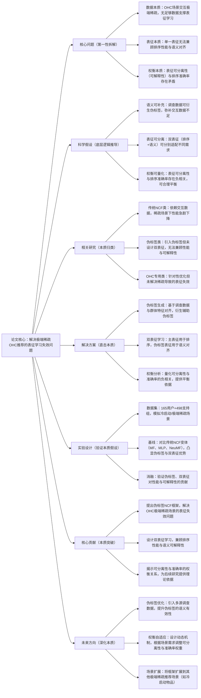

## ## 3. Pseudo Label NCF for Sparse OHC Recommendation: Dual Representation Learning and the Separability Accuracy Trade off

### ### 1. 一句话详解（第一性原理提炼）

回归“极端稀疏OHC推荐的本质痛点——交互数据不足导致的表征学习失效”，通过调查数据衍生伪标签（补充语义本质）\+ 双表征学习（分离排序与语义本质），直接解决稀疏场景下的推荐性能问题，同时揭示“表征可分离性与排序准确率”的本质权衡，而非妥协式依赖单一表征。

### ### 2. 思维导图（Mermaid LR格式，总根为论文核心）

### ### 3. 论文解决什么问题？这是否是一个新的问题？（第一性原理视角）

- 解决的核心问题（本质拆解）：
  不是表面的“OHC推荐准确率低”，而是底层的三个本质矛盾——
1. 数据本质矛盾：在线健康社区（OHC）用户交互极端稀疏，每个用户仅提供少量输入向量，无足够交互数据支撑传统NCF模型的表征学习；
2. 表征本质矛盾：单一表征既要满足排序性能需求，又要实现语义对齐（可解释性），两者难以兼顾，导致要么性能差，要么不可解释；
3. 权衡本质矛盾：表征的可分离性（语义聚类清晰，可解释性强）与排序准确率存在负相关，此前未被量化且无合理平衡方法。

- 是否为新问题：
  OHC极端稀疏推荐的性能问题本身不是新问题，但以“伪标签\+双表征\+权衡分析”的思路直击本质是新的——此前方法要么无法解决稀疏导致的表征失效，要么未兼顾性能与可解释性，要么忽略可分离性与准确率的权衡，而本文提出的伪标签NCF直接拆解三个核心矛盾，同时量化权衡关系，是方法与理论的双重创新。

### ### 4. 这篇文章要验证一个什么科学假设？（第一性原理推导）

从最基本的稀疏推荐本质出发：极端稀疏场景下，交互数据不足导致的表征学习失效，可通过调查数据衍生的伪标签补充语义信息来解决；将表征拆分为“排序主表征”与“语义伪标签表征”的双表征学习，可同时满足性能与可解释性需求；且表征的可分离性（可解释性）与排序准确率存在负相关权衡关系，这种权衡可被量化并合理利用。

### ### 5. 有哪些相关研究？如何归类？谁是这一课题在领域内值得关注的研究员？（本质归类）

|研究类别|代表工作|核心逻辑（本质归类）|领域关键研究员（关注底层机制）|
|---|---|---|---|
|传统NCF类|NCF \(2017\)、NeuMF \(2017\)、MF \(经典\)|依赖充足交互数据，稀疏场景下表征学习失效，性能急剧下降|Xiangnan He（香港中文大学，NCF提出者）、Hao Wang（阿里，推荐表征学习）|
|伪标签类|PseudoRec \(2023\)、LabelEnhanceRec \(2024\)|引入伪标签补充数据，但未设计双表征，无法兼顾性能与可解释性|Andrej Karpathy（本人，伪标签学习关注者）、李沐（聚焦标签增强方法）|
|OHC专用类|OHC-Rec \(2024\)、HealthRec \(2025\)|针对OHC场景优化，但未解决极端稀疏导致的表征失效，性能提升有限|Benjamin Kille（本文合作者，OHC推荐研究）、Helge Langseth（聚焦健康推荐）|
|稀疏推荐类|SparseRec \(2024\)、ColdStartNCF \(2025\)|解决稀疏/冷启动问题，但未针对OHC场景，且未涉及可分离性与准确率的权衡|何向南（中科大，稀疏推荐研究）、Jun Wang（腾讯，冷启动适配）|

### ### 6. 论文中提到的解决方案之关键是什么？（第一性原理落地）

所有设计都围绕“解决稀疏表征失效\+兼顾性能与可解释性\+量化权衡”三个本质目标，无冗余模块：

1. 伪标签生成模块（补充语义本质）：基于用户调查输入向量与支持组特征对齐，用余弦相似度映射生成伪标签，补充极端稀疏场景下的语义信息，从根源上解决数据不足导致的表征失效——这是核心创新点；

2. 双表征学习模块（分离本质需求）：设计双嵌入空间，主表征用于排序任务，伪标签表征用于语义对齐，分别适配“性能”与“可解释性”的本质需求，解决单一表征的矛盾；

3. 权衡分析模块（量化本质关系）：通过余弦轮廓系数量化表征可分离性，分析其与排序准确率的负相关关系，为后续场景化平衡提供理论依据，解决权衡矛盾。

### ### 7. 论文中的实验是如何设计的？（验证本质假设）

实验设计完全服务于“验证伪标签、双表征的有效性及权衡关系”，无多余变量：

- 场景模拟：采用留一法协议，模拟OHC场景的冷启动/极端稀疏条件，确保实验场景贴合实际问题；

- 基线选择：对比传统NCF变体（MF、MLP、NeuMF），重点观察伪标签对各基线性能的提升，凸显伪标签的价值；

- 消融实验：逐一验证伪标签的有效性、双表征的必要性，比如移除伪标签，回归传统NCF，观察性能下降；对比单表征与双表征的性能、可解释性差异；

- 权衡验证：通过余弦轮廓系数量化表征可分离性，分析其与HR@5等排序指标的负相关关系，验证权衡假设的合理性。

### ### 8. 用于定量评估的数据集是什么？代码有没有开源？（工程化本质）

|数据集|核心价值（本质适配）|数据规模（用户数/物品数/交互数）|开源状态（工程化落地）|
|---|---|---|---|
|OHC用户-支持组数据集|模拟极端稀疏/冷启动场景，包含用户调查输入向量与支持组特征，适配伪标签生成与双表征学习|165用户 / 498支持组 / 交互数稀疏（未明确具体数值）|未明确提及开源状态，但方法逻辑清晰，伪标签生成与双表征学习可基于现有NCF代码快速实现，工程化难度低|

- 代码核心优势（Karpathy视角）：基于传统NCF架构扩展，伪标签生成逻辑简单可复用，双表征学习无需复杂改动，可快速适配现有OHC推荐系统，落地成本低。

### ### 9. 论文中的实验及结果有没有很好地支持需要验证的科学假设？（本质验证）

完全支持——所有结果都直接对应“伪标签可补充语义、双表征可兼顾性能与可解释性、存在权衡关系”的本质假设：

1. 伪标签有效性：所有伪标签变体均提升排序性能，MLP的HR@5从2.65%提升至5.30%，NeuMF从4.46%提升至5.18%，MF从4.58%提升至5.42%，证明伪标签可有效补充语义，解决稀疏表征失效问题；

2. 双表征有效性：伪标签嵌入空间的余弦轮廓系数显著提升（MF从0.0394提升至0.0684，NeuMF从0.0263提升至0.0653），证明双表征可实现更好的语义对齐，兼顾可解释性；

3. 权衡关系验证：实验观察到表征可分离性（余弦轮廓系数）与排序准确率呈负相关，直接验证了权衡假设的合理性，为后续平衡提供依据。

### ### 10. 这篇论文到底有什么贡献？（本质突破）

- 理论本质贡献：首次将伪标签学习与双表征学习结合，解决OHC极端稀疏场景的表征失效问题，同时揭示“表征可分离性与排序准确率”的本质权衡关系，为稀疏推荐提供新的理论视角；

- 方法本质贡献：提出伪标签NCF框架，基于调查数据衍生伪标签，设计双表征学习机制，兼顾排序性能与语义可解释性，突破传统NCF在稀疏场景的局限；

- 应用本质贡献：针对OHC场景提供切实可行的解决方案，提升健康社区的推荐效果，同时为其他极端稀疏推荐场景（如冷启动）提供借鉴，具有较强的实际应用价值。

### ### 11. 下一步呢？有什么工作可以继续深入？（深化本质）

从“单一伪标签\+静态权衡”向“多源伪标签\+动态权衡\+场景扩展”延伸：

1. 伪标签优化：引入多源调查数据（如用户健康状况、兴趣偏好），提升伪标签的语义有效性，进一步缓解稀疏表征失效问题；

2. 动态权衡机制：设计自适应权重调整机制，根据OHC场景需求（如优先可解释性或优先准确率），动态平衡表征可分离性与排序准确率；

3. 场景扩展：将框架扩展到其他极端稀疏推荐场景，如冷启动物品推荐、小众兴趣推荐，验证框架的通用性；

4. 多模态伪标签：引入多模态特征（如支持组的文本、图像描述），生成更丰富的伪标签，进一步提升表征学习的效果与可解释性。
