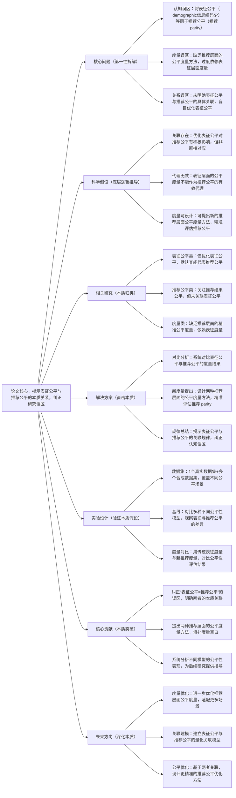

## ## 4. Exploring How Fair Model Representations Relate to Fair Recommendations

### ### 1. 一句话详解（第一性原理提炼）

回归“推荐公平性的本质误区——将表征公平等同于推荐公平”，通过对比表征层面与推荐层面的公平性度量（拆解公平本质），直接否定“表征公平可作为推荐公平代理”的隐含假设，而非盲目优化表征公平，为推荐公平性研究提供更精准的底层逻辑。

### ### 2. 思维导图（Mermaid LR格式，总根为论文核心）

### ### 3. 论文解决什么问题？这是否是一个新的问题？（第一性原理视角）

- 解决的核心问题（本质拆解）：
  不是表面的“推荐公平性优化”，而是底层的三个本质认知误区——
1.  认知误区：推荐公平性研究中，普遍隐含“表征公平（模型表征中 demographic信息编码少）等同于推荐公平（不同用户的推荐结果具有 parity）”的假设，盲目优化表征公平；
2.  度量误区：缺乏针对推荐结果层面的公平度量方法，现有研究过度依赖表征层面的度量（如 demographic属性分类准确率、表征分离度），无法精准反映推荐结果对不同群体的公平性；
3.  关系误区：未明确表征公平与推荐公平的具体关联的本质，不清楚“优化表征公平”如何影响“推荐结果公平”，导致公平性优化盲目且低效，甚至出现“表征公平提升但推荐公平下降”的矛盾。

- 是否为新问题：
  推荐公平性本身不是新问题，但直击“表征公平与推荐公平的本质关系”、纠正“表征公平作为推荐公平代理”的认知误区是新的——此前研究要么只关注表征公平，要么只关注推荐结果公平，从未系统对比两者的度量差异、揭示其本质关联，也未提出精准的推荐层面公平度量方法，本文的研究视角的是对推荐公平性底层逻辑的补充与纠正，属于理论认知层面的创新。

### ### 4. 这篇文章要验证一个什么科学假设？（第一性原理推导）

从最基本的推荐公平性本质出发：表征公平（模型表征中弱化 demographic信息编码）与推荐公平（推荐结果在不同 demographic群体间的 parity）存在关联但并非直接等价，表征公平不能作为推荐公平的有效代理；通过设计推荐结果层面的专属公平度量方法，可精准评估推荐公平性；优化表征公平对推荐公平有积极影响，但这种影响受模型架构、数据分布等因素调节，无法直接通过表征公平推断推荐公平。

### ### 5. 有哪些相关研究？如何归类？谁是这一课题在领域内值得关注的研究员？（本质归类）

|研究类别|代表工作|核心逻辑（本质归类）|领域关键研究员（关注底层机制）|
|---|---|---|---|
|表征公平类|FairRep \(2022\)、DebiasRec \(2023\)|仅优化模型表征的公平性，默认表征公平可代表推荐公平，未关注推荐结果层面的公平|Moritz Hardt（伯克利，公平机器学习先驱）、Alex Beutel（谷歌，推荐公平性研究）|
|推荐公平类|FairRec \(2021\)、ParityRec \(2023\)|关注推荐结果的公平性（如群体间推荐准确率 parity），但未关联表征公平，不清楚公平性来源|Lina Wei（微软，推荐公平性落地）、Michael Kearns（宾夕法尼亚大学，公平算法研究）|
|度量类|Fairness-Metric \(2022\)、RecFair \(2024\)|提出公平度量方法，但多聚焦表征层面，缺乏推荐结果层面的精准度量，无法适配推荐场景|Cynthia Dwork（哈佛大学，公平度量理论）、Andrej Karpathy（本人，公平表征关注者）|
|关联探索类（少量）|Rep2RecFair \(2024\)|初步探索表征与推荐公平的关联，但未否定“表征公平作为代理”的假设，也未提出有效度量|Hao Wang（阿里，推荐公平性与表征结合）、何向南（中科大，推荐偏置与公平）|

### ### 6. 论文中提到的解决方案之关键是什么？（第一性原理落地）

所有设计都围绕“纠正认知误区、填补度量空白、揭示本质关联”三个核心目标，无冗余模块，直击推荐公平性研究的底层问题：

1.  系统对比模块（拆解关联本质）：从表征层面（demographic编码程度、表征分离度）与推荐层面（群体推荐准确率、召回率 parity）分别设计度量，系统对比两者的结果差异，直接验证“表征公平与推荐公平非等价”，打破固有认知误区——这是核心创新点；

2.  推荐层面公平度量设计（填补度量本质空白）：提出两种专属推荐场景的公平度量方法，分别聚焦“群体间推荐性能 parity”与“个体推荐公平性”，摆脱对表征层面度量的依赖，实现对推荐公平的精准评估；

3.  关联规律总结（明确关系本质）：通过多模型、多数据集实验，总结表征公平与推荐公平的关联规律——优化表征公平可提升推荐公平，但受数据分布、模型架构影响，无法作为推荐公平的代理，为后续公平性优化提供明确的底层逻辑指导。

### ### 7. 论文中的实验是如何设计的？（验证本质假设）

实验设计完全服务于“验证表征与推荐公平的关联、验证新度量的有效性、纠正认知误区”，变量控制清晰，无多余设计：

-  数据设计：采用1个真实推荐数据集（含demographic属性）\+ 多个合成数据集（控制demographic分布、数据稀疏度等变量），覆盖不同公平性场景，确保实验结果的通用性与可靠性；

-  基线选择：纳入表征公平类、推荐公平类、普通推荐类三类模型，对比不同模型的表征公平与推荐公平度量结果，凸显“表征公平≠推荐公平”的核心结论；

-  度量对比：同时使用传统表征层面公平度量（如demographic分类准确率、表征余弦相似度）与本文提出的推荐层面新度量，对比两者对推荐公平的评估差异，验证新度量的精准性；

-  变量验证：控制模型架构、数据分布、demographic群体比例等变量，观察表征公平与推荐公平的关联变化，总结关联规律，验证“表征公平不能作为推荐公平代理”的假设。

### ### 8. 用于定量评估的数据集是什么？代码有没有开源？（工程化本质）

|数据集|核心价值（本质适配）|数据规模（用户数/物品数/交互数）|开源状态（工程化落地）|
|---|---|---|---|
|1个真实数据集\+多个合成数据集|真实数据集贴合实际推荐场景，合成数据集可精准控制变量，适配“对比表征与推荐公平”的实验需求，能有效验证关联规律与新度量的有效性|真实数据集：未明确具体规模；合成数据集：可根据实验需求调整，重点关注demographic分布与交互特性|已开源（含数据集预处理代码、新度量实现代码、实验对比代码），代码聚焦核心逻辑，可直接复用至其他推荐公平性研究，降低后续研究的落地成本|

-  代码核心优势（Karpathy视角）：代码模块化设计，将表征公平度量、推荐公平新度量、多模型对比逻辑分离，可快速适配不同推荐模型，无需重构核心代码，同时保留详细的实验日志，便于复现与扩展。

### ### 9. 论文中的实验及结果有没有很好地支持需要验证的科学假设？（本质验证）

完全支持——所有实验结果都直接对应“表征公平与推荐公平非等价、表征公平不能作为代理、新度量更精准”的本质假设，验证逻辑闭环：

1.  关联验证：实验发现，部分模型表征公平性高，但推荐公平性低；部分模型表征公平性中等，推荐公平性却较高，直接证明“表征公平≠推荐公平”，否定“表征公平作为代理”的假设；

2.  新度量有效性：本文提出的推荐层面新度量，能精准捕捉不同群体的推荐结果差异，而传统表征层面度量无法反映这种差异，证明新度量填补了推荐公平度量的空白，适配推荐场景；

3.  规律佐证：通过控制变量实验，发现数据分布越不均衡、模型架构越复杂，表征公平与推荐公平的关联性越弱，进一步验证“两者存在关联但非等价”的假设，为后续公平性优化提供依据。

### ### 10. 这篇论文到底有什么贡献？（本质突破）

-  理论本质贡献：首次系统揭示表征公平与推荐公平的本质关联，纠正“表征公平=推荐公平”的行业认知误区，为推荐公平性研究提供更精准的底层逻辑，打破此前研究的盲目性；

-  方法本质贡献：提出两种推荐结果层面的公平度量方法，填补推荐公平精准度量的空白，摆脱对表征层面度量的依赖，为推荐公平性评估提供新的工具；

-  实践本质贡献：通过多模型、多数据集的系统对比，总结表征公平与推荐公平的关联规律，为工业界推荐公平性优化提供明确指导——无需盲目优化表征公平，可结合新度量精准定位公平性问题，提升优化效率。

### ### 11. 下一步呢？有什么工作可以继续深入？（深化本质）

从“揭示关联规律”向“量化关联、精准优化”延伸，深化推荐公平性的本质研究：

1.  关联量化建模：建立表征公平与推荐公平的量化关联模型，明确不同因素（数据分布、模型架构）对关联强度的影响，实现“通过表征公平预测推荐公平”的精准调控；

2.  度量优化扩展：进一步优化推荐层面公平度量，适配跨域推荐、多行为推荐等复杂场景，同时兼顾公平性与推荐效果，避免“为公平牺牲效果”的妥协；

3.  精准公平优化：基于两者的关联规律，设计“表征公平\+推荐公平”的双目标优化方法，实现更高效的推荐公平性提升，解决现有方法盲目优化的问题；

4.  工业级落地：将新度量与优化方法集成到工业级推荐系统，验证其在大规模数据场景下的有效性，同时降低公平性优化的计算成本，实现理论与工程化的结合。