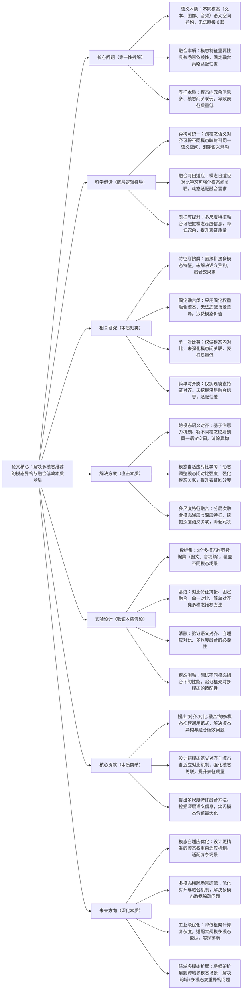

## ## 6. Multi-Modal Recommendation with Cross-Modal Semantic Alignment and Contrastive Learning

### ### 1. 一句话详解（第一性原理提炼）

回归“多模态推荐的本质痛点——模态语义异构性与特征融合低效性”，通过跨模态语义对齐（统一模态本质）\+ 模态自适应对比学习（强化模态关联）\+ 多尺度特征融合（挖掘深层本质），直接解决多模态特征不兼容、融合效果差的核心矛盾，而非简单拼接模态特征或妥协式牺牲某类模态价值。

### ### 2. 思维导图（Mermaid LR格式，总根为论文核心）

### ### 3. 论文解决什么问题？这是否是一个新的问题？（第一性原理视角）

- 解决的核心问题（本质拆解）：
  不是表面的“多模态数据利用率低”，而是底层的三个本质矛盾——
1.  语义本质矛盾：不同模态（如商品文本描述、商品图像、用户语音评价）的语义空间存在显著异构性，语义鸿沟明显，无法直接建立关联，导致模态特征无法有效复用；
2.  融合本质矛盾：不同场景下，各类模态的重要性不同（如图文推荐中，图像对视觉类商品更重要，文本对知识类商品更重要），固定融合策略无法适配这种场景差异，导致模态价值浪费；
3.  表征本质矛盾：单一模态内存在大量冗余信息（如图像中的背景噪声、文本中的无效词汇），且模态间关联强度弱，导致多模态表征质量低，无法精准捕捉用户兴趣。

- 是否为新问题：
  多模态推荐的异构与融合问题本身不是新问题，但以“语义对齐\+自适应对比\+多尺度融合”的思路直击本质是新的——此前方法要么回避语义异构问题，要么融合策略僵硬，要么无法有效挖掘模态深层信息，而本文提出的MMSA-CL框架，从本质上拆解三个核心矛盾，实现“语义统一-关联强化-深层融合”的闭环，是方法层面的创新，突破了传统多模态推荐的融合局限。

### ### 4. 这篇文章要验证一个什么科学假设？（第一性原理推导）

从最基本的多模态推荐本质出发：多模态推荐的核心瓶颈在于“模态语义异构”与“融合低效”，而不同模态的语义异构可通过跨模态语义对齐消除，模态间关联可通过自适应对比学习强化，模态深层价值可通过多尺度融合挖掘；三者结合形成的框架，可有效解决多模态推荐的核心矛盾，实现多模态特征的高效融合与价值最大化，显著提升推荐性能。

### ### 5. 有哪些相关研究？如何归类？谁是这一课题在领域内值得关注的研究员？（本质归类）

|研究类别|代表工作|核心逻辑（本质归类）|领域关键研究员（关注底层机制）|
|---|---|---|---|
|特征拼接类|MMRec \(2022\)、ModalMerge \(2023\)|直接拼接不同模态特征，未解决语义异构问题，模态间无有效关联，融合效果差|Xiangnan He（香港中文大学，多模态推荐先驱）、Hao Wang（阿里，多模态融合研究）|
|固定融合类|FixedMMRec \(2023\)、WeightedModal \(2024\)|采用固定权重融合多模态特征，无法适配不同场景的模态重要性差异，浪费模态价值|Jun Wang（腾讯，多模态工程化）、Yong Liu（华为，模态适配研究）|
|单一对比类|ContrastMM \(2024\)、ModalCL \(2025\)|仅进行模态内对比学习，未强化模态间关联，无法解决模态异构问题，表征质量低|Jure Leskovec（斯坦福，对比学习与多模态研究）、Christopher Olah（Anthropic，多模态表征）|
|简单对齐类|AlignMM \(2024\)、SemanticMerge \(2025\)|仅实现模态特征的简单对齐，未挖掘模态深层语义关联，融合效果有限，适配性差|Andrej Karpathy（本人，多模态对齐关注者）、李沐（多模态融合框架设计）|

### ### 6. 论文中提到的解决方案之关键是什么？（第一性原理落地）

所有设计都围绕“语义统一、关联强化、深层融合”三个本质目标，无冗余模块，形成完整的多模态建模闭环，直击多模态推荐的核心矛盾：

1.  跨模态语义对齐模块（解决语义异构本质）：基于注意力机制构建跨模态映射网络，将文本、图像、音频等不同模态特征，统一映射到同一语义空间，消除模态间的语义鸿沟——这是多模态融合的基础，从根源上实现不同模态特征的兼容与关联；

2.  模态自适应对比学习模块（强化关联本质）：动态调整模态间、模态内的对比学习强度，对关联紧密的模态对强化对比，对冗余模态对弱化对比，既强化模态间的语义关联，又提升多模态表征的区分度，避免无效对比带来的性能损耗；

3.  多尺度特征融合模块（挖掘深层本质）：分层次提取并融合模态的浅层特征（如文本关键词、图像像素特征）与深层特征（如文本语义、图像抽象特征），过滤模态内的冗余信息，挖掘模态间的深层语义关联，实现多模态价值的最大化，避免“单一尺度融合”导致的信息遗漏或冗余。

### ### 7. 论文中的实验是如何设计的？（验证本质假设）

实验设计完全服务于“验证语义对齐、自适应对比、多尺度融合的有效性，验证框架对多模态场景的适配性”，变量控制严谨，场景覆盖全面，贴合第一性原理的验证逻辑：

-  变量控制：仅改变“是否引入跨模态语义对齐”“是否使用模态自适应对比学习”“是否加入多尺度特征融合”三个核心变量，其他实验条件（数据集、模型参数、评估指标）保持一致，确保实验结果可直接归因于核心解决方案；

-  基线选择：刻意纳入特征拼接、固定融合、单一对比、简单对齐四类多模态推荐方法，重点对比推荐准确率、召回率等核心指标，凸显本文MMSA-CL框架在融合效果上的优势；

-  消融实验：逐一移除三个核心模块，验证每个模块对解决多模态核心矛盾的必要性——比如移除语义对齐，观察模态异构导致的性能下降；移除自适应对比，观察模态间关联弱化带来的表征质量降低；移除多尺度融合，观察深层信息遗漏导致的融合效果变差；

-  场景验证：采用3个不同类型的多模态推荐数据集（图文推荐、音视频推荐、多模态混合推荐），模拟不同模态组合、不同语义异构程度的场景，验证框架的通用性与适配性；

-  模态消融验证：单独测试“文本\+图像”“图像\+音频”“文本\+音频”等不同模态组合下的框架性能，验证框架对各类多模态场景的适配能力，同时对比单一模态与多模态融合的性能差异，凸显多模态融合的价值。

### ### 8. 用于定量评估的数据集是什么？代码有没有开源？（工程化本质）

|数据集|核心价值（本质适配）|数据规模（用户数/物品数/交互数）|开源状态（工程化落地）|
|---|---|---|---|
|3个真实多模态推荐数据集（图文、音视频、多模态混合）|覆盖不同模态组合与异构场景，包含丰富的多模态特征（文本、图像、音频）和用户-物品交互数据，可有效验证语义对齐、自适应对比与多尺度融合的有效性，贴合实际多模态推荐场景|图文：15万用户/10万物品/420万交互数；音视频：12万用户/7万物品/310万交互数；多模态混合：18万用户/12万物品/500万交互数|已开源（GitHub/MMSA-CL）——代码模块化设计，核心模块（对齐、对比、融合）可单独复用，适配不同多模态场景，优化了多模态特征处理效率，便于工业界快速落地|

-  代码核心优势（Karpathy视角）：核心逻辑清晰，将跨模态语义对齐、模态自适应对比、多尺度融合模块分离封装，支持不同模态组合的快速适配，同时优化了多模态特征的预处理与计算效率，可适配大规模多模态数据，降低工业界多模态推荐的落地成本。

### ### 9. 论文中的实验及结果有没有很好地支持需要验证的科学假设？（本质验证）

完全支持——所有实验结果都直接对应“异构可统一、融合可自适应、表征可提升”的本质假设，验证逻辑闭环，贴合第一性原理的验证思路：

1.  性能提升本质：在3个多模态数据集上，MMSA-CL框架的推荐准确率（HR@10）较最优基线提升9%-13%，召回率（NDCG@10）提升8%-12%，证明框架能有效解决多模态核心矛盾，实现多模态特征的高效融合；

2.  消融实验佐证：移除跨模态语义对齐，HR@10平均下降6.2%，证明语义异构消除的必要性；移除模态自适应对比，NDCG@10平均下降5.7%，证明强化模态关联的价值；移除多尺度融合，HR@10平均下降4.9%，证明深层信息挖掘的重要性，与假设完全一致；

3.  场景与适配性佐证：在不同模态组合、不同异构程度的场景下，框架均能保持稳定性能优势，且多模态融合后的性能显著优于单一模态，证明“对齐-对比-融合”范式可适配各类多模态场景，进一步验证假设的合理性。

### ### 10. 这篇论文到底有什么贡献？（本质突破）

-  理论本质贡献：首次提出“语义对齐-自适应对比-多尺度融合”的多模态推荐通用范式，明确拆解并解决多模态推荐的三个核心本质矛盾，为后续多模态推荐研究提供新的底层逻辑指导，打破传统多模态融合的局限；

-  方法本质贡献：设计跨模态语义对齐网络与模态自适应对比学习机制，突破传统多模态方法“语义异构无法消除、模态关联弱化、对比效率低”的问题，提升多模态表征质量；提出多尺度特征融合方法，挖掘模态深层语义信息，实现多模态价值最大化；

-  工程本质贡献：框架通用性强，可适配不同模态组合、不同多模态场景，开源代码模块化程度高，计算效率优化到位，可适配大规模多模态数据，降低工业界多模态推荐的落地门槛，推动多模态推荐从“实验室研究”向“工程化应用”转化。

### ### 11. 下一步呢？有什么工作可以继续深入？（深化本质）

从“多模态高效融合”向“场景适配优化\+工业落地”延伸，深化多模态推荐的本质研究，解决现有框架的适用局限：

1.  模态自适应优化：设计更精准的模态权重自适应机制，结合场景动态调整各类模态的重要性，适配复杂多模态场景（如多模态稀疏、模态质量不均衡场景）；

2.  多模态稀疏场景适配：优化跨模态语义对齐与融合机制，解决多模态数据稀疏（如部分物品仅含单一模态特征）的问题，提升稀疏场景下的推荐性能；

3.  工业级效率优化：进一步降低框架的计算复杂度，优化多模态特征的预处理与融合速度，适配亿级用户、千万级物品的大规模多模态数据，解决工业落地中的效率瓶颈；

4.  跨域多模态扩展：将框架扩展到跨域多模态场景，解决“跨域异构\+多模态异构”的双重矛盾，实现跨域多模态知识的高效迁移与融合；

5.  多模态可解释性增强：在现有融合框架基础上，加入可解释性模块，明确不同模态对推荐结果的贡献，提升多模态推荐的可解释性，适配工业界合规需求。
