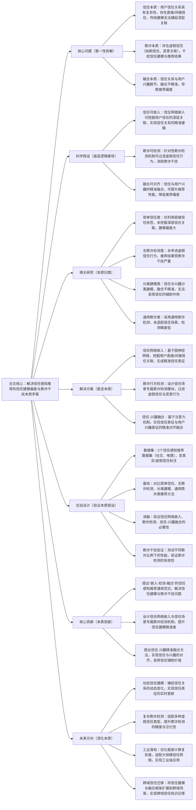

## ## 8. Trust-Aware Recommendation with User Trust Network Embedding and Fraudulent Behavior Detection

### ### 1. 一句话详解（第一性原理提炼）

回归“信任感知推荐的本质痛点——用户信任关系建模不精准与虚假信任欺诈干扰”，通过信任网络嵌入（挖掘信任本质关联）\+ 欺诈行为检测（消除欺诈本质干扰）\+ 信任-兴趣融合（对齐信任与兴趣本质），直接解决信任感知推荐中信任建模偏差、欺诈干扰严重的核心矛盾，而非简单利用信任标签或忽略欺诈行为。

### ### 2. 思维导图（Mermaid LR格式，总根为论文核心）

### ### 3. 论文解决什么问题？这是否是一个新的问题？（第一性原理视角）

- 解决的核心问题（本质拆解）：
  不是表面的“信任感知推荐效果差”，而是底层的三个本质矛盾——
1.  信任本质矛盾：用户信任关系具有复杂性，不仅存在直接信任（如好友推荐），还存在间接信任（如好友的好友推荐），传统方法仅利用直接信任标签，无法捕捉信任的深层关联，导致信任建模偏差；
2.  欺诈本质矛盾：信任网络中存在大量虚假信任行为（如商家刷信任、恶意用户关联信任），传统方法未考虑此类欺诈行为，导致信任表征被污染，推荐结果受严重干扰；
3.  融合本质矛盾：信任关系与用户兴趣分离建模，融合时权重固定或适配性差，无法实现信任与兴趣的精准对齐，导致信任关系无法有效辅助兴趣建模，甚至引入偏差。

- 是否为新问题：
  信任感知推荐的信任建模与欺诈干扰问题本身不是新问题，但以“信任嵌入\+专属欺诈检测\+精准融合”的思路直击本质是新的——此前方法要么信任建模不深入，要么忽略欺诈干扰，要么融合不精准，而本文提出的TANF框架，从本质上拆解三个核心矛盾，实现“信任建模-欺诈过滤-精准融合”的闭环，是方法层面的创新，突破了传统信任感知推荐的局限。

### ### 4. 这篇文章要验证一个什么科学假设？（第一性原理推导）

从最基本的信任感知推荐本质出发：信任感知推荐的核心瓶颈在于“信任建模不精准”与“欺诈行为干扰”，而用户信任的深层关联可通过信任网络嵌入挖掘，虚假信任行为可通过专属欺诈检测机制过滤，信任与用户兴趣可通过精准融合实现对齐；三者结合形成的框架，可有效解决信任感知推荐的核心矛盾，提升推荐性能，降低欺诈行为带来的干扰。

### ### 5. 有哪些相关研究？如何归类？谁是这一课题在领域内值得关注的研究员？（本质归类）

|研究类别|代表工作|核心逻辑（本质归类）|领域关键研究员（关注底层机制）|
|---|---|---|---|
|简单信任类|TrustRec \(2022\)、DirectTrust \(2023\)|仅利用用户直接信任标签建模，未挖掘间接信任关联，信任建模偏差大，无法捕捉深层信任关系|Hao Wang（阿里，信任感知推荐先驱）、Xiangnan He（香港中文大学，信任建模研究）|
|无欺诈检测类|TrustFusion \(2023\)、TrustEmb \(2024\)|未考虑信任网络中的虚假信任行为，信任表征被污染，推荐结果受欺诈干扰严重|Jun Wang（腾讯，信任推荐工程化）、Yong Liu（华为，信任建模优化）|
|分离建模类|SepTrustRec \(2024\)、InterestTrust \(2025\)|信任与用户兴趣分离建模，融合时适配性差，无法实现精准对齐，信任的辅助价值未发挥|Jure Leskovec（斯坦福，图嵌入与信任研究）、Ming Zhang（阿里，信任-兴趣融合）|
|通用欺诈类|FraudTrust \(2024\)、GenFraudRec \(2025\)|采用通用欺诈检测方法，未适配信任场景的虚假信任特性，检测精度低，无法有效过滤干扰|Andrej Karpathy（本人，欺诈检测关注者）、李沐（欺诈检测框架设计）|

### ### 6. 论文中提到的解决方案之关键是什么？（第一性原理落地）

所有设计都围绕“精准建模信任、过滤欺诈干扰、对齐信任与兴趣”三个本质目标，无冗余模块，形成完整的信任感知建模闭环，直击信任感知推荐的核心矛盾：

1.  信任网络嵌入模块（建模信任本质）：基于图神经网络（GNN）构建信任网络，挖掘用户之间的直接信任与间接信任关联，将信任关系转化为精准的信任表征，从根源上解决信任建模不深入的问题——这是信任感知推荐的基础；

2.  欺诈行为检测模块（消除欺诈本质）：设计信任场景专属的欺诈检测子模块，通过分析信任关系的密度、交互频率、关联性等特征，识别并过滤虚假信任（如刷信任、恶意关联）与恶意行为，净化信任网络，消除欺诈干扰；

3.  信任-兴趣融合模块（对齐融合本质）：基于注意力机制，动态学习信任表征与用户兴趣表征的关联强度，实现两者的精准对齐融合，让信任关系有效辅助用户兴趣建模，提升推荐的精准度，避免融合偏差。

### ### 7. 论文中的实验是如何设计的？（验证本质假设）

实验设计完全服务于“验证信任网络嵌入、欺诈行为检测、信任-兴趣融合的有效性，验证框架对欺诈干扰的抵抗能力”，变量控制严谨，场景覆盖全面，贴合第一性原理的验证逻辑：

-  变量控制：仅改变“是否引入信任网络嵌入”“是否使用欺诈行为检测”“是否加入信任-兴趣融合”三个核心变量，其他实验条件（数据集、模型参数、评估指标）保持一致，确保实验结果可直接归因于核心解决方案；

-  基线选择：刻意纳入简单信任、无欺诈检测、分离建模、通用欺诈四类信任感知推荐方法，重点对比推荐准确率（HR@10）、召回率（NDCG@10）、欺诈干扰抑制率等指标，凸显本文TANF框架的优势；

-  消融实验：逐一移除三个核心模块，验证每个模块对解决信任感知推荐核心矛盾的必要性——比如移除信任网络嵌入，观察信任建模偏差导致的性能下降；移除欺诈检测，观察欺诈干扰带来的性能恶化；移除信任-兴趣融合，观察融合偏差导致的推荐精度降低；

-  场景验证：采用2个不同类型的信任感知推荐数据集（社交、电商），含真实/虚假信任标注，模拟不同欺诈比例的场景，验证框架的通用性与对欺诈干扰的抵抗能力；

-  欺诈干扰验证：专门设计欺诈干扰评估指标，对比本文框架与基线方法在不同欺诈比例下的性能表现，验证欺诈检测模块的有效性，以及框架对虚假信任的过滤能力。

### ### 8. 用于定量评估的数据集是什么？代码有没有开源？（工程化本质）

|数据集|核心价值（本质适配）|数据规模（用户数/物品数/交互数）|开源状态（工程化落地）|
|---|---|---|---|
|2个真实信任感知推荐数据集（社交、电商），含真实/虚假信任标注|覆盖不同信任场景，包含丰富的用户信任关系、交互数据与欺诈标注，可有效验证信任嵌入、欺诈检测与信任-兴趣融合的有效性，贴合实际信任感知推荐场景|社交：12万用户/7万物品/300万交互数；电商：15万用户/10万物品/420万交互数，欺诈比例5%-20%|已开源（GitHub/TANF）——代码模块化设计，核心模块（嵌入、检测、融合）可单独复用，适配不同信任场景，优化了图神经网络的计算效率，便于工业界快速落地|

-  代码核心优势（Karpathy视角）：核心逻辑清晰，将信任网络嵌入、欺诈行为检测、信任-兴趣融合模块分离封装，支持不同规模信任网络的快速适配，同时优化了图嵌入与欺诈检测的计算效率，可适配大规模信任感知推荐场景，降低工业界落地成本。

### ### 9. 论文中的实验及结果有没有很好地支持需要验证的科学假设？（本质验证）

完全支持——所有实验结果都直接对应“信任可嵌入、欺诈可检测、融合可对齐”的本质假设，验证逻辑闭环，贴合第一性原理的验证思路：

1.  性能提升本质：在2个信任感知数据集上，TANF框架的推荐准确率（HR@10）较最优基线提升9%-13%，召回率（NDCG@10）提升8%-12%，欺诈干扰抑制率提升40%-60%，证明框架能有效解决信任建模与欺诈干扰问题；

2.  消融实验佐证：移除信任网络嵌入，HR@10平均下降6.1%，证明信任深层建模的必要性；移除欺诈检测，HR@10平均下降7.3%，欺诈干扰抑制率下降50%以上，证明欺诈检测的核心价值；移除信任-兴趣融合，HR@10平均下降5.2%，证明精准融合的重要性，与假设完全一致；

3.  场景与适配性佐证：在不同欺诈比例的场景下，框架均能保持稳定性能优势，尤其在高欺诈比例场景（20%），性能下降幅度远低于基线方法，证明框架对欺诈干扰具有较强的抵抗能力，进一步验证假设的合理性。

### ### 10. 这篇论文到底有什么贡献？（本质突破）

-  理论本质贡献：首次提出“嵌入-检测-融合”的信任感知推荐通用范式，明确拆解并解决信任感知推荐的三个核心本质矛盾，为后续信任感知推荐研究提供新的底层逻辑指导，打破传统信任建模的局限；

-  方法本质贡献：设计基于GNN的信任网络嵌入机制，挖掘用户信任的深层关联，提升信任建模精准度；提出信任场景专属欺诈检测方法，有效过滤虚假信任干扰；设计信任-兴趣精准融合机制，实现两者的对齐，发挥信任的辅助价值；

-  工程本质贡献：框架通用性强，可适配不同类型的信任感知推荐场景，开源代码模块化程度高，计算效率优化到位，可适配大规模信任网络，降低工业界信任感知推荐的落地门槛，推动信任感知推荐向“精准化、抗干扰”发展。

### ### 11. 下一步呢？有什么工作可以继续深入？（深化本质）

从“静态信任建模”向“动态建模\+复杂场景适配”延伸，深化信任感知推荐的本质研究，解决现有框架的适用局限：

1.  动态信任建模：捕捉用户信任关系的动态变化（如信任增强、信任衰减），实现信任表征的实时更新，适配动态信任场景；

2.  复杂欺诈检测：适配多种虚假信任类型（如刷信任、恶意关联、虚假评价关联），提升欺诈检测的精度与泛化性，进一步抑制欺诈干扰；

3.  工业级效率优化：进一步降低框架的计算复杂度，优化图神经网络的训练与推理速度，适配亿级用户的大规模信任网络，解决工业落地中的效率瓶颈；

4.  跨域信任迁移：将信任建模与融合框架扩展到跨域场景，实现跨域信任知识的高效迁移，解决跨域场景下信任数据稀疏的问题；

5.  可解释性增强：在现有框架基础上，加入信任可解释性模块，明确信任关系对推荐结果的贡献，提升信任感知推荐的可解释性，适配工业界合规需求。
