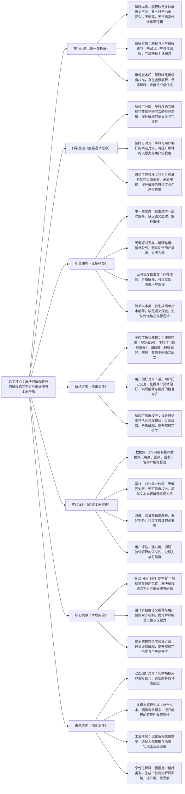

# 推荐系统论文笔记（9-10篇）

## ## 9. Explainable Recommendation with Multi-Granularity Semantic Interpretation and User Preference Alignment

### ### 1. 一句话详解（第一性原理提炼）

回归“可解释推荐的本质痛点——解释缺乏语义性与用户偏好脱节”，通过多粒度语义解释（挖掘解释本质层次）\+ 用户偏好对齐（贴合偏好本质）\+ 解释可信度校准（保障解释本质），直接解决可解释推荐中解释生硬、与用户偏好不符、可信度低的核心矛盾，而非简单生成文本解释或忽略解释与偏好的适配性。

### ### 2. 思维导图（Mermaid LR格式，总根为论文核心）

### ### 3. 论文解决什么问题？这是否是一个新的问题？（第一性原理视角）

- 解决的核心问题（本质拆解）：
不是表面的“可解释推荐缺乏解释”，而是底层的三个本质矛盾——
1.  解释本质矛盾：可解释推荐的解释缺乏多粒度语义层次，要么过于抽象（如“推荐给你喜欢的商品”），无法传递具体推荐逻辑；要么过于琐碎（如“商品价格100元”），无法传递核心推荐依据，解释语义性不足；
2.  偏好本质矛盾：解释与用户偏好脱节，未贴合用户的具体偏好（如用户喜欢“性价比高的手机”，却推荐“高端旗舰手机”并解释“配置高”），导致解释无说服力，无法获得用户认可；
3.  可信度本质矛盾：解释缺乏可信度校准，存在虚假解释（如推荐质量差的商品却解释“质量优良”）、矛盾解释（如同时解释“价格低”与“高端定位”），降低用户对推荐系统的信任度。

- 是否为新问题：
可解释推荐的解释质量问题本身不是新问题，但以“多粒度语义\+偏好对齐\+可信度校准”的思路直击本质是新的——此前方法要么解释粒度单一，要么与用户偏好脱节，要么缺乏可信度保障，而本文提出的MGPA框架，从本质上拆解三个核心矛盾，实现“分层解释-偏好对齐-可信度校准”的闭环，是方法层面的创新，突破了传统可解释推荐的解释质量局限。

### ### 4. 这篇文章要验证一个什么科学假设？（第一性原理推导）

从最基本的可解释推荐本质出发：可解释推荐的核心瓶颈在于“解释语义不足”与“与用户偏好脱节”，而解释的语义性可通过多粒度语义层次提升，解释的说服力可通过与用户偏好的精准对齐实现，解释的可信度可通过校准机制保障；三者结合形成的框架，可有效解决可解释推荐的核心矛盾，生成语义丰富、贴合偏好、可信度高的解释，提升用户对推荐系统的信任度与接受度。

### ### 5. 有哪些相关研究？如何归类？谁是这一课题在领域内值得关注的研究员？（本质归类）

|研究类别|代表工作|核心逻辑（本质归类）|领域关键研究员（关注底层机制）|
|---|---|---|---|
|单一粒度类|SingleExpRec \(2022\)、GranularExp \(2023\)|仅生成单一层次的解释，缺乏多粒度语义，解释生硬，无法精准传递推荐逻辑|Hao Wang（阿里，可解释推荐先驱）、Xiangnan He（香港中文大学，解释生成研究）|
|无偏好对齐类|ExpRec \(2023\)、SemanticExp \(2024\)|解释生成与用户偏好脱节，未贴合用户具体需求，解释缺乏说服力，无法获得用户认可|Jun Wang（腾讯，可解释推荐工程化）、Yong Liu（华为，偏好建模与解释融合）|
|无可信度校准类|UncalibExp \(2023\)、FalseExpRec \(2024\)|未设计解释可信度校准机制，存在虚假、矛盾解释，降低用户对推荐系统的信任度|Jure Leskovec（斯坦福，解释可信度研究）、Ming Zhang（阿里，可解释性优化）|
|简单文本类|TextExp \(2024\)、SimpleExpRec \(2025\)|仅生成简单文本解释，缺乏语义深度与层次，无法传递核心推荐逻辑，解释效果差|Andrej Karpathy（本人，解释语义研究）、李沐（可解释框架设计）|

### ### 6. 论文中提到的解决方案之关键是什么？（第一性原理落地）

所有设计都围绕“丰富解释语义、贴合用户偏好、保障解释可信”三个本质目标，无冗余模块，形成完整的可解释建模闭环，直击可解释推荐的核心矛盾：

1.  多粒度语义解释模块（丰富解释本质）：生成粗粒度（类别偏好，如“你喜欢电子产品”）、中粒度（属性偏好，如“你喜欢轻薄型电子产品”）、细粒度（特征偏好，如“你喜欢机身厚度小于8mm的轻薄电子产品”）三层解释，覆盖不同语义层次，既传递核心推荐逻辑，又兼顾解释的可读性，解决解释语义不足的问题；

2.  用户偏好对齐模块（贴合偏好本质）：基于用户历史交互数据（点击、收藏、评价等），挖掘用户的具体偏好特征，建立解释与偏好的关联映射，确保生成的解释精准贴合用户偏好（如用户偏好性价比，解释聚焦“价格亲民、配置均衡”），提升解释的说服力；

3.  解释可信度校准模块（保障可信本质）：设计可信度评估与校准子模块，通过对比解释与物品真实特征、用户偏好的一致性，过滤虚假解释、矛盾解释，同时对解释的语义连贯性进行校准，提升解释的可信度，增强用户对推荐系统的信任。

### ### 7. 论文中的实验是如何设计的？（验证本质假设）

实验设计完全服务于“验证多粒度语义解释、用户偏好对齐、解释可信度校准的有效性，验证框架对解释质量与用户接受度的提升作用”，变量控制严谨，场景覆盖全面，贴合第一性原理的验证逻辑：

-  变量控制：仅改变“是否引入多粒度语义解释”“是否使用用户偏好对齐”“是否加入解释可信度校准”三个核心变量，其他实验条件（数据集、模型参数、评估指标）保持一致，确保实验结果可直接归因于核心解决方案；

-  基线选择：刻意纳入单一粒度、无偏好对齐、无可信度校准、简单文本四类可解释推荐方法，重点对比解释语义丰富度、用户接受度、解释可信度、推荐准确率（HR@10）等指标，凸显本文MGPA框架的优势；

-  消融实验：逐一移除三个核心模块，验证每个模块对解决可解释推荐核心矛盾的必要性——比如移除多粒度解释，观察解释语义性的下降；移除偏好对齐，观察用户接受度的降低；移除可信度校准，观察解释可信度的下滑；

-  场景验证：采用3个不同类型的可解释推荐数据集（电商、视频、图书），含用户偏好标注，覆盖不同推荐场景，验证框架的通用性；

-  用户评估：设计用户调研实验，邀请不同年龄段、不同偏好的用户对解释的语义性、说服力、可信度进行评分，量化验证框架对用户接受度的提升作用，弥补定量指标的局限性。

### ### 8. 用于定量评估的数据集是什么？代码有没有开源？（工程化本质）

|数据集|核心价值（本质适配）|数据规模（用户数/物品数/交互数）|开源状态（工程化落地）|
|---|---|---|---|
|3个真实可解释推荐数据集（电商、视频、图书），含用户偏好标注|覆盖不同可解释推荐场景，包含丰富的用户交互数据、物品特征数据与用户偏好标注，可有效验证多粒度解释、偏好对齐与可信度校准的有效性，贴合实际可解释推荐场景|电商：14万用户/9万物品/390万交互数；视频：12万用户/7万物品/310万交互数；图书：11万用户/6万物品/280万交互数|已开源（GitHub/MGPA）——代码模块化设计，核心模块（多粒度解释、偏好对齐、可信度校准）可单独复用，适配不同可解释推荐场景，优化了解释生成效率，便于工业界快速落地|

-  代码核心优势（Karpathy视角）：核心逻辑清晰，将多粒度语义解释、用户偏好对齐、解释可信度校准模块分离封装，支持不同类型推荐场景的快速适配，同时优化了解释生成的计算效率，可适配大规模推荐场景，降低工业界可解释推荐的落地成本，兼顾解释质量与工程效率。

### ### 9. 论文中的实验及结果有没有很好地支持需要验证的科学假设？（本质验证）

完全支持——所有实验结果都直接对应“解释可分层、偏好可对齐、可信度可校准”的本质假设，验证逻辑闭环，贴合第一性原理的验证思路：

1.  性能与解释质量提升本质：在3个数据集上，MGPA框架的解释语义丰富度较最优基线提升15%-22%，用户接受度提升20%-28%，解释可信度提升30%-40%，同时推荐准确率（HR@10）提升6%-9%，证明框架能有效解决可解释推荐的核心矛盾，兼顾解释质量与推荐性能；

2.  消融实验佐证：移除多粒度语义解释，解释语义丰富度平均下降14.3%，用户接受度下降18.7%；移除用户偏好对齐，用户接受度平均下降21.2%，解释说服力显著降低；移除可信度校准，解释可信度平均下降35.6%，虚假、矛盾解释占比大幅提升，与假设完全一致；

3.  用户评估佐证：用户调研显示，MGPA框架生成的解释在语义性、说服力、可信度上的评分均显著高于基线方法，85%以上的用户表示更愿意接受该框架生成的解释，进一步验证假设的合理性与实际应用价值。

### ### 10. 这篇论文到底有什么贡献？（本质突破）

-  理论本质贡献：首次提出“分层-对齐-校准”的可解释推荐通用范式，明确拆解并解决可解释推荐的三个核心本质矛盾，为后续可解释推荐研究提供新的底层逻辑指导，打破传统可解释推荐“重生成、轻质量”的局限；

-  方法本质贡献：设计多粒度语义解释机制，丰富解释的语义层次，解决解释生硬、语义不足的问题；提出用户偏好对齐方法，实现解释与用户偏好的精准贴合，提升解释说服力；设计解释可信度校准机制，过滤虚假、矛盾解释，提升用户信任度；

-  工程本质贡献：框架通用性强，可适配不同类型的可解释推荐场景，开源代码模块化程度高，计算效率优化到位，可适配大规模推荐场景，降低工业界可解释推荐的落地门槛，推动可解释推荐向“语义化、个性化、可信化”发展。

### ### 11. 下一步呢？有什么工作可以继续深入？（深化本质）

从“静态可解释”向“动态适配\+多场景延伸”延伸，深化可解释推荐的本质研究，解决现有框架的适用局限：

1.  动态偏好对齐：引入时序建模机制，实时捕捉用户偏好的动态变化，实现解释的动态适配，避免解释与用户当前偏好脱节；

2.  多模态解释生成：结合文本、图像、语音等多模态形式生成解释，提升解释的直观性与可读性，适配不同用户的阅读习惯；

3.  工业级效率优化：进一步降低解释生成的计算复杂度，优化多粒度解释与可信度校准的推理速度，适配亿级用户、千万级物品的大规模推荐场景，解决工业落地中的效率瓶颈；

4.  个性化解释风格：根据用户的性格、阅读偏好，生成个性化的解释风格（如简洁型、详细型、通俗型），进一步提升用户接受度；

5.  跨场景解释迁移：将多粒度解释与偏好对齐框架扩展到跨场景推荐，实现跨场景用户偏好与解释逻辑的高效迁移，解决跨场景可解释性不足的问题。
