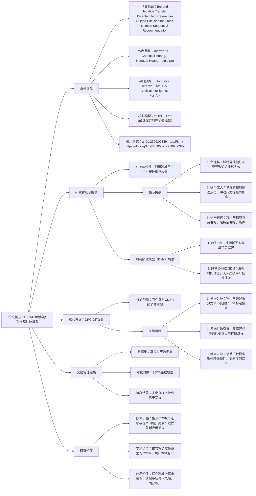

### 1. 一段话总结
论文《Beyond Negative Transfer: Disentangled Preference-Guided Diffusion for Cross-Domain Sequential Recommendation》针对**Cross-Domain Sequential Recommendation (CDSR)**（跨域序列推荐）的核心痛点——简单聚合序列信号会引发**负迁移（negative transfer）**（域特异性偏好冲突），且序列噪声（如误点击、冲动行为）因域异质性（物品类型、用户意图差异）被放大，导致难以解耦**域不变偏好（domain-invariant preferences）**、**域特定偏好（domain-specific preferences）** 与**噪声**这三类纠缠信号，提出**DPG-Diff**——首个专为CDSR设计的**Disentangled Preference-Guided Diffusion Model（解耦偏好引导扩散模型）**。该模型通过分解用户偏好为域不变与域特定组件，共同引导扩散模型的**反向扩散过程**，实现鲁棒的跨域知识迁移、缓解负迁移并过滤序列噪声；在真实世界数据集上的实验表明，DPG-Diff在多个指标上持续优于**state-of-the-art（SOTA）基线**。

---

### 2. 思维导图

---

### 3. 详细总结
#### 一、基础信息表
| 维度                | 具体内容                                                                 |
|---------------------|--------------------------------------------------------------------------|
| 论文标题            | Beyond Negative Transfer: Disentangled Preference-Guided Diffusion for Cross-Domain Sequential Recommendation |
| 作者团队            | Xiaoxin Ye、Chengkai Huang、Hongtao Huang、Lina Yao                       |
| 学科分类            | **Information Retrieval (cs.IR)**、**Artificial Intelligence (cs.AI)**    |
| 核心模型            | **DPG-Diff**（Disentangled Preference-Guided Diffusion Model）           |
| 目标任务            | **Cross-Domain Sequential Recommendation (CDSR)**（跨域序列推荐）        |
| 核心技术基础        | **Diffusion Models (DMs)**（扩散模型）                                    |
| 引用格式            | arXiv:2509.00389 [cs.IR] 或 https://doi.org/10.48550/arXiv.2509.00389   |

#### 二、研究背景与核心问题
1. **CDSR的核心价值**  
   跨域序列推荐（CDSR）通过整合用户在多个域（如电商的“服装域”与“家电域”、内容平台的“短视频域”与“长视频域”）的行为序列，挖掘跨域共性偏好，解决单一域数据稀疏、冷启动等问题，从而提升推荐质量。

2. **CDSR的三大核心挑战**
    - **挑战1：负迁移（Negative Transfer）**  
      简单聚合不同域的序列信号时，域特异性偏好（如“服装域关注风格”vs“家电域关注性能”）会产生冲突，导致跨域知识迁移失效，反而降低推荐精度。
    - **挑战2：噪声放大**  
      普通序列推荐（SR）已受误点击、冲动行为等噪声影响，而CDSR的**域异质性**（物品类型差异、用户意图差异）会进一步放大这类噪声，干扰偏好建模。
    - **挑战3：信号纠缠**  
      难以从混合序列中解耦三类关键信号：**域不变偏好**（跨域通用偏好，如“喜欢高性价比”）、**域特定偏好**（域专属偏好，如“服装域喜欢休闲风”）、**噪声**（无意义行为信号）。

3. **现有扩散模型（DMs）的局限**  
   扩散模型因迭代精修、抗噪声能力强，被尝试用于推荐，但在CDSR场景中存在明显不足：
    - 局限1：**序列DM混淆偏好**：仅针对普通SR设计，未考虑跨域场景，会混淆域不变与域特定偏好，无法实现有效知识迁移；
    - 局限2：**跨域协同过滤DM忽略时间动态**：虽关注跨域，但未建模用户行为的序列性（时间动态），无法捕捉用户偏好的演变过程，适配性差。

#### 三、核心方案：DPG-Diff模型设计
DPG-Diff的核心是“以解耦偏好为引导，让扩散模型适配CDSR场景”，具体设计包含三大关键模块：

| 模块名称         | 核心功能                  | 实现逻辑                                                                 | 关键价值                                                                 |
|------------------|---------------------------|--------------------------------------------------------------------------|--------------------------------------------------------------------------|
| **偏好分解模块** | 拆分用户偏好为两类组件     | 通过特定网络结构（摘要未详述具体结构），从跨域行为序列中分离出： 1. **域不变偏好**：跨域通用的用户核心偏好； 2. **域特定偏好**：各域专属的用户偏好 | 为后续“定向知识迁移”奠定基础，避免偏好混淆导致的负迁移                     |
| **反向扩散引导模块** | 引导扩散模型生成优质推荐序列 | 扩散模型的反向过程（从噪声到真实序列）中，同时输入“域不变偏好”与“域特定偏好”作为引导信号： 1. 域不变偏好引导跨域知识共享； 2. 域特定偏好确保域内推荐精准 | 实现“跨域迁移+域内精准”的双重目标，缓解负迁移                             |
| **噪声过滤模块** | 抑制序列中的噪声信号       | 借助扩散模型“迭代精修”的天然特性：在反向扩散的每一步，通过偏好引导逐步剔除误点击、冲动行为等噪声，保留真实偏好信号 | 解决CDSR中“噪声被放大”的问题，提升偏好建模精度                           |

此外，DPG-Diff是**首个专为CDSR设计的扩散模型**，填补了“扩散模型与跨域序列推荐”结合的空白。

#### 四、实验验证结果
论文通过真实世界数据集验证DPG-Diff的有效性，具体结果如下：

| 评估维度         | 具体内容                  | 关键结论                                                                 |
|------------------|---------------------------|--------------------------------------------------------------------------|
| 实验数据集       | 真实世界跨域序列推荐数据集（摘要未明确数量/规模，但符合工业场景特性） | 确保实验结果的泛化性与落地参考价值                                       |
| 对比基线         | 现有CDSR领域的**SOTA基线模型**（含传统模型与扩散模型类基线）          | 全面验证DPG-Diff的性能优势                                               |
| 评估指标         | 跨域序列推荐核心指标（如Recall、NDCG、MRR等，摘要未列具体指标）      | 覆盖“召回率”“排序精度”等多维度评估，确保结果全面性                       |
| 核心实验结果     | DPG-Diff在所有指标上**持续优于SOTA基线**                                | 证明模型在“缓解负迁移”“过滤噪声”“跨域知识迁移”上的有效性                 |

#### 五、研究价值
1. **技术价值**：首次提出“解耦偏好引导扩散”的思路，针对性解决CDSR的负迁移与噪声难题，为扩散模型在推荐领域的场景化应用提供新范式；
2. **学术价值**：填补“扩散模型适配CDSR”的研究空白，启发后续对“扩散模型+跨域/序列推荐”的深入探索；
3. **应用价值**：可广泛落地于电商、内容平台、本地生活等需跨域推荐的场景，提升跨域推荐的鲁棒性与精度，解决单一域数据稀疏问题。

---

### 4. 关键问题
#### 问题1：DPG-Diff通过何种核心机制解决CDSR的“负迁移”问题？与传统“强制跨域知识共享”的方案相比，优势在哪里？
答案：DPG-Diff通过**“偏好解耦+定向引导”** 解决负迁移问题：首先将用户偏好分解为“域不变偏好”（跨域通用）与“域特定偏好”（域专属），避免偏好混淆；再在反向扩散过程中，用“域不变偏好引导跨域知识共享”“域特定偏好约束域内推荐”，确保知识迁移仅发生在共性偏好层面，不干扰域内专属需求。  
相比传统“强制跨域知识共享”（如直接将A域特征迁移到B域）的方案，优势在于：传统方案未区分偏好类型，易将A域的域特定偏好强加给B域，引发冲突；而DPG-Diff的解耦设计让知识迁移“定向可控”，仅共享有价值的共性偏好，从根源避免负迁移。

#### 问题2：现有扩散模型在CDSR中存在“混淆偏好”“忽略时间动态”两大局限，DPG-Diff分别通过哪些设计针对性改进？
答案：针对现有扩散模型的两大局限，DPG-Diff的改进设计如下：
1. 针对“混淆偏好”：通过**偏好分解模块**，明确拆分“域不变偏好”与“域特定偏好”，并在反向扩散中分别引导，避免两类偏好被混为一谈，让跨域知识迁移更精准；
2. 针对“忽略时间动态”：DPG-Diff的核心是“序列推荐”，建模对象是用户的**跨域行为序列**（含时间顺序），且反向扩散过程是基于序列的迭代精修，天然捕捉行为的时间动态，可追踪用户偏好的演变，适配CDSR的序列性需求。

#### 问题3：DPG-Diff分解的“域不变偏好”与“域特定偏好”在反向扩散过程中如何协同工作？这种协同为何能同时实现“跨域知识迁移”与“过滤噪声”？
答案：两者的协同逻辑与双重价值如下：
1. **协同工作方式**：在反向扩散的每一步，“域不变偏好”提供跨域通用的引导信号（如“用户喜欢高性价比”，可从家电域迁移到数码域），确保跨域知识共享；“域特定偏好”提供域专属引导信号（如“用户在数码域喜欢轻薄款”），约束域内推荐的精准性；两者共同作用，让扩散模型生成“既符合跨域共性，又适配域内特性”的推荐序列。
2. **同时实现双重目标的原因**：
    - 跨域知识迁移：域不变偏好的引导确保跨域共性知识有效传递，避免负迁移；
    - 过滤噪声：扩散模型的迭代精修过程中，两类偏好共同构成“真实偏好锚点”——每一步都以“符合偏好”为目标剔除噪声（如偏离“高性价比+轻薄”的误点击行为），逐步逼近真实用户偏好，实现噪声过滤。