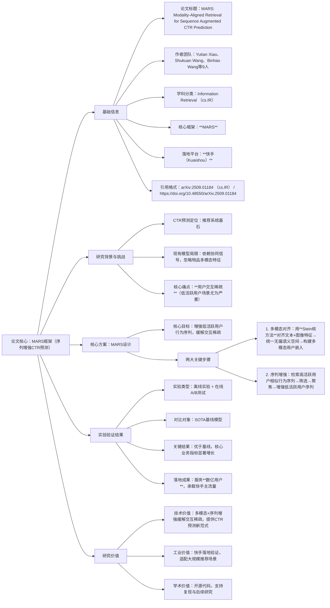

### 1. 一段话总结
论文《MARS: Modality-Aligned Retrieval for Sequence Augmented CTR Prediction》针对**CTR预测**（推荐系统核心任务）中“用户交互稀疏（尤其低活跃用户场景）”的核心痛点，提出**MARS框架**——通过**Stein核方法**将物品的文本与图像特征对齐到统一无偏语义空间，构建多模态用户嵌入；再基于该嵌入检索、筛选、聚焦高活跃用户的最相似行为序列，实现低活跃用户行为序列的增强。经大量**离线实验**与**快手平台在线A/B测试**验证，MARS持续优于**SOTA基线**，并在核心业务指标上实现显著增长，已成功部署并服务**数亿用户**，代码提供匿名访问以保障可复现性。

---

### 2. 思维导图

---

### 3. 详细总结
#### 一、基础信息表
| 维度                | 具体内容                                                                 |
|---------------------|--------------------------------------------------------------------------|
| 论文标题            | MARS: Modality-Aligned Retrieval for Sequence Augmented CTR Prediction   |
| 作者团队            | Yutian Xiao、Shukuan Wang、Binhao Wang、Zhao Zhang、Yanze Zhang、Shanqi Liu、Chao Feng、Xiang Li、Fuzhen Zhuang |
| 学科分类            | **Information Retrieval (cs.IR)**（信息检索领域，聚焦推荐系统CTR预测）    |
| 核心框架            | **MARS**（Modality-Aligned Retrieval for Sequence Augmented CTR Prediction） |
| 目标任务            | **CTR预测**（Click-through Rate Prediction，推荐系统核心任务）           |
| 落地平台            | **快手（Kuaishou）**                                                     |
| 服务规模            | **数亿用户**（承载快手主流量）                                           |
| 代码资源            | 提供匿名访问URL，保障实验可复现性                                       |
| 引用格式            | arXiv:2509.01184 [cs.IR] 或 https://doi.org/10.48550/arXiv.2509.01184   |

#### 二、研究背景与核心问题
1. **CTR预测的重要性**  
   CTR预测是推荐系统的“基石任务”，其预测精度直接影响推荐列表的点击率与用户体验，进而关联平台流量与营收。

2. **现有CTR模型的局限**  
   当前基于用户行为建模的CTR模型虽表现较好，但存在致命瓶颈：
   - **依赖协同信号**：过度依赖用户-物品交互的协同过滤信号（如用户点击历史的相似性）；
   - **忽略多模态特征**：未充分利用物品的**文本特征**（如标题、描述）与**图像特征**（如封面图），而这些特征能有效补充用户偏好信息。

3. **核心痛点：用户交互稀疏**  
   上述局限导致模型在“**低活跃用户场景**”（如新用户、低频交互用户）中性能骤降——这类用户的交互数据极少（协同信号不足），且现有方法无法通过多模态特征弥补，最终导致CTR预测不准，推荐效果差。

#### 三、核心方案：MARS框架设计
MARS的核心逻辑是“用多模态特征构建精准用户嵌入，再通过检索高活跃用户序列增强低活跃用户数据”，具体分为两大关键步骤：

| 步骤名称         | 核心操作                  | 技术细节                                                                 | 关键目标                                                                 |
|------------------|---------------------------|--------------------------------------------------------------------------|--------------------------------------------------------------------------|
| **步骤1：多模态特征对齐** | 构建多模态用户嵌入        | 1. 输入物品的**文本特征**（如标题）与**图像特征**（如封面图）； 2. 采用**Stein核方法**，将两类特征映射到**统一无偏语义空间**（避免单模态偏差）； 3. 基于对齐后的多模态特征，生成用户的“多模态用户嵌入”（综合反映用户对多模态物品的偏好） | 解决“多模态特征割裂”问题，为后续相似序列检索提供精准的用户偏好表示       |
| **步骤2：行为序列增强**   | 增强低活跃用户序列        | 1. 以“低活跃用户的多模态嵌入”为查询，检索**高活跃用户**的行为序列； 2. 筛选出与低活跃用户偏好最相似的序列； 3. 聚焦序列中的核心交互（过滤噪声），将其补充到低活跃用户的行为序列中，完成数据增强 | 缓解“交互稀疏”问题，为低活跃用户的CTR预测提供足够的行为数据支撑         |

#### 四、实验验证与落地成果
论文通过“离线实验+在线A/B测试”双重验证，并在快手平台实现工业落地，结果如下：

| 验证类型         | 具体内容                  | 关键结果                                                                 |
|------------------|---------------------------|--------------------------------------------------------------------------|
| **离线实验**     | 对比MARS与CTR预测领域的SOTA基线模型，评估CTR预测精度（如AUC、LogLoss等指标） | MARS在所有指标上**持续优于SOTA基线**，证明其缓解交互稀疏的有效性           |
| **在线A/B测试**  | 在快手平台主流量中部署MARS，对比基线模型的核心业务指标（如点击率、留存率） | MARS实现**核心业务指标显著增长**，验证其工业场景适配性                   |
| **工业落地**     | 部署MARS为快手数亿用户提供CTR预测服务，承载平台主流量                     | 成功服务**数亿用户**，运行稳定，无性能瓶颈，证明其大规模场景的可扩展性     |

#### 五、研究价值
1. **技术价值**：首次将“多模态特征对齐”与“行为序列增强”结合用于CTR预测，针对性解决低活跃用户的交互稀疏问题，为CTR预测提供新的技术范式；
2. **工业价值**：在快手平台的落地验证（服务数亿用户、承载主流量），证明其在大规模推荐场景的实用性，可直接复用于电商、内容平台等类似场景；
3. **学术价值**：提供匿名访问的代码，支持后续研究的复现与扩展，推动CTR预测领域对“多模态+数据增强”的深入探索。

---

### 4. 关键问题
#### 问题1：MARS针对“低活跃用户交互稀疏”这一核心痛点，相比传统“基于协同信号的数据增强方法”，核心优势是什么？这种优势如何提升CTR预测精度？
答案：核心优势是**用多模态特征补充协同信号的不足**——传统方法仅依赖用户-物品交互的协同信号，低活跃用户因交互少无足够信号支撑增强；而MARS通过**Stein核对齐物品的文本+图像特征**，构建多模态用户嵌入（不依赖交互数量，仅需少量交互即可捕捉偏好），再基于该嵌入检索高活跃用户的相似序列。  
这种优势提升CTR预测精度的逻辑是：多模态用户嵌入能更精准反映低活跃用户的真实偏好（如用户喜欢“搞笑类短视频”可通过文本标题与图像封面判断），基于此检索的相似序列更贴合用户需求，补充的行为数据质量更高，最终让CTR模型学到更准确的偏好-点击关联，提升预测精度。

#### 问题2：MARS中“Stein核方法”的核心作用是什么？为何选择Stein核而非其他特征对齐技术（如对比学习、PCA）？
答案：Stein核方法的核心作用是**将文本与图像特征对齐到统一无偏语义空间**，确保两类特征在同一维度下具有可比的语义含义，避免单模态特征的偏差（如文本特征过度主导或图像特征被忽略）。  
选择Stein核的原因有两点：
1. **无偏性**：Stein核能自适应调整特征映射权重，避免因文本/图像特征的分布差异导致的对齐偏差，而PCA易受异常值影响，对比学习需大量正负样本且可能引入模态偏好；
2. **语义一致性**：Stein核擅长捕捉特征间的非线性语义关联（如“猫咪图片”与“可爱猫咪”文本的对应），比线性对齐技术（如PCA）更适合文本-图像这类跨模态特征的语义对齐，确保多模态用户嵌入的精准性。

#### 问题3：MARS在快手平台“服务数亿用户、承载主流量”的落地成果，证明了其哪些工业级能力？这些能力对其他大规模推荐平台（如电商、长视频平台）有何借鉴意义？
答案：落地成果证明MARS的三大工业级能力：
1. **大规模可扩展性**：能支撑数亿用户的并发请求，无性能瓶颈，适配高流量场景；
2. **业务兼容性**：可融入快手现有推荐系统，与其他模块（如召回、排序）协同工作，不影响平台原有流程；
3. **效果稳定性**：在线A/B测试中实现核心业务指标增长，且长期运行稳定，无效果波动。

对其他大规模平台的借鉴意义：
- 电商平台：可通过MARS对齐商品的“标题文本+商品图片”特征，增强低活跃用户（如新注册用户）的购物行为序列，提升商品推荐的CTR；
- 长视频平台：可对齐视频的“简介文本+封面图像”特征，增强低频观影用户的行为序列，优化视频推荐的点击率与用户留存，最终实现“用多模态+序列增强解决冷启动与交互稀疏”的通用目标。