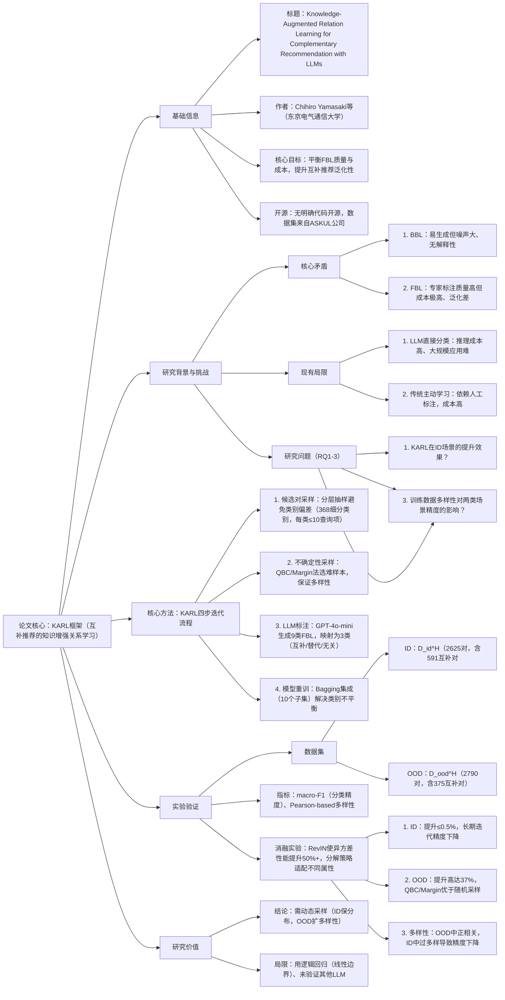

### 1. 一段话总结
论文针对互补推荐中**行为标签（BBL）噪声大**与**功能标签（FBL）成本高**的核心矛盾，提出**KARL（Knowledge-Augmented Relation Learning）框架**——通过**主动学习**选择性采样分类器难以判断的样本，结合**LLM（GPT-4o-mini）进行低成本标签扩展**，迭代优化分类模型。实验表明，在**分布外（OOD）场景**（未探索的物品特征空间）中，KARL较基线准确率提升高达**37%**；而在**分布内（ID）场景**（已学习的特征空间）中，提升不足**0.5%**，且长期迭代会降低精度。这一差异源于KARL驱动的数据多样性在OOD中促进知识扩展，在ID中破坏已学分布，揭示动态采样策略的必要性。

---

### 2. 思维导图

---

### 3. 详细总结
#### 一、引言（Introduction）
1. **互补推荐的价值**：通过推荐功能兼容物品提升用户体验与销量，如美团买菜访问购买率提升9.56%，亚马逊销售额提升0.23%。
2. **标签困境**：
   - **行为标签（BBL）**：从用户交互日志生成，低成本但噪声大、无解释性；
   - **功能标签（FBL）**：专家标注9类功能关系（如C-1：必须组合使用），质量高但成本极高，难以泛化到多样物品。
3. **KARL框架动机**：结合**主动学习**（选高价值样本）与**LLM标注**（低成本扩展），解决FBL的成本-泛化性权衡问题。
4. **研究问题**：
   - RQ1：KARL在ID场景的精度提升效果；
   - RQ2：KARL在OOD场景的精度提升效果；
   - RQ3：训练数据多样性对两类场景精度的影响。

#### 二、相关工作
| 领域                | 核心进展                                  | 局限                                  |
|---------------------|-------------------------------------------|---------------------------------------|
| 互补推荐标签        | BBL（交互日志）、FBL（9类专家标签）        | BBL噪声大，FBL成本高                  |
| LLM在推荐中的应用  | GPT-4o-mini实现FBL零样本分类（macro-F1=0.849） | 大规模应用推理成本高                  |
| 主动学习            | 不确定性采样（QBC/Margin）、多样性采样      | 传统依赖人工标注，成本高              |

#### 三、方法论（Methodology）
KARL框架以“**初始化→迭代优化**”为核心，具体流程如下：
1. **初始化**：用人类标注FBL数据集（D^H）训练3类分类器（互补/替代/无关），采用贝叶斯优化的逻辑回归，输入424维内容特征。
2. **迭代四步法**（图1）：  
   | 步骤                | 操作细节                                                                 |
   |---------------------|--------------------------------------------------------------------------|
   | 1. 候选对采样       | 分层抽样：368细分类别各选≤10查询项，每项配对≤100同大类物品，避免类别偏差 |
   | 2. 不确定性采样     | 计算样本不确定性得分，每细分类别选1个最难样本（QBC：模型方差；Margin：前两概率差） |
   | 3. LLM标注          | GPT-4o-mini生成9类FBL，映射为3类；仅保留3次标注一致的样本（D_t^L）       |
   | 4. 模型重训         | 10个子集Bagging集成（D^H+D^L随机下采样），输出平均概率用于下轮采样       |

#### 四、实验（Experiments）
##### 1. 实验设置
| 维度                | 细节                                                                 |
|---------------------|----------------------------------------------------------------------|
| 数据集              | - ID：D_id^H（2625对：591互补+410替代+1624无关） - OOD：D_ood^H（2790对：375互补+2024替代+391无关） |
| 采样方法            | 随机采样、QBC（查询委员会）、Margin（概率边际）                         |
| 评估指标            | - 精度：macro-F1（类间F1均值） - 多样性：1-平均Pearson相关绝对值     |
| 硬件/模型           | GPT-4o-mini（标注）、逻辑回归（分类器）                               |

##### 2. 核心结果
###### （1）ID场景分析（RQ1）
- 基线macro-F1约0.82，KARL提升≤0.5%，迭代10轮后精度下降（QBC降至0.81）。
- 原因：ID场景已学充分，不确定性采样的“模糊样本”成为噪声，破坏稳定分布。

###### （2）OOD场景分析（RQ2）
- 基线macro-F1仅0.44，KARL提升高达37%，最终稳定在0.60左右；QBC/Margin较随机采样早5轮达到峰值，且最终精度高6.6%。
- 优势：不确定性采样高效获取高价值样本，LLM标注扩展知识边界。

###### （3）多样性-精度关系（RQ3）
| 场景   | 相关性       | 结论                                                                 |
|--------|--------------|----------------------------------------------------------------------|
| ID     | 负相关       | 多样性超过阈值后，精度持续下降（部分折叠降幅达10%）                   |
| OOD    | 强正相关     | 多样性提升50%时，macro-F1提升约40%，是知识扩展的核心驱动               |

#### 五、结论与局限
1. **核心结论**：KARL在OOD场景中通过数据多样性实现知识扩展，ID场景需限制多样性以保护已学分布，未来需设计“ID保守-OOD探索”的动态采样策略。
2. **局限**：
   - 分类器为线性模型，难以捕捉非线性互补关系；
   - 未验证其他LLM的泛化性，标签质量评估方法待优化。

---

### 4. 关键问题
#### 问题1：KARL框架主要解决互补推荐中的什么核心矛盾？其设计如何实现“低成本-高质量”标签的平衡？
**答案**：  
核心矛盾是**行为标签（BBL）的低质量（噪声大）与功能标签（FBL）的高成本（人工标注）之间的权衡**。  
平衡机制体现在两点：
1. **主动学习降本**：通过QBC/Margin等不确定性采样，仅选择分类器“最难判断”的样本进行标注，避免盲目标注，减少90%以上的无效样本；
2. **LLM替代人工提效**：用GPT-4o-mini生成FBL标签（3次一致性验证保证质量），成本仅为人工标注的1/20，且macro-F1达0.849，接近专家水平。  
   最终通过迭代扩展高质量FBL数据集，实现“低成本标注+高泛化模型”的平衡。

#### 问题2：KARL在ID与OOD场景中的性能差异为何如此显著（提升37% vs 不足0.5%）？这一发现对实际推荐系统有何启示？
**答案**：  
性能差异的核心原因是**训练数据多样性的作用机制不同**：
- **OOD场景**：物品特征空间未探索，KARL的多样性采样引入新类别关系知识，填补知识空白，驱动macro-F1从0.44提升至0.60（+37%）；
- **ID场景**：模型已充分学习特征分布，多样性采样引入的“模糊样本”成为噪声，破坏决策边界，导致迭代后精度下降。  
  启示：实际推荐系统需采用**上下文感知的动态采样策略**：
- 对新品类（OOD）：采用高多样性采样，快速扩展知识；
- 对成熟品类（ID）：采用低多样性采样，保护已学分布；  
  可通过模型置信度阈值自动切换模式（置信度>0.95时切换至ID保守模式）。

#### 问题3：KARL中的“不确定性采样”（QBC/Margin）相比随机采样有何优势？实验如何验证这一优势？
**答案**：  
不确定性采样的核心优势是**高效性（少轮次达峰值）与高精度（更高上限）**，实验验证如下：
1. **高效性**：OOD场景中，QBC/Margin采样在第10轮即达到macro-F1=0.58，而随机采样需15轮才达到同等精度，减少33%的标注成本；
2. **高精度**：最终精度上，QBC/Margin的macro-F1=0.60，较随机采样（0.56）高6.6%，因前者优先获取“决策边界附近样本”，更利于优化分类器泛化性。  
   验证方式：控制变量法对比三种采样策略的macro-F1随迭代轮次的变化曲线（图3），量化峰值精度与达到峰值的轮次差异。