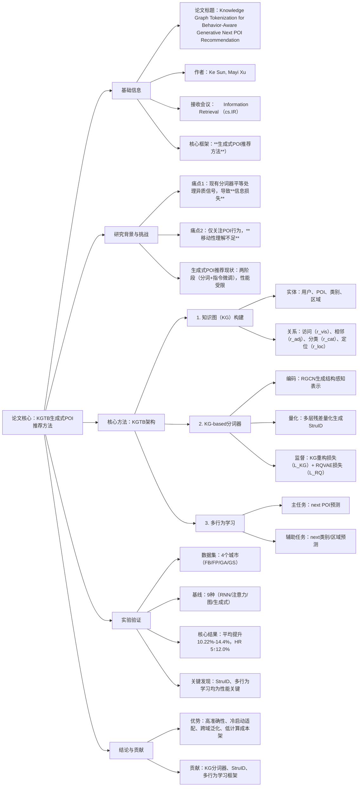

### 1. 一段话总结
本文针对生成式POI推荐中**信息损失**和**移动性理解不足**两大问题，提出**KGTB（Knowledge Graph Tokenization for Behavior-aware generative next POI Recommendation）** 方法：通过构建知识图（KG）整合POI的协同、地理、类别等异质信号，设计**KG-based分词器**生成含结构信息的**StruID**（结构ID），并引入**多行为学习**（POI/类别/区域预测任务）增强LLM对用户移动性的理解。在4个真实城市数据集（FB/FP/GA/GS）上的实验表明，KGTB较最佳基线平均提升**10.22%-14.4%**，HR@5相对增益达**12.0%**，且在冷启动、跨域泛化场景表现优异，同时参数规模仅**80.2M**（远低于基线GNPR-SID的1072M），训练时间缩短至**5.5h**，验证了其准确性与效率。

---

### 2. 思维导图

---

### 3. 详细总结
#### 1. 引言：研究背景与问题
生成式POI推荐依托LLM的序列生成能力，采用“分词器+指令微调”两阶段框架，但存在两大核心局限：
- **信息损失**：现有分词器（如SID）将POI的异质信号（协同、地理、类别）压缩为统一表示，导致关键信息丢失；
- **移动性理解不足**：仅关注POI访问行为，忽略类别、区域等辅助行为对用户决策的影响。

为此，本文提出**KGTB**，通过KG整合异质信息、StruID保留结构特征、多行为学习深化移动性理解，解决上述问题。

#### 2. 相关工作
| 类别                | 核心思路                                  | 局限                                  |
|---------------------|-------------------------------------------|---------------------------------------|
| 传统POI推荐         | 匹配范式（RNN/注意力/图网络）建模序列模式  | 可扩展性差，依赖人工特征工程            |
| 生成式POI推荐       | 分词器生成ID，LLM指令微调预测下一个POI     | 信息损失严重，移动性理解片面            |

#### 3. 方法论：KGTB详细设计
KGTB包含**KG构建**、**KG-based分词器**、**多行为学习**三大模块，整体架构如图2所示。

##### 3.1 知识图（KG）构建
将推荐数据组织为KG（$`(G=\{(h,r,t)\})`$），无缝保留异质信号：
- **实体集**：用户（U）、POI（V）、类别（C）、区域（O）；
- **关系集**：
    1. $`(r_{vis})`$：用户-POI访问关系（协同信号）；
    2. $`(r_{adj})`$：POI-POI相邻关系（地理信号，距离＜0.2km）；
    3. $`(r_{cat})`$：POI-类别分类关系（类别信号）；
    4. $`(r_{loc})`$：POI-区域定位关系（地理信号）。

##### 3.2 KG-based分词器：生成StruID
核心目标：将KG节点量化为含结构信息的**StruID**，避免信息损失，包含三步：
1. **KG编码**：用**RGCN**（关系图卷积网络）生成结构感知表示：  
   $`[h_i^{(l)}=\sigma\left(W_0^{(l)}h_i^{(l-1)}+\sum_{r\in R}\sum_{j\in N_r(i)}\frac{1}{|N_r(i)|}W_r^{(l)}h_j^{(l-1)}\right)]`$  
   输出$`(h_i=Encoder(G,i))`$，整合节点局部结构信息。

2. **多层残差量化**：采用RQVAE结构，为不同实体类型（用户/POI/类别/区域）设计独立层级码本，生成StruID：
    - 初始化残差$`(z_1=h_i)`$，每层检索最近码本向量，更新残差$`(z_l=z_{l-1}-b_{l-1,n_{l-1}^e}^e)`$；
    - 最终量化索引序列$`(n_i=[n_1^e,...,n_L^e])`$即为StruID，相似前缀对应KG中相关实体。

3. **监督训练**：联合两大损失：
    - **KG重构损失（L_KG）**：通过量化表示重建KG链接，确保StruID学习结构信息：  
      $`[\mathcal{L}_{KG}=y log(f(i,r,j))+(1-y)log(1-f(i,r,j))]`$
    - **RQVAE损失（L_RQ）**：鼓励残差聚类于码本向量，平衡量化精度：  
      $`[\mathcal{L}_{RQ}=\sum_{l=1}^L\left\|sg[z_l]-b_{l,n_l^e}^e\right\|^2+\beta\left\|sg[b_{l,n_l^e}^e]-z_l\right\|^2]`$W

##### 3.3 多行为学习：深化移动性理解
设计3个行为预测任务，指令微调LLM（GPT-2/Llama3-8B）：
- **主任务**：next POI预测，输入用户偏好（Top-5常访POI）+ 历史轨迹，输出下一个POI的StruID；
- **辅助任务**：next类别/区域预测，分别基于历史类别/区域序列生成目标StruID，从多维度捕捉用户移动规律。

#### 4. 实验验证
##### 4.1 实验设置
- **数据集**：4个城市级LBSN数据集，统计如下：  
  | 数据集       | 用户数 | POI数  | 记录数   | 类别数 |
  |--------------|--------|--------|----------|--------|
  | Foursquare-Boston (FB) | 398    | -      | -        | -      |
  | Foursquare-Paris (FP)  | 409    | -      | -        | -      |
  | Gowalla-Austin (GA)    | 369    | -      | -        | 285    |
  | Gowalla-SF (GS)        | 6105   | 10631  | 144505   | -      |
- **基线**：9种方法（RNN-based：STLSTM；注意力：SASRec；图：GETNext等；生成式：P5、GNPR-SID等）；
- **指标**：HR@K、NDCG@K（K=1,5,10）；
- **参数**：RGCN/量化层数=3，码本维度=64，LoRA秩=16，学习率=0.0002。

##### 4.2 核心结果
KGTB在所有数据集上显著优于基线，关键结果如下（以FB为例）：  
| 指标    | 最佳基线（GNPR-SID） | KGTB  | 相对提升 |
|---------|---------------------|-------|----------|
| HR@1    | 0.1577              | 0.1675| 6.2%     |
| HR@5    | 0.2827              | 0.3190| 12.0%    |
| N@5     | 0.2231              | 0.2468| 10.6%    |

**跨数据集平均提升**：FB（10.22%）、FP（9.12%）、GA（12.58%）、GS（14.4%）。

##### 4.3 深入分析
1. **Ablation研究**（N@5结果，表3）：  
   所有组件移除均导致性能下降，其中“w/o Seq”（移除历史轨迹）降幅最大（FB：0.2468→0.2088），“w/o StruID”（替换为RID）验证StruID的核心价值。

2. **冷启动与跨域泛化**：
    - 冷启动POI（＜5访客）：KGTB性能显著优于GNPR-SID；
    - 跨域测试：性能下降幅度小于GNPR-SID，验证StruID的泛化能力。

3. **效率对比**（FB数据集）：  
   | 模型       | 训练时间 | 测试时间 | 参数规模 |
   |------------|----------|----------|----------|
   | GNPR-SID   | 39.3h    | 6h       | 1072M    |
   | KGTB       | 5.5h     | 0.4h     | 80.2M    |

#### 5. 结论
KGTB通过KG整合异质信息、StruID保留结构特征、多行为学习深化移动性理解，在生成式POI推荐中实现了**准确性、泛化性、效率**的三重提升，为地理位置推荐提供了新范式。

---

### 4. 关键问题
#### 问题1：KGTB针对生成式POI推荐的核心痛点提出了哪些创新解决方案？这些方案如何解决痛点？
**答案**：  
核心痛点为**信息损失**和**移动性理解不足**，对应解决方案及原理如下：
1. **KG整合异质信息+StruID编码**：
    - 痛点解决：现有分词器压缩异质信号，KGTB先构建KG将协同、地理、类别信号转化为“实体-关系”结构，再通过RGCN生成结构感知表示，经多层残差量化生成StruID，确保异质信息嵌入ID中；
    - 关键机制：KG重构损失（L_KG）监督StruID学习结构关联，可视化显示StruID按区域/类别聚类（优于SID）。

2. **多行为学习**：
    - 痛点解决：仅关注POI行为导致移动性理解片面，KGTB新增next类别/区域预测任务；
    - 关键机制：用户决策遵循“类别意图→区域选择→POI访问”逻辑，辅助任务帮助LLM从多维度捕捉偏好，实验显示KGTB在类别/区域预测上均优于GNPR-SID。

#### 问题2：KG-based分词器是KGTB的核心模块，其工作流程包含哪几个关键步骤？与传统分词器（如SID）相比有何优势？
**答案**：
##### （1）关键工作流程
1. **KG编码**：用RGCN对KG节点进行关系感知信息传播，生成融合局部结构的节点表示$`(h_i)`$；
2. **多层残差量化**：为不同实体类型设计独立码本，通过残差迭代检索生成StruID（量化索引序列）；
3. **双损失训练**：联合L_KG（重建KG链接）和L_RQ（优化量化精度）训练分词器。

##### （2）与传统SID的优势
| 对比维度         | 传统SID                | KGTB的StruID            |
|------------------|------------------------|-------------------------|
| 异质信息保留     | 压缩为统一向量，损失严重 | 嵌入KG结构信息，无损失  |
| 语义关联性       | 相似性依赖特征聚合      | 相似前缀对应KG相关实体  |
| 监督信号         | 仅依赖向量重构          | 新增KG结构监督（L_KG）  |
| 冷启动适配       | 无结构信息，泛化差      | 可通过KG关系推断新POI  |

#### 问题3：实验从哪些维度验证了KGTB的有效性？请结合关键数据说明其性能与效率优势。
**答案**：  
实验从**核心性能、组件有效性、场景适配性、计算效率**四大维度验证有效性：
1. **核心性能优势**：
    - 跨4个数据集平均提升10.22%-14.4%，GA数据集N@5达0.1693（较GNPR-SID提升14.7%）；
    - 大模型适配：Llama3-8B版KGTB较最佳基线平均提升25.73%，证明扩展性。

2. **组件有效性（Ablation）**：
    - 移除StruID后FB的N@5从0.2468降至0.2396，移除双辅助任务降至0.2411，验证各组件必要性。

3. **场景适配性**：
    - 冷启动POI：KGTB的N@5是GNPR-SID的2-4倍；
    - 跨域泛化：FB训练→GS测试时，KGTB的N@5（0.1044）远高于GNPR-SID（0.0559）。

4. **计算效率**：
    - 参数规模：80.2M（仅为GNPR-SID的7.5%）；
    - 训练时间：5.5h（仅为GNPR-SID的14%），适配低资源场景。