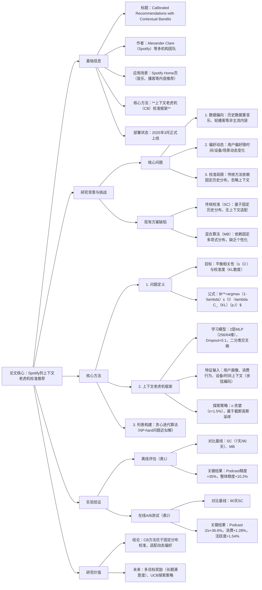

### 1. 一段话总结
论文针对**Spotify**平台中历史数据严重偏向音乐、难以实现内容类型平衡且用户偏好随上下文动态变化的核心问题，提出**基于上下文老虎机（Contextual Bandits, CB）的校准推荐方法**。该方法将内容类型校准问题转化为老虎机学习任务，通过**MLP神经网络**学习用户上下文（时间、设备等）与最优内容类型分布的关联，采用**ε-贪婪探索策略**（探索率1.5%）平衡探索与利用，动态生成符合用户实时偏好的推荐列表。实验表明，离线场景下该方法较7天历史校准（SC）的**Podcast精度提升35%**，较90天SC的整体精度提升7.2%；在线A/B测试中**Podcast曝光-播放转化率（i2s）提升36.6%**，整体活跃度提升1.54%。该系统已于**2025年3月在Spotify正式部署**，有效提升了非主流内容（如播客）的消费与用户参与度。

---

### 2. 思维导图

---

### 3. 详细总结
#### 一、引言（Introduction）
1. **背景与价值**  
   Spotify等流媒体平台需平衡多内容类型（音乐、播客、有声书）推荐，以提升用户长期满意度、减少兴趣窄化、缓解流行度偏见。传统校准方法可优化内容分布，但存在显著局限。

2. **核心问题**
   - 数据偏差：历史交互数据严重偏向音乐，播客等内容曝光不足；
   - 偏好静态假设：传统方法（如Steck校准）基于固定历史分布，忽略用户偏好随**时间（时段/周内）、设备、场景**的动态变化（图1显示播客消费在不同时段/周内波动显著）。

3. **本文贡献**  
   提出**上下文老虎机校准方法**，动态学习用户上下文与最优内容类型分布的关联，平衡相关性与校准度。

#### 二、内容类型校准（Content Type Calibration）
##### 2.1 问题设置
- **目标**：为用户生成长度为N的内容货架列表，平衡**相关性（s(I)）** 与**校准度（KL散度）**，公式如下：  
  $`I^*=\underset{I:|I|=N}{arg max }(1-\lambda) \cdot s(I)-\lambda \cdot C_{KL}(p, I)`$  
  其中，$`\lambda`$控制权衡系数，$`C_{KL}(p,q)`$衡量推荐分布$q$与目标分布$p$的差异。
- **传统目标分布缺陷**：
   - 基于历史（SC）：$`p(c|u)`$由用户过去7/90天交互计算，忽略动态偏好；
   - 基于业务（MB）：固定多分类分布，缺乏个性化。

##### 2.2 上下文老虎机（CB）方法
将校准问题转化为老虎机学习任务，核心流程为“观察上下文→选择动作→获取奖励→更新策略”：

| 模块                | 技术细节                                                                 |
|---------------------|--------------------------------------------------------------------------|
| **学习模型**        | 2层MLP（隐藏层256/64维），ReLU激活，Dropout=0.1，二分类交叉熵损失；输入含用户画像、消费行为、设备/时间上下文（时间用余弦编码）。 |
| **探索策略**        | ε-贪婪（ε=1.5%）：98.5%选择当前最优分布，1.5%基于截断高斯采样探索（围绕历史分布，避免过度偏离偏好）。 |
| **列表构建**        | 贪心迭代算法：从空集开始，每次添加最大化目标函数的货架，近似求解NP-hard问题（兼顾效率与效果）。 |

#### 三、评估（Evaluation）
##### 3.1 离线评估
- **数据与方法**：7天用户交互数据，采用逆倾向加权（IPW）进行离线策略评估，指标为**Precision@1**（首屏货架准确率）。
- **对比基线**：
   1. SC-7d：基于过去7天历史的Steck校准；
   2. SC-90d：基于过去90天历史的Steck校准；
   3. MB：基于固定多分类分布的混合算法。
- **结果（表1）**：
  | 对比组合               | Podcast精度提升 | 整体精度（音乐+播客）提升 |
  |------------------------|----------------|--------------------------|
  | CB vs SC-7d            | +35%           | +10.2%                   |
  | CB vs SC-90d           | +25.6%         | +7.2%                    |
  | CB vs MB               | +16.6%         | +2.8%                    |

##### 3.2 在线A/B测试
- **设置**：对照组为SC-90d（离线最优基线），评估Spotify全量用户核心指标。
- **结果（表2）**：
  | 指标                | 提升幅度 |
  |---------------------|----------|
  | Podcast曝光-播放率（i2s） | +36.6%   |
  | 整体曝光-播放率（i2s）   | +3.93%   |
  | 总消费时长             | +1.28%   |
  | 用户活跃度             | +1.54%   |

#### 四、结论与未来工作
1. **核心结论**：上下文老虎机方法通过动态适配用户上下文偏好，显著优于基于固定历史/业务分布的校准方法，有效提升非主流内容消费与用户参与度。
2. **未来方向**：
   - 优化奖励信号：融合长期用户满意度与商业价值；
   - 探索策略升级：采用UCB替代ε-贪婪，提升探索效率；
   - 引入序列信号：结合用户行为序列优化意图预测。

---

### 4. 关键问题
#### 问题1：本文提出的CB校准方法与传统校准方法（如Steck的SC）的核心区别是什么？为何能更好适配Spotify的推荐场景？
**答案**：  
核心区别在于**目标分布的动态性与上下文感知能力**：
- 传统SC方法：目标分布$`p(c|u)`$基于固定时间窗口（7/90天）的历史交互计算，假设用户偏好不变，无法响应时段（如通勤时偏好播客）、设备（手机vs音箱）等上下文变化；
- CB方法：通过MLP模型学习上下文$x$与最优分布$p$的映射，目标分布随实时上下文动态更新，无需依赖固定历史窗口。

适配性原因：Spotify用户偏好具有强动态性（图1显示播客消费在工作日早高峰/周末午后显著升高），CB的上下文感知能力可实时捕捉这类变化，而SC的静态分布会导致推荐与实时需求脱节。

#### 问题2：CB方法中的“探索策略”如何设计？为何选择“截断高斯采样”而非均匀采样？
**答案**：
1. **探索策略设计**：采用**ε-贪婪策略**（ε=1.5%），即98.5%时间选择当前模型预测的最优分布（利用），1.5%时间通过**截断高斯采样**选择探索分布（探索）；其中，高斯分布以用户历史偏好分布为中心，确保探索范围围绕用户兴趣，避免过度偏离。

2. **选择截断高斯的原因**：
   - 均匀采样缺陷：探索分布可能严重偏离用户偏好，导致生成的推荐列表相关性极低，用户无交互（奖励为0），无法为模型提供有效学习信号；
   - 截断高斯优势：在用户兴趣附近探索，既能发现新的偏好模式（如用户在周末可能喜欢特定类型播客），又能保证一定的交互率（奖励为1的样本更多），提升模型学习效率。

#### 问题3：实验如何验证CB方法的有效性？关键证据有哪些？
**答案**：  
通过离线评估与在线A/B测试双重验证，关键证据如下：
1. **离线有效性**：
   - 针对非主流内容（播客）：CB较最优历史校准（SC-7d）精度提升35%，解决了传统方法播客曝光不足的问题；
   - 整体性能：较SC-90d整体精度提升7.2%，证明动态校准未牺牲主流内容（音乐）的相关性。

2. **在线有效性**：
   - 核心业务指标：Podcast曝光-播放率（i2s）提升36.6%，直接反映非主流量内容的消费转化提升；
   - 用户 engagement：整体活跃度提升1.54%、总消费时长提升1.28%，验证方法对用户长期参与的正向影响。

3. **部署验证**：该系统已于2025年3月在Spotify正式上线，进一步证明其工业界实用性与稳定性。