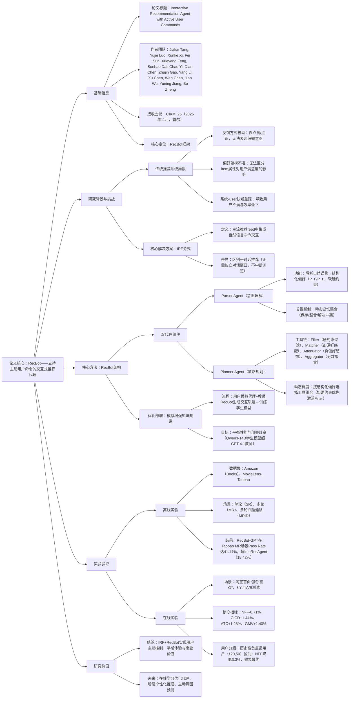

### 1. 一段话总结
针对传统推荐系统依赖**被动反馈机制**（如点赞/点踩）无法捕捉用户细微意图、导致偏好建模不准确的核心问题，研究提出**Interactive Recommendation Feed (IRF)范式**，允许用户通过自然语言命令主动控制推荐策略；同时开发**RecBot双代理架构**，其中**Parser Agent**将自然语言命令解析为结构化偏好（区分正负意图与软硬约束），**Planner Agent**通过动态调度工具链（Filter/Matcher/Attenuator/Aggregator）实现实时推荐策略调整，并采用**模拟增强知识蒸馏**解决大规模部署效率问题。离线实验（Amazon、MovieLens、Taobao数据集）显示RecBot在多交互场景下Pass Rate超基线2-3倍，在线三个月A/B测试（淘宝首页）验证其显著提升用户体验（**NFF降低0.71%**、**CICD提升1.44%**）与商业价值（**ATC提升1.28%**、**GMV提升1.40%**）。

---

### 2. 思维导图

---

### 3. 详细总结
#### 一、引言：传统推荐系统的核心痛点
传统推荐系统依赖**被动反馈机制**（如点击、点赞、点踩），存在三大局限：
1. **用户表达约束**：无法传递细微意图（如“颜色好但不要图案”），关键属性偏好丢失；
2. **算法解析模糊**：将所有item属性视为同等重要，导致偏好建模偏差与过滤气泡；
3. **系统-user认知死锁**：用户对无关推荐不满→反馈更模糊→系统进一步误判，形成恶性循环。

为解决此问题，研究提出两大创新：①**Interactive Recommendation Feed (IRF)产品范式**：在主流推荐feed（如淘宝首页、YouTube）中集成自然语言命令交互，不中断浏览流程；②**RecBot多代理框架**：实现从用户命令到推荐策略的端到端转化。

#### 二、问题定义：IRF的交互流程建模
将推荐过程定义为时序决策问题，核心元素与流程如下：
| 核心元素 | 定义 |
|----------|------|
| 候选集 | $`(I=\{i_1,i_2,...,i_n\})`$，待推荐item集合 |
| 用户反馈 | $`(c_t)`$：t轮的自然语言命令（如“不要 floral 连衣裙”） |
| 用户模型 | ①显式偏好$`(P_t=\phi(c_1,...,c_t))`$（结构化意图）；②隐式偏好$`(H_t)`$（历史交互序列） |
| 系统状态 | $`(S_t=\{R_t,c_t,P_t,H_t})`$，$`(R_t)`$为t轮推荐feed |
| 交互目标 | 生成$`(R_{t+1}=\pi(S_t))`$，直至用户满意（$`(satisfy(u,R_{t+1})=1)`$）或达最大轮次$`(T_{max})`$ |

#### 三、核心方法：RecBot双代理架构与优化
##### 3.1 整体架构
RecBot包含**Parser Agent**（意图理解）、**Planner Agent**（策略执行）两大核心，流程为：用户命令→Parser解析→结构化偏好→Planner调度工具链→生成下一轮feed。

##### 3.2 Parser Agent：意图解析与记忆管理
1. **结构化偏好解析**  
   将自然语言命令转化为二元结构化偏好：  
   $`(P_{t+1}=\{P_{t+1}^+（正意图）, P_{t+1}^-（负意图）\})`$，每类意图进一步区分：
   - **硬约束（$`(C^{hard})`$）**：可确定性验证（如“价格低于200元”）；
   - **软偏好（$`(C^{soft})`$）**：需语义理解（如“偏爱浅蓝色”）。

2. **动态记忆整合**  
   解决多轮交互的偏好一致性问题，采用三大原则：
   - 保存原则：用户满意/中性反馈时，$`(P_{t+1}=P_t)`$；
   - 整合原则：新偏好与历史兼容时，$`(P_{t+1}^+=P_t^+ \oplus Extract^+(c_t))`$；
   - 解决原则：存在冲突时，基于语言线索（如“不再想要”）更新偏好。

##### 3.3 Planner Agent：工具链调度与策略适配
1. **核心工具集**（模块化设计，支持扩展）  
   | 工具名称 | 功能 | 公式/逻辑 |
   |----------|------|-----------|
   | Filter | 执行硬约束，筛选候选集 | $`(I'=\{i \in I: C^+(i,C^{+,hard})=1 \land C^-(i,C^{-,hard})=0\})`$ |
   | Matcher | 计算正偏好匹配分数（语义+协同） | $`(s_{match}=\alpha \cdot s_{sem} + (1-\alpha) \cdot s_{aia})`$ |
   | Attenuator | 计算负偏好惩罚分数 | $`(s_{atten}=-\beta \cdot sim(e_{item}(i),e_{intent}(P^-)))`$ |
   | Aggregator | 整合分数生成最终排序 | $`(s_{final}=s_{match}+s_{atten})`$ |

2. **自适应工具链调度**  
   根据$`(P_{t+1})`$动态选择工具组合：
   - 含硬约束→优先激活Filter；
   - 含正软偏好→激活Matcher；
   - 含负软偏好→激活Attenuator；
   - 多维度需求→全工具链（Filter→Matcher/Attenuator→Aggregator）。

##### 3.4 部署优化：模拟增强知识蒸馏
为解决闭源LLM（如GPT-4.1）部署成本高的问题，设计两阶段优化：
1. **轨迹生成**：用户模拟代理（GPT-4.1驱动）与教师RecBot交互，生成多轮交互轨迹（含命令、结构化偏好、工具链）；
2. **学生模型训练**：用轨迹数据微调开源模型（Qwen3-14B），优化目标为**Next-Token Prediction（NTP）**，最终学生模型性能超教师（如MovieLens MRID场景Recall@10达0.3940，超GPT-4.1的0.3158）。

#### 四、实验验证：离线与在线效果
##### 4.1 实验设置
- **数据集**：3个真实数据集，覆盖电商、影视场景  
  | 数据集 | 交互规模 | 硬约束类型 | 软偏好类型 |
  |--------|----------|------------|------------|
  | Amazon（Books） | 1K用户，20-core过滤 | 价格、语言 | 图书类别 |
  | MovieLens | 评分>3视为正交互 | 上映日期 | 电影类型 |
  | Taobao | 3K用户，首页“猜你喜欢” | 价格、材质 | 商品类别+图片 |
- **基线方法**：传统序列推荐（SASRec、BERT4Rec）、命令感知方法（BM25、BGE）、交互代理（GOMMIR、InteRecAgent）；
- **评估指标**：离线（Recall@K、NDCG@K、CSR@K、Pass Rate、AR）；在线（NFF、CICD、ATC、GMV）。

##### 4.2 离线实验结果
- **单轮场景（SR）**：RecBot-GPT在Taobao数据集Recall@50达0.6980，超BGE（0.3947）77%；
- **多轮场景（MR）**：RecBot-GPT在Taobao的Pass Rate达41.14%，超InteRecAgent（18.42%）122%，且平均交互轮次（4.28）更少；
- **兴趣漂移场景（MRID）**：RecBot-Qwen（Align.）在MovieLens的Pass Rate达33.51%，超教师模型GPT-4.1（26.02%）29%。

##### 4.3 在线实验结果（淘宝3个月A/B测试）
| 指标类型 | 指标名称 | 变化幅度 | 说明 |
|----------|----------|----------|------|
| 用户体验 | 负反馈频率（NFF） | -0.71% | 用户不满减少，意图理解更准 |
| 用户体验 | 点击类别多样性（CICD） | +1.44% | 缓解过滤气泡，内容更丰富 |
| 商业价值 | 加购率（ATC） | +1.28% | 转化意图增强 |
| 商业价值 | 商品交易总额（GMV） | +1.40% | 商业收益显著提升 |

- **用户分组分析**：历史负反馈频率[20,50)区间用户NFF降低3.3%，效果最优；极端高负反馈（[100,200)）用户NFF提升1.6%（因长期不满难以短期改善）；
- **命令满足率**：人工评估达88.9%，LLM-Judge评估达87.5%，一致性96.5%，验证命令解析准确性。

##### 4.4 消融实验
验证RecBot核心组件的必要性（Amazon数据集）：
- 仅语义匹配（V1）：CSR@20仅85.0%，比Full模型（96.2%）低11.7%；
- 仅协同匹配（V2）：Pass Rate仅5.66%，比Full模型（20.0%）低71.7%；
- 缺失Attenuator（无负偏好）：NFF比Full模型高2.1个百分点；
- Full模型（含所有组件）：在SR/MR/MRID场景均最优，验证工具链与记忆整合的价值。

#### 五、相关工作与结论
##### 5.1 与现有方法的区别
- **交互式推荐**：传统方法（如GOMMIR）依赖浅交互，RecBot支持自然语言命令与多轮动态偏好；
- **可控推荐**：现有方法（如UCRS）需预定义控制维度，RecBot支持自由文本命令，更灵活；
- **对话推荐（CRS）**：CRS聚焦目标导向搜索（需独立对话窗口），IRF聚焦探索式浏览（集成于feed，不中断流程）。

##### 5.2 结论与未来方向
- **结论**：IRF范式与RecBot框架通过主动用户命令解决传统系统的认知差距，实现用户体验与商业价值双赢；
- **未来方向**：①在线学习优化代理（实时适应用户偏好变化）；②增强个性化推理（预判用户潜在需求）；③扩展解释性（告知推荐原因）。

---

### 4. 关键问题
#### 问题1：IRF（交互式推荐Feed）范式与传统推荐系统、对话推荐系统（CRS）的核心区别是什么？
**答案**：三者的核心区别体现在**交互方式**与**适用场景**，具体如下：
1. 与传统推荐系统：传统系统依赖被动反馈（点击/点赞），用户无法表达细微意图；IRF允许自然语言主动命令（如“不要 floral 连衣裙，预算200元”），实现用户对推荐策略的直接控制；
2. 与对话推荐系统（CRS）：①适用场景：CRS聚焦目标导向搜索（如“找适合送礼的红酒”），用户意图明确；IRF聚焦探索式浏览（如淘宝首页刷商品），用户意图随交互演化；②偏好获取：CRS通过结构化提问（如“偏好什么价位？”）获取偏好；IRF通过用户对当前feed的自然语言反馈（如“这个颜色好，但太长了”）获取，更贴合真实浏览习惯，不中断流程。

#### 问题2：RecBot双代理（Parser与Planner）的协作机制是什么？如何确保两者对用户意图的理解一致？
**答案**：RecBot双代理的协作机制与一致性保障如下：
1. **协作流程**：①Parser接收“当前feed+用户命令+历史偏好”，输出结构化偏好（含正负意图、软硬约束）；②Planner基于结构化偏好调度工具链（如硬约束激活Filter，正偏好激活Matcher），计算item分数并生成下一轮feed；
2. **一致性保障**：通过**双对齐损失**实现协作训练：①**嵌入对齐损失（EAL）**：将Parser的低维嵌入（维度4）映射至Planner维度（32），最小化两者差异，确保特征重要性认知一致；②**预测对齐损失（PAL）**：最小化Parser与Planner的预测分数差异，确保Parser学习Planner的决策模式；
3. **记忆整合**：Parser的动态记忆机制（保存/整合/冲突解决）确保多轮交互中偏好不漂移，为Planner提供稳定的意图输入，进一步强化协作一致性。

#### 问题3：RecBot在线部署（淘宝首页）的关键效果如何？不同用户群体的效果差异反映了什么？
**答案**：RecBot在线部署的关键效果与用户群体差异如下：
1. **核心效果**：①用户体验：NFF（负反馈频率）降低0.71%（用户不满减少），CICD（点击类别多样性）提升1.44%（缓解过滤气泡）；②商业价值：ATC（加购率）提升1.28%，GMV（商品交易总额）提升1.40%，实现体验与商业双赢；
2. **用户群体差异**：①历史负反馈频率[20,50)区间用户NFF降低3.3%，效果最优，反映此类用户有明确但未被满足的需求，主动命令能有效传递意图；②极端高负反馈（[100,200)）用户NFF提升1.6%，因长期不满源于产品本身（非推荐算法），短期难以通过推荐改善；
3. **意义**：差异表明RecBot对“有潜在需求但表达受限”的用户群体价值最大，验证主动命令交互的针对性，为后续优化提供方向（如针对极端高负反馈用户设计产品+算法联合方案）。