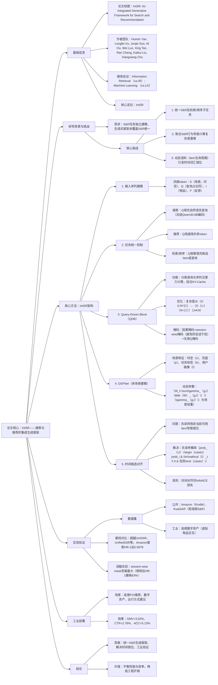

### 1. 一段话总结
为解决现有系统无法统一**搜索与推荐（S&R）任务**、计算复杂度高及动态语料导致**时间词汇错位**的问题，研究提出**IntSR**——一个集成式生成框架，通过**查询占位符（Q）** 统一搜索（显式查询）与推荐（隐式兴趣）及其检索/排序子任务，设计**Query-Driven Block（QDB）** 降低 autoregressive 训练复杂度（从\(O(c'N^2)\)降至\(O(c'J(N+1))\)），并引入**DSFNet**处理多场景偏好，结合**时间候选对齐策略**优化负采样（解决item生命周期导致的错位）。离线实验在Amazon、KuaiSAR数据集上超越UniSAR等基线（如Amazon搜索任务HR@1达0.5678），工业部署于高德地图后，实现数字资产GMV**+3.02%**、POI推荐CTR**+2.76%**、出行方式建议ACC**+5.13%**，验证了框架的有效性与实用性。

---

### 2. 思维导图

---

### 3. 详细总结
#### 一、引言：研究背景与核心挑战
1. **S&R任务的天然关联性**  
   搜索（显式查询驱动）与推荐（隐式兴趣驱动）共享用户/物品数据，但现有系统多独立建模，存在工程开销高、偏好捕捉不全面的问题；生成式框架虽能统一检索/排序，却未覆盖S&R统一。

2. **三大核心挑战**
   - 挑战1：如何在单一框架中统一S&R及下属的检索（retrieval）、排序（ranking）子任务；
   - 挑战2：聚合S&R行为后，autoregressive训练的计算复杂度激增；
   - 挑战3：动态语料（item上线/下线）导致负采样时**时间词汇错位**，引发错误模式学习。

#### 二、核心方法：IntSR框架设计
##### 2.1 输入序列建模（3.1节）
将用户交互序列$`(\mathcal{A}_u)`$编码为四类token，覆盖场景、查询、物品、反馈维度：
| Token类型 | 功能描述 | 示例 |
|-----------|----------|------|
| **S（场景token）** | 捕捉时空上下文 | 地理编码（geohash）、离散时间戳 |
| **Q（查询占位符）** | 标记预测位置，区分任务类型 | 搜索时填用户查询，推荐时填通用token |
| **I（物品token）** | 核心交互物品，融合多模态嵌入 | 商品ID、POI名称 |
| **F（反馈token）** | 编码交互类型，反映兴趣强度 | 点击（click）、购买（purchase） |

##### 2.2 S&R任务统一机制（3.2节）
以**查询占位符（Q）** 为核心，统一四类子任务：
| 任务类型 | Q的填充内容 | 目标概率公式 |
|----------|-------------|--------------|
| 推荐-检索 | 通用共享token | $`(P_{retr}^{rec}=P(i_{n+1}|\mathcal{A}_u,s_{n+1}))`$ |
| 推荐-排序 | 候选item ID | $`(P_{rank}^{rec}=P(a_{n+1}|\mathcal{A}_u,s_{n+1},i_{n+1}))`$ |
| 搜索-检索 | 用户自然语言查询（Qwen30.6B编码） | $`(P_{retr}^{src}=P(i_{n+1}|\mathcal{A}_u,s_{n+1},q_{n+1}))`$ |
| 搜索-排序 | 查询+候选item ID | $`(P_{rank}^{src}=P(a_{n+1}|\mathcal{A}_u,s_{n+1},i_{n+1},q_{n+1}))`$ |

**查询增强策略**：构建5类查询池（原始查询、item信息、描述改写、关键词、模拟用户表达），非搜索交互以概率\(\beta\)填充池内查询，提升泛化性。

##### 2.3 Query-Driven Block（QDB）：降低计算复杂度（3.3节）
1. **核心设计**：分离“原始序列（$`(X_1)`$）”与“查询序列（$`(X_2)`$）”的注意力计算，结合KV-Cache缓存中间结果。
2. **复杂度优化**：
   - 原始HSTU复杂度：$`(O(c'N^2))`$（\(c'\)为每查询候选数，$`(N)`$为序列长度）；
   - QDB优化后：$`(O(c'J(N+1)))`$（\(J\)为查询占位符数量，$`(J≪N\)），如排序任务中$`(J=5)`$、$`(N=30)`$时，复杂度降低80%+。
3. **定制化掩码**：
   - **Session-wise掩码**：避免同会话内item相互干扰（如“浏览→点击→购买”中，购买行为无法观察点击前的同item交互）；
   - **无效Q掩码**：排除非查询用途的Q token（如推荐的通用token）作为注意力key/value，确保表示合理性。

##### 2.4 DSFNet：多场景偏好建模（3.4节）
1. **场景特征融合**：将时空（$`(s_{n+1})`$）、页面上下文（$`(p_{n+1})`$）、任务标签（$`(b_{n+1})`$）、用户画像（$`(f)`$）拼接为场景向量$`(R=concat(s,p,b,f))`$。
2. **动态场景权重**：
   - 场景权重计算：$`(\gamma_{g,l}=2*\sigma(MLP_{g,l}(R)))`$（$`(\sigma)`$为sigmoid，因子2支持特征放大）；
   - 动态参数生成：$`(W_l=\sum_{g=1}^{N_g}\gamma_{g,l}\tilde{W}_{g,l})`$（$`(\tilde{W}_{g,l})`$为场景$`(g)`$的可学习参数），实现场景自适应。

##### 2.5 时间候选对齐：解决词汇错位（3.5节）
1. **问题定义**：传统负采样未考虑item生命周期（如用“未来上线item”作为“过去交互”的负样本），导致模型学习错误模式。
2. **解决方案**：
   - 时间对齐负采样：仅从交互发生时的可用item集$`(\mathcal{I}_{t_a})`$中采样负样本，概率公式为：  
     $`[prob_{i,t}=\begin{cases}prob_i & \text{if } i\in\mathcal{I}_t \\ 0 & \text{otherwise}\end{cases}]`$
   - 时间对齐损失：基于InfoNCE损失，约束正样本与同期可用负样本对比：  
     $`[L=-\frac{1}{|\mathcal{A}|}\sum_{u}\sum_{a\in\mathcal{A}_u}\delta_{u,a}\ log\frac{exp(z_{u,a,i^+})}{\sum_{i\in\mathcal{I}_{t_a}}exp(z_{u,a,i})}]`$  
     （$`(\delta_{u,a})`$为交互学习标记，$`(z_{u,a,i}=sim(o_{u,a},emb_i))`$为相似度分数）。

#### 三、实验验证（4节）
##### 3.1 实验设置
| 数据集 | 类型 | 用户数 | 物品数 | 平均交互数 | 核心任务 |
|--------|------|--------|--------|------------|----------|
| Amazon（Kindle） | 公共 | 68,223 | 61,934 | 28 | S&R统一建模 |
| KuaiSAR | 公共 | 22,700 | 673,415 | 218 | 短视频S&R |
| 高德数字资产 | 工业 | 5200万 | 819 | 12 | 虚拟物品交互（验证时间对齐） |

**基线方法**：涵盖推荐（DIN、SASRec、HSTU）、搜索（HEM、TEM、CoPPS）、S&R统一（UniSAR、UnifiedSSR）三类模型。

##### 3.2 核心实验结果
1. **S&R任务性能（公共数据集）**
   - 搜索任务（Amazon）：IntSR的HR@1达**0.5678**，超UniSAR（0.5343）6.3%；NDCG@10达**0.7305**，超基线11.5%；
   - 推荐任务（KuaiSAR）：IntSR的HR@10达**0.7248**，超UniSAR（0.6792）6.7%，验证统一建模的优势。

2. **时间对齐效果（高德数字资产）**  
   所有负采样策略结合时间对齐后性能均提升，以硬负采样（HNS）为例：
   | 策略 | HR@1 | HR@5 | N@5 |
   |------|------|------|------|
   | HNS（未对齐） | 0.1569 | 0.3880 | 0.2763 |
   | HNS（对齐） | 0.1842 | 0.4305 | 0.3112 |
   | 提升幅度 | +17.4% | +11.0% | +12.6% |

3. **消融实验（Amazon搜索任务）**  
   移除关键模块后性能显著下降，其中**session-wise mask**影响最大：
   | 模型变体 | HR@1 | HR@5 | N@5 |
   |----------|------|------|------|
   | IntSR（全模块） | 0.5678 | 0.8266 | 0.7091 |
   | w/o session mask | 0.2024 | 0.3958 | 0.3030 |
   | w/o 搜索查询 | 0.4023 | 0.6453 | 0.5315 |
   | w/o DSFNet | 0.5560 | 0.8157 | 0.6975 |

#### 四、工业部署效果（5节）
IntSR在高德地图三大场景落地，服务数亿日活用户，核心指标提升如下：
| 部署场景 | 关键指标 | 提升幅度 |
|----------|----------|----------|
| 数字资产推荐（如导航语音包） | GMV（商品交易总额） | +3.02% |
| 首页POI推荐 | CTR（点击率） | +2.76% |
| 出行方式建议（公交/驾车） | ACC（准确率） | +5.13% |

#### 五、结论与贡献
1. **理论贡献**：首次提出生成式框架统一S&R及检索/排序子任务，定义并解决时间词汇错位问题；
2. **技术贡献**：QDB降低计算复杂度，DSFNet适配多场景，时间对齐优化负采样；
3. **应用价值**：工业部署验证有效性，平衡性能与工程效率，为S&R统一提供实践范式。

---

### 4. 关键问题
#### 问题1：IntSR如何通过“查询占位符（Q）”统一搜索与推荐的四类子任务（推荐-检索/排序、搜索-检索/排序）？这种统一方式的核心优势是什么？
**答案**：  
IntSR以“查询占位符（Q）”为核心纽带，通过Q的差异化填充实现子任务统一：
- 推荐-检索：Q填充**通用共享token**（无显式查询），目标是从候选集中预测下一个交互item（$`(P_{retr}^{rec})`$）；
- 推荐-排序：Q填充**候选item ID**，目标是预测用户对该item的反馈（$`(P_{rank}^{rec})`$）；
- 搜索-检索：Q填充**用户自然语言查询**（经冻结Qwen30.6B编码为语义向量），目标是匹配查询相关item（$`(P_{retr}^{src})`$）；
- 搜索-排序：Q填充**查询+候选item ID**，目标是预测查询与item的匹配度（$`(P_{rank}^{src})`$）。

**核心优势**：
1. 避免多模型独立建模的工程开销，用单一框架覆盖S&R全场景；
2. 复用用户交互序列表示，无需为不同任务设计独立特征，提升偏好捕捉的一致性；
3. 通过查询池增强（5类查询），提升对非搜索交互的泛化性（非搜索交互以概率\(\beta\)填充查询池内容）。

#### 问题2：论文提出的“时间词汇错位”问题具体指什么？其产生原因及IntSR的解决思路（含关键公式）是什么？
**答案**：
1. **问题定义**：指负采样时未考虑item的生命周期（上线/下线时间），导致用“交互发生时未上线的item”或“已下线的item”作为负样本，使模型学习到“不存在item与用户的虚假关联”，引发错误模式。

2. **产生原因**：动态语料特性——item并非永久存在（如限时虚拟物品、季节性POI），传统负采样（RNS/PNS/HNS）仅关注“用户未交互”，忽略“item是否同期可用”。

3. **解决思路**：
   - 步骤1：标记每个交互$`(a)`$发生时的可用item集$`(\mathcal{I}_{t_a})`$；
   - 步骤2：改进负采样概率，仅从$`(\mathcal{I}_{t_a})`$中采样负样本，概率公式为：  
     $`[prob_{i,t}=\begin{cases}prob_i & \text{if } i\in\mathcal{I}_t \\ 0 & \text{otherwise}\end{cases}]`$  
     （$`(prob_i)`$为原始采样概率，如PNS的 popularity-based 概率）；
   - 步骤3：采用时间对齐的InfoNCE损失，约束正样本与同期可用负样本对比，确保损失计算基于“真实存在的item集合”。

**效果验证**：在高德数字资产数据集上，HNS结合时间对齐后HR@5提升11.0%，NDCG@5提升12.6%，证明错位问题的严重性及解决方案的有效性。

#### 问题3：Query-Driven Block（QDB）和DSFNet在IntSR中分别承担什么核心作用？它们如何提升模型的效率与性能？
**答案**：
##### （1）Query-Driven Block（QDB）：解决计算复杂度问题
- **核心作用**：分离“原始交互序列”与“查询占位符”的注意力计算，结合KV-Cache优化autoregressive训练效率。
- **效率提升机制**：
   - 原始HSTU需对整个序列（长度$`(N)`$）与每查询候选（数量$`(c')`$）做注意力计算，复杂度$`(O(c'N^2))`$；
   - QDB仅对“查询占位符（数量$`(J)`$）”与序列计算注意力，复杂度降至$`(O(c'J(N+1)))`$，且$`(J≪N)`$（如$`(N=30)`$、$`(J=5)`$时，复杂度降低83%）；
   - 结合定制化掩码（session-wise+无效Q），进一步减少无效注意力计算，提升表示精度。

- **性能贡献**：消融实验显示，移除QDB的相对偏差（rab_pos/rab_time）后，Amazon搜索任务HR@1从0.5678降至0.5050，下降11.1%，验证其对序列建模的重要性。

##### （2）DSFNet：解决多场景偏好异质性问题
- **核心作用**：动态适配用户在不同场景下的偏好（如“通勤时段”vs“周末出游”的POI偏好差异），生成场景自适应的模型参数。
- **性能提升机制**：
   - 场景特征融合：将时空（s）、页面（p）、任务标签（b）、用户画像（f）拼接为场景向量\(R\)，捕捉场景上下文；
   - 动态权重生成：通过\(\gamma_{g,l}=2*\sigma(MLP_{g,l}(R))\)计算各场景的权重，支持特征放大（权重可>1）；
   - 动态参数组装：模型参数\(W_l=\sum\gamma_{g,l}\tilde{W}_{g,l}\)，实现“场景-参数”的自适应匹配，避免单一参数对多场景的适配不足。

- **性能贡献**：在高德多场景部署中，DSFNet使出行方式建议ACC提升5.13%，证明其对场景异质性的处理能力；消融实验显示，移除DSFNet后Amazon搜索任务NDCG@5从0.7091降至0.6975，验证其必要性。