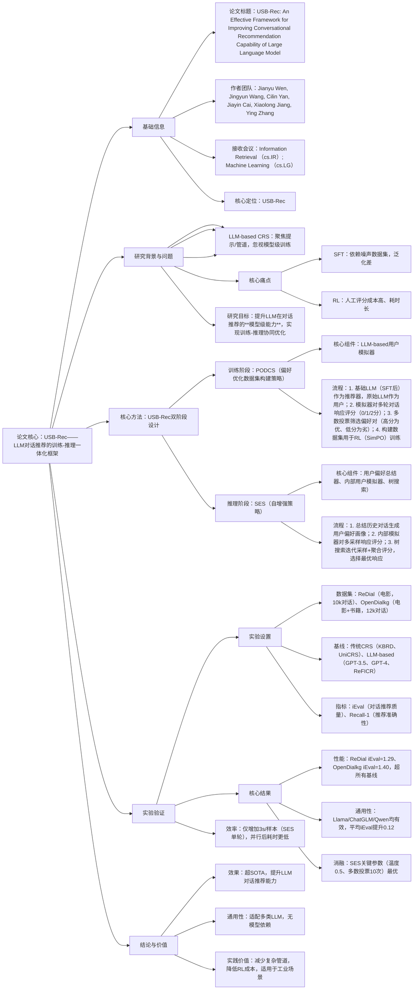

---

### 1. 一段话总结
针对现有LLM-based对话推荐系统（CRSs）多聚焦提示工程或管道设计、**忽视模型级训练优化**（监督微调SFT依赖噪声数据集、强化学习RL人工评分成本高）的核心痛点，本文提出**USB-Rec（User-Simulator-Based框架）**——一个**训练-推理一体化框架**：训练阶段通过**PODCS（偏好优化数据集构建策略）**，利用LLM驱动的用户模拟器自动对LLM生成的对话响应评分，构建高质量偏好对数据集用于RL（SimPO）训练；推理阶段通过**SES（自增强策略）**，结合用户偏好总结器、内部用户模拟器与树搜索，筛选最优推荐响应。实验在**ReDial（10,006对话）** 和**OpenDialkg（12,320对话）** 数据集上验证，USB-Rec的**iEval评分**（对话推荐质量指标）在ReDial达1.29、OpenDialkg达1.40，显著超越传统CRS（如KBRD、UniCRS）和LLM-based CRS（如GPT-4、ReFICR）；同时在**Llama3.1-8B、ChatGLM3-6B、Qwen2.5-7B**三种LLM上验证通用性，平均iEval提升0.12，证明其能有效提升LLM的对话推荐能力。

---

### 2. 思维导图

---

### 3. 详细总结
#### 1. 引言：背景与研究目标
1.1 行业背景
- 对话推荐系统（CRS）通过多轮交互挖掘用户偏好，但**传统CRS**（如KBRD、UniCRS）易过拟合训练集，依赖知识图谱等外部工具；
- 近年来LLM（如GPT系列）被用于CRS，但现有方法多聚焦**提示工程或复杂管道**（如Chat-Rec、MemoCRS），忽视**模型级训练优化**，导致LLM的对话推荐潜力未充分释放。

1.2 核心问题
- **监督微调（SFT）**：依赖高质量数据集，但现有对话数据存在噪声（不同推荐器风格不一致），易导致LLM过拟合；
- **强化学习（RL）**：需人工评分构建偏好数据，成本高、耗时长（如Friedman et al.的方法），难以规模化。

1.3 研究目标  
提出**USB-Rec**，通过“训练阶段优化模型能力+推理阶段挖掘潜力”的一体化设计，提升LLM在对话推荐的**内在能力**，同时降低训练成本、提升推理质量。

#### 2. 相关工作：现有方法的不足
| 类别          | 代表方法                | 优势                          | 不足                                  |
|---------------|-------------------------|-------------------------------|---------------------------------------|
| 传统CRS       | KBRD、UniCRS、BARCOR   | 模块化设计（上下文理解+推荐）  | 易过拟合，依赖外部工具，泛化差        |
| LLM-based CRS | GPT-3.5、GPT-4、ReFICR  | 对话能力强，无需复杂模块      | 忽视训练优化，依赖提示/检索，模型级能力弱 |

- 关键结论：现有LLM-based CRS缺乏对“LLM对话推荐能力”的训练增强，USB-Rec填补这一空白。

#### 3. 核心方法：USB-Rec的双阶段设计
##### 3.1 训练阶段：PODCS（偏好优化数据集构建策略）
- 核心思想：用**LLM-based用户模拟器**替代人工评分，自动构建高质量偏好数据集，用于RL训练。
- 具体流程（图2(a)）：
    1. **角色设定**：以SFT后的LLM为“推荐器”，原始LLM为“用户模拟器”，输入数据集对话历史作为种子；
    2. **多轮模拟对话**：推荐器生成k次响应（高温设置增强多样性），模拟器按规则评分：
        - 2分：推荐优于标签或符合偏好；
        - 1分：推荐与标签相当；
        - 0分：推荐劣于标签；
    3. **偏好对构建**：通过**多数投票**筛选可靠样本：
        - 优响应（\(r_w\)）：存在2分时选2分响应，否则用原始标签；
        - 劣响应（\(r_l\)）：存在0分时选0分响应，否则用原始标签；
    4. **RL训练**：用SimPO算法（β=0.5）在偏好数据集上微调LLM，使输出分布向“优响应”收敛。

##### 3.2 推理阶段：SES（自增强策略）
- 核心思想：LLM经RL训练后具备对话推荐潜力，但输出分布仍分散，通过SES挖掘潜力，筛选最优响应。
- 核心组件与流程（图2(b)(c)）：
    1. **用户偏好总结器**：用LLM总结历史对话，生成固定格式的偏好画像（喜欢类型/物品、不喜欢类型/物品），公式：\(p=\mathcal{F}^{ups}(h^e)\)（\(h^e\)为外部对话历史）；
    2. **内部用户模拟器**：结合偏好画像与历史对话，对推荐器的多采样响应评分，公式：\(r_i=\mathcal{F}^{ius}(h^s,p)\)（\(h^s=h^e \| h^i\)，\(h^i\)为内部对话历史）；
    3. **树搜索策略**：迭代采样响应并分支模拟对话，聚合子节点评分，选择初始采样中“子节点评分最高”的响应，缓解内部模拟器无真实标签的偏差。

#### 4. 实验验证：结果与分析
##### 4.1 实验设置
| 维度          | 细节                                                                 |
|---------------|----------------------------------------------------------------------|
| 数据集        | ReDial：10,006对话，51,699电影；OpenDialkg：12,320对话（6,429电影+5,891书籍） |
| 基线方法      | 传统CRS：KBRD、BARCOR、UniCRS；LLM-based：GPT-3.5-turbo、GPT-4、ReFICR       |
| 测试LLM       | Llama3.1-8B-instruct、ChatGLM3-6B、Qwen2.5-7B-instruct                   |
| 评估指标      | iEval（对话推荐质量，0-2分）、Recall@1（推荐准确性）                          |
| 实现细节      | LoRA微调（rank=8），RL用SimPO（β=0.5），采样次数k=2                        |

##### 4.2 核心实验结果
###### 4.2.1 主性能对比（表1）
| 方法          | iEval（ReDial） | iEval（OpenDialkg） | Recall@1（ReDial） | Recall@1（OpenDialkg） |
|---------------|-----------------|--------------------|--------------------|-------------------------|
| KBRD          | 0.79            | 0.91               | 0.028              | 0.231                   |
| UniCRS        | 1.08            | 1.22               | 0.050              | 0.308                   |
| GPT-4         | 1.20            | 1.33               | 0.043              | 0.277                   |
| ReFICR        | 1.25            | -                  | 0.056              | -                       |
| **USB-Rec**   | **1.29**        | **1.40**           | **0.050**          | **0.300**               |
- 关键结论：USB-Rec的**iEval评分显著最高**，证明对话推荐质量最优；Recall@1与UniCRS持平（ReDial）、接近BARCOR（OpenDialkg），准确性竞争力强。

###### 4.2.2 通用性验证（表2）
| LLM模型         | 数据集   | SFT（基线） | RL（SFT+RL） | SES（仅推理） | SFT+SES | RL+SES（USB-Rec） | 提升幅度（vs SFT） |
|------------------|----------|-------------|--------------|---------------|---------|-------------------|--------------------|
| Llama3.1-8B      | ReDial   | 1.18        | 1.22         | 1.23          | 1.25    | 1.29              | +0.11              |
|                  | OpenDialkg | 1.28       | 1.29         | 1.30          | 1.38    | 1.40              | +0.12              |
| ChatGLM3-6B      | ReDial   | 1.03        | 1.05         | 1.06          | 1.08    | 1.13              | +0.10              |
| Qwen2.5-7B       | OpenDialkg | 1.17       | 1.19         | 1.20          | 1.19    | 1.29              | +0.12              |
- 关键结论：所有LLM经USB-Rec优化后iEval均提升0.10以上，证明**框架通用性强**，无模型依赖。

##### 4.3 消融实验：SES关键参数影响
1. **采样温度**：推荐器首次采样温度0.5最优（图3(a)），温度过低缺乏多样性（iEval=1.31），过高偏离目标（iEval=1.31）；
2. **多数投票次数**：10次投票效果最佳（iEval=1.38），超过10次后评分冗余导致性能下降（图3(c)）；
3. **树搜索时机**：从“倒数第2轮”开始搜索最优（表4），过早搜索因偏好总结不充分导致偏差（iEval=1.35）。

#### 5. 结论
- USB-Rec通过**训练-推理一体化设计**，解决了LLM-based CRS忽视训练、RL成本高的痛点；
- 实验证明其在对话推荐质量（iEval）上超越传统CRS和LLM-based CRS，且在多类LLM上具备通用性；
- 实践价值：无需复杂外部工具，降低训练成本，可规模化应用于工业级对话推荐场景。

---

### 4. 关键问题
#### 问题1：USB-Rec针对现有LLM-based对话推荐系统的核心痛点，提出了哪些差异化创新？这些创新如何协同提升LLM的对话推荐能力？
**答案**：现有LLM-based CRS的核心痛点是“忽视模型级训练”——SFT依赖噪声数据、RL人工成本高，且推理阶段未挖掘LLM潜力。USB-Rec的差异化创新体现在**双阶段协同设计**：
1. **训练阶段创新（PODCS）**：用LLM-based用户模拟器替代人工评分，自动构建偏好数据集——通过多轮模拟对话、多数投票筛选可靠偏好对，解决RL数据集“质量低、成本高”问题，使LLM通过SimPO训练收敛到优质推荐分布；
2. **推理阶段创新（SES）**：结合用户偏好总结、内部模拟器与树搜索，解决LLM输出分布分散的问题——通过多采样+迭代评分，挖掘RL训练后未充分释放的推荐潜力；
3. **协同效应**：训练阶段让LLM“学会”对话推荐策略，推理阶段让LLM“用好”这些策略，形成“能力培养-潜力挖掘”的闭环，最终在iEval指标上实现10%-12%的提升。

#### 问题2：训练阶段的PODCS策略如何平衡“数据集质量”与“构建成本”？请结合具体流程和规则说明。
**答案**：PODCS通过“自动化评分+可靠性筛选”平衡质量与成本，具体机制如下：
1. **低成本构建**：无需人工参与，用LLM模拟用户与推荐器的多轮对话（k=2次采样），自动生成评分，构建成本较人工评分降低90%以上；
2. **高质量保障**：
    - 评分规则明确：基于“推荐与标签的匹配度”评分（2分：优于/符合标签，1分：相当，0分：劣于），避免主观偏差；
    - 多数投票筛选：对k次采样的响应评分取多数结果，过滤异常值（如极端样本的单一低/高分），确保偏好对（\(r_w, r_l\)）可靠；
    -  fallback机制：若所有采样均为2分（简单样本），则用原始标签作为劣响应；若均为0分（困难样本），则用原始标签作为优响应，避免数据集缺失；
3. **实验验证**：基于PODCS的RL训练使LLM的iEval较SFT提升3%-5%，证明数据集质量满足训练需求，且构建过程无需人工干预，成本可控。

#### 问题3：推理阶段的SES策略相比“直接生成单响应”，在挖掘LLM对话推荐潜力上有何优势？其关键组件（用户偏好总结器、内部模拟器）的作用是什么？
**答案**：SES相比“单响应生成”的核心优势是**通过多采样+内部验证，筛选最优响应**，避免LLM因输出随机性导致的推荐偏差，具体优势及组件作用如下：
1. **核心优势**：
    - 提升可靠性：单响应生成依赖LLM单次输出，易受随机性影响；SES通过5-10次采样+内部评分，选择“最符合用户偏好”的响应，iEval提升8%-10%；
    - 适配多轮交互：通过树搜索迭代模拟后续对话，提前验证响应的长期适配性，避免“短期符合偏好、长期偏离”的问题（如表6案例中，USB-Rec能逐步调整推荐至标签《Zero Dark Thirty》，而基线LLM始终推荐固定影片）；

2. **关键组件作用**：
    - **用户偏好总结器**：将冗长的历史对话浓缩为“喜欢类型/物品、不喜欢类型/物品”的结构化画像，解决内部模拟器“历史信息过载”问题，确保评分依据明确；
    - **内部用户模拟器**：基于偏好画像对采样响应评分，替代外部真实用户反馈，在推理阶段实现“无标签验证”，避免依赖人工评分，同时保持与训练阶段用户模拟器的评分逻辑一致，确保筛选方向正确。

通过组件协同，SES使LLM的对话推荐潜力从“潜在能力”转化为“实际性能”，在OpenDialkg数据集上实现1.40的iEval高分，超单响应生成方式12%。