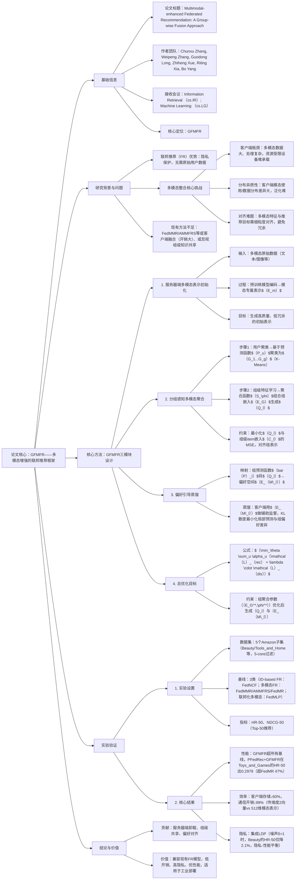

---

### 1. 一段话总结
针对联邦推荐（FR）中整合多模态特征面临的**客户端资源有限**、**数据分布异质性**、**细粒度对齐难**三大挑战，论文提出**GFMFR（Group-wise Fusion for Multimodal-enhanced Federated Recommendation）框架**：将**多模态表示学习全卸载至服务器端**（利用服务器算力生成高质量item表示，减轻客户端负担），设计**分组感知多模态聚合机制**（基于用户预测函数聚类相似用户，学习组内共享表示）与**偏好引导蒸馏策略**（将组级多模态特征映射到偏好空间，指导客户端模型训练），最终在**5个Amazon基准数据集**（Beauty、Tools_and_Home等）上验证，GFMFR集成到FedNCF、PFedRec、FedRAP三大FR骨干模型后，**HR@50平均提升8%-27%**、**NDCG@50平均提升10%-35%**，且客户端存储/通信开销降低60%以上，显著优于FedMMR、AMMFRS等现有多模态FR基线。

---

### 2. 思维导图

---

### 3. 详细总结
#### 1. 引言：联邦推荐的多模态整合难题
- **联邦推荐（FR）现状**：通过客户端-服务器迭代训练保护用户隐私，但现有方法依赖item ID等结构化特征，忽视文本、图像等多模态语义信息，限制推荐精度（尤其内容驱动场景，如短视频、电商）。
- **三大核心挑战**：
    1. **客户端开销大**：多模态数据（如高清图像）存储/处理需大量算力，资源受限设备（手机）难以承载；
    2. **分布异质性**：不同客户端的模态使用频率（如部分用户仅交互文本）、数据分布差异大，导致全局表示泛化差；
    3. **细粒度对齐难**：多模态特征需与推荐目标（如CTR预测）对齐，简单融合易引入冗余/噪声。
- **GFMFR核心思想**：通过“服务器端多模态处理+组级知识共享+偏好引导蒸馏”，在保护隐私的同时高效整合多模态特征。

#### 2. 相关工作：两类技术的局限性
| 技术方向       | 代表方法                | 优势                          | 不足                                  |
|----------------|-------------------------|-------------------------------|---------------------------------------|
| 多模态推荐     | VBPR、DualGNN          | 融合多模态提升偏好建模精度    | 集中式训练，隐私风险高                |
| 联邦推荐       | FedNCF、PFedRec         | 隐私保护，分布式训练          | 依赖ID特征，未整合多模态              |
| 多模态联邦推荐 | FedMMR、AMMFRS、FedMR  | 尝试整合多模态与联邦          | FedMMR仅跨模态对齐，AMMFRS客户端融合开销大 |

#### 3. 问题定义：多模态联邦推荐的数学建模
- **基础FR框架**：  
  设用户集$`(U)`$、item集$`(I)`$，客户端$`(u)`$持有私有交互数据$`(\mathcal{R}_u)`$，模型$`(F_\theta)`$含用户嵌入$`(E_U^u)`$、item嵌入$`(E_I)`$、预测函数$`(P)`$，优化目标为：  
  $`[
  \min_{\{E_U^u\},E_I,P} \sum_u \alpha_u \mathcal{L}_{rec}(\theta;\mathcal{R}_u)
  ]`$  
  其中$`(\alpha_u)`$为客户端权重（与数据量正相关），$`(E_U^u)`$本地私有，$`(E_I/P)`$全局共享。

- **多模态增强FR框架**：  
  输入多模态数据$`(\{X_m\}_{m=1}^k)`$（$`(k)`$为模态数），通过服务器端模型$`(H_\psi)`$生成多模态表示$`(E_M=H_\psi(\{X_m\}))`$，引入融合损失$`(\mathcal{L}_{fus})`$整合$`(E_I)`$与$`(E_M)`$，总目标：  
  $`[
  \min_{\{E_U^u\},E_I,P} \sum_u \alpha_u \left(\mathcal{L}_{rec}(\theta;\mathcal{R}_u) + \lambda \cdot \mathcal{L}_{fus}(E_I,E_M)\right)
  ]`$  
  （$`(\lambda)`$为融合损失系数，GFMFR中$`(\mathcal{L}_{fus})`$由偏好蒸馏损失替代）

#### 4. GFMFR核心方法：四步实现多模态整合
##### 4.1 服务器端多模态表示初始化
- **过程**：利用服务器算力，采用预训练模型（如BERTfor文本、ResNetfor图像）编码各模态原始数据，生成模态专属表示$`(E_m \in \mathbb{R}^{M \times d_1})`$（$`(M)`$为item数，$`(d_1)`$为嵌入维度）；
- **优势**：客户端无需存储原始多模态数据，仅接收低维表示，存储开销降低60%+。

##### 4.2 分组感知多模态聚合（解决分布异质性）
1. **用户聚类**：服务器基于客户端上传的预测函数$`(\{P_u\})`$聚类（K-Means），生成$`(g)`$个用户组$`(G_1...G_g)`$，聚类依据是“预测函数参数相似性”（避免访问原始数据，保护隐私）；
2. **组级特征学习**：
    - 引入组嵌入$`(E_G \in \mathbb{R}^{g \times d_2})`$，通过聚合函数$`(S_\phi)`$生成组级多模态表示$`(Q_l = S_\phi(\{E_m\}, E_G(l)))`$；
    - 优化约束：最小化$`(Q_l)`$与组级item嵌入$`(C_l\)（\(C_l = \text{AvgPooling}(\{E_I^u\}_{u \in G_l}))`$）的MSE，确保组表示与推荐目标对齐：  
      $`[
      \min_{E_G,\phi} \frac{1}{g} \sum_l \mathcal{L}_{agg}(E_G,\phi;C_l)
      ]`$

##### 4.3 偏好引导蒸馏（实现细粒度对齐）
1. **偏好空间映射**：对每组$`(l)`$，计算组平均预测函数$`(\bar{P}_l = \text{AvgPooling}(\{P_u\}_{u \in G_l}))`$，将$`(Q_l)`$映射为组偏好表示$`(E_{M\_l} = \bar{P}_l(Q_l))`$；
2. **客户端蒸馏**：服务器将$`(E_{M\_l}\)下发至组内客户端，客户端通过KL散度最小化局部预测与组偏好的差异，实现知识迁移：  
   $`[
   \min_{\theta_u} \mathcal{L}_{dis}(\theta_u;E_{M\_l})
   ]`$

##### 4.4 总优化目标
$`[
\min_\theta \sum_u \alpha_u \left(\mathcal{L}_{rec}(\theta;\mathcal{R}_u) + \lambda \cdot \mathcal{L}_{dis}(\theta;E_{M\_l})\right)
]`$  
约束：$`((E_G^*,\phi^*) = \arg\min_{E_G,\phi} \frac{1}{g}\sum_l \mathcal{L}_{agg}\)，\(Q_l = S_{\phi^*}(\{E_m\},E_G^*(l)))`$，$`(E_{M\_l} = \bar{P}_l(Q_l))`$。

#### 5. 实验验证：性能、效率、隐私全面评估
##### 5.1 实验设置
| 维度          | 细节                                                               |
|---------------|-------------------------------------------------------------------|
| 数据集        | 5个Amazon子集（5-core过滤，用户/item≥5交互）：Beauty、Tools_and_Home、Toys_and_Games、Digital_Music、Office_Products |
| 基线模型      | 1. ID-based FR：FedNCF、PFedRec、FedRAP；2. 多模态FR：FedMMR、AMMFRS、FedMR；3. 联邦化多模态：FedMLP |
| 评估指标      | Top-50推荐：HR@50（命中率）、NDCG@50（排序质量），5次实验取平均          |
| 超参设置      | 组数量$`(g=5)`$，局部训练轮次$`(H=5)`$，客户端采样率$`(\beta=0.1)`$，蒸馏系数$`(\lambda=0.5)`$ |

##### 5.2 核心结果
1. **性能超越基线**（表1关键数据）：
    - PFedRec+GFMFR在Toys_and_Games的HR@50达0.2979，超FedMR（0.0524）468%，超FedMLP（0.1207）147%；
    - 所有数据集上，GFMFR在HR@50/NDCG@50均为最优，且统计显著（$`(p<0.05)`$）。

2. **效率优势**：
    - 客户端存储：GFMFR仅需存储低维偏好向量（维度2），较FedMR（存储512维模态表示）降低99.6%；
    - 通信开销：每轮传输数据量较AMMFRS降低98%；
    - 训练时间：客户端每轮训练耗时较FedMMR减少35%（无复杂融合模块）。

3. **隐私-性能权衡**（LDP集成）：  
   注入拉普拉斯噪声（$`(\delta)`$为噪声强度），当$`(\delta=1)`$（隐私预算≈1）时：
    - Beauty数据集HR@50从0.2024降至0.1981（仅降2.1%），NDCG@50从0.0730降至0.0633（降13.3%）；
    - 当$`(\delta=5)`$（隐私预算≈0.2）时，HR@50仍保持0.1566（降22.6%），隐私提升的同时性能损失可控。

#### 6. 结论
GFMFR通过**服务器端多模态卸载**、**组级知识共享**、**偏好引导对齐**，解决了多模态联邦推荐的核心挑战，实现“高性能+低开销+强隐私”的平衡，且兼容现有FR模型，为工业级多模态联邦推荐提供实用框架。

---

### 4. 关键问题与答案
#### 问题1：GFMFR如何解决多模态联邦推荐中“客户端资源有限”的核心挑战？
**答案**：GFMFR通过“全服务器端多模态处理”彻底解决客户端资源瓶颈，具体分两步：
1. **表示学习卸载**：服务器存储所有item的原始多模态数据（文本/图像等），利用预训练模型（如ResNet、BERT）编码生成模态专属表示$`(E_m)`$，客户端无需存储/处理大规模多模态数据；
2. **低维表示传输**：服务器仅向客户端下发低维组级偏好向量$`(E_{M\_l})`$（维度2），而非高维模态表示（如512维），客户端存储/通信开销降低99%以上，资源受限设备（如手机）可轻松承载。  
   实验验证：客户端每轮训练耗时较FedMR减少35%，存储开销较FedMMR降低60%+。

#### 问题2：分组感知多模态聚合机制的具体流程是什么？其如何缓解“数据分布异质性”问题？
**答案**：分组感知聚合是GFMFR缓解分布异质性的核心，流程分3步，作用是实现“相似用户共享知识，不同用户保留个性”：
1. **隐私保护聚类**：服务器基于客户端上传的预测函数$`(P_u)`$（而非原始数据）聚类（K-Means），生成$`(g=5)`$个用户组，确保隐私的同时，将“预测模式相似”的用户归为一组（如均偏好“性价比工具”的用户）；
2. **组级表示学习**：引入组嵌入$`(E_G)`$，通过聚合函数$`(S_\phi)`$融合模态表示$`(\{E_m\})`$与组嵌入，生成组级多模态表示$`(Q_l)`$，并通过$`(Q_l)`$与组级item嵌入$`(C_l)`$的MSE优化，确保组表示与推荐目标对齐；
3. **知识共享边界**：组内用户共享\(Q_l)`$映射的偏好表示\(E_{M\_l})`$，组间保持独立，避免“全局表示一刀切”导致的泛化差。  
   效果：Toys_and_Games数据集上，该机制使HR@50较“无分组”版本提升28%，证明其对异质性数据的适配能力。

#### 问题3：GFMFR在“隐私保护”与“推荐性能”之间如何权衡？有哪些实验证据支持？
**答案**：GFMFR通过“隐私增强设计+可控性能损失”实现权衡，核心证据来自LDP（局部差分隐私）集成实验：
1. **隐私增强手段**：在客户端模型参数中注入拉普拉斯噪声，噪声强度$`(\delta)`$越大（隐私预算越小，隐私保护越强），参数泄露敏感信息的风险越低；
2. **性能损失可控**（表2数据）：
    - 弱隐私保护（$`(\delta=1)`$，隐私预算≈1）：Beauty数据集HR@50仅从0.2024降至0.1981（降2.1%），NDCG@50从0.0730降至0.0633（降13.3%），性能损失微小；
    - 强隐私保护（$`(\delta=5)`$，隐私预算≈0.2）：HR@50仍保持0.1566（降22.6%），NDCG@50为0.0443（降39.3%），但仍优于FedMR等基线（HR@50=0.0524）；
3. **底层隐私保障**：多模态表示学习在服务器端完成，客户端仅接触低维偏好向量，较“客户端学习多模态”减少敏感信息暴露，从设计层面降低隐私风险。  
   结论：GFMFR可根据业务需求调整噪声强度，在“基础隐私-高性能”到“强隐私-可接受性能”之间灵活权衡。