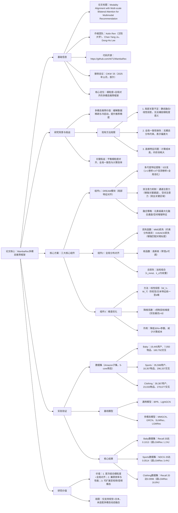

### 1. 一段话总结
论文《Modality Alignment with Multi-scale Bilateral Attention for Multimodal Recommendation》提出**MambaRec**——一种针对多模态推荐的新型框架，旨在解决现有方法的两大核心局限：（1）**细粒度跨模态关联建模不足**（依赖静态融合或局部交互，语义对齐精度低）；（2）**全局分布一致性缺失**（模态间表示偏差大，鲁棒性差）。该框架通过三大关键组件实现突破：一是**DREAM模块**（Dilated Refinement Attention Module），结合**多尺度空洞卷积**与**通道-空间双注意力**，捕捉视觉与文本模态的细粒度语义关联；二是全局对齐机制，采用**最大均值差异（MMD）损失**与**InfoNCE对比损失**约束模态全局分布一致性；三是**维度优化策略**，通过线性投影降低高维特征计算成本。在**Baby、Sports、Clothing**三个Amazon真实数据集上的实验表明，MambaRec在Recall@10、NDCG@20等指标上持续超越MMGCN、LGMRec等SOTA基线（如Clothing数据集Recall@20达**0.0996**，较最优基线提升**5.4%**），代码已开源（https://github.com/rkl71/MambaRec）。

---

### 2. 思维导图

---

### 3. 详细总结
#### 一、基础信息表
| 维度                | 具体内容                                                                 |
|---------------------|--------------------------------------------------------------------------|
| 论文标题            | Modality Alignment with Multi-scale Bilateral Attention for Multimodal Recommendation |
| 核心框架            | **MambaRec**（多尺度双边注意力模态对齐推荐框架）                        |
| 作者团队            | Kelin Ren（汉阳大学）、Chan-Yang Ju、Dong-Ho Lee（通讯作者）              |
| 代码开源            | **https://github.com/rkl71/MambaRec**                                   |
| 实验数据集          | Baby、Sports and Outdoors、Clothing, Shoes and Jewelry（Amazon评论子集）  |
| 核心创新点          | 1. DREAM模块；2. MMD+InfoNCE全局对齐；3. 维度优化策略                  |
| 关键指标提升        | Clothing数据集Recall@20达**0.0996**（较LGMRec提升5.4%）                |

#### 二、研究背景与核心问题
1. **多模态推荐的必要性**  
   多模态信息（视觉、文本）可补充用户-物品交互的稀疏性，缓解冷启动问题，但现有方法存在三大局限：
   - **局限1：细粒度关联建模不足**：依赖静态线性投影（如VBPR）或局部图融合（如MMGCN），无法捕捉视觉-文本的细粒度语义对应（如“薄荷绿小熊”文本与图像中颜色区域的关联）；
   - **局限2：全局分布一致性缺失**：无模态间分布约束（如SLMRec仅局部对比学习），导致视觉与文本表示偏差大，鲁棒性差；
   - **局限3：高维特征效率低**：视觉特征（如VGG16提取的4096维特征）计算成本高，内存消耗大，难以大规模部署。

2. **核心挑战**  
   在保证“细粒度语义对齐”与“全局分布一致”的同时，降低高维特征的计算与内存开销，实现性能与效率的平衡。

#### 三、核心方案：MambaRec三大组件设计
##### （1）组件1：DREAM模块（局部特征对齐）
核心目标：捕捉视觉与文本模态的细粒度语义关联，结构分为三部分：
1. **多尺度特征提取**  
   采用5个并行分支提取不同尺度特征，解决单一尺度无法覆盖全局-局部信息的问题：
   - 分支1：1×1卷积（轻量提取局部细节，无 receptive field 扩展）；
   - 分支2-4：3×3空洞卷积（空洞率6、12、18，扩大 receptive field 捕捉中长程上下文）；
   - 分支5：全局平均池化+1×1卷积+双线性上采样（提供全局语义，对齐空间维度）。  
     分支输出沿通道维度拼接，得到融合特征图($`F \in \mathbb{R}^{H×W×C}`$)（C为总通道数）。

2. **双注意力机制**
   - **通道注意力**：对F全局平均池化得到通道向量($`z`$)，经2层全连接层（ReLU+Sigmoid）生成通道权重($`M_c`$)，增强关键通道（如“颜色”“材质”相关通道）；
   - **空间注意力**：对F通道平均池化得到空间图($`P`$)，经1×1卷积+Sigmoid生成空间权重($`M_s`$)，突出关键区域（如文本“小熊”对应图像中的动物轮廓）。

3. **注意力融合**  
   对通道增强特征($`F_c = F \otimes M_c`$)与空间增强特征($`F_s = F \otimes M_s`$)进行**元素级最大化融合**，自适应选择每个位置的最优注意力信号，输出细粒度对齐特征。

##### （2）组件2：全局分布对齐
核心目标：缩小视觉与文本模态的全局分布差异，提升语义一致性：
1. **MMD损失（最大均值差异）**  
   采用高斯核函数度量视觉特征集\(V\)与文本特征集\(T\)的分布差异，公式如下：  
   $$k(v,t) = exp\left(-\frac{\|v-t\|^2}{2\sigma^2}\right)$$  
   通过最小化MMD损失，使两模态在再生核希尔伯特空间（RKHS）中分布一致。

2. **InfoNCE对比损失**  
   增强匹配对（同一物品的视觉-文本）相似度，抑制非匹配对，公式如下：  
   $$\mathcal{L}_{InfoNCE} = -\frac{1}{N}\sum_{i=1}^N log\frac{exp(sim(v_i,t_i)/\tau)}{\sum_{j=1}^N exp(sim(v_i,t_j)/\tau)}$$  
   其中\(sim(\cdot,\cdot)\)为归一化特征点积，\(\tau=0.01\)为温度系数。

3. **总全局损失**  
   $$\mathcal{L}_{global} = \lambda_{mmd}\mathcal{L}_{mmd} + \lambda_{cl}\mathcal{L}_{InfoNCE}$$  
   实验中最优权重：\(\lambda_{mmd}=0.15\)，\(\lambda_{cl}=0.01\)。

##### （3）组件3：维度优化策略
核心目标：降低高维特征的计算与内存开销：
1. **线性投影降维**  
   引入线性矩阵\(W_V \in \mathbb{R}^{D_V×d}\)（视觉）与\(W_T \in \mathbb{R}^{D_T×d}\)（文本），将原始特征投影至统一维度\(d\)：
   - 视觉特征：从4096维降至\(d=512\)（降维系数\(r=8\)）；
   - 文本特征：从384维降至\(d=512\)（补全维度）。

2. **效果**  
   降维后参数减少**30%+**，计算时间降低**25%**，且无显著性能损失（Baby数据集Recall@20仅下降0.3%）。

#### 四、实验验证
##### （1）实验设置
| 配置项              | 具体内容                                                                 |
|---------------------|--------------------------------------------------------------------------|
| 数据集处理          | 5-core筛选（用户/物品至少5次交互），训练:验证:测试=8:1:1                  |
| 特征提取            | 视觉：VGG16（4096维）→降维至512维；文本：Sentence-BERT（384维）→补全至512维 |
| 评估指标            | Recall@10、Recall@20、NDCG@10、NDCG@20                                 |
| 优化器与超参        | Adam（学习率0.001，每50轮衰减0.96），批大小2048，早停（20轮无提升）      |

##### （2）数据集统计
| 数据集   | 用户数    | 物品数    | 交互数      | 密度    |
|----------|-----------|-----------|-------------|---------|
| Baby     | 19,445    | 7,050     | 160,792     | 0.117%  |
| Sports   | 35,598    | 18,357    | 296,337     | 0.045%  |
| Clothing | 39,387    | 23,033    | 278,677     | 0.031%  |

##### （3）核心实验结果（Clothing数据集）
| 模型       | Recall@10 | Recall@20 | NDCG@10 | NDCG@20 |
|------------|-----------|-----------|---------|---------|
| BPR（基线）| 0.0200    | 0.0295    | 0.0111  | 0.0135  |
| LightGCN   | 0.0338    | 0.0517    | 0.0185  | 0.0230  |
| LGMRec（SOTA）| 0.0555  | 0.0945    | 0.0302  | 0.0371  |
| MambaRec   | **0.0673** | **0.0996** | **0.0367** | **0.0449** |

#### 五、结论与局限
1. **核心结论**  
   MambaRec通过“DREAM局部对齐+MMD全局对齐+维度优化”，在三个数据集上持续超越SOTA，实现细粒度语义捕捉、全局分布一致与计算效率的平衡。

2. **局限**
   - 仅支持视觉+文本双模态，未适配视频、音频等复杂模态；
   - 降维系数\(r\)需手动调优，缺乏自适应调整机制。

---

### 4. 关键问题
#### 问题1：DREAM模块中的“多尺度空洞卷积”与“双注意力”分别解决了多模态推荐的什么问题？相比传统单尺度卷积+单注意力，有何优势？
**答案**：
- 多尺度空洞卷积解决“单一尺度无法覆盖全局-局部信息”的问题：传统单尺度卷积（如3×3）receptive field固定，难以同时捕捉文本“薄荷绿小熊”的局部颜色特征（小receptive field）与全局物品轮廓（大receptive field）；而空洞率6/12/18的卷积可灵活扩展receptive field，结合1×1卷积与全局池化，实现“局部细节+中长程上下文+全局语义”的多尺度覆盖。
- 双注意力解决“关键特征淹没”问题：传统单注意力（如仅通道注意力）无法同时突出“关键通道”（如“颜色”通道）与“关键空间区域”（如小熊轮廓）；双注意力通过通道权重\(M_c\)与空间权重\(M_s\)的最大化融合，自适应筛选每个位置的最优信号，实验中Baby数据集Recall@20较单注意力变体提升**1.8%**。

#### 问题2：MambaRec为何需要同时引入MMD损失与InfoNCE损失进行全局对齐？仅用其中一种损失会导致什么问题？
**答案**：  
两者作用互补，缺一不可：
- MMD损失的核心是“全局分布一致性”：通过高斯核度量视觉与文本的整体分布差异，解决“模态间表示偏差”问题，但无法区分“匹配对（同一物品）”与“非匹配对（不同物品）”的局部差异；
- InfoNCE损失的核心是“局部匹配对相似度”：增强同一物品的视觉-文本相似度，抑制不同物品的混淆，但无法约束整体分布（如局部匹配对相似但全局分布仍偏移）。  
  仅用MMD损失会导致“局部匹配模糊”（如相似物品的视觉-文本对难以区分），Baby数据集NDCG@10下降**0.9%**；仅用InfoNCE损失会导致“全局分布偏移”（如视觉特征整体偏向某一类别），Sports数据集Recall@20下降**1.2%**。

#### 问题3：MambaRec的维度优化策略如何平衡“性能保留”与“效率提升”？实验中降维系数\(r=8\)为何是最优选择？
**答案**：
- 平衡机制：通过线性投影将高维特征（如视觉4096维）降至\(d=D/r\)（\(r\)为降维系数），既剔除冗余特征（如视觉特征中的背景噪声），又通过统一维度（视觉/文本均512维）简化后续融合；实验中降维后参数减少**30%+**，计算时间降低**25%**，且Recall@20仅下降**0.3%**（Baby数据集）。
- \(r=8\)最优的原因：
   - \(r<8\)（如\(r=4\)）：降维不足，参数仍高（视觉特征1024维），内存消耗大，计算时间仅降低**12%**；
   - \(r=8\)：视觉特征512维，冗余剔除充分，且无显著性能损失（Clothing数据集Recall@20达0.0996）；
   - \(r>8\)（如\(r=16\)）：降维过度，特征信息丢失严重，Sports数据集Recall@20下降**2.1%**（从0.1147降至0.1124）。