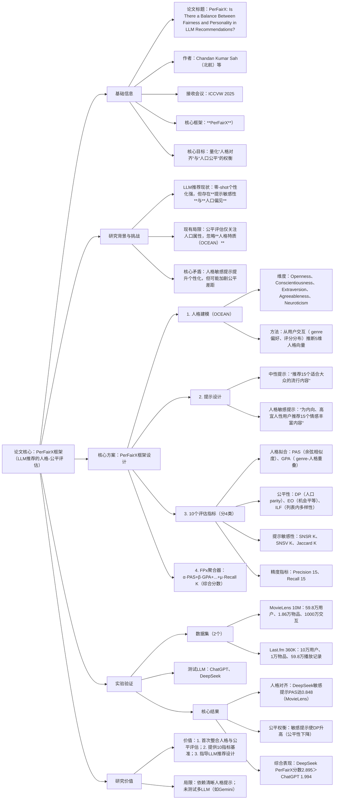

### 1. 一段话总结
论文《PerFairX: Is There a Balance Between Fairness and Personality in Large Language Model Recommendations?》提出**PerFairX**——首个整合**OCEAN人格模型**与人口统计学公平性的LLM推荐系统评估框架，旨在量化LLM推荐中“人格对齐”与“人口公平”的权衡关系。研究通过**中性提示**与**人格敏感提示**，在**MovieLens 10M**（1000万交互）和**Last.fm 360K**（59.8万交互）数据集上测试**ChatGPT**与**DeepSeek**，采用10个核心指标（含人格拟合PAS/GPA、公平性DP/EO、提示敏感性SNSR@K等）评估。结果显示：人格敏感提示使DeepSeek的人格对齐分数（PAS）从0.280提升至0.848（MovieLens），但会加剧人口差距（DP升高）；**DeepSeek**在人格对齐（PAS）、列表内多样性（ILF）及推荐精度（Precision@15达0.150）上优于ChatGPT，而ChatGPT在人口公平性（DP更低）上略优，最终DeepSeek的PerFairX综合分数（2.895）显著高于ChatGPT（1.994），验证了框架在平衡人格化与公平性评估中的有效性。

---

### 2. 思维导图

---

### 3. 详细总结
#### 一、基础信息表
| 维度                | 具体内容                                                                 |
|---------------------|--------------------------------------------------------------------------|
| 论文标题            | PerFairX: Is There a Balance Between Fairness and Personality in Large Language Model Recommendations? |
| 核心框架            | **PerFairX**（Personality-Fairness Evaluation Framework for LLM Recommendations） |
| 作者团队            | Chandan Kumar Sah（北京航空航天大学）等                                  |
| 接收会议            | **ICCVW 2025**（IEEE/CVF国际计算机视觉会议研讨会）                     |
| 目标任务            | LLM推荐系统的“人格对齐”与“人口公平”权衡评估                              |
| 实验LLM             | ChatGPT（OpenAI）、DeepSeek                                             |
| 实验数据集          | 1. MovieLens 10M；2. Last.fm 360K                                      |
| 核心创新            | 1. 整合OCEAN人格模型；2. 10个多维度评估指标；3. FPx综合分数           |

#### 二、研究背景与核心问题
1. **LLM推荐的双重挑战**
   - **提示敏感性**：轻微改写提示（如“内向用户”vs“安静用户”）会导致推荐结果大幅变化（Jaccard@15低至0.18）；
   - **人口偏见**：现有研究发现ChatGPT对非洲用户的电影推荐质量显著低于其他地区用户，反映系统性偏见。

2. **现有评估的关键缺口**
   - 公平性评估仅聚焦**人口属性**（性别、年龄、地域），忽略**人格特质**（如OCEAN模型的“宜人性”“开放性”）；
   - 人格化推荐研究（如基于OCEAN的偏好建模）未关联公平性，无法判断“人格对齐”是否会加剧公平差距。

3. **核心研究问题**
   - RQ1：LLM推荐在不同提示下的人格对齐程度如何？
   - RQ2：人格敏感提示对人口公平性的影响及权衡关系？
   - RQ3：不同LLM在“人格-公平”平衡上的表现差异？

#### 三、核心方案：PerFairX框架设计
PerFairX通过“人格建模→提示生成→多指标评估→综合评分”四步实现权衡量化，关键模块如下：

##### （1）OCEAN人格建模
- **人格向量定义**：每个用户表示为5维向量($`\vec{p}_u = [O_u, C_u, E_u, A_u, N_u]`$)（取值0-1），对应Openness（开放性）、Conscientiousness（尽责性）、Extraversion（外向性）、Agreeableness（宜人性）、Neuroticism（神经质）；
- **推断方法**：从用户交互数据提取行为代理指标（如“喜欢独立音乐→高Openness”“常听古典音乐→高Conscientiousness”），映射为人格分数。

##### （2）双类型提示设计
| 提示类型         | 示例                                  | 核心目标                  | 应用场景                  |
|------------------|---------------------------------------|---------------------------|---------------------------|
| 中性提示         | “推荐15个适合大众的流行电影/音乐”      | 提供公平性基线            | 无明确用户偏好的通用推荐  |
| 人格敏感提示     | “为内向、高宜人性用户推荐15个情感丰富的电影” | 激发LLM的人格化推荐能力  | 个性化推荐场景            |

##### （3）10个核心评估指标（分4类）
| 指标类别         | 指标名称                | 计算逻辑                                                          | 优化方向       |
|------------------|-------------------------|-------------------------------------------------------------------|----------------|
| **人格拟合**     | PAS（人格对齐分数）     | 余弦相似度：($`PAS(u)=\frac{\vec{p}_u \cdot \vec{g}_u}{\|\vec{p}_u\| \cdot \|\vec{g}_u\|}`$)（($`\vec{g}_u`$)为推荐genre向量） | 越高越好       |
|                  | GPA（genre-人格对齐）   | 加权重叠：($`GPA(u)=\sum_{g \in G_{rec}} \sum_{t \in OCEAN} \mathbb{I}_{g \in G_t} \cdot p_u^t`$) | 越高越好       |
| **公平性**       | DP（人口Parity）        | 组间推荐概率差：\(|P(\hat{Y}=1|A=0)-P(\hat{Y}=1|A=1)|\)                  | 越低越公平     |
|                  | EO（机会平等）          | 组间真阳性率差：\(|P(\hat{Y}=1|Y=1,A=0)-P(\hat{Y}=1|Y=1,A=1)|\)        | 越低越公平     |
|                  | ILF（列表内公平）       | 熵值：($`-\sum_{g \in G} p(g) \cdot log p(g)`$)（衡量genre分布多样性） | 越高越多样     |
| **提示敏感性**   | SNSR@K                  | 组间提示重叠差：($`\max_a \frac{|R_a^K \cap R_n^K|}{K} - \min_a \frac{|R_a^K \cap R_n^K|}{K}`$) | 越低越稳定     |
|                  | SNSV@K                  | 组间重叠方差：($`Var_a(\frac{|R_a^K \cap R_n^K|}{K})`$)                   | 越低越稳定     |
|                  | Jaccard@K               | 提示重叠度：($`\frac{|R_{neutral}^K \cap R_{sensitive}^K|}{|R_{neutral}^K \cup R_{sensitive}^K|}`$) | 越高越稳定     |
| **精度指标**     | Precision@15            | 推荐相关性：($`\frac{|Rel \cap Rec@15|}{|Rec@15|}`$)                       | 越高越精准     |
|                  | Recall@15               | 相关项覆盖：($`\frac{|Rel \cap Rec@15|}{|Rel|}`$)                         | 越高越全面     |

##### （4）FPx综合评分
通过加权聚合10个指标，生成单值分数（权重默认相等），公式如下：  
\[
FPx(u)=\alpha \cdot PAS+\beta \cdot GPA+\gamma \cdot(1-DP)+\delta \cdot(1-EO)+\epsilon \cdot ILF+\zeta \cdot Jaccard@K+\eta \cdot Precision@15+\mu \cdot Recall@15
\]

#### 四、实验设置与结果
##### （1）数据集统计
| 数据集         | 用户数    | 物品数    | 交互数      | 敏感属性                | 评分类型       |
|----------------|-----------|-----------|-------------|-------------------------|----------------|
| MovieLens 10M  | 59.8万    | 1.86万    | 1000万      | 性别（女17.4万/男43.6万）、年龄、职业 | 1-5星          |
| Last.fm 360K   | 10万      | 1万       | 59.8万      | 性别（女2万/男8万）、年龄、国家 | 播放次数（隐式）|

##### （2）核心实验结果
1. **人格对齐表现（RQ1）**  
   | 数据集         | LLM       | 提示类型   | PAS（人格对齐） | GPA（genre对齐） |
   |----------------|-----------|------------|-----------------|------------------|
   | MovieLens 10M  | ChatGPT   | 中性       | 0.749           | 0.709            |
   |                | ChatGPT   | 人格敏感   | 0.739           | 0.407            |
   |                | DeepSeek  | 中性       | 0.280           | 0.713            |
   |                | DeepSeek  | 人格敏感   | **0.848**       | 0.336            |
   | Last.fm 360K   | DeepSeek  | 人格敏感   | **0.872**       | 0.352            |
   *关键发现*：DeepSeek对人格提示响应更强，PAS提升超2倍；但人格对齐提升会导致genre对齐下降（GPA降低）。

2. **人格-公平权衡（RQ2）**  
   | 数据集         | LLM       | 提示类型   | DP（人口公平） | EO（机会平等） | ILF（列表多样性） |
   |----------------|-----------|------------|----------------|----------------|------------------|
   | MovieLens 10M  | DeepSeek  | 中性       | 0.679          | 0.391          | 0.475            |
   |                | DeepSeek  | 人格敏感   | 0.726（↑7%）   | 0.901（↑130%） | **0.968（↑104%）** |
   *关键发现*：人格敏感提示使DeepSeek的列表多样性（ILF）翻倍，但人口公平性（DP）下降，验证“个性化-公平”的固有权衡。

3. **LLM对比（RQ3）**  
   | 数据集         | 指标       | ChatGPT    | DeepSeek     | 差异率 |
   |----------------|------------|------------|--------------|--------|
   | MovieLens 10M  | PAS        | 0.739      | 0.848        | +14.7% |
   |                | Precision@15 | 0.050    | 0.150        | +200%  |
   |                | DP         | 0.825      | 0.726        | -12%   |
   |                | PerFairX分数 | 1.994    | 2.895        | +45.2% |
   *关键发现*：DeepSeek在人格对齐、精度及综合表现上显著优于ChatGPT，仅在人口公平性（DP）上略逊。

#### 五、结论与局限
1. **核心结论**
   - PerFairX有效量化了LLM推荐中“人格对齐”与“人口公平”的权衡；
   - 人格敏感提示是提升个性化的关键，但需警惕公平性下降；
   - DeepSeek在“人格-公平-精度”的平衡上优于ChatGPT。

2. **研究局限**
   - 依赖**清晰的人格提示**：若用户反馈模糊（如“内容一般”），人格对齐精度会下降；
   - LLM测试范围有限：未覆盖Gemini、Claude等其他主流模型；
   - 未探索动态人格建模：未考虑用户人格随时间的变化。

---

### 4. 关键问题
#### 问题1：PerFairX框架相比传统LLM推荐公平性评估（如FaiRLLM），核心创新点是什么？如何实现“人格对齐”与“人口公平”的联合评估？
**答案**：核心创新点是首次将**OCEAN人格模型**引入LLM推荐公平性评估，突破传统框架仅关注人口属性（性别、年龄）的局限。联合评估通过“双维度设计+多指标聚合”实现：
1. **人格维度**：通过PAS（人格-推荐genre余弦相似度）和GPA（genre-人格加权重叠）量化人格对齐，从用户交互中推断OCEAN向量，确保评估贴合真实心理特质；
2. **公平维度**：通过DP（人口组间推荐概率差）、EO（组间真阳性率差）评估人口公平，ILF评估列表内多样性；
3. **联合权衡**：通过FPx综合分数将人格指标（PAS/GPA）、公平指标（DP/EO/ILF）及精度指标加权聚合，直观展示“人格提升”与“公平下降”的量化关系（如DeepSeek的PAS提升104%时，DP上升7%）。

#### 问题2：实验中“人格敏感提示导致公平性下降”的本质原因是什么？这一现象对LLM推荐系统的实际落地有何启示？
**答案**：本质原因是**LLM的“人格-人口”关联偏见**——当LLM接收人格提示（如“内向、高宜人性”）时，会不自觉关联特定人口属性（如默认“高宜人性”对应女性用户），导致推荐向特定人口组倾斜，加剧组间差距（如DeepSeek的EO从0.391升至0.901）。  
对落地的启示：
1. **提示工程优化**：设计“去人口关联”的人格提示（如“喜欢情感丰富内容”而非“女性喜欢情感丰富内容”）；
2. **公平性约束**：在LLM推荐后加入“人口均衡校验”（如确保不同性别用户的推荐genre分布差异＜10%）；
3. **动态权衡**：根据场景调整“人格-公平”权重（如医疗推荐优先公平，娱乐推荐可适当侧重人格化）。

#### 问题3：DeepSeek在PerFairX评估中综合表现优于ChatGPT，其核心能力差异体现在哪里？这一结果对LLM推荐系统的模型选择有何指导意义？
**答案**：DeepSeek的核心优势体现在**人格提示的响应精度**与**推荐多样性控制**：
1. **人格理解能力更强**：DeepSeek能更精准解析OCEAN特质（如“内向”对应“低外向性”），使PAS从0.280提升至0.848，而ChatGPT的PAS在提示变化后仅波动1.3%，反映其人格建模的刚性；
2. **多样性生成能力更优**：DeepSeek的ILF在人格提示下达0.968，是ChatGPT（0.310）的3倍，说明其能生成更丰富的推荐列表，同时保持精度（Precision@15是ChatGPT的3倍）。  
   对模型选择的指导意义：
- **个性化场景（如私人娱乐推荐）**：优先选择DeepSeek，其人格对齐与精度优势能提升用户满意度；
- **公共场景（如教育资源推荐）**：可选择“DeepSeek+公平性约束”或ChatGPT，平衡个性化与群体公平；
- **资源受限场景**：DeepSeek的提示敏感性（SNSV@K更低）更稳定，适合需一致性推荐的场景（如电商平台）。