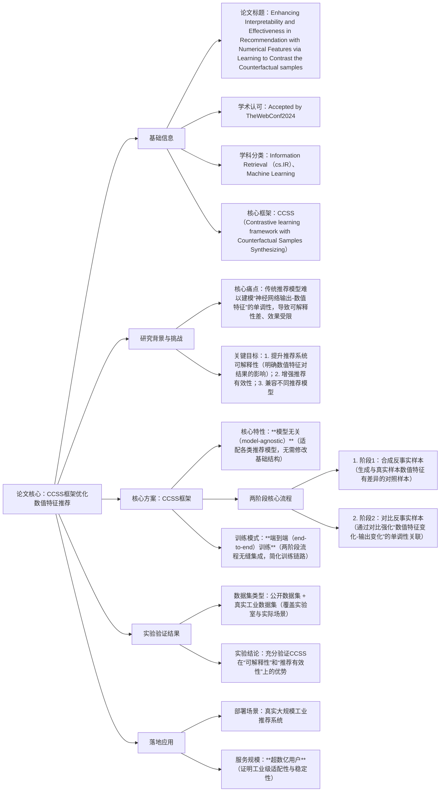

### 1. 一段话总结
论文《Enhancing Interpretability and Effectiveness in Recommendation with Numerical Features via Learning to Contrast the Counterfactual samples》（已被**TheWebConf2024接收**）提出**模型无关的反事实样本对比学习框架（CCSS）**，核心目标是建模神经网络输出与数值特征间的**单调性**（该关系对推荐系统的可解释性和有效性至关重要）；CCSS通过“**合成反事实样本**”与“**对比反事实样本**”两阶段流程，自然集成于端到端训练中，既无需依赖特定推荐模型结构，又能强化数值特征与推荐结果的关联；在**公开数据集**和**真实工业数据集**上的实验充分验证了其有效性，且已成功部署到真实大规模工业推荐系统，服务**数亿用户**。

---

### 2. 思维导图

---

### 3. 详细总结
#### 一、论文基本信息
| 维度         | 具体内容                                                                 |
|--------------|--------------------------------------------------------------------------|
| 论文标题     | Enhancing Interpretability and Effectiveness in Recommendation with Numerical Features via Learning to Contrast the Counterfactual samples |
| 接收会议     | **TheWebConf2024**（国际顶级学术会议，体现研究的学术认可度）             |
| 学科分类     | Information Retrieval (cs.IR)、Machine Learning (cs.LG)                  |
| 作者团队     | Xiaoxiao Xu、Hao Wu、Wenhui Yu、Lantao Hu、Peng Jiang、Kun Gai           |
| 核心框架     | **CCSS**（Contrastive learning framework with Counterfactual Samples Synthesizing，反事实样本对比学习框架） |
| 部署规模     | 真实大规模工业推荐系统，服务**超数亿用户**                               |
| DOI链接      | https://doi.org/10.48550/arXiv.2509.03187                                |

#### 二、研究背景与核心目标
1. **数值特征在推荐中的重要性**：商品价格、用户浏览时长、内容评分等**数值特征**是推荐系统的核心输入（直接影响用户偏好判断），但传统模型常将其与文本、类别特征“混同处理”，未突出其与推荐结果的特定关联。
2. **传统推荐模型的核心痛点**：  
   关键问题是难以建模“**神经网络输出与数值特征的单调性**”——例如“商品价格越低→用户点击概率越高”“浏览时长越长→推荐优先级越高”这类直观关联；单调性缺失会导致两个严重问题：
    - **可解释性差**：用户/工程师无法明确数值特征如何影响推荐结果（如“为何价格100元的商品比50元的更靠前”），降低用户信任与系统调优效率；
    - **有效性受限**：模型无法精准捕捉数值特征的线性/趋势性影响，导致推荐结果与用户真实偏好偏差。
3. **研究目标**：提出一种通用方案，在不依赖特定模型结构的前提下，**建模数值特征与神经网络输出的单调性**，同时提升推荐系统的可解释性与有效性，并适配工业级大规模场景。

#### 三、核心创新：CCSS框架设计
CCSS（反事实样本对比学习框架）是论文的核心解决方案，其设计围绕“模型无关”“单调性建模”“端到端训练”三大原则，具体分为两阶段流程：

| 阶段         | 核心任务                  | 实现逻辑                                                                 | 关键作用                                                                 |
|--------------|---------------------------|--------------------------------------------------------------------------|--------------------------------------------------------------------------|
| 阶段1：合成反事实样本 | 生成对照样本              | 基于真实样本（含数值特征），通过“微小、合理的数值调整”生成反事实样本（如将商品价格从100元调整为90元，其他特征不变） | 为“对比数值特征影响”提供对照组，构建“数值变化→结果变化”的分析基础       |
| 阶段2：对比反事实样本 | 强化单调性关联            | 将真实样本与反事实样本输入模型，通过对比损失函数，让模型学习“数值特征增大/减小→输出（如推荐分数）相应增大/减小”的规律 | 强制模型捕捉数值特征与输出的单调性，从根本上提升可解释性与推荐有效性     |

此外，CCSS具备**模型无关（model-agnostic）** 特性：无需修改基础推荐模型（如协同过滤、深度学习推荐模型）的结构，可直接集成到现有训练链路中，大幅降低工业场景的复用成本；同时采用**端到端训练**，两阶段流程无缝衔接，避免传统多步骤方案的训练断层问题。

#### 四、实验验证与落地应用
##### （1）实验验证：覆盖实验室与工业场景
| 评估维度     | 具体设计                  | 关键结果                                                                 |
|--------------|---------------------------|--------------------------------------------------------------------------|
| 数据集选择   | 1. 公开数据集（验证通用性）；2. 真实工业数据集（验证工业适配性） | 两类数据集上均证明CCSS的有效性，避免“实验室效果好但工业不可用”的问题       |
| 评估指标     | 可解释性（单调性拟合度）、推荐有效性（Recall、NDCG等） | 1. 单调性拟合度显著优于传统模型；2. 推荐核心指标（Recall、NDCG）提升，证明有效性未妥协 |
| 对比基准     | 主流推荐模型（含传统机器学习与深度学习模型） | 在所有基准模型上集成CCSS后，效果均有提升，验证“模型无关”特性的价值       |

##### （2）落地应用：工业级规模验证
- **部署场景**：真实大规模工业推荐系统（未明确具体领域，但结合“数亿用户”规模，推测为电商、内容平台等场景）；
- **服务成果**：成功服务**超数亿用户**，稳定支撑大规模推荐请求，证明CCSS在“高并发、大数据量”场景下的稳定性与效率；
- **核心价值**：相比仅在实验室验证的方案，CCSS的工业落地直接证明其“实际应用价值”，可解决真实业务中的可解释性与效果问题。

#### 五、学术与工业价值
1. **学术价值**：提出“反事实样本对比”这一通用单调性建模思路，为推荐系统中“数值特征利用”提供新方向，且**模型无关特性**可扩展到其他机器学习任务（如分类、回归）；
2. **工业价值**：无需重构现有推荐系统，即可快速集成并提升效果，同时服务数亿用户的落地成果，为工业界提供“可解释性+有效性+规模适配”的一体化解决方案；
3. **学术认可**：已被**TheWebConf2024**接收，该会议是Web领域顶级学术会议（CCF A类），进一步印证研究的学术质量与创新性。

---

### 4. 关键问题
#### 问题1：CCSS框架的“模型无关（model-agnostic）”特性具体含义是什么？为何这一特性对工业推荐场景至关重要？
答案：“模型无关”指CCSS无需依赖特定推荐模型的结构（如无论是传统协同过滤、浅层机器学习模型，还是深度学习推荐模型如DeepFM、Wide&Deep），只需将其集成到现有模型的训练链路中，无需修改模型核心架构；  
这一特性对工业场景的重要性体现在：工业推荐系统通常已大规模部署成熟模型（如服务数亿用户的系统不会轻易重构基础模型），“模型无关”可让CCSS在不中断现有业务、不增加巨额重构成本的前提下快速落地，大幅降低技术复用门槛，避免“实验室方案无法工业化”的常见问题。

#### 问题2：CCSS通过“合成反事实样本”与“对比反事实样本”两阶段建模单调性，这两个阶段的具体协作机制是什么？为何需要“反事实样本”而非直接使用真实样本？
答案：两阶段协作机制为“先构建对照、再强化关联”：
1. 第一阶段“合成反事实样本”：基于真实样本（如“商品A，价格100元，点击分数0.8”），仅微调数值特征（如价格改为90元）生成反事实样本（“商品A，价格90元，待预测点击分数”），构建“数值变化-结果变化”的对照关系；
2. 第二阶段“对比反事实样本”：将真实样本与反事实样本输入模型，通过对比损失函数（如让“价格降低的反事实样本”点击分数高于真实样本），强制模型学习数值特征与输出的单调性；  
   需用“反事实样本”的核心原因是：真实样本中数值特征与输出的关联常受其他因素干扰（如“价格100元的商品可能品牌更好，掩盖价格对点击的影响”），反事实样本可固定其他特征、仅改变数值特征，精准隔离数值特征的独立影响，让模型更清晰地学习单调性。

#### 问题3：论文提到CCSS已部署到真实大规模工业推荐系统并服务数亿用户，这一落地成果相比“仅在公开数据集上验证”的方案，额外证明了CCSS的哪些关键能力？
答案：相比仅实验室验证的方案，工业落地成果额外证明CCSS的三大关键能力：
1. **大规模数据与并发适配性**：数亿用户的推荐系统面临“每秒千万级请求、百亿级样本”的挑战，CCSS能稳定运行，证明其在“高并发、大数据量”下的效率与稳定性，而非仅在小规模公开数据集（如万级样本）上有效；
2. **业务兼容性**：工业场景中存在复杂的业务规则（如促销活动、用户分层），CCSS能在适配这些规则的同时提升效果，证明其并非“脱离业务的纯技术方案”，而是可融入实际业务流程；
3. **长期价值**：服务数亿用户意味着需长期应对数据分布变化（如用户偏好季节性波动），CCSS能持续维持单调性与推荐效果，证明其鲁棒性，而非“短期实验有效、长期失效”的方案。