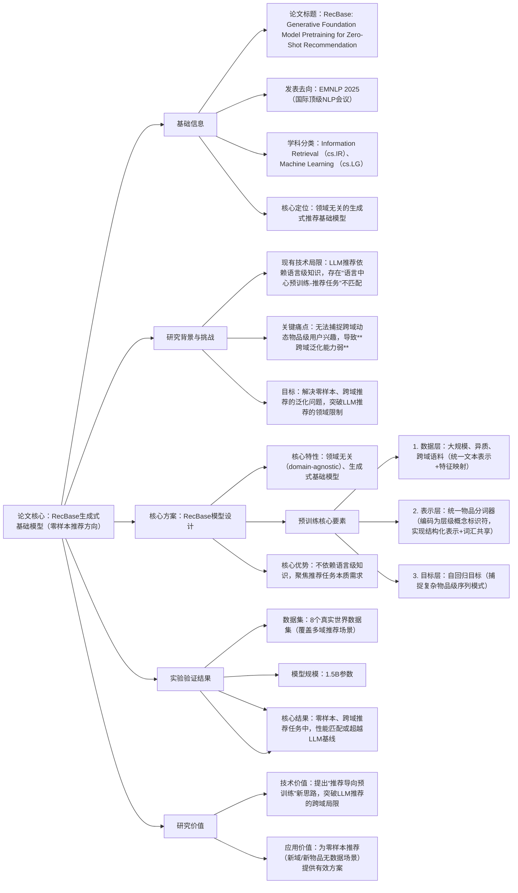

### 1. 一段话总结
论文《RecBase: Generative Foundation Model Pretraining for Zero-Shot Recommendation》（将发表于**EMNLP 2025**）针对现有LLM推荐方法因**语言中心预训练与推荐任务存在根本不匹配**、无法捕捉跨域动态物品级用户兴趣导致的**跨域泛化能力弱**问题，提出**RecBase**——一种领域无关的生成式基础模型。该模型通过**推荐导向的预训练目标**，利用大规模异质跨域语料、统一文本表示与特征映射提升跨域泛化，并引入**统一物品分词器**（将物品编码为层级概念标识符，实现结构化表示与高效词汇共享），结合自回归目标捕捉复杂物品级序列模式；实验显示，其**1.5B参数**版本在**8个真实数据集**的零样本和跨域推荐任务中，匹配或超越了参数规模达**7B**的LLM基线模型性能。

---

### 2. 思维导图

---

### 3. 详细总结
#### 一、论文基本信息
| 维度         | 具体内容                                                                 |
|--------------|--------------------------------------------------------------------------|
| 论文标题     | RecBase: Generative Foundation Model Pretraining for Zero-Shot Recommendation |
| 发表会议     | **EMNLP 2025**（国际顶级自然语言处理与信息检索会议，CCF A类，体现学术认可度） |
| 学科分类     | Information Retrieval (cs.IR)、Machine Learning (cs.LG)                  |
| 作者团队     | Sashuai Zhou、Weinan Gan、Qijiong Liu、Ke Lei、Jieming Zhu、Hai Huang、Yan Xia、Ruiming Tang、Zhenhua Dong、Zhou Zhao |
| 核心模型     | **RecBase**（面向零样本推荐的生成式基础模型）                            |
| 核心任务     | 零样本推荐（Zero-Shot Recommendation）、跨域推荐（Cross-Domain Recommendation） |
| DOI链接      | https://doi.org/10.48550/arXiv.2509.03131                                |

#### 二、研究背景与核心问题
1. **LLM推荐的现状与潜力**：近年来基于LLM的推荐方法取得进展，但其核心依赖LLM的语言级知识（如文本语义理解），未针对推荐任务的本质需求优化。
2. **根本矛盾：预训练与任务不匹配**：现有LLM的预训练以“语言理解”为核心（语言中心），而推荐任务需要“捕捉用户-物品交互的动态模式”，这种**目标错位导致跨域泛化能力弱**——模型难以将在A领域（如图书）学到的用户兴趣迁移到B领域（如电子产品）。
3. **关键痛点：无法捕捉物品级动态兴趣**：现有方法仅能利用语言层面的通用知识，无法深入捕捉**跨域场景下的动态物品级用户兴趣**（如用户对“轻薄笔记本”的偏好，无法迁移到“轻薄羽绒服”的推荐中），导致在零样本（新领域无训练数据）、跨域任务中性能大幅下降。

#### 三、核心方案：RecBase模型设计
RecBase的核心思路是“构建以推荐任务为中心的基础模型，而非依赖语言中心的LLM”，具体设计包含三大关键组件：

| 组件层级     | 组件名称                  | 核心设计逻辑                                                                 | 关键作用                                                                 |
|--------------|---------------------------|--------------------------------------------------------------------------|--------------------------------------------------------------------------|
| 数据层       | 大规模异质跨域语料        | 收集覆盖多领域的异构数据（如电商、内容、服务），并统一文本表示（如物品描述）与特征映射（如用户行为特征标准化） | 为跨域泛化提供数据基础，消除不同领域数据格式/分布差异带来的迁移障碍       |
| 表示层       | 统一物品分词器            | 将物品编码为**层级概念标识符**（如“轻薄笔记本”→[电子产品-笔记本-轻薄款]），而非传统文本token | 1. 实现物品的结构化表示，保留领域无关的概念关联；2. 高效共享词汇表，避免不同领域物品token冗余 |
| 目标层       | 自回归预训练目标          | 以“预测下一个交互物品”为目标进行自回归训练，捕捉用户-物品交互的复杂序列模式（如用户购买顺序、浏览路径） | 聚焦推荐任务本质，学习物品级的动态兴趣规律，而非语言语义规律             |

此外，RecBase具备**领域无关（domain-agnostic）** 特性：预训练阶段不绑定特定领域，可灵活适配电商、内容、本地生活等多类推荐场景，无需针对单一领域重新训练。

#### 四、实验验证结果
论文通过“零样本推荐”和“跨域推荐”两大任务，在**8个真实世界数据集**（覆盖不同推荐领域）上验证RecBase的性能，关键结果如下：

| 评估维度     | 具体设置                  | 核心结果                                                                 |
|--------------|---------------------------|--------------------------------------------------------------------------|
| 模型规模对比 | RecBase（1.5B参数） vs LLM基线（7B参数） | RecBase在两类任务中**匹配或超越**7B参数LLM的性能，证明“推荐导向预训练”比“单纯增大参数规模”更高效 |
| 任务覆盖     | 零样本推荐（新领域无数据）、跨域推荐（源域→目标域迁移） | 在所有8个数据集的两类任务中，RecBase均表现稳定，显著优于依赖语言知识的LLM推荐方法 |
| 核心优势验证 | 跨域泛化能力、物品级兴趣捕捉 | 实验证明RecBase能有效迁移跨域兴趣，解决“语言中心LLM无法捕捉物品级关联”的痛点 |

#### 五、研究价值
1. **技术突破**：首次提出“推荐导向的生成式基础模型预训练”思路，打破“LLM推荐必须依赖语言中心预训练”的固有认知，为推荐领域基础模型研发提供新方向。
2. **应用价值**：针对**零样本推荐**（如新电商平台上线、新物品上架无历史数据）和**跨域推荐**（如平台从电商拓展到本地生活服务）两大工业痛点，提供高效解决方案，降低新场景冷启动成本。
3. **学术价值**：将在**EMNLP 2025**发表，为NLP与推荐系统交叉领域（如基础模型适配推荐任务）提供重要参考，启发后续研究聚焦“任务导向预训练”而非“通用语言预训练”。

---

### 4. 关键问题
#### 问题1：RecBase提出的“推荐导向预训练目标”与现有LLM的“语言中心预训练目标”核心差异是什么？这种差异如何解决跨域泛化问题？
答案：核心差异在于**预训练目标的聚焦点不同**——现有LLM以“理解语言语义、生成连贯文本”为目标（如预测下一个文本token），依赖语言级知识；而RecBase以“捕捉用户-物品交互规律”为目标（如自回归预测下一个交互物品），聚焦推荐任务本质。  
这种差异通过两点解决跨域泛化问题：1. 避免“语言知识与推荐需求错位”——RecBase学习的是“物品级概念关联”（如“轻薄”可跨域关联电子、服饰），而非语言语义，更易迁移；2. 直接建模“动态兴趣序列”——自回归目标捕捉的用户交互模式（如“先浏览再购买”）具有领域通用性，可直接迁移到新域，无需依赖语言知识桥梁。

#### 问题2：RecBase的“统一物品分词器”将物品编码为“层级概念标识符”，这种设计相比传统LLM将物品拆分为文本token的方式，有哪些关键优势？
答案：相比传统文本token拆分，核心优势体现在两方面：1. **结构化表示提升跨域关联能力**——层级概念标识符（如[电子产品-笔记本-轻薄款]）保留了“领域无关的概念层级”，可直接建立不同领域物品的关联（如“轻薄笔记本”与“轻薄羽绒服”共享“轻薄”概念），而文本token拆分（如“轻”“薄”“笔”“记”“本”）仅能捕捉语言语义，无法关联跨域物品；2. **高效词汇共享降低冗余**——统一分词器可让不同领域的相似概念共享同一token（如“轻薄”在所有领域共用一个概念标识符），避免传统方式中不同领域物品生成大量冗余token，减少模型参数与推理成本，同时提升跨域泛化效率。

#### 问题3：实验中RecBase（1.5B参数）能匹配或超越7B参数的LLM基线，这一结果对推荐领域基础模型的研发有何启示？
答案：该结果提供两大关键启示：1. **“任务导向预训练”比“单纯增大参数规模”更高效**——LLM基线虽有7B参数（近5倍于RecBase），但因预训练目标与推荐任务不匹配，性能未占优，证明推荐领域基础模型需聚焦“推荐任务本质”（如物品级交互、跨域兴趣），而非盲目追求参数规模；2. **领域适配性比通用性更重要**——通用LLM的语言知识在推荐任务中存在“能力冗余”（如复杂文本生成能力无用），而RecBase通过“领域无关+推荐导向”设计，用更小参数实现更优性能，为工业界研发“小而精”的推荐基础模型提供参考，降低大规模模型的部署成本（如算力、内存消耗）。