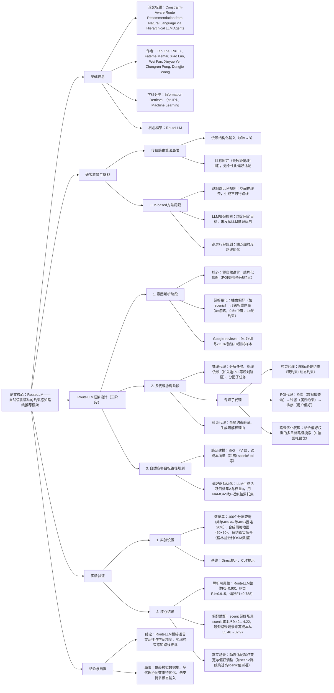

---

### 1. 一段话总结
针对传统路由算法（如最短路径）需**结构化输入且目标固定**、现有LLM-based方法**空间推理弱且无法联合建模路线级与POI级偏好**的核心问题，本文提出**RouteLLM**——一种**分层多智能体框架**，通过“解析代理（将自然语言查询分解为POI、路径、约束等结构化意图）→管理代理（协调专项子代理）→专项子代理（约束代理验证约束、POI代理检索排序POI、路径优化代理结合偏好成本优化路线）→验证代理（确保约束满足并生成可解释理由）”的流程，实现自然语言意图到约束感知路线的落地。实验表明，RouteLLM的查询解析**整体F1达0.901**（显著优于Direct和CoT方法），在纽约格林威治村真实场景中能根据“偏好 scenic路线”等需求动态调整路线（scenic成本从9.42降至4.22），有效平衡语言灵活性与空间精度。

---

### 2. 思维导图

---

### 3. 详细总结
#### 1. 引言：现有方法的核心局限
传统路由与LLM-based方法均无法满足“自然语言交互+约束感知+空间精度”的需求，具体局限如下：
| 方法类型       | 核心局限                                                                 |
|----------------|--------------------------------------------------------------------------|
| 传统路由算法   | 1. 需结构化输入（如固定起点/终点）；2. 优化目标固定（最短距离/时间）；3. 无法适配个性化偏好（如scenic路线） |
| LLM-based方法  | 1. 端到端规划：空间推理弱，生成不可行路线；2. LLM增强搜索：绑定固定目标，未发挥LLM推理优势；3. 高层规划：缺乏细粒度路线优化 |

#### 2. 相关工作
- **路由推荐**：早期以经典算法（Dijkstra、A*）为主，后续深度学习方法（如NeurOMLR）虽优化复杂模式，但仍刚性缺乏个性化；
- **LLM用于空间推理**：分为三类（端到端规划、LLM增强搜索、高层行程规划），均存在空间推理或目标灵活性的短板，未实现“自然语言→精确路线”的闭环。

#### 3. RouteLLM方法论：三阶段分层多智能体框架
##### 3.1 阶段1：意图解析——自然语言→结构化任务
通过**解析代理**采用“[对象+约束]”范式，将查询分解为三类可计算意图，核心是量化抽象偏好：
| 意图类型       | 定义与示例                                                                 | 处理方式                                                                 |
|----------------|--------------------------------------------------------------------------|--------------------------------------------------------------------------|
| POI需求（T_POI） | 含属性约束的地点需求（如“带WiFi的安静咖啡店”）                              | 解析为（类型，属性集），如（coffee_shop，{WiFi: true, quiet: true}）       |
| 路径需求（T_path）| 路线级偏好（硬约束：避 toll；抽象偏好：scenic路线）                          | 硬约束直接编码，抽象偏好→3级权重向量（0=忽略，0.5=中度，1=硬约束）         |
| 特殊需求（T_special）| 动态约束（如“避洪水区域”“适配天气”）                                        | 触发实时数据检索，或调整约束，或补充信息（不修改路线）                     |

##### 3.2 阶段2：多代理协调——任务分解与执行
由**管理代理**主导，解决“LLM空间推理弱”与“任务异质性”问题，具体机制：
1. **分层任务分解**：
    - 任务级：处理依赖（如先选POI再规划路径），确定执行顺序；
    - 步骤级：将单任务拆分为细粒度动作（如“找路线”→“识别途经点→计算距离→优化路径”），降低空间推理负担。
2. **专项子代理执行**：
   | 子代理类型   | 核心功能                                                                 | 示例场景                                                                 |
   |--------------|--------------------------------------------------------------------------|--------------------------------------------------------------------------|
   | 约束代理     | 1. 解析约束逻辑；2. 验证约束可行性（如“避 toll”是否可满足）；3. 动态更新约束 | 检测“避洪水”需求，检索实时数据并更新路径约束                               |
   | POI代理      | 1. 数据库查询POI；2. 属性过滤（如“4星以上意大利餐厅”）；3. 偏好排序         | 从50个POI中筛选出“4星+、含素食选项、预算$80内”的意大利餐厅                |
   | 路径优化代理 | 1. 路网建模（G=(V,E)，边成本向量含距离/scenic/toll等）；2. 多目标优化（ε-帕累托集） | 根据“scenic偏好权重=1”，生成scenic成本最低的路线，容忍toll成本上升         |
3. **验证代理**：
    - 全局约束验证：用公式$`(\mathcal{C}_{g}(s)=\begin{cases} feasible & if g_{j}(s) \leq \theta_{j}, \forall j \in \mathcal{G} \\ infeasible & otherwise \end{cases})`$验证总行程时间/预算等全局约束；
    - 结果生成：输出自然语言总结（如“此路线scenic值高但toll多”）、对比解释与可视化路线。

##### 3.3 阶段3：自适应多目标路径规划
核心是将LLM解析的偏好转化为算法可优化的成本，步骤如下：
1. **偏好量化**：LLM生成“活跃目标集A”（如{A={scenic, toll}}）与“权重向量u”（如u={1, 0.5}）；
2. **多目标搜索**：用NAMOA*算法找ε-近似帕累托集，ε-占优定义为$`(x \preceq_{\varepsilon} y \Leftrightarrow \forall j \in \mathcal{A}: x_{j} \leq(1+\varepsilon) y_{j} \text{ 且 } \exists k \in \mathcal{A}: x_{k}<(1+\varepsilon) y_{k})`$；
3. **结果输出**：交付代理解释路线权衡（如“路线A更快但无scenic视图，路线B慢5分钟但途经 waterfront”）。

#### 4. 实验验证
##### 4.1 实验设置
| 配置项         | 详情                                                                 |
|----------------|--------------------------------------------------------------------------|
| 地图环境       | 1. 合成地图：50×30网格（8向连通，含POI与边属性）；2. 真实场景：纽约格林威治村（OSM数据） |
| 查询数据集     | 100个分层查询（简单40%：≤2个POI+2个约束；中等40%：3个POI+3个约束；困难20%：5个POI+5个约束） |
| 基线方法       | 1. Direct： vanilla提示；2. CoT：链式思维提示                           |
| 核心LLM        | GPT-4o（解析代理、管理代理等核心逻辑）                                  |

##### 4.2 核心实验结果
1. **解析可靠性分析**（表1）：RouteLLM在偏好提取（F1=0.788）与整体解析（F1=0.901）上显著优于基线，且所有方法均保证100% schema有效性。
   | 方法       | POI F1 | 约束F1 | 偏好F1 | Schema有效性 | 整体F1 |
   |------------|--------|--------|--------|--------------|--------|
   | Direct     | 0.905  | 1      | 0.738  | 1            | 0.880  |
   | CoT        | 0.905  | 1      | 0.377  | 1            | 0.761  |
   | RouteLLM   | 0.915  | 1      | 0.788  | 1            | 0.901  |

2. **偏好适配实验**（表2）：RouteLLM能根据偏好动态调整路线成本，如scenic偏好场景中scenic成本降低55.2%，最短路径场景中距离成本降低7.0%。
   | 场景                | 危险成本 | 距离成本 | 能量成本 | scenic成本 | 坡度成本 |  toll成本 |
   |---------------------|----------|----------|----------|------------|----------|-----------|
   | A_基线              | 7.54     | 35.46    | 3.45     | 9.42       | 3.59     | 1.70      |
   | B_偏好scenic        | 7.86     | 36.38    | 3.90     | 4.22       | 3.92     | 7.25      |
   | C_偏好安全          | 7.54     | 35.46    | 3.45     | 9.42       | 3.59     | 1.70      |
   | D_偏好最短路径      | 7.41     | 32.97    | 3.54     | 8.59       | 3.63     | 2.60      |

3. **真实场景验证**（纽约格林威治村）：
    - 动态适配：修改起点后能重新生成合理路线；
    - 偏好响应：偏好scenic时路线绕过高scenic值街道（绿色标记），偏好最短路径时选择直达路线，验证真实场景的实用性。

#### 5. 结论与局限
- **结论**：RouteLLM通过分层多智能体设计，成功桥接自然语言灵活性与空间精度，实现约束感知的个性化路线推荐；
- **局限**：1. 依赖模拟数据集，真实世界大规模数据验证不足；2. 多代理协同效率待优化；3. 未支持多模态输入（如图像查询）。

---

### 4. 关键问题与答案
#### 问题1：RouteLLM如何针对性解决传统路由算法与现有LLM-based方法的核心局限？
**答案**：RouteLLM通过“分层多智能体+偏好量化+传统路由算法集成”的设计，同时解决两类方法的局限：
1. 针对传统路由算法的“结构化输入+固定目标”局限：
    - 由**解析代理**将自然语言查询（非结构化）分解为POI、路径约束、特殊需求等结构化意图，无需人工输入固定参数；
    - 引入“偏好量化机制”，将抽象偏好（如“scenic路线”）转化为3级权重向量，支持多目标动态优化（而非固定目标）；
2. 针对现有LLM-based方法的“空间推理弱+无法联合建模路线/POI偏好”局限：
    - 由**管理代理**将任务分解为细粒度步骤（如“选POI→算距离→优化路径”），降低LLM的空间推理负担；
    - 用**POI代理**（处理POI级偏好）与**路径优化代理**（处理路线级偏好）联合建模，并集成传统多目标算法（如NAMOA*）保证空间精度；
    - **验证代理**进一步校验路线可行性，避免LLM生成不可行路线。  
      实验中，RouteLLM在真实场景（纽约格林威治村）能动态适配起点与偏好变化，证明其对两类方法局限的解决效果。

#### 问题2：RouteLLM的多代理协调机制中，各代理的职责分工是什么？管理代理如何确保任务执行的逻辑性与效率？
**答案**：RouteLLM的多代理分工明确，管理代理通过“分层分解+依赖管理”保障执行逻辑与效率：
1. **各代理职责分工**：  
   | 代理类型       | 核心职责                                                                 | 输出结果                                                                 |
   |----------------|--------------------------------------------------------------------------|--------------------------------------------------------------------------|
   | 解析代理       | 分解自然语言查询为POI、路径、特殊约束，量化抽象偏好为权重向量             | 结构化意图字典（含POI属性、路径约束、偏好向量）                           |
   | 管理代理       | 1. 处理任务依赖（如先选POI再规划路径）；2. 分解任务为细粒度步骤；3. 分配子任务 | 任务执行序列、子任务分配结果                                             |
   | 约束代理       | 1. 解析约束逻辑；2. 验证约束可行性；3. 动态更新实时约束（如避洪水）       | 约束验证结果、更新后的约束条件                                           |
   | POI代理        | 1. 数据库查询POI；2. 按属性过滤；3. 按偏好排序                           | 排序后的POI列表（含坐标、属性）                                           |
   | 路径优化代理   | 1. 路网建模（边成本向量）；2. 基于偏好权重的多目标优化（ε-帕累托集）       | 候选路线列表（含各维度成本）                                             |
   | 验证代理       | 1. 验证全局约束（总时间/预算）；2. 生成可解释理由与可视化路线             | 可行路线、自然语言总结、对比解释                                         |
2. **管理代理的逻辑与效率保障**：
    - **依赖管理**：识别任务间依赖（如“道路通行状态”需先于“路径优化”），生成顺序执行序列；无依赖任务（如查询天气与搜索POI）并行执行，提升效率；
    - **任务分解**：将复杂任务拆分为细粒度步骤（如“找路线”→“识别途经点→计算边成本→生成帕累托集”），每个步骤聚焦单一目标，降低LLM空间推理负担；
    - **约束分类**：区分局部约束（如POI属性）与全局约束（如总预算），局部约束由子代理处理，全局约束由验证代理统一校验，避免重复计算。

#### 问题3：实验从哪些维度验证RouteLLM的有效性？关键结果如何证明其在“解析可靠性”与“偏好适配”上的优势？
**答案**：实验从“解析可靠性”“偏好适配能力”“真实场景适用性”三个维度验证有效性，关键结果如下：
1. **解析可靠性验证**（维度1）：
    - 实验设计：对比RouteLLM与Direct、CoT基线在“POI提取、约束提取、偏好提取”的F1分数，以及schema有效性；
    - 关键结果：RouteLLM的**整体F1达0.901**，显著优于Direct（0.880）与CoT（0.761）；尤其在偏好提取上，RouteLLM的F1=0.788，远超CoT的0.377（因CoT的通用推理无法适配路由领域的偏好语义）；所有方法schema有效性均为100%，确保输出结构化可用于下游。
2. **偏好适配验证**（维度2）：
    - 实验设计：设置4个场景（基线、偏好scenic、偏好安全、偏好最短路径），对比各场景的路线成本变化；
    - 关键结果：
        - 偏好scenic时，scenic成本从9.42降至4.22（降低55.2%），虽toll成本从1.70升至7.25，但体现多目标权衡；
        - 偏好最短路径时，距离成本从35.46降至32.97（降低7.0%），验证偏好与路线成本的精准映射；
        - 偏好安全时，危险成本与基线一致（7.54），证明系统能识别“基线已最优”的场景，避免无效调整。
3. **真实场景适用性验证**（维度3）：
    - 实验设计：基于纽约格林威治村OSM数据，测试“起点变更”与“偏好变更”的路线适配；
    - 关键结果：修改起点后能重新生成连贯路线，偏好scenic时路线绕过高scenic值街道，偏好最短路径时选择直达路线，证明其在真实复杂路网中的实用性。

综上，实验从“输入解析→偏好映射→真实落地”全链路验证了RouteLLM的有效性。