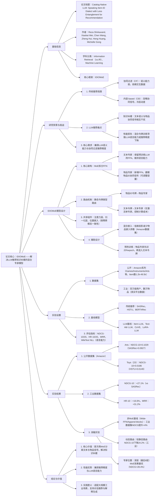

---

### 1. 一段话总结
为解决传统推荐系统（协同过滤缺乏语义能力、LLM难以建模协同信号）与现有LLM推荐方法中**知识纠缠**（文本语义与物品协同信号相互干扰）的核心问题，本文提出**IDIOMoE（Item-ID + Oral-language Mixture-of-Experts Language Model）**——一种基于**混合专家（MoE）** 的LLM增强推荐模型。该模型将预训练LLM的每个Feed Forward Network（FFN）拆分为**文本专家（保留原LLM能力）** 与**物品专家（建模协同信号）**，通过**静态令牌类型路由**（物品ID令牌入物品专家，文本令牌入文本专家）避免信号干扰，同时共享注意力与归一化层保障一致性。实验表明，IDIOMoE在**Amazon系列公开数据集**（如Amazon-Arts的NDCG@10达0.1029）与**百万级用户工业数据集**（NDCG@10较SASRec提升**27.1%**、HR@10提升**16.6%**、MRR提升**31.2%**）上均显著优于传统推荐模型（SASRec、HSTU）与LLM基线（Item-LLM、Text-Attr LLM），且完全保留LLM的语言理解能力（WikiText NLL与基准LLM差异<0.5%）。

---

### 2. 思维导图

---

### 3. 详细总结
#### 1. 引言：问题提出与研究动机
传统推荐系统与LLM推荐存在难以调和的矛盾，具体表现为：
- **协同过滤（CF）局限**：依赖用户-物品交互数据，语义理解弱，无法支持自然语言查询与解释生成；
- **LLM推荐痛点**：预训练聚焦文本语义，难以建模隐式协同信号；且直接混合物品ID与文本令牌会导致**知识纠缠**（文本能力与协同精度相互损害）；
- **现有方案缺陷**：如Text-derived Bias方法（物品嵌入+文本向量）虽提升推荐精度，但导致LLM语言能力下降（WikiText NLL升高20%+）；直接扩展LLM词汇表（CoVE、CLLM4Rec）未解决信号干扰问题。

本文目标：设计一种能**分离文本语义与物品协同信号**、同时保留LLM语言能力的推荐模型，即IDIOMoE。

#### 2. 相关工作：三类方法的局限性
| 方法类别       | 代表模型                | 核心局限                                                                 |
|----------------|-------------------------|--------------------------------------------------------------------------|
| 传统推荐       | SASRec、BERT4Rec、HSTU  | 语义能力弱，依赖ID嵌入，无法支持对话推荐                                 |
| LLM作为推荐器  | P5、VIP5、E4SRec        | 需 verbose 文本描述物品，忽略协同信号，易出现知识纠缠                     |
| ID-LLM混合     | CoVE、CLLM4Rec、URM      | 物品ID与文本令牌共享参数，导致语义-协同信号干扰，语言或推荐性能下降       |

#### 3. 模型设计：IDIOMoE的核心架构
IDIOMoE基于预训练解码器LLM（Qwen2.5-0.5B/1.5B）改造，核心是**MoE拆分FFN**与**静态路由**，具体设计如下：

##### 3.1 核心组件
| 组件名称               | 功能描述                            | 关键细节                                                                 |
|------------------------|---------------------------------|--------------------------------------------------------------------------|
| 令牌扩展               | 新增`<\|it-id\|>`专用令牌，扩展LLM词汇表    | 物品嵌入层可训练，工业场景中仅训练物品嵌入与物品专家，冻结LLM其他参数     |
| FFN拆分（MoE）         | 将每个Transformer块的FFN拆分为文本专家与物品专家 | 文本专家：保留原LLM的FFN，维持语言能力；物品专家：结构相同，容量可调整（如1/2、1/4倍文本专家） |
| 静态令牌路由           | 按令牌类型分配专家：物品ID→物品专家，文本→文本专家     | 仅激活单专家/令牌，计算成本与基础LLM接近（1024令牌时推理延迟仅+3.8%）   |
| 共享层                 | 注意力层、LayerNorm、位置嵌入跨专家共享        | 保障文本与物品令牌的表示一致性，避免模态断裂                             |

##### 3.2 辅助优化策略
- **混合嵌入**：Amazon数据集采用低维投影（$`(E=W_l \times W_u\)，\(W_l \in \mathbb{R}^{N_{items} \times d_{mid}})`$），减少物品嵌入参数50%+；
- **预热训练**：物品专家先以纯物品ID序列训练20%epoch，再线性混入文本令牌，避免冷启动时文本信号压制协同学习；
- **语言能力保留**：文本专家完全复用预训练参数，仅在必要时微调（工业场景冻结文本专家）。

#### 4. 实验验证：性能与消融分析
##### 4.1 数据集概况
| 数据集         | 类型       | 用户数    | 物品数    | 交互数       | 核心场景               |
|----------------|------------|-----------|-----------|--------------|------------------------|
| Amazon-Games   | 公开       | 4.2k      | 13.8k     | 42.3k        | 游戏推荐               |
| Amazon-Arts    | 公开       | 2.2k      | 9.4k      | 22.2k        | 艺术品推荐             |
| Amazon-Toys(23)| 公开（大） | 43.2k     | 162.0k    | 432.3k       | 玩具推荐               |
| 工业数据集     |  proprietary| 百万级    | 数万      | 未披露       | 真实平台推荐           |

##### 4.2 核心性能结果
###### 4.2.1 公开数据集（Amazon）
| 数据集         | 模型       | NDCG@10 | HR@10 | 对比基线提升（vs SASRec） |
|----------------|------------|---------|--------|--------------------------|
| Amazon-Arts    | SASRec     | 0.0927  | 0.1290 | -                        |
|                | Item-LLM   | 0.0901  | 0.1272 | -2.8%                    |
|                | IDIOMoE    | 0.1029  | 0.1409 | +11.0%                   |
| Amazon-Toys(23)| HSTU       | 0.0149  | 0.0332 | -                        |
|                | Text-Attr LLM | 0.0164  | 0.0300 | +10.1%                   |
|                | IDIOMoE    | 0.0186  | 0.0361 | +24.8%                   |

###### 4.2.2 工业数据集（关键指标）
| 模型         | NDCG@10  | HR@10    | MRR      | 语言能力（WikiText NLL） |
|--------------|----------|----------|----------|--------------------------|
| SASRec（基线）| 1.00x    | 1.00x    | 1.00x    | -                        |
| HSTU         | 1.105x   | 1.027x   | 1.132x   | -                        |
| Item-LLM     | 1.235x   | 1.130x   | 1.243x   | 1.20x（基线LLM=1.00x）   |
| IDIOMoE      | **1.271x** | **1.166x** | **1.312x** | 1.005x（与基线LLM无差异） |

##### 4.3 消融实验：关键设计的必要性
| 消融场景               | 工业数据集NDCG@10变化 | 核心结论                                                                 |
|------------------------|------------------------|--------------------------------------------------------------------------|
| 非MoE基线（Wide-FFN）  | +3.8%                  | 单纯增加参数无法解决知识纠缠，MoE结构是性能关键                           |
| 动态路由（MoA/MoT）    | -24.2%                 | 动态路由导致专家角色模糊，静态令牌路由更适合分离文本-物品信号             |
| MoE仅前8层             | +9.6%                  | 深层Transformer更适合建模协同信号，最后8层MoE效果最优（+28.4%）          |
| 物品专家容量缩小8倍     | -4.5%                  | 工业场景需足够物品专家容量，小数据集（Amazon-Beauty）可缩小至1/4容量     |

#### 5. 结论与意义
- **理论贡献**：首次提出用MoE结构分离LLM中的文本语义与物品协同信号，解决知识纠缠问题；
- **实践价值**：在工业级数据上实现推荐精度与语言能力的双提升，支持对话推荐、解释生成等高级功能；
- **局限性**：物品专家容量需按数据集规模调整，跨领域（如音乐、影视）泛化性需进一步验证。

---

### 4. 关键问题与答案
#### 问题1：IDIOMoE通过哪些核心设计解决了LLM推荐中的“知识纠缠”问题？这种设计为何能同时保留LLM的语言能力？
**答案**：  
IDIOMoE通过**“FFN拆分+静态令牌路由”** 解决知识纠缠，具体设计与原理如下：
1. **FFN混合专家拆分**：将每个Transformer块的FFN拆分为**文本专家**（完全复用预训练LLM的FFN参数，负责语义理解）与**物品专家**（新增FFN，专注建模物品ID的协同信号），使两种信号在FFN层独立处理，避免参数共享导致的干扰；
2. **静态令牌类型路由**：严格按令牌类型分配专家（物品ID→物品专家，文本→文本专家），且仅激活单专家/令牌，确保文本信号不流入物品专家、协同信号不污染文本专家；
3. **共享核心层保障一致性**：注意力层、LayerNorm、位置嵌入跨专家共享，避免模态表示断裂，同时文本专家完全保留预训练参数（工业场景冻结），因此LLM的语言能力（如WikiText NLL、MMLU基准）几乎无损失（与原LLM差异<0.5%）。

#### 问题2：IDIOMoE在公开数据集与工业数据集上的性能表现有何差异？这种差异反映了模型的什么特性？
**答案**：  
两者性能差异与特性如下：
1. **性能差异**：
    - 公开数据集（如Amazon-Arts）：IDIOMoE较SASRec的NDCG@10提升**11.0%**，优势相对温和；
    - 工业数据集（百万级用户）：较SASRec的NDCG@10提升**27.1%**、MRR提升**31.2%**，优势显著扩大；
2. **差异反映的特性**：
    - 工业数据集用户-物品交互更稀疏、场景更复杂，传统模型（SASRec、HSTU）易受数据稀疏影响；而IDIOMoE的物品专家能更高效建模大规模协同信号，文本专家可利用LLM的世界知识补充稀疏交互的语义信息，因此在复杂场景中优势更突出；
    - 公开数据集物品数较少（如Amazon-Arts仅9.4k物品），知识纠缠问题不显著，非MoE模型（如Item-LLM）性能差距小；工业数据集物品数达数万，知识纠缠影响加剧，MoE结构的分离优势更明显。

#### 问题3：消融实验显示“静态路由”比“动态路由”性能高24.2%，为何静态路由更适合IDIOMoE的场景？动态路由的局限性在哪里？
**答案**：  
静态路由更适合的核心原因是**“专家角色的确定性”**，动态路由的局限性源于信号干扰，具体分析如下：
1. **静态路由的适配性**：  
   IDIOMoE的核心目标是分离“文本语义”与“物品协同”两种异质信号，静态路由通过令牌类型强制分配专家，使文本专家专注语义、物品专家专注协同，形成稳定的角色分工，训练过程中专家可持续优化特定任务，避免功能漂移；
2. **动态路由的局限性**：
    - 角色模糊：动态路由（如MoA/MoT）根据令牌内容动态选择专家，可能导致文本令牌流入物品专家、物品令牌流入文本专家，重新引发知识纠缠；
    - 训练不稳定：动态路由需学习路由权重，工业数据集上易因数据稀疏导致路由策略震荡，专家无法形成稳定的任务专精能力，最终NDCG@10较静态路由下降24.2%；
    - 计算冗余：动态路由需激活多个专家并计算路由权重，推理延迟较静态路由高15.6%（256令牌时），不符合工业场景的效率要求。