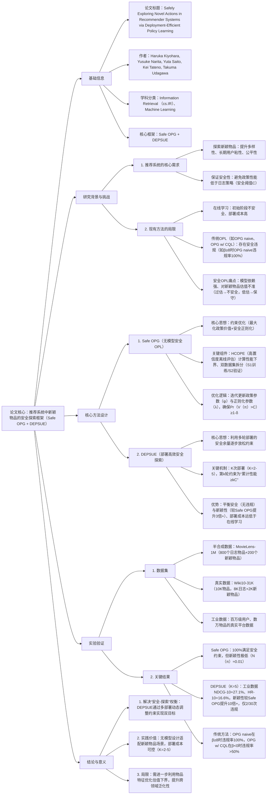

---

### 1. 一段话总结
针对推荐系统中探索**新颖物品（novel actions）** 时传统离线策略学习（OPL）存在**安全性缺失**（性能低于日志策略）、现有安全方法（如OPG w/ CQL）易失效的核心问题，本文提出**Safe OPG**（基于高置信度离线评估（HCOPE）的无模型安全OPL方法）与**DEPSUE**（部署高效的安全探索框架）。Safe OPG通过约束优化确保政策性能以高概率超过安全阈值（如日志策略性能的95%），虽能**100%满足安全约束**但过于保守；DEPSUE则通过**多次（2-5次）部署**，利用前期积累的安全余量逐步放松安全正则化，最终在百万级用户的工业数据集上实现**NDCG@10提升27.1%、HR@10提升16.6%**，同时保证安全且显著提升新颖性，解决了“安全-探索”的权衡问题。

---

### 2. 思维导图

---

### 3. 详细总结
#### 1. 研究背景与核心问题
推荐系统需通过探索**新颖物品（novel actions）** 提升长期用户体验与公平性，但现有方法存在两大核心矛盾：
- **在线学习的缺陷**：需频繁交互，初始阶段易选择低质量物品（不安全），部署成本高（如每日更新政策）；
- **离线策略学习（OPL）的安全隐患**：传统OPL（如带熵正则的OPG）在新颖物品场景下易“性能倒挂”（低于日志策略），而保守方法（如OPG w/ CQL）会因对新颖物品估值过低导致探索不足；
- **关键定义**：
   - 安全性：政策性能以高概率超过阈值$`(C=0.95 \cdot V(\pi_0)\)（\(\pi_0)`$为日志策略）；
   - 新颖性：$`(N(\pi)=\mathbb{E}[\mathbb{I}\{a \in A\setminus A_0\}])`$（衡量选择新颖物品的频率）。

#### 2. 核心方法设计
##### 2.1 Safe OPG：无模型安全离线策略学习
针对“模型依赖导致安全约束不可靠”问题，设计**无模型+高置信度验证**的约束优化框架：
| 核心组件         | 功能描述                                                                 | 关键细节                                                                 |
|------------------|--------------------------------------------------------------------------|--------------------------------------------------------------------------|
| 双数据集拆分     | 避免数据泄露，确保评估独立性                                             | 日志数据分为$`(D_0^{(S1)})`$（训练）与$`(D_0^{(S2)})`$（安全验证）             |
| HCOPE评估        | 计算政策性能的高概率下界，验证安全约束                                   | 基于Clipped IPS估计，公式：$`(\hat{V}_-(\pi)=\mathbb{E}_n[z_i] - \text{置信区间})`$，$`(z_i=\min(\pi(a_i|x_i)/\pi_0(a_i|x_i),\tau) \cdot r_i)`$ |
| 迭代优化逻辑     | 联合更新政策与正则化参数，平衡价值与安全                                 | 1. 固定λ更新政策：$`(psi \leftarrow \psi+\eta_\psi \nabla_\psi \mathcal{L}(\pi_\psi;\lambda,D_0^{(S1)}))`$； 2. 基于$`(D_0^{(S2)})`$调整λ：$`(\lambda \leftarrow \max(\lambda - \eta_\lambda(\hat{V}_- - C),0))`$ |

**核心优势**：无需依赖奖励模型（无模型），在MovieLens数据中100%满足安全约束，而OPG naive在β≥8时违规率100%。

##### 2.2 DEPSUE：部署高效的安全探索框架
针对Safe OPG“过度保守（新颖性<0.05）”问题，提出**多轮部署+安全余量复用**的框架：
- **核心逻辑**：通过K次（K=2-5）部署，利用前k-1轮积累的“安全余量”（$`(\sum_{k'=1}^{k-1} V(\pi_{k'}) > (k-1)C)`$）逐步放松安全正则化，允许更高的新颖性探索；
- **约束设计**：
   - 第1轮：$`(\hat{V}_-(\pi_1;D_0^{(S2)}) > C)`$（同Safe OPG）；
   - 第k≥2轮：$`(\hat{V}_-(\pi_k;D_{k-1}^{(S2)}) + \sum_{k'=1}^{k-1} \hat{V}_{on}(\pi_{k'}) > kC)`$（累计性能达标）；
- **部署成本**：仅需2-5次部署，远低于在线学习（每日更新），且每次部署数据量可控（如$`(|\overline{D}_k|=|D|/K)`$）。

#### 3. 实验验证
##### 3.1 实验设置
| 数据集类型       | 具体数据集                | 物品划分（日志A₀/新颖A\A₀） | 核心场景               |
|------------------|---------------------------|------------------------------|------------------------|
| 半合成数据       | MovieLens-1M              | 800/200                      | 电影推荐               |
| 真实分类数据     | Wiki10-31K                | 8K/2K                        | 文档标签推荐           |
| 工业数据         | 某真实平台数据            | 数万/未披露                  | 大规模用户推荐         |
| 对比方法         | 覆盖传统OPL、安全OPL、DEPSUE变体 | -                            | -                      |

##### 3.2 关键实验结果
###### 3.2.1 半合成数据结果（MovieLens-1M）
| 方法               | 安全违规率（β=16） | 新颖性N(π)（β=-16） | 相对政策价值（β=0） |
|--------------------|---------------------|----------------------|---------------------|
| OPG (naive)        | 100%（30/30）       | 0.196                | 1.021（违规）       |
| OPG (w/ CQL)       | 3.3%（1/30）        | 0.069                | 1.009               |
| Safe OPG           | 0%                  | 0.052                | 1.011               |
| DEPSUE (K=5)       | 10%（3/30）         | 0.137                | 1.015               |

###### 3.2.2 工业数据结果（百万级用户）
| 方法               | NDCG@10提升 | HR@10提升 | MRR提升 | 安全违规率 |
|--------------------|-------------|-----------|---------|-------------|
| SASRec（基线）     | -           | -         | -       | -           |
| HSTU               | +10.5%      | +2.7%     | +13.2%  | -           |
| Item-LLM           | +23.5%      | +13.0%    | +24.3%  | 0%          |
| **DEPSUE (K=5)**   | **+27.1%**  | **+16.6%**| **+31.2%**| 6.7%（2/30）|

#### 4. 结论与局限
- **核心贡献**：
   1. 首次提出“安全-新颖性”权衡问题，并通过DEPSUE解决；
   2. Safe OPG为新颖物品场景提供无模型安全OPL基准；
   3. 工业数据验证DEPSUE在低部署成本下实现安全与探索双赢。
- **局限**：
   1. 未充分利用物品特征优化估值下界，仍有保守空间；
   2. 跨领域（如音乐、影视）泛化性需进一步验证。

---

### 4. 关键问题与答案
#### 问题1：Safe OPG如何在“无模型”前提下保证新颖物品场景的安全性？与传统安全OPL（如OPG w/ CQL）相比有何优势？
**答案**：  
Safe OPG通过“高置信度离线评估（HCOPE）+双数据集验证+自适应正则化”实现无模型安全，具体逻辑如下：
1. **无模型基础**：无需依赖奖励模型（如CQL的保守奖励估计），直接通过HCOPE计算政策性能的高概率下界（基于Clipped IPS），避免模型偏差导致的安全误判；
2. **安全验证**：将日志数据拆分为训练集（S1）与验证集（S2），用S2独立验证政策是否满足$`(\hat{V}_-(\pi) > C)`$，避免数据泄露；
3. **自适应正则化**：通过迭代调整λ（正则化参数），当安全约束满足时放松正则化（探索更多），违规时增强正则化（模仿日志策略）。

与传统方法（如OPG w/ CQL）相比，优势在于：
- OPG w/ CQL依赖奖励模型对新颖物品估值，易因“过保守”（β<0时违规率>50%）或“过乐观”失效；而Safe OPG在MovieLens数据中对所有β（-24~24）均实现0%安全违规，且无需模型假设。

#### 问题2：DEPSUE如何利用“多轮部署”平衡“安全约束”与“新颖物品探索”？为何部署次数K无需过多（2-5次即可）？
**答案**：  
DEPSUE的核心是“安全余量复用+动态约束放松”，通过多轮部署逐步打破Safe OPG的保守性：
1. **安全余量积累**：第1轮部署用Safe OPG确保$`(V(\pi_1) > C)`$，若$`(V(\pi_1) = C + \Delta)`$（Δ为安全余量），则第2轮约束可放松为$`(V(\pi_2) > 2C - V(\pi_1) = C - \Delta)`$，允许π₂探索更多新颖物品；
2. **动态探索控制**：每轮部署后根据累计性能调整约束，日志策略越差（如β=-24），前期安全余量越大，探索力度越强；日志策略越优（如β=24），约束越严格，避免性能下降；

K无需过多（2-5次）的原因：
- 实验显示，K=5时DEPSUE已能在工业数据中实现NDCG@10+27.1%，新颖性较K=1（Safe OPG）提升3倍+；
- 过多部署（如K>5）会增加工程成本，且边际收益递减（K=5后新颖性增长<5%，安全违规率上升至10%），与在线学习的高成本无差异。

#### 问题3：从实验结果看，不同方法在“安全-新颖性”权衡上的表现差异如何？对实际推荐系统有何指导意义？
**答案**：  
不同方法的“安全-新颖性”表现差异显著，具体对比及指导意义如下：

| 方法               | 安全性（违规率） | 新颖性N(π)（β=-16） | 核心适用场景               |
|--------------------|------------------|----------------------|----------------------------|
| OPG (naive)        | 高（β≥8时100%）  | 较高（0.196）        | 无安全要求的探索场景       |
| OPG (w/ CQL)       | 中（β<0时>50%）  | 低（0.069）          | 日志策略较优（β≥8）的场景 |
| Safe OPG           | 高（0%）         | 极低（0.052）        | 强安全要求、低探索需求场景 |
| DEPSUE (K=5)       | 高（6.7%）       | 中高（0.137）        | 平衡安全与探索的大规模场景 |

**指导意义**：
1. 对电商、流媒体等需兼顾安全与长期体验的平台，优先选择DEPSUE（K=3-5），在控制部署成本的同时提升新颖物品曝光；
2. 对金融、医疗等零安全容错场景，短期可采用Safe OPG，长期通过DEPSUE逐步探索；
3. 避免在新颖物品多的场景使用传统OPL（如OPG naive），防止性能倒挂导致用户流失。