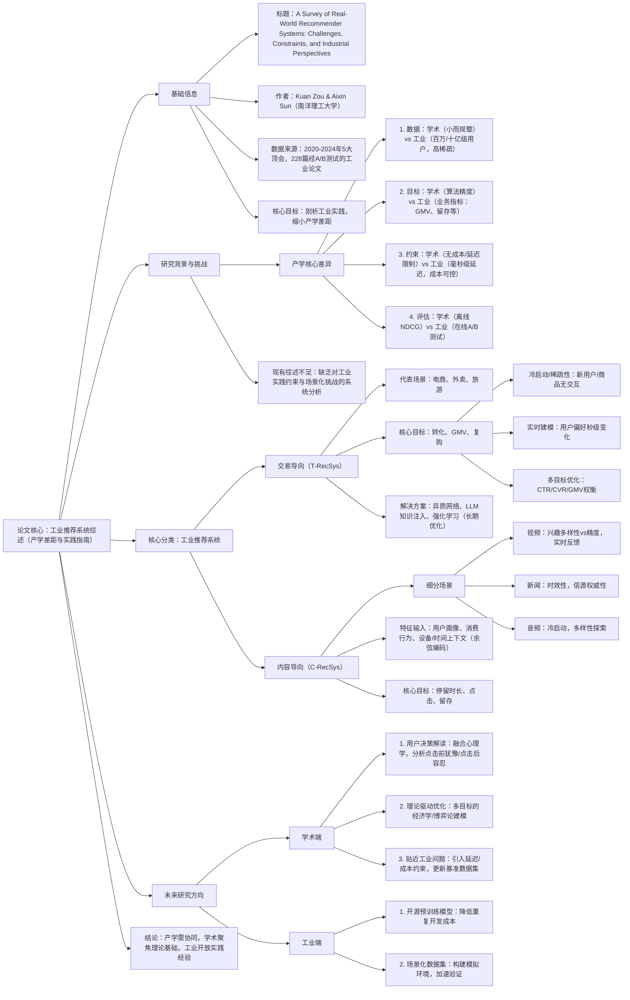

### 1. 一段话总结
本文是一篇聚焦**工业推荐系统**的系统性综述，通过分析2020-2024年5大顶会的**228篇工业实践论文**（经A/B测试验证），对比了学术与工业推荐系统在数据规模、实时性要求、评估体系等维度的核心差异，提出**交易导向（T-RecSys）与内容导向（C-RecSys）** 的新型分类框架。前者以电商为代表，核心挑战为冷启动、实时偏好建模及多目标优化，依赖异质网络、LLM等技术解决；后者涵盖视频、新闻、音频等场景，重点应对兴趣多样性、时效性、冷启动等问题。论文指出，学术研究多聚焦离线算法优化，而工业系统需平衡效果、成本、实时性等约束，并提出未来需强化**用户决策机制解读、跨学科理论融合、贴近工业场景的问题定义**等方向，以缩小产学差距。

---

### 2. 思维导图

---

### 3. 详细总结
#### 一、引言（Introduction）
1. **研究背景**  
   推荐系统是数字生态的核心（如TikTok、亚马逊），但学术研究多局限于离线数据集优化，与工业实践存在巨大差距。论文通过筛选**2020-2024年SIGIR、RecSys等5大顶会的272篇论文**，最终保留**228篇经在线A/B测试验证的工业论文**，系统性剖析工业推荐系统的挑战与解决方案。

2. **核心创新**  
   提出基于“物品特征与推荐目标”的分类框架：
    - **交易导向（T-RecSys）**：以促成交易为目标（如电商），优化GMV、转化率；
    - **内容导向（C-RecSys）**：以提升消费与 engagement 为目标（如视频、新闻），优化停留时长、点击。

#### 二、学术与工业推荐系统的核心差异
| 维度                | 学术研究                                  | 工业实践                                  |
|---------------------|-------------------------------------------|-------------------------------------------|
| **数据规模**        | 小数据集（如MovieLens，10万级交互）        | 亿级用户，十亿级交互，高稀疏性            |
| **核心目标**        | 算法精度（NDCG、Recall）                   | 业务价值（GMV+1%、留存+1.5%）             |
| **关键约束**        | 无成本、延迟限制                          | 毫秒级响应（＜100ms），GPU/CPU成本可控    |
| **评估方法**        | 离线实验                                  | 在线A/B测试（核心）+ 离线验证             |
| **优化重点**        | 模型结构创新                              | 效果、成本、稳定性的多维度权衡            |

#### 三、交易导向推荐系统（T-RecSys）
##### 3.1 核心挑战与解决方案
| 挑战                | 具体描述                                  | 工业解决方案                              |
|---------------------|-------------------------------------------|-------------------------------------------|
| **冷启动/稀疏性**   | 新用户/商品无交互，长尾商品曝光不足        | 1. 异质网络：融合用户-商品-属性关系 2. 跨域迁移：复用电商数据到保险场景 3. LLM：生成商品语义嵌入，解决ID缺失 |
| **实时偏好建模**   | 用户兴趣随促销/滑动/位置秒级变化          | 1. 触发式兴趣网络：捕捉点击后的即时兴趣 2. 轻量化模型：GreenSeq（神经架构搜索降本） 3. 图结构：三角兴趣单元建模潜在动机 |
| **多目标优化**     | CTR/CVR/GMV存在冲突（如低价商品CTR高但GMV低） | 1. 多任务学习：PLE（分层提取共享/任务特征） 2. 强化学习：优化商品全生命周期价值 3. 因果推断：量化不同目标的 uplift |

##### 3.2 典型案例
- 淘宝：基于570亿样本训练的多视图图学习框架，平衡CTR与复购率；
- 美团：跨域迁移框架，提升广告场景CTR与GMV双指标。

#### 四、内容导向推荐系统（C-RecSys）
##### 4.1 细分场景挑战与方案
| 场景        | 核心挑战                                  | 关键解决方案                              |
|-------------|-------------------------------------------|-------------------------------------------|
| **视频**    | 1. 兴趣多样性vs精度 2. 反馈噪声（跳过≠不感兴趣） 3. 实时响应 | 1. 序列建模：TWIN-V2（长序列聚类压缩） 2. 去偏：因果干预消除时长偏差 3. 端侧重排序：实时利用滑动/点赞信号 |
| **新闻**    | 1. 时效性（内容生命周期短） 2. 信源权威性 3. 避免重复 | 1. 高频更新：模型每小时刷新，缓存新闻向量 2. LLM：提取信源与主题特征 3. 约束重排序：控制品类/信源分布 |
| **音频**    | 1. 冷启动（新歌/播客） 2. 多样性探索需求高 | 1. 外部知识注入：LLM推断音乐风格 2. 混合策略：多项式融合音乐与播客 3. 兴趣时钟：时间动态调整推荐权重 |

#### 五、未来研究方向
##### 5.1 学术研究重点
1. **用户决策机制解读**：现有系统仅依赖点击/购买等行为，需融合心理学分析“点击前犹豫”“点击后容忍”等状态，提升长期满意度；
2. **理论驱动优化**：用经济学（效用函数）、心理学（认知偏差）替代经验性权重调参，实现多目标的 principled 权衡；
3. **贴近工业场景**：
    - 数据集：构建含分布漂移的真实数据集（如Yambda-5B）；
    - 问题定义：将延迟、成本作为优化约束，而非忽略。

##### 5.2 工业实践重点
1. **开源预训练模型**：释放生产级模型（如万亿参数生成式推荐模型），附调优指南；
2. **场景化模拟环境**：将数据集转化为可交互环境，降低A/B测试成本；
3. **系统级优化**：公开GPU/CPU成本优化经验（如多尺寸嵌入，参数降30%）。

#### 六、结论
工业推荐系统是“技术-业务-工程”的综合体，学术研究需跳出“离线精度竞赛”，聚焦工业真实约束；工业需开放更多实践数据与问题，最终通过产学协同推动推荐系统从“短期效果优化”走向“长期生态健康”。

---

### 4. 关键问题
#### 问题1：学术与工业推荐系统的核心差异体现在哪些维度？造成这些差异的根本原因是什么？
**答案**：  
核心差异体现在4个维度（如表2所示），根本原因是**目标与约束的本质不同**：
- 学术研究以“方法论创新”为目标，不受实际业务中的成本、延迟、数据规模约束，可专注于离线数据集上的算法精度提升；
- 工业系统以“商业价值”为核心目标，需在“效果（如GMV）、成本（如GPU消耗）、体验（如延迟）”之间做严格权衡，且必须通过在线A/B测试验证真实用户价值，导致技术选择更侧重实用性而非理论优雅性。  
  例如，学术中表现优异的复杂Transformer模型，因推理延迟＞500ms，工业中常被轻量化模型（如GreenSeq）替代。

#### 问题2：交易导向（T-RecSys）与内容导向（C-RecSys）推荐系统的核心区别是什么？请从目标、挑战、技术路径三方面对比说明。
**答案**：  
二者的核心区别源于“推荐目标的本质差异”（交易转化vs内容消费），具体对比如下：  
| 维度        | 交易导向（T-RecSys）                      | 内容导向（C-RecSys）                      |
|-------------|-------------------------------------------|-------------------------------------------|
| **核心目标** | 短期交易（转化率、GMV）+ 长期复购          | 短期 engagement（停留时长、点击）+ 长期留存 |
| **核心挑战** | 冷启动（新商品）、实时偏好漂移、多目标冲突  | 兴趣多样性vs精度、反馈噪声、时效性（新闻） |
| **技术路径** | 1. 异质网络（融合商品属性） 2. 强化学习（长期价值） 3. 因果推断（转化归因） | 1. 序列建模（捕捉短期兴趣） 2. 多任务学习（去噪） 3. 约束重排序（多样性） |  
例如，电商（T-RecSys）用强化学习优先曝光高潜力新商品以提升长期GMV；短视频（C-RecSys）用序列建模快速响应用户从“美食”到“旅行”的兴趣切换。

#### 问题3：论文提出的“用户决策机制解读”为何被视为未来学术研究的关键方向？现有方法存在哪些局限？
**答案**：
1. **关键原因**：  
   推荐系统的本质是“理解用户意图并匹配信息”，但现有方法仅依赖**后验行为信号**（如点击、购买），忽略了行为产生前的决策过程与行为后的真实反馈，导致优化偏离用户真实需求，影响长期满意度。

2. **现有方法的局限**：
    - 误判“犹豫性点击”：用户点击某商品仅为了解信息（非购买意图），却被系统视为兴趣信号，导致过度推荐；
    - 忽略“容忍性消费”：用户完整观看某视频但实际不感兴趣（如被动观看），系统误判为正向信号，加剧信息茧房；
    - 缺乏认知洞察：未考虑“好奇心驱动的点击”“社交压力下的互动”等心理学因素，优化局限于短期指标。

3. **实践价值**：  
   融合心理学与认知科学（如用户决策理论），可将“犹豫度”“容忍度”纳入优化目标，例如对犹豫性点击的商品降低推荐权重，最终提升用户长期留存与平台信任度。