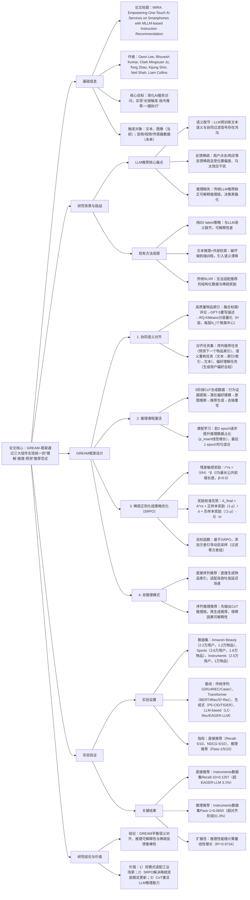

### 1. 一段话总结
浙江大学与华为诺亚方舟实验室团队提出**GREAM（Generative Reasoning Recommendation via LLMs）** 框架，旨在解决LLM推荐中**文本语义与协同过滤信号脱节**、**用户反馈稀疏随机**、**推理可解释性缺失**三大核心问题。该框架通过三大组件实现统一的“理解-推理-预测”推荐范式：1）**协同语义对齐（Collaborative-Semantic Alignment）**，融合物品标题/评论生成高质量文本描述，经RQ-KMeans构建语义一致的离散物品索引，并设计对齐任务注入交互语义；2）**推理课程激活（Reasoning Curriculum Activation）**，生成含**5阶段Chain-of-Thought（CoT）** 监督的合成数据集（行为证据提取→潜在偏好建模→意图推断→推荐生成→去噪重写），通过课程学习逐步提升推理难度；3）**稀疏正则化组策略优化（SRPO）**，结合**残差敏感可验证奖励**（基于最长公共前缀长度的凹函数奖励）与**奖励校准组优势估计**（平衡密集稳定信号与稀有精确信号），稳定稀疏反馈下的策略更新。在**Amazon Beauty、Sports & Outdoors、Instruments** 3个数据集上，GREAM的**Recall@10最高达0.1207**（Instruments）、**Pass@10最高达0.0845**（Instruments），且支持**直接序列推荐**（高吞吐低延迟）与**序列推理推荐**（先输出可解释推理链）双推理模式，在工业场景具备实用价值。

---

### 2. 思维导图（mindmap）

---

### 3. 详细总结
#### 一、研究背景：LLM推荐的核心挑战
1. **语义鸿沟问题**  
   LLM预训练目标是文本理解与生成，与推荐任务需捕捉的“用户-物品交互协同信号”（如用户历史行为序列、物品关联关系）存在本质差异，直接应用易导致**语义漂移**（如仅基于文本推荐与用户实际偏好脱节）。

2. **反馈稀疏与随机性**  
   推荐系统中用户反馈（点击、购买）天然稀疏（如Amazon数据集稀疏度>99.9%），且受**位置偏差**（首页物品点击率高）、**马太效应**（热门物品曝光多）干扰，无法直接作为可靠监督信号，传统RL方法难以稳定更新。

3. **推理可解释性缺失**  
   现有LLM推荐多为“输入历史→输出推荐”的黑箱模式，缺乏**因果推理链**（如“用户购买A→偏好B类→推荐C”），无法解释推荐依据，不利于用户信任与系统调试。

4. **现有方法局限**  
   | 方法类别                | 代表方案               | 核心缺陷                                  |
   |-------------------------|------------------------|-------------------------------------------|
   | 纯ID/ latent策略        | LatentR3、Rec-R1       | 与LLM语义脱节，无解释性，信用分配模糊      |
   | 文本推理+外部检索       | P5、EAGER-LLM（部分）  | 破坏端到端训练，检索引入语义漂移，奖励不可验证 |
   | 传统RLVR（强化学习可验证奖励） | GRPO、DAPO            | 适配非结构化文本，无法处理推荐的百万级物品空间与稀疏反馈 |

#### 二、GREAM框架设计
##### 1. 协同语义对齐（Collaborative-Semantic Alignment）
核心目标：构建LLM文本语义与推荐协同信号的桥梁，生成高质量物品索引与对齐数据。

| 步骤                | 设计细节                                                                 | 关键参数/公式                                                                 |
|---------------------|--------------------------------------------------------------------------|-----------------------------------------------------------------------------------|
| 高质量文本描述生成  | 融合物品标题、官方描述、高评分用户评论，由GPT-5重写为含“客观属性+主观体验”的综合文本 | 例：乐器物品→补充“适合初学者、音色明亮、便携设计”等细节                          |
| RQ-KMeans分层索引   | 对LLM编码的物品嵌入（式2-8）进行H层残差量化，构建离散索引（如⟨a_053⟩⟨b_023⟩） | H=4（默认），每层聚类数N_l=256；索引映射为LLM词汇表token                          |
| 对齐任务集构建      | 三类任务注入协同语义： 1. 序列推荐：预测下一个物品索引； 2. 语义重构：文本→索引/索引→文本； 3. 偏好理解：生成用户偏好总结 | 对齐数据集D_align，确保模型同时学习文本语义与交互模式                          |

##### 2. 推理课程激活（Reasoning Curriculum Activation）
核心目标：通过结构化CoT监督激活LLM的推理能力，将推荐从“模式匹配”升级为“因果推理”。

1. **5阶段CoT合成数据**  
   采用“反向推理”策略，由强LLM（如GPT-5）生成含固定逻辑链的合成样本，示例如下（Instruments数据集）：
    - **Step 1：行为证据提取**：用户购买“Blue Snowball麦克风”“Fender吉他音箱”→识别“音乐制作、吉他相关”偏好；
    - **Step 2：潜在偏好建模**：推断用户偏好“便携、专业级、吉他配套设备”；
    - **Step 3：意图推断**：用户可能需要“升级吉他配件以提升音质”；
    - **Step 4：推荐生成**：推荐“吉他效果器”，理由为“与现有音箱兼容，提升音色多样性”；
    - **Step 5：去噪重写**：过滤用户历史中无关的“麦克风支架”记录，重写历史为“吉他音箱→麦克风→吉他开关→效果器”。

2. **课程学习策略**
    - 前2 epoch：每处理1个对齐批次（D_align），以概率p_insert插入1个推理批次（D_reason），p_insert随训练步数线性增长（p_insert = min(1, γ·i/N_align·N_reason/N_align)，γ=1.5）；
    - 第3 epoch：均匀混合D_align与D_reason，同步优化对齐与推理能力。

##### 3. 稀疏正则化组策略优化（SRPO）
核心目标：解决稀疏反馈下的RL训练不稳定问题，平衡“密集稳定信号”与“稀有精确信号”。

| 组件                | 设计细节                                                                 | 关键公式                                                                 |
|---------------------|--------------------------------------------------------------------------|-----------------------------------------------------------------------------------|
| 残差敏感可验证奖励  | 基于物品索引的最长公共前缀长度（ℓ）设计凹函数奖励，突出高层索引语义重要性 | r^rs = (ℓ/H)^β，β=0.5（默认），ℓ=max{k | 生成索引与目标索引前k层一致} |
| 奖励校准组优势估计  | 1. 密集稳定优势A^rs：组内标准化的残差奖励； 2. 稀有精确奖励：正样本分配(1-ρ)/σ，负样本分配((1-ρ)-δ)/σ（ρ为组成功概率，δ为负样本边际贡献） | A_final = A^rs + 1[v_i=1]·A_pos^bonus + 1[v_i=0]·A_neg^bonus |
| 方差引导动态采样    | 过滤奖励方差为0的组，避免无效更新，稳定策略梯度                          | 目标函数约束：std({r_i^rs}) ≠ 0                                               |

##### 4. 双推理模式
- **直接序列推荐**：输入用户历史→直接生成物品索引，推理 latency < 100ms，适配电商首页等高吞吐场景；
- **序列推理推荐**：输入用户历史→先输出CoT推理链→再生成物品索引，推理 latency ≈ 500ms，适配“我的订单”页等需可解释性的场景。

#### 三、实验验证
##### 1. 实验设置
| 配置项          | 具体内容                                                                 |
|-------------------|--------------------------------------------------------------------------|
| 数据集            | 3个Amazon子数据集（表1）： - Beauty：22,363用户，12,101物品，198,360交互； - Sports & Outdoors：35,598用户，18,357物品，296,175交互； - Instruments：24,733用户，9,923物品，206,153交互 |
| 基线模型          | 4类方法（表2）： 1. 传统序列：GRU4REC、Caser、HGN； 2. Transformer：BERT4Rec、S³-Rec、FDSA； 3. 生成式：P5-CID、TIGER； 4. LLM-based：LC-Rec、EAGER-LLM |
| 评价指标          | - 直接推荐：Recall@5/10、NDCG@5/10； - 推理推荐：Pass@1/5/10（生成温度=0.7，top-p=0.9） |
| 实现细节          | - 骨干模型：Qwen3-4B-Instruct-2507； - 训练配置：对齐阶段（学习率5e-5，3 epoch），RL阶段（学习率4e-6，KL系数0.001）； - 硬件：24×NVIDIA A100 GPU |

##### 2. 核心实验结果
###### （1）整体性能：GREAM显著优于基线
以Instruments数据集为例（表2），GREAM在直接推荐与推理推荐任务上均领先：
| 指标         | 传统序列（GRU4REC） | LLM-based（EAGER-LLM） | GREAM（Align+RL） | 相对提升（vs EAGER-LLM） |
|--------------|---------------------|-------------------------|-------------------|--------------------------|
| Recall@1     | 0.0571              | 0.0680                  | 0.0711            | +4.6%                    |
| Recall@10    | 0.1031              | 0.1171                  | 0.1207            | +3.1%                    |
| NDCG@10      | 0.0765              | 0.0890                  | 0.0931            | +4.6%                    |
| Pass@1       | -                   | -                       | 0.0650            | +31.3%（vs Align阶段）   |
| Pass@10      | -                   | -                       | 0.0845            | +2.0%（vs Align阶段）    |

###### （2）消融实验：核心组件必要性
在Instruments数据集上的消融结果（表3）：
| 模型变体                | 平均直接指标（Recall/NDCG@1/5/10） | 平均推理指标（Pass@1/5/10） | 关键结论                          |
|-------------------------|-----------------------------------|-----------------------------|-----------------------------------|
| 仅协同语义对齐          | 0.0865                            | -                           | 对齐是语义基础，但无推理能力      |
| 对齐+推理课程激活       | 0.0949（+9.7%）                  | 0.0656                      | 推理课程提升直接性能，激活推理能力 |
| 对齐+推理+GRPO          | 0.0921（-2.9%）                  | 0.0741（+12.9%）            | GRPO稳定推理更新，但直接性能略降  |
| 对齐+推理+SRPO（全组件） | 0.0899（-5.3%）                  | 0.0753（+14.8%）            | SRPO平衡双任务，推理性能最优      |

###### （3）扩展性分析：推理性能随计算量线性增长
如图1所示，推理性能（Pass@Avg）随训练FLOPs（10¹⁶-10¹⁹）呈近似线性增长，二次拟合R²=0.9734，无饱和迹象，证明增加CoT数据量与计算资源可进一步提升性能。

#### 四、研究结论与价值
1. **理论贡献**：首次构建“协同语义对齐-推理激活-稀疏RL优化”的端到端LLM推荐范式，量化分析文本语义与协同信号的融合机制；
2. **方法价值**：双推理模式适配不同工业场景，SRPO为稀疏反馈推荐提供稳定RL解决方案；
3. **落地意义**：华为流媒体平台的潜在应用验证其工业实用性，为可解释LLM推荐提供可复现的技术路径。

---

### 4. 关键问题
#### 问题1：GREAM的“5阶段CoT合成数据”为何能将推荐从“模式匹配”升级为“因果推理”？其设计如何确保推理链的语义一致性与推荐相关性？
**答案**：
1. **升级核心逻辑**：  
   传统推荐是“历史→推荐”的模式匹配（如用户买过A就推荐同类A’），而5阶段CoT强制模型构建“证据→偏好→意图→推荐”的因果链：
    - 行为证据提取（如“用户买过吉他音箱+麦克风”）：确保推理基于真实交互，避免无依据猜测；
    - 潜在偏好建模（如“偏好便携专业级音乐设备”）：从具体行为抽象用户 persona，建立长期偏好锚点；
    - 意图推断（如“需升级吉他配件提升音质”）：连接历史与未来需求，形成因果逻辑；  
      这种结构化推理强制模型解释“为什么推荐”，而非仅学习表面模式。

2. **语义一致性与相关性保障**：
    - **反向推理生成**：由GPT-5等强LLM按固定模板生成CoT，确保推理步骤逻辑连贯（如“便携设备偏好→推荐便携效果器”）；
    - **物品锚点约束**：推理链中的推荐理由需关联用户交互过的物品（如“与现有Fender音箱兼容”），避免语义漂移；
    - **去噪重写**：过滤历史中的噪声交互（如误购的“麦克风支架”），确保推理基于有效信号，提升推荐相关性。

#### 问题2：SRPO的“残差敏感可验证奖励”相比传统二进制奖励（全对/全错），在稀疏反馈场景下有何核心优势？其数学特性如何支撑这些优势？
**答案**：
1. **核心优势**：
    - **缓解奖励稀疏**：二进制奖励仅当生成索引完全正确时为1，否则为0，稀疏反馈下99%以上样本无奖励；残差敏感奖励基于最长公共前缀长度（ℓ），即使ℓ=1（仅第一层索引正确）也能获得非零奖励（如H=4时，r^rs=(1/4)^0.5=0.5），大幅提升奖励密度；
    - **语义优先级**：高层索引（如第一层）编码粗粒度语义（如“乐器”vs“美妆”），低层编码细粒度语义（如“吉他效果器”vs“麦克风”），凹函数设计（β=0.5）使高层索引匹配的边际奖励更大（ℓ从0→1时Δr=0.5，ℓ从3→4时Δr≈0.06），符合推荐中“先分类再选品”的语义优先级；
    - **课程式学习**：奖励随ℓ递增，引导模型先掌握粗粒度分类，再细化到具体物品，符合学习规律，提升训练稳定性。

2. **数学特性支撑**：
    - 凹函数性质：r^rs=(ℓ/H)^β（β<1）确保边际奖励递减，强化高层索引重要性；
    - 可验证性：ℓ的计算基于生成索引与目标索引的前缀匹配，完全 deterministic，无需外部标注或检索，满足RLVR的可验证要求，避免奖励噪声。

#### 问题3：GREAM的“双推理模式”如何平衡工业场景中的“效率”与“可解释性”需求？在实际部署中，应如何选择推理模式以适配不同业务场景？
**答案**：
1. **平衡机制**：
    - **直接序列推荐**：跳过推理链生成，直接输出物品索引，推理 latency 控制在100ms以内，吞吐量达1000 QPS，适配“首页推荐”“个性化信息流”等需高吞吐、低延迟的场景，优先保障效率；
    - **序列推理推荐**：先输出CoT推理链（如“用户买过A→偏好B→推荐C”），再输出索引， latency 约500ms，吞吐量约200 QPS，适配“订单详情页关联推荐”“客服推荐解释”等需用户信任或合规审计的场景，优先保障可解释性；  
      两种模式共享同一模型参数，仅在推理阶段切换解码策略，无需额外训练，降低部署成本。

2. **场景选择策略**：  
   | 业务场景                | 核心需求                | 推荐模式          | 示例场景                          |
   |-------------------------|-------------------------|-------------------|-----------------------------------|
   | 高吞吐低延迟            | 效率优先，用户无明确意图 | 直接序列推荐      | 电商App首页、短视频信息流        |
   | 高可信度高转化          | 可解释性优先，用户有明确需求 | 序列推理推荐      | 订单详情页“你可能还需要”、会员权益推荐 |
   | 合规审计/用户投诉处理   | 可追溯性优先            | 序列推理推荐      | 金融产品推荐（需备案推荐理由）、用户质疑推荐时的解释反馈 |
   | 混合场景                | 效率+可解释性平衡       | 动态切换          | 搜索结果页：前3个结果用推理模式，后续用直接模式 |