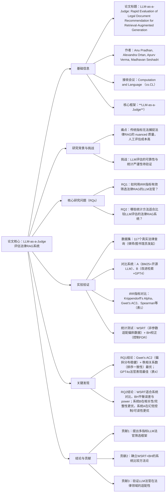

### 1. 一段话总结
本文针对**法律RAG系统评估的人工瓶颈**，探究“LLM-as-a-Judge”的可行性，聚焦两个核心问题：如何通过评分者间信度（IRR）指标筛选LLM法官，以及如何进行统计严谨的系统比较。实验发现，传统指标如**Krippendorff’s Alpha**在法律评估常见的偏斜分布中易误导，而**Gwet’s AC2**和秩相关系数（Spearman、Kendall’s Tau）是更可靠的法官筛选指标；**Wilcoxon Signed-Rank Test（WSRT）结合Benjamini-Hochberg（B-H）校正**能为系统比较提供统计严谨性。基于117个真实法律查询的实验显示，**GPT4o作为法官表现最优**（Spearman相关系数0.73，Gwet’s AC2-Quad 0.78），该框架成功将法律RAG评估从人工密集型转化为自动化且高精度的流程。

---

### 2. 思维导图

---

### 3. 详细总结
#### 一、引言：研究动机与核心问题
1. **背景**  
   法律RAG系统的推荐质量直接影响专业决策，但传统评估指标（如ROUGE）无法捕捉相关性、幻觉、可读性等nuanced维度，人工评估成本高且难以规模化。“LLM-as-a-Judge”为自动化评估提供可能，但需解决**LLM与人类评估的一致性**及**系统比较的统计严谨性**两大问题。

2. **核心研究问题（RQs）**
    - RQ1：如何通过综合IRR指标评估并筛选法律RAG系统的LLM法官？
    - RQ2：哪些统计方法能有效比较LLM评估的法律RAG系统，多假设检验校正的影响如何？

#### 二、相关工作
| 研究方向         | 关键发现                                                                 |
|------------------|--------------------------------------------------------------------------|
| LLM-as-a-Judge   | GPT4可接近人类一致性，但存在认知偏差、自我偏好等问题，需多模型委员会优化   |
| 可靠评估         | 多智能体辩论可缓解LLM偏见，但缺乏法律领域的针对性验证                     |
| 统计分析         | NLP实验常存在统计功效不足，需非参数测试与多比较校正确保结果可靠           |

#### 三、实验设计
##### 3.1 数据集与评估对象
- **数据集**：117个匿名法律查询（覆盖真实律师/图书馆员研究场景），评估维度包括相关性、完整性、幻觉（内在/外在）、可读性、正确性（1-4分ordinal量表）。
- **对比系统**：
    - 系统A：BM25检索 + 开源LLM摘要（Top5文档）；
    - 系统B：改进检索 + GPT4摘要。

##### 3.2 IRR指标对比
重点评估7类IRR指标的适配性（表1）：
| IRR指标           | 偏斜分布稳健性 | 序数数据支持 | 多评分者适配 | 关键局限                     |
|-------------------|----------------|--------------|--------------|------------------------------|
| Krippendorff’s Alpha | ✗              | ✓            | ✓            | 偏斜分布下低估一致性         |
| Gwet’s AC2         | ✓              | ✓            | ✓            | 无明显局限，法律场景最优     |
| Spearman 秩相关    | ✓              | ✓            | ✗            | 仅衡量排序一致性             |
| Cohen’s Kappa      | ✗              | ✗            | ✗            | 不适用于序数/多评分者数据    |

##### 3.3 统计测试选择
对比4类非参数测试（表2），最终选择**WSRT**：
- 优势：适配ordinal/非正态数据，捕捉组间差异幅度，适合系统A/B配对比较；
- 多比较校正：采用**B-H校正**（平衡False Discovery Rate（FDR）与统计功效，优于保守的Bonferroni）。

#### 四、实验结果
##### 4.1 RQ1：LLM法官筛选（表4）
测试5种LLM法官的IRR表现，核心结论：
1. **指标选择优先级**：Gwet’s AC2（偏斜分布稳健）> Spearman/Kendall’s Tau（排序一致性）> Krippendorff’s Alpha（易误导）；
2. **最优LLM法官**：GPT4o，关键指标如下：
    - Spearman相关系数：0.73（与人类排序一致性最高）；
    - Gwet’s AC2-Quad：0.78（相关性评估一致性最高）；
    - 百分比一致性：0.56（优于其他模型）。

##### 4.2 RQ2：RAG系统比较
1. **数据分布特征**：评估指标呈强偏斜（如“不准确幻觉”偏斜度5.13，表3），验证WSRT的必要性；
2. **系统差异结果**（WSRT+BH校正）：
    - 系统B更优：相关性（调整p=0.0358）、完整性（调整p=1.215e-18）、正确性（p<0.05）；
    - 系统A更优：外在幻觉（调整p=0.0204）、可读性（调整p=0.01997）；
    - 无显著差异：不准确幻觉（p>0.05）。

#### 五、结论与贡献
1. **核心贡献**
    - 提出多指标LLM法官筛选框架：Gwet’s AC2适配偏斜数据，秩相关系数保障排序一致性；
    - 确立法律RAG系统比较方法论：WSRT+BH提供统计严谨性；
    - 验证LLM法官在法律领域的实用性：GPT4o可替代人工完成高精度评估。
2. **价值**：将法律RAG评估从“人工密集型”转化为“自动化、统计严谨”的流程，降低评估成本。

---

### 4. 关键问题
#### 问题1：为何传统IRR指标（如Krippendorff’s Alpha）不适合法律RAG的LLM法官筛选？推荐哪些指标组合，依据是什么？
**答案**：  
传统指标的核心缺陷是**对偏斜分布敏感**——法律评估中幻觉、完整性等指标常呈强偏斜（如“不准确幻觉”偏斜度5.13），Krippendorff’s Alpha会因“期望一致性（Ae）趋近1”导致系数被低估，产生“高实际一致性却低指标值”的误导。

推荐**Gwet’s AC2 + 秩相关系数（Spearman/Kendall’s Tau）** 组合：
- Gwet’s AC2：通过直接建模“机会分歧”避免偏斜分布的不稳定性，在GPT4o的相关性评估中达0.78（表4）；
- 秩相关系数：捕捉LLM与人类对文档排序的一致性（如GPT4o的Spearman系数0.73），适配法律“先例排序”的核心需求。

#### 问题2：比较法律RAG系统时，为何选择Wilcoxon Signed-Rank Test（WSRT）结合Benjamini-Hochberg（B-H）校正？该组合在实验中体现了哪些优势？
**答案**：  
选择依据与优势如下：
1. **WSRT的必要性**：法律RAG评估数据多为ordinal且非正态（偏斜度0.09-5.13，表3），WSRT作为非参数测试无需分布假设，且能捕捉组间差异的“幅度”（优于仅关注“胜负”的Sign Test）；
2. **B-H校正的价值**：实验需跨6个维度比较系统A/B，B-H校正可控制FDR（假阳性率），同时保留比Bonferroni更高的统计功效——例如成功检测出“系统A在可读性上更优”（调整p=0.01997），而保守校正可能遗漏该差异；
3. **实验验证**：该组合清晰识别系统A/B的权衡（B优在准确性，A优在幻觉控制），为法律RAG优化提供精准方向。

#### 问题3：该研究提出的LLM法官框架如何适配法律领域的特殊性？实际应用中需注意哪些要点？
**答案**：
1. **领域适配性体现**：
    - 评估维度定制：覆盖法律核心需求（如“先例排序一致性”用秩相关系数衡量，“幻觉”细分内在/外在类型）；
    - 偏斜分布适配：Gwet’s AC2解决法律评估中“低幻觉样本占比极高”的偏斜问题；
    - 统计严谨性：WSRT+BH满足法律决策对“结果可靠性”的高要求。

2. **实际应用要点**：
    - 法官选择：优先GPT4o（综合表现最优），避免低性能模型（如Prometheus2-7B，Krippendorff’s Alpha仅0.06）；
    - 指标组合：必用Gwet’s AC2（一致性）+ Spearman（排序），避免单一指标误导；
    - 系统比较：需跨多维度评估，因法律RAG存在“准确性-可读性”等固有权衡，不可单维度下结论。