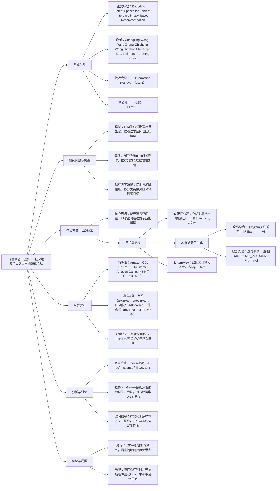

### 1. 一段话总结
针对**大语言模型（LLMs）生成式推荐中语言空间自回归解码导致的高推理开销**问题，研究提出**轻量级潜空间解码（L2D）** 方法：通过提取LLM生成式训练后的训练样本隐藏态构建记忆模块，采用**全局聚合（平均item关联隐藏态）** 或**局部聚合（选取与测试样本最相似的Top-M隐藏态）** 生成候选item的潜空间表示，再通过L2距离匹配测试样本隐藏态与候选表示完成解码。该方法**无需改变LLM生成式调优范式**，实验证明其推理速度比语言空间解码快**10倍以上**，同时在CDs、Games等数据集上的Recall@K、NDCG@K指标保持甚至超越基线模型（如BIGRec、GPT4Rec）。

---

### 2. 思维导图

---

### 3. 详细总结
#### 一、研究背景与动机
1.  **LLM生成式推荐现状**：将LLMs通过文本格式推荐数据微调，直接生成用户感兴趣的下一个item，能实现复杂的用户理解与兴趣挖掘，但部署时面临核心挑战——解码效率。
2.  **核心问题**：现有方法依赖**语言空间解码**，需自回归逐token生成item（如标题），前一token生成需等待前序所有token，且推荐列表长度会线性增加开销。虽接地技术可减少成本，但会导致性能下降（如生成1个item对应Top-10推荐时，性能下降50%）。
3.  **研究目标**：绕开语言空间解码以提升效率，同时**保留LLM生成式调优的优势**（避免ID分类头等方案偏离LLM预训练目标的问题）。

#### 二、核心方法：Light Latent-space Decoding（L2D）
##### 2.1 方法核心逻辑
LLM微调后，其内部潜空间已包含推荐目标的“想法”，语言空间解码仅为激活该想法。因此L2D直接在潜空间通过**测试样本隐藏态**与**候选item潜表示**的匹配实现解码，无需自回归过程。

##### 2.2 三步骤实现流程
| 步骤 | 具体操作                                                                                       | 关键公式/定义                                                                                                                                                                      |
|------|--------------------------------------------------------------------------------------------|------------------------------------------------------------------------------------------------------------------------------------------------------------------------------|
| 1. 记忆构建 | 对训练样本$`(s_j, v_j)`$，用$`LLM_{last}(prompt(s_j))`$提取最后一层隐藏态$`h_j`$，存储$`(h_j, v_j)`$为记忆集$`\mathcal{M}`$ | $`\mathcal{M}=\{(h_j, v_j) \| j=1,...,N\}`$（N为训练样本数）                                                                                                                         |
| 2. 候选item表示生成 | 聚合记忆集中item关联的隐藏态，提供两种策略                                                                    | - 全局聚合：$`\bar{h}_v=\frac{1}{\|\mathcal{M}(v) \|}\sum_{h_j \in \mathcal{M}(v)} h_j`$ - 局部聚合：先选与$`h_t`$最相似的Top-M样本$`\mathcal{M}_t`$，再聚合得$`\bar{h}_v^t`$ |
| 3. Item解码 | 用L2距离计算测试隐藏态$h_t$与候选表示的相似度，选Top-K item                                                     | 相似度：$`S(h_t, h_v)=\frac{1}{\|h_t - h_v\|_2}`$                                                                                                                                  |

##### 2.3 两种聚合策略对比
| 策略类型 | 特点 | 适用场景 |
|----------|------|----------|
| 全局聚合 | 平均item所有关联隐藏态，表示全面 | 稀疏场景（item交互少，需平衡多特征维度） |
| 局部聚合 | 聚焦与测试样本相关的Top-M隐藏态，个性化强 | 稠密场景（item交互多，可过滤无关信息） |

#### 三、实验设计与关键结果
##### 3.1 实验设置
- **数据集**：Amazon CDs、Amazon Games（统计如下表）
  | 数据集 | 用户数 | 物品数 | 训练样本数 | 验证样本数 | 测试样本数 |
  |--------|--------|--------|------------|------------|------------|
  | CDs    | 21,347 | 14,239 | 148,685    | 18,586     | 18,587     |
  | Games  | 34,089 | 11,037 | 201,613    | 25,202     | 25,203     |
- **基线模型**：传统（SASRec、GRU4Rec）、LLM嵌入（AlphaRec）、生成式（BIGRec、GPT4Rec、D³）
- **评估指标**：Recall@K、NDCG@K（K=20、50、100）
- **骨干模型**：Llama 3.2-1B（扩展实验用Llama 3.1-8B）

##### 3.2 核心结果
1.  **效率与性能平衡**：L2D在CDs、Games数据集上均接近“左上象限”（高性能+低开销），推理速度比语言空间解码快**10倍以上**，且优于AlphaRec（快5倍+，性能更优）。
2.  **性能超越基线**：在beam=1的公平对比下，L2D显著优于所有基线。以CDs数据集Recall@50为例，L2D-G达0.1562，L2D-L达0.1569，远超BIGRec（0.0565）、GPT4Rec（0.0562）。
3.  **模型扩展性**：Llama 3.1-8B版本的L2D性能进一步提升（CDs数据集Recall@50达0.1654），证明方法对大模型的适配性。

#### 四、关键分析
1.  **聚合策略适配性**：稠密场景中L2D-L性能最优（可聚焦相关特征）；稀疏场景中L2D-G更优（避免相似样本不足导致的偏差）。
2.  **超参M影响**：Games数据集性能随M先升后降（需匹配场景特征需求），CDs数据集L2D-G始终优于L2D-L。
3.  **空间效率**：存储30%训练样本时，L2D仍优于多数基线（如CDs数据集Recall@20达0.1012，接近SASRec的0.1015）；10⁹样本的1024维float16隐藏态仅需约**2TB**存储。
4.  **与ID分类头对比**：L2D在整体场景（CDs数据集Recall@20：0.1158 vs 0.1087）和稀疏场景（CDs稀疏Recall@50：0.0889 vs 0.0682）均优于ID分类头，且无需额外训练。

#### 五、结论与局限
1.  **结论**：L2D通过潜空间解码成功解决LLM生成式推荐的效率问题，在保持生成式调优优势的同时实现高效推理，为LLM推荐提供新范式。
2.  **局限**：①记忆构建需额外预处理时间；②无法处理零交互的冷启动item；③未考虑动态数据的记忆更新机制。

---

### 4. 关键问题
#### 问题1：L2D相比传统LLM生成式推荐的语言空间解码，核心创新点是什么？
**答案**：核心创新在于**“绕开语言空间，在LLM潜空间直接解码”**，具体体现在三方面：①**范式保留**：不改变LLM生成式调优目标（next-token预测），仅替换解码环节，避免ID分类头等方案偏离预训练知识的问题；②**效率提升**：消除自回归逐token生成过程，仅需一次LLM前向计算+向量相似度匹配，推理速度快10倍以上；③**表示构建**：通过训练样本的“生成态隐藏态”聚合item表示，与测试样本的“生成态隐藏态”处于同一潜空间，无需额外对齐训练，实现“即插即用”。

#### 问题2：实验中L2D在性能和效率上的关键量化表现如何？
**答案**：①**效率表现**：推理速度比语言空间解码快**10倍以上**，且比LLM嵌入基线AlphaRec快5倍以上；②**性能表现**：在CDs数据集上，L2D-L的Recall@20达0.1158、Recall@50达0.1569、NDCG@50达0.0745，均远超BIGRec（beam=1）的0.0506、0.0565、0.0446；在Games数据集上，L2D-L的Recall@50达0.1465、NDCG@50达0.0511，显著优于GPT4Rec（beam=1）的0.0782、0.0347；③**空间效率**：存储30%训练样本仍保持优势，10⁹样本的隐藏态仅需约**2TB**存储。

#### 问题3：L2D的两种聚合策略（全局/局部）有何本质差异，分别适用于什么场景？
**答案**：①**本质差异**：全局聚合是对item在训练集中所有关联隐藏态的平均，追求“全面性”，表示固定且适用于所有测试样本；局部聚合是先筛选与当前测试样本隐藏态最相似的Top-M训练样本，再聚合其中item的隐藏态，追求“相关性”，表示随测试样本动态变化。②**适用场景**：全局聚合适用于**稀疏场景**（item交互次数少，Top-M相似样本可能不足，全面表示可平衡偏差），实验中CDs稀疏场景L2D-G的Recall@50达0.0835，优于L2D-L；局部聚合适用于**稠密场景**（item交互多，可过滤无关特征，聚焦用户当前兴趣），实验中Games稠密场景L2D-L的Recall@50达0.1465，优于L2D-G。